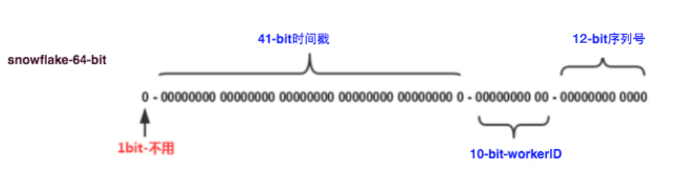
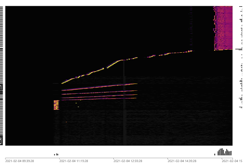
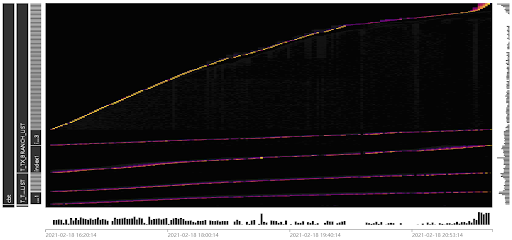
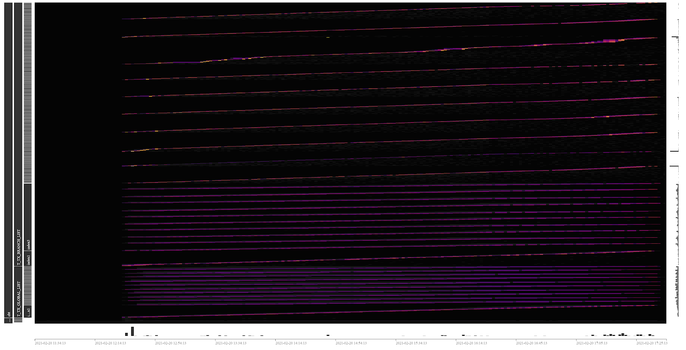
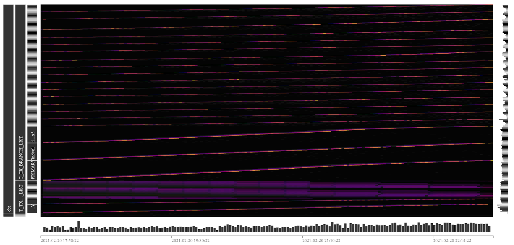
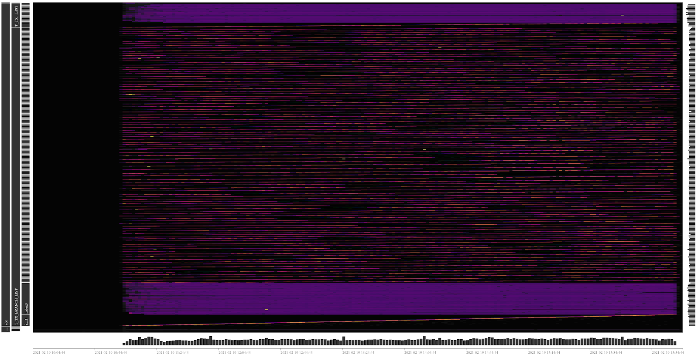
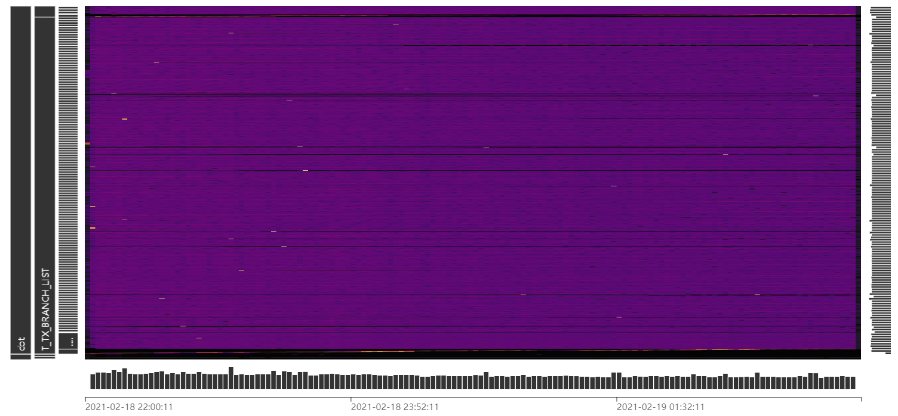

TiDB 从 v4.0 版本开始正式支持序列功能，而除了序列之外还有多种序列号生成方案，这些方案在没有对 TiDB 优化的时候一般会产生写入热点问题。本文将介绍如何应对写入热点问题高效运行序列号服务。

## 为什么需要（唯一）序列号

主键是关系模型设计中的第二范式，参照第二范式，所有表都应具有主键。实际操作中，OLTP 系统中承载交易的关键表会通过设置主键来确保记录的唯一性。

主键应具有不可变性，而具有业务属性的字段都不具备这样的特性，即使如身份证号，也存在升位、过期、多次办理等业务场景，将身份证号作为主键而不得不进行修改时，就会对业务产生严重影响。因此选取主键的一个基本原则就是采用与业务不相关的字段作为代理键，唯一序列号即承载这样的功能。

## 常见的序列号生成方案

唯一序列号生成方案有很多种，有依赖数据库自身特性的序列和自增列，有开源的分布式唯一 ID 生成器，也有非常灵活的号段分配方案：

1. 自增列：自增（auto_increment）是大多数兼容 MySQL 协议的 RDBMS 上列的一种属性，通过配置该属性来使数据库为该列的值自动赋值，用户不需要为该列赋值，该列的值随着表内记录增加会自动增长，并确保唯一性。在大多数场景中，自增列被作为无业务涵义的代理主键使用。自增列的局限性在于：自增列只能采用整型字段，所赋的值也只能为整型。假设业务所需要的序列号由字母、数字及其他字符拼接而成，用户是难以通过自增列来获取序列号中所需的数字自增值的。

2. 序列（Sequence）：序列是一种数据库对象，应用程序通过调用某个序列可以产生递增的序列值，应用程序可以灵活的使用这个序列值为一张表或多张表赋值，也可以使用序列值进行更复杂的加工，来实现文本和数字的组合，来赋予代理键以一定的跟踪和分类的意义。TiDB 从 v4.0 版本开始提供序列功能，详情请参考[官方文档](https://docs.pingcap.com/zh/tidb/stable/sql-statement-create-sequence#create-sequence)。

3. 号段分配方案：号段（segment）分配是从数据库一次获取一批 ID，将获取的 ID 看成一个范围，例如 (500,1000]，这个范围称为一个号段或步进（step），应用一次申请一个号段，加载到内存中，然后应用生成 ID，当号段使用完后，再次申请一个新的号段， 这样以批量获取的方式来提高效率，实际使用过程中，可以通过调节获取号段大小控制数据库记录更新频度。号段分配方案需要通过应用代码来实现相关逻辑，具有很好的灵活性，例如可以引入时间因素，来实现序列号在时间上的递增，来避免重复；也可以灵活的通过文本和数字的组合来赋予代理键以一定的跟踪和分类的意义。但相应的带来了一定的额外开发工作量。详细构建方案请参考 [tidb-in-action 文章](https://github.com/tidb-incubator/tidb-in-action/blob/master/session4/chapter6/serial-number.md)。

4. 类 snowflake 分布式唯一 ID 生成器：这种方案是由 Twitter 提出的分布式 ID 生成方案，它通过划分命名空间来生成 ID，这种方案把 64-bit 划分为多段，切分后的段分别用以标识时间、机器号、序列号等。该方案不依赖于数据据库，稳定性高，ID 生成速度快，还可以根据自身业务配置 bit 位，非常灵活。该方案非常依赖发号机器的本地时钟，时钟回拨可能会导致发号重复，在使用中需要注意这一点。除了 Twitter snowflake 之外，类似的唯一 ID 生成器还有百度 uid-generator 和美团 Leaf 等。详细构建方案请参考 [tidb-in-action 文章](https://github.com/tidb-incubator/tidb-in-action/blob/master/session4/chapter6/serial-number.md)。



<div class="caption-center">图 1. Twitter snowflake 64 位 id 结构</div>

## 序列号与 TiDB 写入热点

唯一序列号多被用于为表的主键字段赋值。

大部分单机 RDBMS 采用 B+ tree 数据结构，主键往往是用于组织数据的关键索引（此时表被称作索引组织表），同一数据页内的记录按主键顺序存放。因此单机 RDBMS 产品一般推荐写入连续的序列号，这样每次写入新的记录，都会顺序添加到当前 B+ tree 索引节点的后续位置，当前的数据页写满时，会自动开始新一页的写入。相反，过于随机的主键值，会导致新记录被写入到数据页的某个中间位置，造成数据的移动而带来了额外的开销。

虽然 TiDB 具有不同于单机 RDBMS 的数据结构，但顺序的主键值写入，在 TiDB 上也会产生类的效果：TiKV 上一个的 region 被写满，进而分裂出一个新的 region，后续的写入转由新的 reigon 来承载。但甲之蜜糖，乙之砒霜，单机 RDBMS 的最佳实践放到 TiDB 上，会使写入压力总是集中在一个 region 上，这样就构成了持续的写入热点，无法发挥出 TiDB 这种分布式数据库的并行写入能力，降低了业务写入瓶颈，造成了系统资源的浪费。

TiDB v4.0 版本提供了便于迅速识别集群负载的 Dashboard 流量可视化页面（Key Visualizer），下图展示了写入热点的显示效果，中间一条明亮的曲线即标志着存在一张连续写入 Key 值的表。而右上侧的一组线条则显示出一个写入压力较为均匀的负载。Key Visualizer 的具体使用方法请参考[官方文档](https://docs.pingcap.com/zh/tidb/stable/dashboard-key-visualizer)。



<div class="caption-center">图 2. 写入热点在 Dashboard Key Visualizer 中的显示效果</div>

具体来说，TiDB 的写入热点是由于 TiKV 中 KV 的 Key 值连续写入造成的，根据 [TiDB 的编码规则](https://docs.pingcap.com/zh/tidb/stable/troubleshoot-hot-spot-issues#tidb-%E7%BC%96%E7%A0%81%E8%A7%84%E5%88%99%E5%9B%9E%E9%A1%BE)，在 TiDB v4.0 及更早的版本中，Key 的取值存在以下两种情况：

1. 当表的主键为单一字段，且该字段的类型为整型时，Key 值由该字段构成，Value 为所有字段值的拼接，因此整型主键的表为索引组织表。

2. 其他情况，TiDB 会为表构建一个隐藏列 _tidb_rowid，Key 值由该隐藏列构成，Value 为所有字段值的拼接，表的主键（如果有的话）构成一个非聚簇索引，即数据并不以主键来组织。拿具有非整型主键的表来举例，它需要比单 int 型主键的表多写一个索引。

对于第二种情况，为了避免由于隐藏列 _tidb_rowid 的顺序赋值而引起写入热点，TiDB 提供一个表属性 SHARD_ROW_ID_BITS 来控制所生成的隐藏列的值分散到足以跳过一个 region 大小（96MB）的多个区间（分片）上，再借助 PD 的热点调度能力，最终将写入压力分摊到整个 TiKV 集群中。由于隐藏列不具有任何业务属性，因此这种打散热点的方法是对用户透明的。一般来说，我们建议用户为所有非单一整型主键的表配置这个表属性，来消除这部分的热点隐患，详细使用方法请参考[官方文档](https://docs.pingcap.com/zh/tidb/stable/troubleshoot-hot-spot-issues#%E4%BD%BF%E7%94%A8-shard_row_id_bits-%E5%A4%84%E7%90%86%E7%83%AD%E7%82%B9%E8%A1%A8)。

在第二章中描述的常见的四种序列号生成方案中，由于自增主键面对的是连续的整型数值的写入，因此它的打散方式比较特殊，请参考[官网文档](https://docs.pingcap.com/zh/tidb/stable/troubleshoot-hot-spot-issues#%E4%BD%BF%E7%94%A8-auto_random-%E5%A4%84%E7%90%86%E8%87%AA%E5%A2%9E%E4%B8%BB%E9%94%AE%E7%83%AD%E7%82%B9%E8%A1%A8)对自增主键进行打散。

对于其他三种方案而言，它们都具有集成到应用代码的能力，也因此具有一定的灵活性，本文将以 Twitter snowflake 为例，展示如何设计应用逻辑来获得较高的唯一 ID 生成效率。

## 在 TiDB 上高效的运行序列号生成服务

本测试基于两张表进行，在原始表结构中，主键为整型，其中一张表有一个索引，另一张表有两个索引，表结构如下：

```
CREATE TABLE `T_TX_GLOBAL_LIST` (
  `global_tx_id` varchar(32) NOT NULL,
  `global_tx_no` bigint NOT NULL,
  `trace_id` varchar(18) NOT NULL,
  `busi_unique_seq` varchar(18) NOT NULL,
  `as_code` varchar(10) NOT NULL,
  `as_version` varchar(5) NOT NULL,
  `framework_type` char(1) NOT NULL,
  `tx_stat` char(1) NOT NULL,
  `code` char(2) DEFAULT NULL,
  `msg` varchar(32) DEFAULT NULL,
  `create_time` timestamp NOT NULL,
  `update_time` timestamp NULL DEFAULT NULL ON UPDATE CURRENT_TIMESTAMP,
  PRIMARY KEY (`global_tx_no`),
  KEY `index1` (`create_time`,`tx_stat`)
);

CREATE TABLE `T_TX_BRANCH_LIST` (
  `branch_tx_id` varchar(32) NOT NULL,
  `branch_tx_no` bigint NOT NULL,
  `global_tx_no` bigint NOT NULL,
  `trace_id` varchar(18) NOT NULL,
  `busi_unique_seq` varchar(18) NOT NULL,
  `ms_code` varchar(10) NOT NULL,
  `ms_version` varchar(5) NOT NULL,
  `framework_type` char(1) NOT NULL,
  `tx_stat` char(1) NOT NULL,
  `code` char(2) DEFAULT NULL,
  `msg` varchar(32) DEFAULT NULL,
  `input_data` longtext NOT NULL,
  `create_time` timestamp NOT NULL,
  `update_time` timestamp NULL DEFAULT NULL ON UPDATE CURRENT_TIMESTAMP,
  PRIMARY KEY (`branch_tx_no`),
  KEY `index1` (`create_time`,`tx_stat`),
  KEY `index3` (`global_tx_no`)
);
```
基于这两张表，我们编写了一个压测程序，压测的场景为批量写入（即 batch insert，形如 `insert into t values(),(),(),(),()......();）`，每个事务向 `T_TX_GLOBAL_LIST` 表写入 20 行记录，向 `T_TX_BRANCH_LIST` 表写入 100 行记录。两张表中的 `global_tx_no` 字段和 `branch_tx_no` 字段（高亮）使用 Twitter snowflake 生成。

Twitter snowflake 生成的唯一序列号类型为整型，由于序列号的前面大部分的 bit 位由时间戳和机器号占据，只有最后的几个 bit 位为递增序列值，因此在一个时间段内生成的序列号的前几位数值相同：

```
561632049706827776
561632049706827777
561632049706827778
561632049706827779
561632049706827780
561632049706827781
… ...
```

我们将通过以下三个实验来展示如何打散 Twitter snowflake 的写入热点。

1.第一个实验中，我们采用默认的表结构和默认 snowflake 设置，向表写入整型序列号，压测持续了 10h。通过 Key Visualizer 展示的负载可以发现明显的写入热点。写入点有 5 个，对应着两张表和 3 个索引。其中一条写入负载非常明亮，是整张图中写入压力最大的一部分，从左侧的标识可以看到是 T_TX_BRANCH_LIST 的表记录部分的写入。



<div class="caption-center">图 3. 默认设置下的写入负载</div>

10h 的测试，两张表写入记录数为：

|  表名 |  10h 写入记录数  |
|  ----  | ----  |
|  T_TX_GLOBAL_LIST | 76685700 |
|  T_TX_BRANCH_LIST  | 383428500  |


2.对 Snowflake 生成的序列号进行转换，将最后一位数字移动到左数第二个数字的位置，原左数第二位数字及之后的所有数字向右移动一位。以此来让生成的 ID 跨越 96MB 的 region 容量，落在 10 个不同的 region 中。直接在二进制 id 上做位运算会导致转换后的十进制 id 位数不稳定，因此这个转换需要将整型的序列号先转为字符型，进行文本操作换位之后再转为整型，经测试，这个转换带来 10% 左右的额外消耗，由于这个额外消耗发生在应用程序中，相对于延迟较高的数据库，其带来的额外的影响在整个压测链路中微乎其微。

|  原始序列号  |  转换后的序列号  |
|  ----  | ----  |
|  561632371724517376  | 566163237172451737  |
|  561632371728711680  | 506163237172871168  |
|  561632371728711681  | 516163237172871168  |
|  561632371728711682  | 526163237172871168  |
|  561632371732905984  | 546163237173290598  |
|  561632371732905985  | 556163237173290598  |
|  561632371732905986  | 566163237173290598  |
|  561632371732905987  | 576163237173290598  |
|  561632371732905988  | 586163237173290598  |
|  561632371737100288  | 586163237173710028  |

压测持续了 10h。通过 Key Visualizer 展示的负载可以看到，两张表的记录部分已经被各自打散到 10 个写入分片上，三个索引的其中一个由于字段值的转换，也呈现出一种较为分散的负载，负载图的整体亮度比较均衡，没有明显的写入热点。



<div class="caption-center">图 4. 序列号换位后的写入负载</div>

10h 的测试，两张表写入记录数为：

|  表名 |  10h 写入记录数  |
|  ----  | ----  |
|  T_TX_GLOBAL_LIST | 150778840 |
|  T_TX_BRANCH_LIST  | 753894200  |

3.将两张表中的 global_tx_no 字段和 branch_tx_no 字段改为字符型，这样两张表从单一整型主键的索引组织表变为了按隐藏列组织的表。对两张表增加 shard_row_id_bits=4 pre_split_regions=4 参数，以分散写入压力。由于主键类型发生了变化，还需要再程序中对 snowflake 生成的序列号类型做整型到字符型的转换。

压测持续了 10h。通过 Key Visualizer 展示的负载可以看到，存在 5 条明亮的线条，这是由于两张表的主键变为了非聚簇索引，导致需要单独 region 来存放主键，索引的数目因此变为了 5 个。而数据部分由于增加了打散参数，各自呈现出 16 个分片的均匀写入负载。



<div class="caption-center">图 5. 将主键转为字符型并打散后的写入负载</div>

10h 的测试，两张表写入记录数为：

|  表名 |  10h 写入记录数  |
|  ----  | ----  |
|  T_TX_GLOBAL_LIST | 136921680 |
|  T_TX_BRANCH_LIST  | 684608400  |

## 测试结论及示例代码

### 测试结论

    a. 从下面的测试成绩表可以看出，默认表结构配合 snowflake 默认配置生成的序列号，由于存在严重的写入热点，其写入性能较另外两个测试有较大的差距。

    b. 整型主键配合序列号换位，获得了本次测试中的最佳性能。我们还另外进行了末尾 2 位数字与末尾 3 位数字的换位测试，但过多的写入分片（2 位数字 100 个分片，3 位数字 1000 个分片）反而拖慢了写入性能，一般来讲使分片数量接近集群 tikv 实例个数可以充分的发挥集群的性能，用户需要根据自身的集群规模来制订换位策略。



<div class="caption-center">图 6. 整型主键换位（2 位置换），100 个分片</div>



<div class="caption-center">图 7. 整型主键换位（3 位置换），1000 个分片</div>

   c. 字符型主键 shard 也获得了不错的写入性能，但由于额外的热点索引写入，其性能略低于序列号换位方案。易用性是它的优势，用户可以通过简单的表结构变更来获取优异的写入性能。


|  测试轮次 |  T_TX_GLOBAL_LIST 表记录数（行）  | T_TX_BRANCH_LIST 表记录数（行） |
|  ----  | ----  | ----  |
|  测试一，整型主键默认配置 | 76685700 | 383428500  |
|  测试二，整型主键换位（1 位  | 150778840  | 753894200  |
|  测试二，整型主键换位（2 位） | 123447080  | 617235400  |
|  测试二，整型主键换位（3 位）  | 101330340  | 506651700  |
|  测试三，字符型主键 shard   | 136921680  | 684608400  |

### 示例代码

```
###   
public synchronized long nextId() {
        long currStmp = getNewstmp();
        if (currStmp < lastStmp) {
            throw new RuntimeException("Clock moved backwards.  Refusing to generate id");
        }

        if (currStmp == lastStmp) {
            //相同毫秒内，序列号自增
            sequence = (sequence + 1) & MAX_SEQUENCE;
            //同一毫秒的序列数已经达到最大
            if (sequence == 0L) {
                currStmp = getNextMill();
            }
        } else {
            //不同毫秒内，序列号置为0
            sequence = 0L;
        }

        lastStmp = currStmp;
        /**
         * XX......XX XX000000 00000000 00000000	时间差 XX
         *  		    XXXXX0 00000000 00000000	数据中心ID XX
         *  		         X XXXX0000 00000000	机器ID XX
         *  		               XXXX XXXXXXXX	序列号 XX
         *  三部分进行|位或运算：如果相对应位都是0，则结果为0，否则为1
         */
        long id = (currStmp - START_STMP) << TIMESTMP_LEFT //时间戳部分
                | datacenterId << DATACENTER_LEFT       //数据中心部分
                | machineId << MACHINE_LEFT             //机器标识部分
                | sequence;                             //序列号部分

        String strid = String.valueOf(id);
        int length = strid.length();
        String lastnum = strid.substring(length - 1, length);
        String str = strid.substring(1, length - 1);
        String head = strid.substring(0, 1);

        StringBuilder sb = new StringBuilder(head).append(lastnum).append(str);
        return Long.valueOf(sb.toString());
    }
###
```

- 必须使用时间差作为首段做位运算，因为其它段调整为首段做位运算会出现生成序列号位数不一致的问题。

- 使用字符串拼接方式效率虽然降低，但是从一次交易总体时间上看是可以忽略不记的。

## 结语

当前版本（v4.0）的易用性还有待加强，TiDB v5.0 版本将正式推出聚簇索引功能，新版本中的聚簇索引将支持任意类型的索引字段，而具有整型主键的表也可以被设置为非主键组织表，这代表采用整型主键的表可以很便捷的通过表属性 SHARD_ROW_ID_BITS 来分散写入热点，大家敬请期待！
