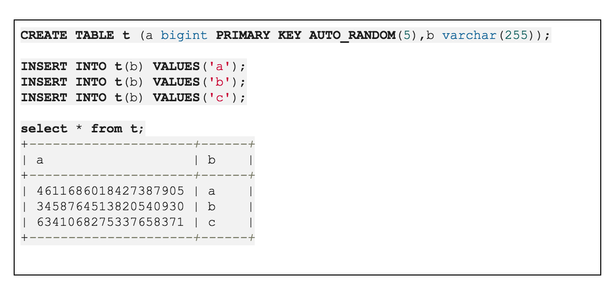
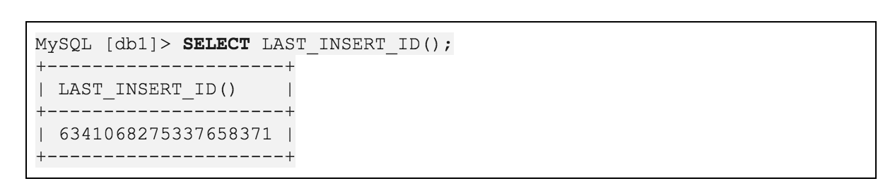
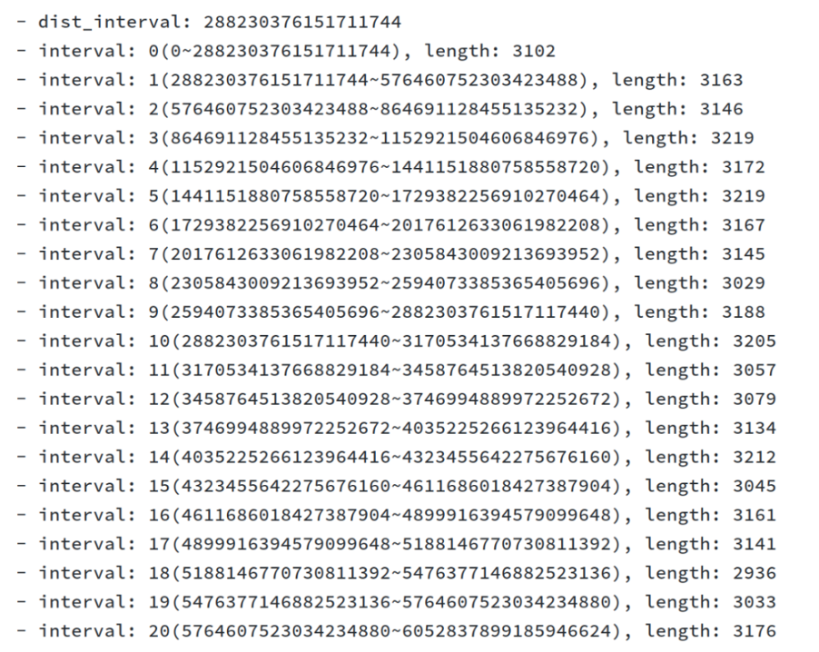
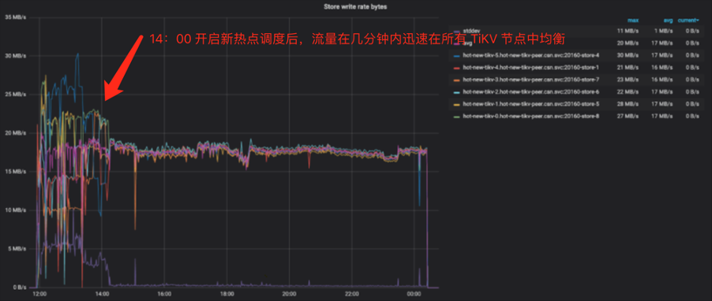

## 热点问题概述

一直以来，TiDB 的数据访问热点问题，是用户比较关注的问题。为什么这个问题如此突出呢？这其实是“分布式”带来的结构效应。单机数据库由于只有一个节点，是不存在热点问题的(因为性能的上限就是单机的处理能力)，而分布式数据库集群存在多个节点，在达到存储扩展、读写能力扩展的目的上，我们希望大量的读写压力能够平摊在每个节点上，TiDB 也一直在朝着这个目标靠近。

数据库也存在二八原则，80% 的读写在 20% 的最新数据上，以使用最广泛的 MySQL 为例，很多从 MySQL 迁移到 TiDB 的业务，迁移前会使用自增主键，将随机写转为顺序写提高性能。而这种方式，在写入 QPS 较大的 TiDB 集群上，会造成写入热点，原因是 TiDB 使用 range 的方式来进行数据分片，导致新写入的数据集中在一个 range 范围所在的节点，对于这部分写入就会退化成单机的写入性能，未能利用分布式读写扩展的优势。

## 直面问题

为了解决这些问题，TiDB 在很早之前的 2.0 版本就开始设法改进，这就是新增的表属性 SHARD_ROW_ID_BITS，它的原理是将自动生成的主键在二进制的高几位进行一个位翻转从而将单调递增的 ID 转化为一定范围内的随机 ID，来达到自动将写入数据的压力分摊到不同节点，由于多数业务对于主键通常只需要不重复而不是单调递增，这个特性能够相当程度上缓解单点写入的压力。并且支持了 PRE_SPLIT_REGIONS，在建表时为该表预设多个 Region。同时，在后面的 3.0 大版本上，也一直在优化 PD 和 TiKV 节点的热点调度的算法，引入了独立热点调度器 HOT-REGION-SCHEDULER，更及时的保持不同节点的读写热点 range 均衡。

不过，这些改进还不足以完全解决热点问题，还需要不断演进。TiDB 需要直面这些问题、解决问题，发展到 3.0 依然存在如下几个比较突出的问题：

- SHARD_ROW_ID_BITS 标志

  - 易用性差，用户存在理解和学习成本；
 
  - 不能支持与 Int 类型主键共同使用，这造成使用的困扰，表结构改造大，无法兼容 Binlog 的使用要求；

  - 导致有时用户需要自己部署类似 snowflake 的随机 id 生成服务。

- 热点调度

  - 3.0 版本统计热点 Region 的方式比较单一，统计出持续一段时间读或写流量超过一定阈值的 Region，对其进行调度，会造成流量统计不准确、过度调度、热点数目较多时不稳定，等问题。

- 热点排查

  - 无法直观断定是否存在热点；

  - 无法直观判断哪张表存在热点，是什么语句造成的热点；

  - 热点问题排查困难，需要结合多处监控、日志，综合判断。

## 4.0 版本的改进

热点问题一直是 TiDB 非常重视的问题，但这不是一日之功的事情，从 2.x 到 3.x 再到 4.0 版本，一直在不断演进中。那么 4.0 为了优化上面的三点问题，做了哪些改进呢？

### AutoRandom ID

AutoRandom 是 TiDB 4.0 提供的一种扩展语法，用于解决整数类型主键通过 AutoIncrement 属性分配 ID 时的写热点问题。

它的使用形式和 AutoIncrement 几乎相同，但能实现随机的表内唯一性，普通用户不再需要理解复杂的 Shard 机制。

当然，AutoRandom 和 SHARD_ROW_ID_BITS 一样，可以配合 PRE_SPLIT_REGIONS 语法共同使用，也可以使用 LAST_INSERT_ID() 获取其值。

AutoRandom 的出现，极大的方便了 MySQL 用户的上迁和下迁。MySQL 到 TiDB 的同步，表结构只需要稍作修改，可以沿用原 MySQL 的 AUTOINCREMENT 值。在兼容性方面，AutoRandom 也是以表结构上注释的形式作为解析，没有实现对应特性的 TiDB 版本则会忽略该属性，因此 TiDB 向下游其他数据库产品同步也是可行的。

红色部分 AutoRandom 以注释作为解析方式

同时，AutoRandom 作为一个随机方案，必须要能做到均匀分布，才能真正解决热点问题，我们通过一个测试，观察一个大量插入后的效果，统计不同分段的行数可以看到是非常均匀的。

需要保证 AutoRandom 生成值的数据分布均匀

上图中 dist_interval 表示分段的基准间隔， interval 表示不同分段范围，length 表示 AutoRandom 的结果命中在该范围中的次数。

下面介绍一下 AutoRandom 的原理。

AutoRandom 成为了 Primary Key，与使用 SHARD_ROW_ID_BITS + auto_increment 唯一索引的方案相比，该方式实际上将隐式的 TiDB 内部的主键 _tidb_rowid 变成了显式主键，底层机制几乎相同，因此性能不会出现衰减。它将 64 位的 bigint 分为 3 段：

- SignBit - 符号位，有符号时占用，长度为 1。

- ShardBits - 生成随机数对 ID 值域打散，由属性 auto_random(5) 指定，默认为 5。

- increment_bits - 自增位，用于保证 ID 的唯一性以及单语句 Insert 时，分配的连续性。

最后，看 AutoRandom 的几个注意事项：

- Shard 位数不建议过多，通常默认的即可（默认值 5），太大会造成 Incremental 部分的可分配的位数变少，以及增加 rpc 交互消耗；

- 和 AutoIncrement 一样，AutoRandom 也支持用户显式写入，但极其不建议这样使用，Incremental 部分将会按用户值 rebase，这可能会导致可分配 id 提前耗尽；

- 建议使用 unsigned bigint 作为 AutoRandom 列的类型，可以最大程度增加 Incremental 的位数。 

### 新热点调度器

在热点调度算法方面，4.0 也有不少的改进。3.0 的版本是从单个 Region 视角出发，而没有很好的汇总 TiKV 节点 上的统计数据，而 4.0 中，TiDB 将从 TiKV 节点的视角出发，去汇总和处理数据，因此新热点调度器也叫做 Load-base 热点调度。它从以下方面进行了优化：

**对统计信息添加降噪处理**：对于统计信息处理，添加了如下策略，忽略新 Leader 第一次上报的统计信息和修复流量的计算时间。这将修复一部分统计不准确和虚高的问题。为了更好的降低噪声，我们还添加了两级处理的机制。

**使用 TopN 覆盖更多热点**：目前热点识别算法在热点 Region 数量超过设定的预期值后将无法工作，为了覆盖更多热点，将维护热点区域的数据结构，从两个缓存队列修改为 TopN 的数据结构。

**添加期望调度**：为了避免出现冗余调度的情况，我们添加了期望调度，即算出每个 Store 的期望，只有当实际数目低于期望乘系数才允许调入，当实际数目高于期望乘系数才允许调出。

**添加 Pending Influence 对未来预判**：为了解决过度调度的出现，我们必须慎重对待 operator 反映到统计上需要耗费时间，所以引入 Pending Influence 对统计进行预测修正，对于每一个添加的新 operator 将他们的开销和代价记录下来，作为接下来新 operator 的参考。

**多维调度**：为了进一步提高热点调度器的能力，也考虑到对未来的可扩展性，我们设计了一个可以适应多维负载均衡的新热点调度器框架，并基于该框架实现了流量的负载均衡。先枚举可能的调度方案，然后通过基于规则的比较找到最好的方案。

开启新热点调度后，测试流量可以快速得到均衡

### 热点可视化

在前面 4.0 Feature 的介绍中，已经介绍了 Dashboard 功能，他其中有一项是 「热点可视化」，也叫 KeyViz，他以热力图像的方式，直观的告诉用户，你的读写流量集中在哪个库，哪个索引，哪段范围，这也是发现和定位热点问题的一个利器，极大的方便用户的排查热点问题。

观察上图明亮的部分，可以看到有规律的斜线，可以清晰的看出是一个流量随着 Region 范围增长的热力图，这是一个典型自增主键造成的热点。鼠标指向其中一个色块，可以看到具体热点背后的库表信息。

### 小表热点优化

前面的优化方法还不能解决小表热点问题。由于 PD 的热点调度只能以 Region 为粒度，小表通常只在一个 Region 中，PD 就无能为力了。例如，一些配置表的大量全表扫描、索引查找产生的单 Region 热点，往往这时需要人为手工介入 Split Region，但操作麻烦并且不及时，如果热点只存在某几个 Key 上，也不易确定切割位置。

在 4.0 版本中引入了 Load Base Split 功能，可以实现热点小表的自动 Split 。Load Base Split 会基于统计信息自动拆分 Region。通过统计去识别出那些读流量在 10s 内持续超过阈值的 Region，并在合适的位置将这些 Region 拆分。在选择拆分的位置时，会尽可能平衡拆分后两个 Region 的访问量，并尽量避免跨 Region 的访问。在 4.0 版本上已经默认开启该功能。

## 总结

热点处理是分布式数据库亘古不变的话题，经过四个大版本的演进，目前 TiDB 4.0 通过 AutoRandom、新热点调度器、热点可视化这几个方面进行了大幅度的优化。这些变化将以润物细无声的方式影响用户的体验。

当然，热点问题还没有终结，还需要在整个社区的帮助下，不断的探索和改进：

- 通过聚簇索引减少回表，提高读热点场景的数据访问效率；目前在最新 Master 版本已经完成，已经有用户在对应场景下测试发现，TPC-C 有 50% 的性能提升，聚簇索引将在下一个 GA 版本中提供；

- 另外一个探索的方向是结合 AI 的预测，提前进行调度操作；

- 小表热点方面，5.0 版本将通过 readonly table（常量表）功能，会得到进一步优化；

- 目前 KeyViz 虽然可以在 Region 的粒度上定位热点的范围，但还可以更加一步到位，比如直接告诉业务是否有读写热点，直接展示哪类 SQL 造成的热点，一键 Split 热点 Region，自动分析潜在热点根因。