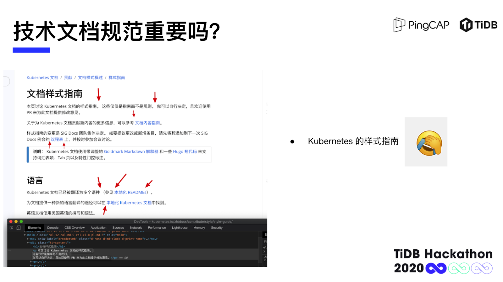
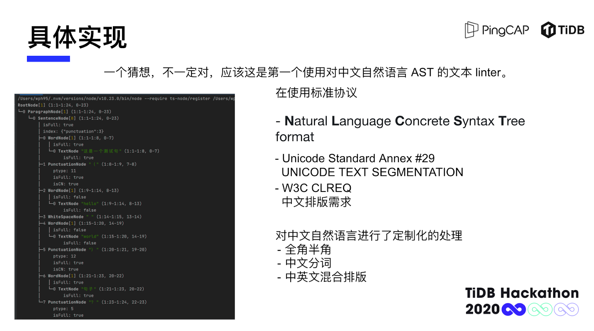
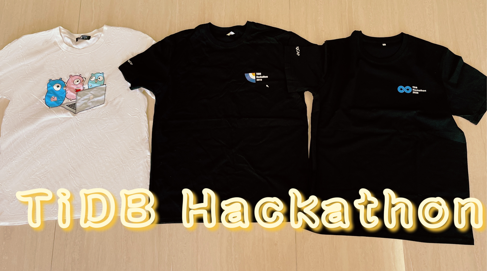
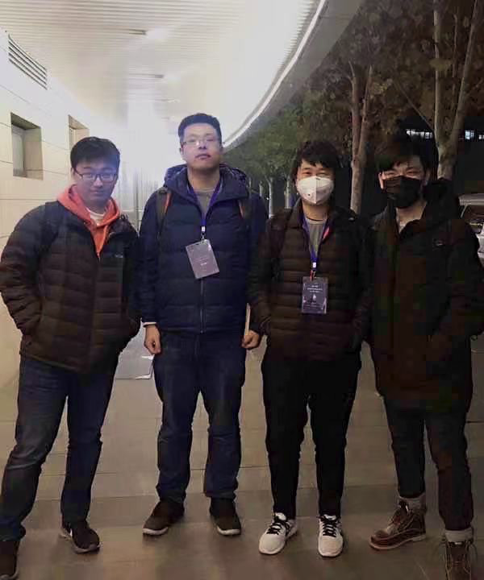

近日，由 TiDB 社区主办，专属于全球开发者与技术爱好者的顶级挑战赛事——TiDB Hackathon 2020 比赛圆满落幕。今年是 TiDB Hackathon 第四次举办，参赛队伍规模创历届之最，共有 45 支来自全球各地的队伍报名，首次实现全球联动。经过 2 天时间的极限挑战， 大赛涌现出不少令人激动的项目。**为了让更多朋友了解这些参赛团队背后的故事，我们将开启 TiDB Hackathon 2020 优秀项目分享系列，本次访谈我们邀请到了 zh.md 的两位队员：来自 Cisco 的研发工程师王鹏翰、来自 PingCAP I18N 团队的 Coco，以及 Hackathon 特邀评委：来自青云 QingCloud 的张雁飞老师，共同谈谈他们对于 zh.md 的看法。**

这也是一次专业工程师 + Tech Writer + 用户的三方会谈，**希望通过本次访谈和思想碰撞，让大家对于中文技术文档的写作和自动化改进有全新的看法。**

## 缘起：一份优雅的中文技术文档是怎样炼成的？

谈及为什么会对 zh.md 格外关注时，评委老师张雁飞表示：**技术文档的规范化是吸引用户，树立品牌非常重要的一环。** 一份格式混乱、翻译参差不齐的文档会给产品大大减分。无论产品本身有多么优秀，技术文档这“最后一公里”对于用户的体验都是至关重要的。

zh.md 的队长王鹏翰作为一个 OpenTelemetry 技术爱好者，翻译文档时发现许多中文文档翻译得参差不齐，格式混乱，就连 CNCF 老大哥 K8S 的技术文档，仅仅是“样式指南”中出现的格式问题就已经可以用令人头大来形容了。不好用的技术文档往往会把 open source 的软件变成一个 source open 却难以上手的软件。

恰逢 TiDB Hackathon 2020 正在征集项目，王鹏翰想到 PingCAP 的文档在国内的开源领域是十分专业的。就算有专业的 Tech Writer 维护，做到风格的统一也不容易，PingCAP 是怎么做到的？仔细阅读之后，他找到了一份 PingCAP 维护的 30 多页的风格指南。这份风格指南非常详尽，给了他非常大的启发。但对于大多数人来说，逐字逐句地阅读一份风格指南成本过高，而且也难以记清其中的规则，因此自动化的文档工具就成为了一个值得探索的方向。

王鹏翰有些激动，他参加过大大小小 20 多次的 Hackathon 比赛，他认为这个 idea 可以排得上前三名。

## 动手：工程师 \+ Tech Writer 一起出发

**——那就行动起来吧。**

王鹏翰很快通过社区与 PingCAP 文档风格指南的作者：PingCAP I18N 团队的 Coco 同学取得了联系。他们很快达成了共识：希望借 Hackathon 这个机会，让更多人认识到开源软件以及 2B 公司技术文档规范的重要性。

Coco 作为项目的产品经理+测试，规划了或许是中文社区里第一份详尽的中文文档写作风格指南，和王鹏翰一起设计了或许是中文社区里第一个中文标点符号检测工具、第一个中英文混排排版检测与优化工具；并且在短时间内设计了测试方法，实现对文档问题的排查，检验了工具的能力。

技术上，王鹏翰实现了一套中文文档分析与检测工具，基于 AST（抽象语法树）和分词，系统地对文档进行扫描与诊断，评估文档质量并对其进行优化和修复，并且基于文档分析结果，使用统计学/ NLP 等工具，辅助作者写出符合风格规范的文档，还可以使用第三方 API，对文本进行中英文错误检测。

目前**针对纯文本的 linter**，主要有以下两种：

- 文档格式的 linter，例如 remark.js、markdownlint 等工具

- 英文语言的 linter，着重在检测风格和拼写上，例如 vale、textlint 等工具

相较于英文文档，中文文档的 linter 语法要复杂很多。当前市面上针对中文文档的 linter，还处于早期阶段，尚无成熟的方案。在此次 Hackathon 中，王鹏翰首先做了语境 -> 实例 -> 字的 AST，然后针对标点符号、中文词汇（重组回句子后进行分词）、英语词汇做跳链索引。**相较于利用正则表达式制定规则的传统方案，有数量级的性能提升，同时保证了高扩展性。**

专业 Tech Writer 与开源社区活跃贡献者联手打造的 zh.md 新鲜出炉，用 TiDB 的官方文档小试牛刀，居然发现了 600 多处拼写错误、5000 多处排版问题。

**这个工作，没白做！**

**关于项目的未来，他们希望这份工具可以继续改进，应用于更广阔的天地：**

v0.1: pingcap/docs-cn 使用上 zh.md 工作流，优化文档质量。\[基本完成✅\]

v1.0: PingCAP 旗下所有 repo 使用上 zh.md 工作流，优化文档质量。

v1.x: 向 CNCF 推广，帮助 CNCF 项目的中文文档都使用上工作流，优化文档质量。

v2.x: 提供 SaaS 服务，帮助各个技术公司的项目进行文档辅助协作，辅助翻译。帮助 2B 公司更好的文档本地化。

## Hackathon：不止是一场比赛

王鹏翰已经是一个 Hackathon 的老玩家了，这也是他第四次参加 TiDB Hackathon 了。

图为 2017、2019、2020 三届 TiDB Hackathon 的纪念 T 恤

在此期间他的角色不断转变——

根据王鹏翰的描述，2017 年的“第 0 届” TiDB Hackathon 是在一个赞助商公司的小食堂里举办，只有四五十人参与。虽然条件略显简陋，但是在场的工程师用硬核干货的 Go 项目为 TiDB 后续的 Hackathon 打下了一个“硬核”的基调。对于他自己来说，这届 Hackathon 帮助他更好地掌握了当时还不是主流的 Go 语言，这让他能够轻易地上手 Kubernetes，参加云原生的生态，为以后的工作打下基础。

2018 年他是一等奖项目 TiDB Batch and Streaming SQL（简称 TBSSQL）的一员，和崔秋、杜川两位“大腿”一起，扩展了 TiDB 的 SQL 引擎，支持用户以类似 StreamSQL 的语法将 Kafka, Pulsar 等外部数据源以流式表的方式接入 TiDB。赞叹于两位大佬能力的同时，他作为学习者，了解了 TiDB 的核心架构与运作原理。

2018 TiDB Hackathon 一等奖队伍 TiBoys 合影

2019 年的他已经可以独立运营项目了，他基于 TiDB Plugin Framework，为 TiDB 增加大量用户定制化的功能扩展方案，为 TiDB 添加类似于 MySQL UDF 的功能。他提到：“可以说是前几年的 Hackathon 给我的经验让我有能力在这一年开始独立的写一些基于 TiDB 的功能，给 TiDB 的代码一些贡献。”

**TiDB Hackathon 2020 对他来说更是意义非凡。** 这一年的 Hackathon 中，他用一个能造福 TiDB 社区内外项目的 idea 获得了三等奖；他还让女朋友带领“鸽了爽”队也一起参加比赛，完成他去年对 Plugin Framework 实现未尽的探索。

对王鹏翰来说，参加 Hackathon 算是对自己的一个总结，也是给自己的 idea 一个落地的机会。相比于其它许多 Hackathon 项目宣讲会的形式，TiDB Hackathon 更注重硬核的技术比拼，不仅看 idea 的好坏，更注重实现的效果。正如 PingCAP CTO 黄东旭开玩笑说的，PingCAP 是一家 Hackathon 驱动的公司。许多 Hackathon 中出彩的项目是会成为 TiDB 的分支，甚至合到 TiDB 的主分支去的。

对 Coco 来说，这次 Hackathon 给了她一个 Tech Writer 以外的身份。怎样通过技术手段减少中文文档撰写的工作量、自动地诊断和优化技术文档，如何将一份 30 多页的风格指南抽象成具体的自动化需求……这些都是全新的体验。

张雁飞老师则是第一次以评委的身份出席 TiDB Hackathon。选手们对技术的狂热追求也激发了他对代码的热情。比赛当天等待的过程中，他也对自己的 UDF 项目进行了重构优化，进行了一次自己的 Hackathon 探索。他更表示如果有机会，希望明年能够以选手的身份参与到活动中。

另外此项目已经发布在了 [https://github.com/tidb-incubator/zh.md](https://github.com/tidb-incubator/zh.md "https://github.com/tidb-incubator/zh.md") 里面，欢迎大家点击前往体验！

> 正如本届大赛的主题「∞」，希望 TiDB Hackathon 在比赛之外，能够给每一个人带来无限可能。
