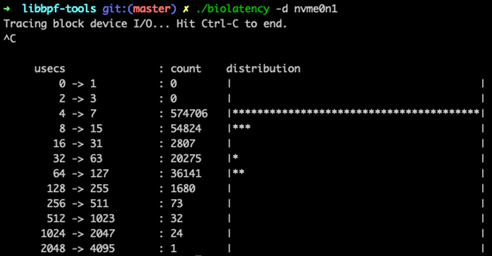
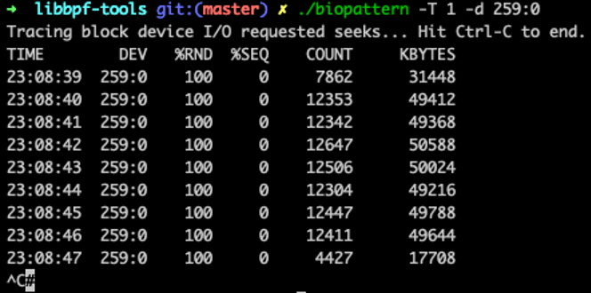
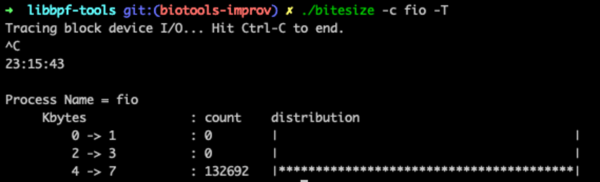
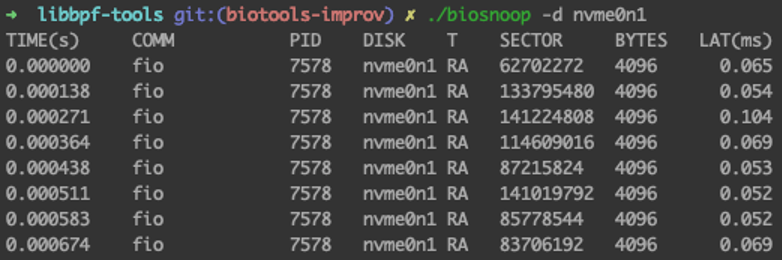

BPF 最初代表 Berkeley Packet Filter，但在 Linux 中已扩展为通用内核执行引擎，能够运行新型的用户定义和内核模式应用程序。近几年来，BPF 子系统越发火热，迄至 Linux 5.8 内核，Linux 内核已经支持 30 种 eBPF 程序类型，遍布于内核各个角落，引起了广泛关注及热议，在 LWN 上甚至出现过 Why don't we rename Linux to BPF-kernel？ 这样的嘲讽评论，不过更多的是一些理性的讨论。除上周在 [CNCF](https://sched.co/cpDS) 和大家分享的 BPF 在 Chaos 领域的应用外，目前 BPF 主要应用于：

1. 跟踪和探测，最有名的应用当属 BCC；

2. 网络功能 (XDP/TC)，用于反 ddos，负载均衡等，K8S 平台有著名的 Cilium；

3. 内核安全策略；

4. 内核回调接口，这种新架构可用于允许 BPF 程序替换内核中的任何 “ops 结构 ( struct xxx_ops ) ，社区大佬对此功能的评价是：march towards becoming BPF runtime-powered microkernel，目前 TCP 拥塞算法已用此框架实现，感兴趣的可以体验下；

5. 迭代器：dump 内核数据；

6. … …

这些功能都非常酷，其中上述一些应用的背后有着一个重要的基础功能 BPF CO-RE （Compile Once – Run Everywhere） 做支撑，我们来看下如何基于 BPF CO-RE 替代 BCC 工具来获得更好的体验。

## Libbpf-tools vs BCC

BCC 是 BPF 的编译工具集合，前端提供 Python/Lua API，本身通过 C/C++ 语言实现，集成 LLVM/Clang 对 BPF 程序进行重写、编译和加载等功能， 提供一些更人性化的函数给用户使用。

虽然 BCC 竭尽全力地简化 BPF 程序开发人员的工作，但其“黑魔法” （使用 Clang 前端修改了用户编写的 BPF 程序）使得出现问题时，很难找到问题的所在以及解决方法。必须记住命名约定和自动生成的跟踪点结构 。且由于 libbcc 库内部集成了庞大的 LLVM/Clang 库，使其在使用过程中会遇到一些问题：

1. 在每个工具启动时，都会占用较高的 CPU 和内存资源来编译 BPF 程序，在系统资源已经短缺的服务器上运行可能引起问题；

2. 依赖于内核头文件包，必须将其安装在每个目标主机上。即便如此，如果需要内核中未 export 的内容，则需要手动将类型定义复制/粘贴到 BPF 代码中；

3. 由于 BPF 程序是在运行时才编译，因此很多简单的编译错误只能在运行时检测到，影响开发体验。

随着 BPF CO-RE 的落地，我们可以直接使用内核开发人员提供的 libbpf 库来开发 BPF 程序，开发方式和编写普通 C 用户态程序一样：一次编译生成小型的二进制文件。libbpf 作为 BPF 程序加载器，接管了重定向、加载、验证等功能，BPF 程序开发者只需要关注 BPF 程序的正确性和性能即可。这种方式将开销降到了最低，且去除了庞大的依赖关系，使得整体开发流程更加顺畅。

性能优化大师 Brendan Gregg 在用 libbpf + BPF CO-RE 转换一个 BCC 工具后给出了性能对比数据：

>As my colleague Jason pointed out, the memory footprint of opensnoop as CO-RE is much lower than opensnoop.py. 9 Mbytes for CO-RE vs 80 Mbytes for Python.

我们可以看到在运行时相比 BCC 版本，libbpf + BPF CO-RE 版本节约了近 9 倍的内存开销，这对于物理内存资源已经紧张的服务器来说会更友好。

## Libbpf-tools 在 PingCAP 的应用

在 PingCAP 内部，我们很早就开始关注 BPF 和其社区发展，以前每添加一台新机器，就得在上面安装一套 BCC 依赖，比较麻烦，自从 libbpf-tools 示例程序添加到 BCC 项目后，我们就开始转换体验，在此过程中有幸得到了 Andrii Nakryiko （libbpf + BPF CO-RE 的主导者），和 Brendan Gregg，Yonghong Song 的指导。当前已完成 10 个 BCC/bpftrace 工具到 [libbpf + BPF CO-RE](https://github.com/iovisor/bcc/tree/master/libbpf-tools) 的转换 & 改进，并在内部使用。比如当需要弄清特定 workload 下 IO 特征时，就可以使用 block 层的多个性能分析工具来分析：

1. 使用 [./biolatency -d nvme0n1](https://github.com/iovisor/bcc/blob/master/libbpf-tools/biolatency.bpf.c) 确认 IO 请求的延迟分布情况：

	
	
2. 使用 [./biopattern -T 1 -d 259:0](https://github.com/iovisor/bcc/blob/master/libbpf-tools/biopattern.bpf.c) 分析 IO 模式：

	
	
3. 使用 [./bitesize -c fio -T](https://github.com/iovisor/bcc/blob/master/libbpf-tools/bitesize.bpf.c) 确认 task 下发物理 IO 请求时的请求大小分布图：

	
	
4. 使用 [./biosnoop -d nvme0n1](https://github.com/iovisor/bcc/blob/master/libbpf-tools/biosnoop.bpf.c) 对每次物理 IO 都进行详细都分析：

	
	
这些分析结果为后续的 IO 优化提供指导建议。除此之外，我们也在探索调度器相关的 libbpf-tools 对 TiDB 数据库的调优是否有帮助。这些工具属于通用型工具，欢迎大家来使用！

后续会将更多的工具基于 libbpf-tools 的方式来实现。期待大家的使用反馈！