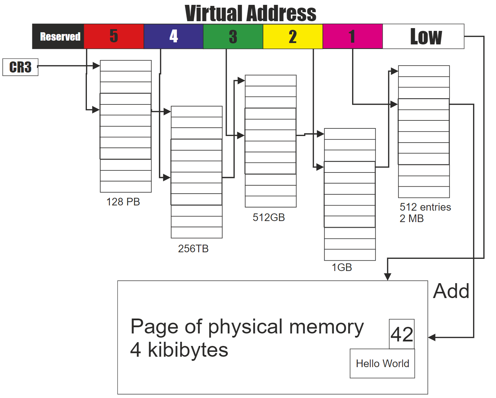
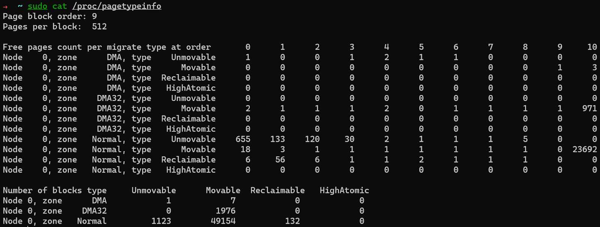
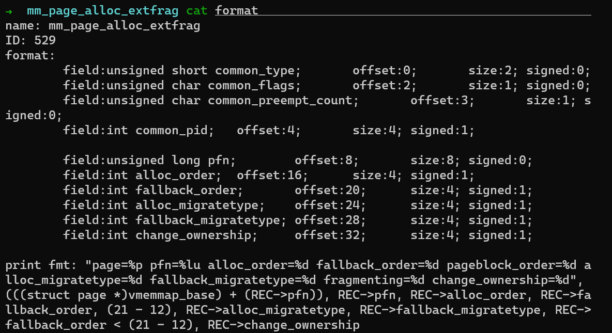

## 前言

（外部）内存碎片是一个历史悠久的 Linux 内核编程问题，随着系统的运行，页面被分配给各种任务，随着时间的推移内存会逐步碎片化，最终正常运行时间较长的繁忙系统可能只有很少的物理页面是连续的。由于 Linux 内核支持虚拟内存管理，物理内存碎片通常不是问题，因为在页表的帮助下，物理上分散的内存在虚拟地址空间仍然是连续的 （除非使用大页），但对于需要从内核线性映射区分配连续物理内存的需求来说就会变的非常困难，比如通过块分配器分配结构体对象 （在内核态很常见且频繁的操作），或对不支持 scatter/gather 模式的 DMA 缓冲器的操作等，会引起频繁的直接内存回收/规整，导致系统性能出现较大的波动，或分配失败 （在慢速内存分配路径会根据页面分配标志位执行不同的操作）。

如果内核编程不再依赖线性地址空间的高阶物理内存分配，那么内存碎片问题就从根本上解决了，但对于 Linux kernel 这样庞大的工程来说，这样的修改显然是不可能的，所以从  Linux 2.x 版本至今，社区一直有人在考虑各种方法，包括很多非常 tricky 的 patch 来缓解内存碎片问题，虽然有些已合并的 patch 也饱受争议，比如内存规整机制，在 [LSFMM 2014](https://lwn.net/Articles/591998/) 大会上，很多人抱怨内存规整的效率太低，速度太慢，且存在不易复现的 bug，但社区没有放弃此功能而是在内核后续版本不断优化 。

在这个领域当中最有毅力的当属 Mel Gorman，有两组重要的 patch 都是他提交的，第一组是在 Linux 2.6.24 版本合并，此 patch 在被社区接纳前共修改了 28 个版本，时间跨度按年记 （05 年 2 月份有其 v19 版本的介绍， 正式合并 v28 是在 07 年 10月），第二组 patch 在 Linux 5.0 合并，此 patch 在 1 或 2 socket 的机器上相比未 patch 版本，总体可减少 94% 的内存碎片事件。

本文将重点描述当前常用的 3.10 版本内核在伙伴分配器的预防内存碎片的扩展，内存规整原理，如何查看碎片指数，以及如何量化内存规整带来的延迟开销等。

## 反碎片简史

在开始正题前，先为大家汇总了部分 Linux 内核开发史上为改善高阶内存分配而做出的所有努力。这里的每一篇文章都非常值得细细的读一读，期望这个表格能为对反碎片细节感兴趣的读者带来便利。

|  lwn 发布时间 | 标题  |
|  ----  | ----  |
|  2004-09-08  | [Kswapd and high-order allocations](https://lwn.net/Articles/101230/)  |
|  2004-05-10  | [Active memory defragmentation](https://lwn.net/Articles/105021/)  |
|  2005-02-01  | [Yet another approach to memory fragmentation](https://lwn.net/Articles/121618/)  |
|  2005-11-02  | [Fragmentation avoidance](https://lwn.net/Articles/158211/)  |
|  2005-11-08  | [More on fragmentation avoidance](https://lwn.net/Articles/159110/)  |
|  2006-11-28  | [Avoiding - and fixing - memory fragmentation](https://lwn.net/Articles/211505/)  |
|  2010-01-06  | [Memory compaction](https://lwn.net/Articles/368869/)  |
|  2014-03-26  | [Memory compaction issues](https://lwn.net/Articles/591998/)  |
|  2015-07-14  | [Making kernel pages movable](https://lwn.net/Articles/650917/)  |
|  2016-04-23  | [CMA and compaction](https://lwn.net/Articles/684611/)  |
|  2016-05-10  | [make direct compaction more deterministic](https://lwn.net/Articles/686801/)  |
|  2017-03-21  | [Proactive compaction](https://lwn.net/Articles/717656/)  |
|  2018-10-31  | [Fragmentation avoidance improvements](https://lwn.net/Articles/770235/)  |
|  2020-04-21  | [Proactive compaction for the kernel](https://lwn.net/Articles/817905/)  |

下面我们开始进入正题。

## Linux 伙伴分配器

Linux 使用[伙伴算法](https://en.wikipedia.org/wiki/Buddy_memory_allocation)作为页分配器，其特点是简单高效。Linux 在经典算法的基础上做了一些个扩展：

1. 分区的伙伴分配器；

2. Per-CPU pageset；

3. 根据迁移类型进行分组；

我们以前介绍过 Linux 内核使用 node, zone, page 来描述物理内存，分区的伙伴分配器专注于某个 node 的某个 zone。4.8 版本以前，页面回收策略也是基于 zone 来实现的，因为早期设计时主要面向 32 位处理器，且存在大量高端内存，但这种方式存在同一个 node 的不同 zone 页面老化速度不一致，导致了很多问题。社区长期以来加了很多非常 tricky 的 patch 来解决各种问题，但依然没有从根本上解决这个问题。随着近几年 64 位处理器 + 大内存的机型越来越多，Mel Groman 将页面回收策略从 zone 迁移到 node，解决了这一问题。我们在使用 BPF 编写工具观察回收操作时需要注意这点。

Per-CPU pageset 是用来优化单页分配的，可以减少处理器之间的锁竞争。和反碎片化没有关系，因此在本文不做详细介绍。

根据迁移类型进行分组是我们要详细介绍的反碎片方法。

## 根据迁移类型进行分组

我们在了解迁移类型前，需要先理解内存地址空间布局，每一种处理器架构都有定义，比如 x86_64 的定义在 [mm.txt](https://www.kernel.org/doc/Documentation/x86/x86_64/mm.txt)。对于通过页表访问虚拟地址空间的情况 （比如用户空间的堆内存需求）并不需要连续物理内存，为什么呢？我们以下图 [Intel 5-level](https://en.wikipedia.org/wiki/Intel_5-level_paging) 页表为例，虚拟地址从低到高划分为：页内偏移、直接页表索引、页中间目录索引、页上层目录索引、页四级目录索引、页全局索引，物理内存页帧号保存在直接页表项中，通过直接页表索引即可找到，将找到的页帧号和页内偏移组合起来就是物理地址。假设我要将某个直接页表项中对应的物理页面换走，只需要分配一个新页面，将旧页面的数据拷贝到新页面，然后修改此直接直接页表项的值为新的页帧号即可，而不会改变原来的虚拟地址，这样的页面可以随便迁移。但对于线性映射区，虚拟地址 = 物理地址 + 常量，我们若修改物理地址，必然会导致虚拟地址也发生变化，所有继续访问原虚拟地址的行为就出 bug 了，这样的页面显然不宜迁移。所以当通过页表访问的物理页面和通过线性映射的页面混合在一起管理时，就很容易出现内存碎片，因此内核根据页面的可移动性定义了几种迁移类型，并根据迁移类型对页面进行分组实现反碎片化。



内核定义了多个迁移类型，我们通常只需要关注 3 个：MIGRATE_UNMOVABLE、MIGRATE_MOVABLE、MIGRATE_RECLAIMABLE，这 3 个是真正的迁移类型，其他的迁移类型都有特殊用途，在此不做表述。我们可以通过 /proc/pagetypeinfo 查看每个迁移类型在每个阶的分布情况。



具体从哪种迁移类型分配页面是由申请页面时，使用的页面分配标志位决定的。比如对于用户空间的内存需求使用 __GFP_MOVABLE，对于文件页使用 __GFP_RECLAIMABLE。当某种迁移类型的页用完时，可以从其他迁移类型盗用物理页。盗用时会从最大的页块 （大小由 pageblock_order 决定，细节不在本文展开）开始盗用，避免产生碎片。上述三个迁移类型的备用优先级从高到低依次为:

MIGRATE_UNMOVABLE:        MIGRATE_RECLAIMABLE, MIGRATE_MOVABLE

MIGRATE_RECALIMABlE:      MIGRATE_UNMOVABLE, MIGRATE_MOVABLE

MIGRATE_MOVABLE:             MIGRATE_RECLAIMABLE, MIGRATE_UNMOVABLE

内核引入迁移类型进行分组的目的是反碎片化，因此当出现频繁盗用时，说明存在外部内存碎片事件，这些外部碎片事件为未来埋下了隐患。我在上一篇文章 [我们为什么要禁用 THP](https://pingcap.com/blog-cn/why-should-we-disable-thp/) 有提到可以用内核提供了 ftrace 事件来分析外部内存碎片事件，具体的步骤如下：

```
echo 1 > /sys/kernel/debug/tracing/events/kmem/mm_page_alloc_extfrag/enable
cat /sys/kernel/debug/tracing/trace_pipe > ~/extfrag.log
```

执行一段事件后执行Ctrl-c，并执行

```
echo 0 > /sys/kernel/debug/tracing/events/kmem/mm_page_alloc_extfrag/enable
```

停止采集。这个事件包含很多字段：



对于分析一段事件内发生外部内存碎片事件的次数，我们只需要关注 fallback_order < pageblock order （x86_64 环境下为 9） 的事件即可。

我们可以看到根据迁移类型进行分组只是延缓了内存碎片，而并不是从根本解决，所以随着时间的推移，当内存碎片过多，无法满足连续物理内存需求时，将会引起性能问题。因此仅仅依靠此功能是不够的，内核需要一些手段来整治内存碎片。

**未完待续...**
