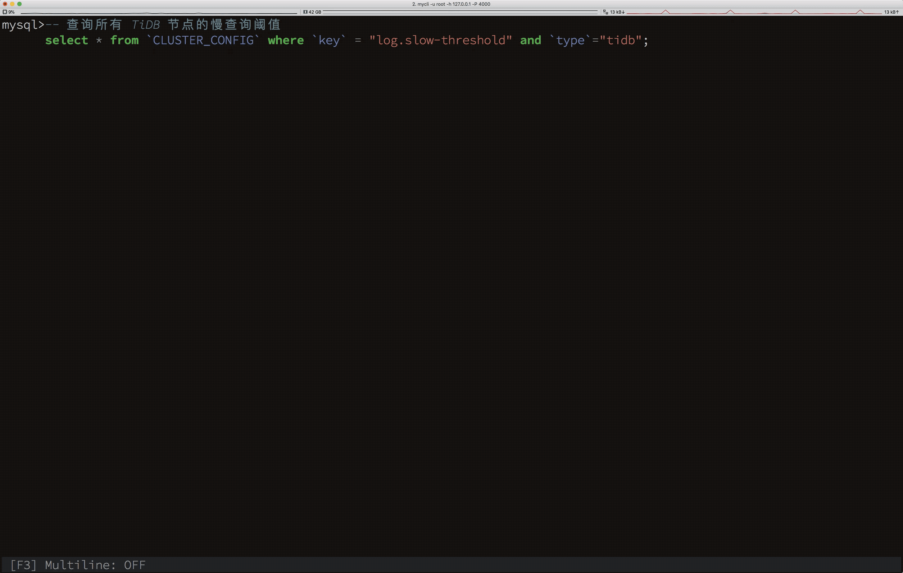
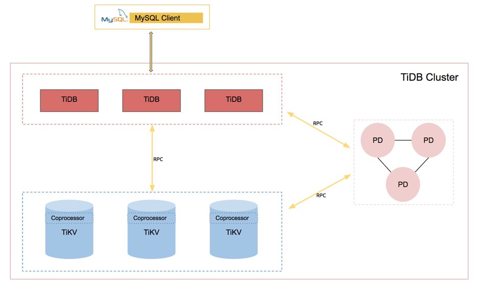
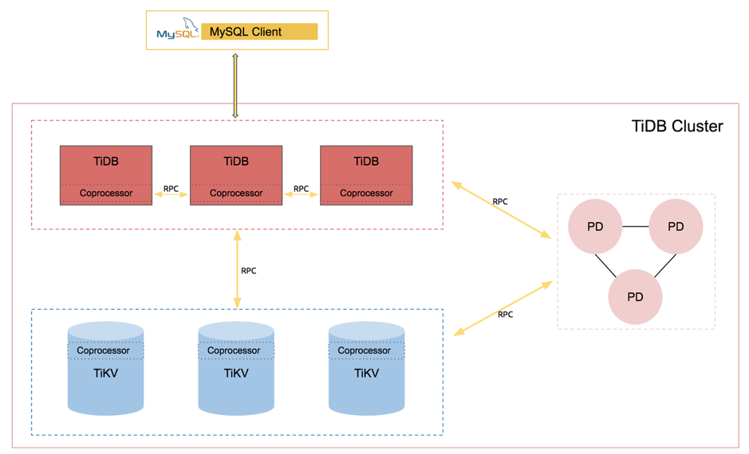

>作者介绍：陈霜，做个人吧队成员，PingCAP TiDB 研发工程师，做个人吧队参加了 TiDB Hackathon 2019，其项目「Manage many as one with SQL」获得了三等奖。

极致的易用性一直是 PingCAP 追寻的目标。在这之前，TiDB 通过兼容 MySQL，将分布式的复杂度隐藏在 TiDB 之后，将用户从复杂的分库分表方案中解脱出来，使用户可以像使用单机数据库一样使用 TiDB。

不过兼容 MySQL 只是易用性的第一步，这一步主要提升了开发人员的体验。但是对于 DBA 来说，运维一个分布式系统的难度还是不低。那么分布式数据库的运维目前到底面临哪些难题？大致有以下几个方面：

*   各组件状态信息分散。

*   运维操作需要跨节点。

*   运维脚本重复编写，无法标准化。

在 TiDB hackathon 2019 之后，以上问题我们给出了一个统一的答案：用 SQL 管理整个 TiDB 集群。

## 用 SQL 查询集群信息

图 1 查询集群系统信息

在上面的示例中，我们通过 SQL 获得集群以下信息：

*   所有节点的拓扑信息，版本信息。

*   所有节点的配置信息。

*   所有节点当前正在处理的请求，即 processlist。

*   所有节点的慢查询信息。

*   所有节点的服务器硬件信息。

*   所有节点当前的负载（Load）信息。

### 提供更多的系统内存表

在此之前，TiDB 提供系统信息的系统表较少。本次 hackathon 的项目也添加了更多的系统表用于通过 SQL 获取更多信息：

*   节点的硬件信息：CPU ，memory，网卡，磁盘等硬件信息。

*   节点的负载信息：CPU/Memory load, 网络/磁盘流量信息。

*   节点的配置信息。

*   节点的监控信息：如 QPS, KV Duration, TSO duration 等。

每个系统表都有一个对应的 cluster_ 前缀的集群系统表视图。这里不一一展示了。

## 用 SQL 动态更改集群的配置

下面演示用 SQL 动态修改集群所有节点的配置:

图 2 动态修改集群配置

根据上面的动图可以看出，我们能通过 Update 语句修改 CLUSTER_CONFIG 系统表，即可完成集群配置的变更，而不需要再通过复杂的运维命令。当然，通过这个语句，也能指定只修改某个节点的某项配置。

## 用 SQL 完成故障诊断

当 TiDB 集群出现故障后，以前 DBA 可能会根据现象以及故障排除手册逐个排查。依靠我们添加完成上述的基础能力，这些完全是可以自动化的，比如一些 TiDB 中常见的故障排查场景：

*   找出系统写入变慢的原因，例如节点发生宕机等等。

*   找出集群中慢查询的全链路日志行为。

*   找出磁盘容量或者内存监控异常的节点。

在本次 Hackathon 之后，通过一些简单的 SQL 语句组合，就可以得到上述的结果。这些大家千呼万唤的功能，都在一点点变成现实。

>TiDB 作为一个成熟的分布式数据库，通过一个易用且统一的方式进行集群的运维、管理以及监控非常重要。随着内部组件越来越多，监控及诊断工具的碎片化，再加上本身 TiDB 天然的分布式属性，让这个问题更加棘手。对于数据库来说，通过 SQL 来做这件事情是最天然的，也是最具有扩展性的，目前 TiDB 也正在往这个方向努力，这个项目是一个非常好的例子。
>
> ———— 黄东旭（PingCAP | CTO）
>
>对于 DBA 来说，一切从简，效率为先，SQL 当仁不让自是 DBA 最有力的、最能提高效率的利器。而分布式数据库有别于传统数据库，其组件居多交互复杂，性能诊断难、问题定位时间长等问题着实让 DBA 头疼。但 TiDB 作为新一代 NewSQL 数据库，一直秉承极致易用性的理念，贴切 DBA ，回归 SQL 实现整个分布式数据库集群管理，无异于节省 DBA 大量精力与时间，完美契合 DBA 。
>
> ———— 金文涛（PingCAP | DBA ）

## 项目设计细节

在这个项目之前，查询 TiDB 的系统表时，用户一定会遇到的问题是：某些系统表只包含了当前 TiDB 节点的数据，而不是所有节点的数据。比如 PROCESSLIST（当前执行语句），SLOW_QUERY（慢查询内存表） 等。

要实现读取所有节点的系统信息和修改所有节点的配置，首先要打通 TiDB 节点之间的数据交互。先看下目前 TiDB 集群的架构，如下：

图 3 原来 TiDB 集群系统架构

可以发现，现有结构下，其他的组件是用 RPC 来通信的，那么自然 TiDB 也应该用 RPC 通信，理由如下：

*   TiDB 用 HTTP API 读其他 TiDB 节点的信息的可扩展性相对会差一些，RPC 框架的可塑性更高，可以承接未来 TiDB 节点间数据交互的需求。

*   计算下推到各个 TiDB 节点。某些某些信息的数据量可能很大，比如慢查询内存表，如果没有算子下推来完成数据的过滤，会存在很多多余的网络开销，这一点原理跟 TiDB 下推算子到 TiKV 是一样的。

所以最后我们选择在 TiDB 新增一个 RPC 服务。架构如下：

图 4 现在 TiDB 集群系统架构

TiDB 新增的 GPC 服务和 HTTP 服务共用 10080 端口，没有新增端口。通过以下 Explain 结果可以看出来，以下语句成功下推到了各个 TiDB。

图 5 计算下推到其他 TiDB 节点执行

## 写在最后

以上功能由于时间原因并未能完全在 Hackathon 期间完成，不过其目前已经作为一个 [社区孵化项目](https://github.com/orgs/pingcap/projects/3)。相信将会很快跟大家见面。

也欢迎感兴趣的社区小伙伴们加入我们社区的工作组：[SQL 诊断工作组](https://github.com/pingcap/community/blob/master/working-groups/wg-sql-diagnostics.md)，一起进一步完善并落地这个项目，提高 TiDB 的易用性。

令人振奋的是，这一切只是一个开始。
