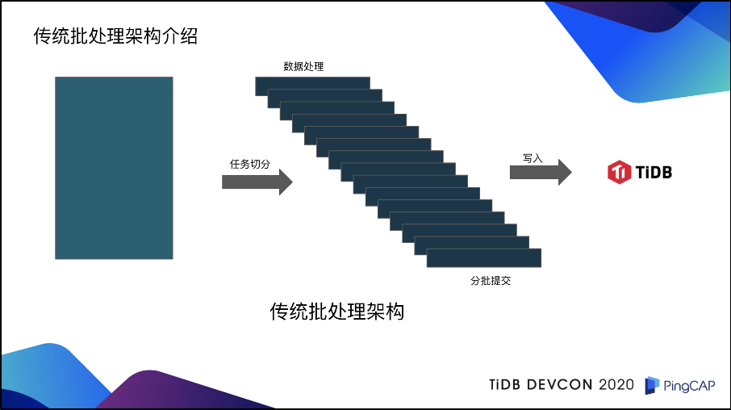
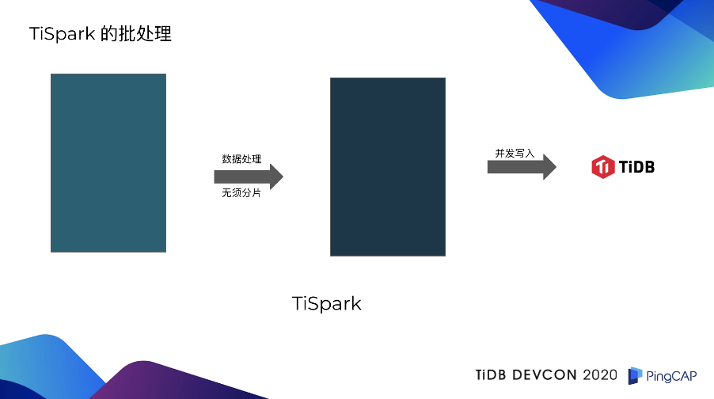
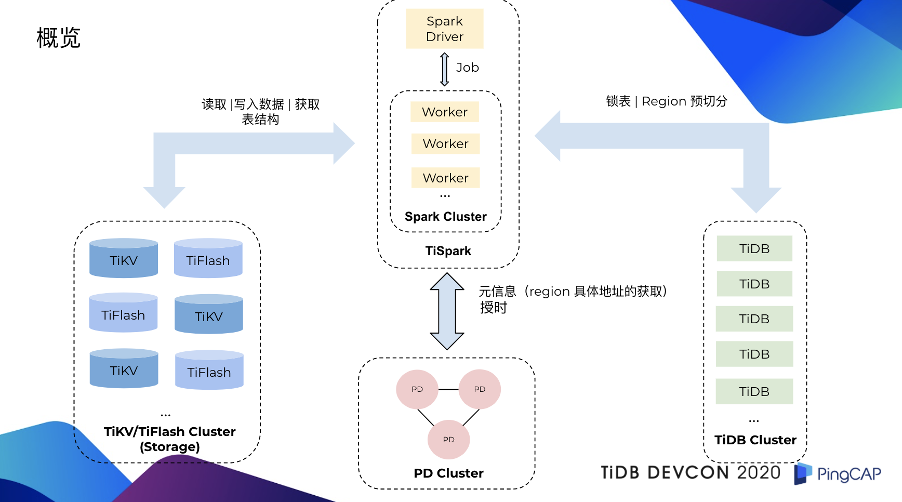
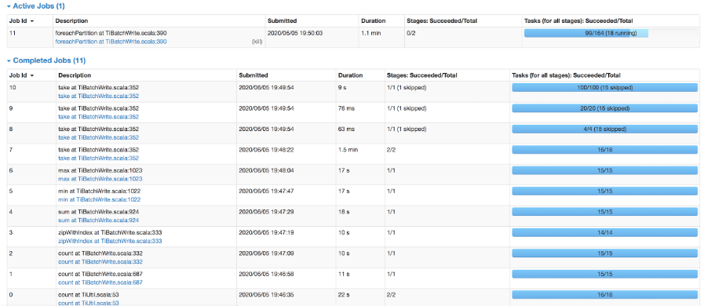

作者介绍：杨哲轩，PingCAP 资深解决方案架构师。

熟悉 TiSpark 的人都知道，TiSpark 是 Spark 的一个插件，它其实就是给予了 Spark 能够去访问 TiDB 底层分布式存储引擎 TiKV 或者 TiFlash 的能力。之前我们一直在解决读的问题，写问题并没有付出太多的时间去解决。今天就给大家揭秘，我们是怎样使用 TiSpark 去实现海量数据批处理，然后写入到 TiDB 里面去的。

## 传统批处理 vs TiSpark 的批处理

在介绍 TiSpark 之前，我们首先来回顾一下传统批处理架构。

对于传统批处理架构而言，首先要有一个数据，这个数据可以是用户的 CSV 文件，也可以是用户从 TiDB 或 MySQL，或者是其它异构数据库里面读出来的数据。在拿到这些数据之后，它首先需要做的是任务切分，对于每一个批次的任务，每一个小批的任务，分别去进行数据处理，然后再进行分批提交，最后再去写入到 TiDB 里面。

熟悉数据库的人可能都知道，这一套架构有一个致命的问题：就是它没有办法通过数据库来保证事务的 ACID 特性。

传统的批处理架构，都需要引入一些任务表的机制，来追踪每一个子任务的成功状态。如果说子任务表中有一个状态是失败的，那可能就需要把整个任务全部回滚。甚至在一些情况下，都需要人工去介入。

对于 TiSpark 来说，则不需要这样。

TiSpark 拿到读取完毕的数据以后，首先把它当做一个整体去进行数据处理，无须分片分批处理。数据处理之后形成的新数据，是直接通过两阶段协议，并发的写入到 TiKV 里，不经过 TiDB Server。如果拿 TiSpark 的批处理技术和传统批处理架构来进行对比，会发现传统批处理架构有着两个致命的缺陷。第一点是慢，在一些商业银行，它的日中批处理任务，都是有一定的时效性的。如果说你的处理速度特别慢，是会影响到第二天的开业。第二，传统批处理架构也是没有办法能够保证事务。为了解决事务的问题需要引入很多机制，业务侧去做这种事务的保证，会特别的复杂，难用，也会影响到整体的处理和写读的速度。

## TiSpark 解读

### 架构

接下来大家可能对 TiSpark 的整体架构会比较感兴趣，下图应该就说的比较清楚了。

首先，左侧蓝色部分是 TiDB 的分布式存储引擎，包括 TiKV、TiFlash；粉色部分是 PD；右侧绿色部分是 TiDB Server；上方黄色部分是 Spark 集群。

在一个任务提交到 TiSpark，TiSpark 在处理完数据之后，开始写入数据之前，会先进行一个锁表的处理。锁表的意义是防止其它的事务与 TiSpark 正在写入的事务发生冲突，导致 TiSpark 的事务进行回滚。大家知道，TiSpark 批处理它所涉及到的数据量都会特别大，可能是成千万，甚至上亿的数据量，如果因为这样而回滚是我们不想看到的事情，所以我们需要预先做一个锁表。

**这里需要强调一下，这个锁表只针对于 3.0.14 以上的版本**。在 4.0 版本中 TiDB 已经原生支持了 10GB 的大事务，它对事务的协议做了一定的修改，这也意味着如果 TiSpark 能够兼容这种协议上的修改，是可以不需要去锁表的。

第二步就是 TiSpark 会对它将要写入的数据去定型、统计、抽样、计算，算出来它这一次批量的写入，大概会生成多少个新的 Region，然后把这些信息传递给 TiDB，由 TiDB 跟其它的组件去进行交互，把新生成的 Region 预先切分出来。Region 预切分的好处：

- 第一，是规避了热点问题。

- 第二，如果说在 TiSpark 写入过程中，因为 Region 发生分裂，可能会导致一些写入性能的降级，通过这种方式，就能够有效的去规避。

另外，TiSpark 在写入过程中，也会跟 PD 去进行互动，这个互动主要是两个方面。第一个方面，是一些元信息。要知道 TiKV 底层数据是一个键值对，TiSpark 在写入之前也会把所有的行数据，转换成为键值对。既然是一个键值对，就需要知道我这个键值对需要去哪一个 Region，这就是 Region 具体地址的获取。另外一方面，TiSpark 在写入也是保证事务的，它需要向 PD 申请一个时间戳。不熟悉 TiDB 的同学，可以简单把这个时间戳理解为事务的 ID 号，接下来就非常简单了，准备工作都已经做完，TiSpark 会直接把它生成的键值对，通过 Spark Worker 去并发的多对多的写入到 TiKV 里面。

### 原理

接下来讲一讲 TiSpark 的原理。原理可以具体分为两大块。

**第一块是 TiSpark 实现了一个 Java 版本的 TiKV 客户端**。这个客户端的功能是比较多，也比较丰富，完全可以单独剥离，然后拿去给用 Java 实现的业务去使用，就是跟 TiKV 去进行交互。首先，它实现了 Coprocessor 的接口。这也意味着它可以跟 TiKV 或者是 TiFlash 去进行互动，可以把一些算计进行下推，比如说 Limit、Order，或者是聚合等等。它也会做一些谓词、索引、键值域的处理。比如我有一个查询，它用了索引以后，或者说用了主键以后，它的查询范围可能是 10 到 100，如果我还继续用全表查的话，速度会特别慢。所以，这时全表查会被优化成为 10 到 100 的范围查。

**另外，Java 版本的 TiKV 客户端也实现了两阶段的协议**。这也是 TiSpark 能够保证写入符合 ACID 的核心功能。简单来说，这个协议在 TiDB 那边也有一样的实现。只不过它是用 Golang 实现的。我们所做的工作，就是把这个协议用 Java 重新实现了一遍。此外，这个客户端也会去维护一些统计信息，索引信息。这样的好处就是在 Spark 做执行计划的时候，能够有效的利用到这些信息，去选择一条更优的执行路径。

刚才提到的 Java 版本的 TiKV 的客户端，只是告诉你，你可以通过这个去跟 TiKV、TiFlash 去进行交互，但是，并没有解决另外一个很关键的问题，就是我怎么样把这个东西告诉 Spark。那这个问题的答案就是 TiSpark。

TiSpark 利用了 Spark 的 Extensions Point。我们之所以选择 Spark Extensions Point 作为一个入口是因为这样做可以减少维护成本，我们没有必要单独去维护一套 Spark 的代码。假设说我们现在选择的是维护 Spark 代码，现在去实现访问 TiKV 或是 TiFlash 的逻辑，那这意味着我们势必要跟主干进行分叉。熟悉开发的同学可能都知道，如果你跟主干离的太远，主干的后续更新你是很难再合回来的。所以基于这种考量，我们当时是采用了 Spark Extensions Point 作为方案。这个方案除了上面说的这个好处以外，还有别的好处吗？答案是有的。它可以劫持 Spark Catalyst 的优化器，能够将怎么样去访问 TiKV 或者是 TiFlash 的逻辑注入到 Spark 的执行计划，或者是去进行一些相应的改写。

并且 TiSpark 无论是单表写入，还是多表写入，它都是能够保证事务的 ACID 特性的。只不过单表写入，它是完全兼容 Spark DataSource API。因为 Spark 里面，DataFrame 就是一个单表的概念，如果说你想要去做多表的写入的话，你需要使用的是 TiSpark 额外维护的接口（后文会举例介绍）。我们能够保证不管是 TiSpark 以后更新多少个版本，这个接口是不会变的。

### 融合

刚才是讲了一些原理，可能大家会有一个疑问，你这个东西很好，那它怎么样能够跟现有的分布式业务系统去融合呢？答案是，它是可以融合的。

举一个简单的例子。我们现在有一个分布式业务系统，它分为三个部分。第一部分是有一个服务应用框架；第二部分是有一个异步任务应用框架；然后接下来就是批量应用框架。

服务应用框架是面向业务开发人员的，业务开发人员去实现这个批任务的逻辑，然后提交给服务应用框架，服务应用框架再把这个任务提交给异步任务框架去进行调度，最终把它放到我们的批量应用框架里面去真正的执行。有了 TiSpark 以后，TiSpark 可以比较好的融入到我们的批量应用框架里面，刚才说的那个流程，只不过是异步任务应用框架在提交给批量应用框架之后，整个的执行路径是由 TiSpark 来控制。就是 TiSpark 来去控制它的整体的调度和处理，而不是由原来的批量调度框架，或者是批量处理框架去进行调度或者是处理。

### 应用

刚才一直在说原理和融合，下面就是讲一讲，TiSpark 到底是怎么样可以应用在这个批任务上？我个人认为，批任务最重要的其实是数据处理，在 TiSpark 里面，数据处理是可以通过 Data Frame 中的接口来实现的。当然如果不那么熟悉 Data Frame 接口的同学，也可以采用 Spark SQL 的方式来实现。下图是一个比较简单的例子：

比如说我有一张用户表，这个用户表里面有它的贷款和利率，然后我想根据这个贷款和利率去计算当月所需要还的利息。那其实很简单，你可以通过 DataFrame 中的接口，通过列的名字去定位到它的贷款，和它的利率，然后通过一个简单的算术运算，加减乘除，把它的当月所需还的利息，算出来。然后最终是通过 DF 的另外一个接口 withColumn，把它新重建一个列，这个列的名字就叫做 toBeDeducted。然后就会生成一个新的 DataFrame。这个新的 DataFrame 与原来的 DataFrame 唯一的区别就是它多了一列，叫做 toBeDeducted。

接下来我们可以把这个 toBededucted 跟它原来的余额去进行减法操作，减法操作完毕之后，这个新的余额，就是经过批量任务以后真正的余额。此时可以看到刚才算出来的 toBeDeducted 是一个冗余列，我们是可以把它作一个丢弃操作。实际上也很简单，你可以通过一个 job 去处理。另外，刚才这个计算应该是比较简单，那同时，用这个 DatoFrame 的接口，也可以去实现一些比较复杂的批处理逻辑。

举个例子，信用卡的积分项目。一个信用卡积分的计算，它可能有三张表，分别是积分信息、消费信息、规则信息。积分信息是用户当前的积分；消费信息就是每个月的消费金额；规则信息是我在不同的商户里面，他的消费的返比是不一样的。可能在珠宝类的商户里面，它的返比是 1：2，也就说，1 块钱等于 2 积分。那我们可以把这三张表，在 Spark 里面进行 join，然后生成一个新的 DataFrame。然后 DataFrame 再通过相应的列的名字，去进行一些算术计算，比如把消费金额乘以规则信息里面的系数，然后把这个批任务去执行完毕。执行完毕以后，可以去按照不同的表的结构，去对 DataFrame 进行相应的处理和操作。最终，通过我们的写入接口，能够又快又好的写入到 TiDB 里面。**这里要强调的就是，TiSpark 的写入是直接去写 TiKV，不经过 TiDB 的，它绕过了 TiDB。**

然后讲一下单表写入。单表写入就比较简单，它是完全兼容了 Spark DataSource 的 API，使用上也是非常方便的。如果说你之前没有 Spark DataSource 的经验，我觉得学习上也一定会特别的快，因为 Spark 它也兼容 Java 语言，然后你也可以用 Java 的接口去实现整个 DF 的写入。关于写入我想强调两点，第一点就是 format 和 options。format 是因为 Spark 里面的 format 有很多种。比如说，如果你想用 JDBC 写，那你可能就要用 JDBC。如果你的写入对象是一个 Parquet，那你可能需要用 parquet。那这边因为我们的写入对象是 TiDB 里面的 TiKV，那我们这边就要用 TiDB 这个字符串。然后这个 options 里面其实就是一个 TiDB 的 options。这里面维护的是 TiDB server 的一些相关信息。包括了它的 IT 地址、端口、用户名、密码等等。因为前面也提到了，我们的 TiSpark 在写入的时候，也是需要跟 TiDB 去进行交互的，有了这些信息，它就可以比较好的去跟 TiDB 进行交互。

下面讲一下多表写入。刚才的单表写入，能够完全兼容 DataSource API，是因为在 Spark 里面，DataFrame 就是一个单表的概念。那如果说你想再写入多表，如果多表写入也能够保证 ACID 的特性的话，是没有办法去继续使用 Spark DataSoucre 的 API，你必须去使用 TiSpark 提供的接口。这边它有一个 DBTable 和 DataFrame 的映射关系。就是一张表你是需要通过它的库名，它的表名，来对应到它具体的 DataFrame，然后把它放在一个 Map 里面。假设你现在有三张表需要去同时写入的话，那它这个 Map 里面的元素应该是三个。接下来就是进入到我们 TiBatchWrite.write 这里面的接口，它这里面就会有一个 data 和 TiDB options。TiDB options 我在单表写入的时候，也已经详细介绍过了，这边就不再赘述。

熟悉 Spark 的同学，可能会问一个问题，因为 Spark 中的 DataFrame 是一个单表的概念，如果说你做一个合并，很可能会有表结构不兼容的问题。我是觉得这个问题非常好。但是，你仔细想一想，在 TiKV 里面，它这个数据格式是什么？是一个一个的键值对，那其实在我们支持多表写入的时候，前面的逻辑都是单独的，只有在 DataFrame 转换成为了键值对以后，我们才会去把它合并。

举个例子，假设说我现在有一张表它是有 100 行数据，两外一张表是 200 行数据，转化成为键值对以后，可以因为有索引，组件等，扩张了两倍，就是 200 行变成 400 个键值对，100 行变成了 200 个键值对。合并完了以后，它是 600 个键值对。在合并完之后，我才去做两阶段协议的提交。因为两阶段协议的提交能够保证你这 600 个键值对的提交，要么是成功，要么是失败的。这也意味着，如果说我的 600 个键值对提交成功了，我的两张表写入是成功的，如果它没有成功，那么我们两张表的写入是失败的。

所以说，通过我们的接口写入的多表的写入，也是符合 ACID 特性的。

另外一个大家可能会比较好奇的就是我有一个任务提交到了 TiSpark 里面，我有没有办法去看的到它这个任务的进度？答案是可以的。下图是我在提交了一个 4 百万行的数据写入的一个截图。

从图中可以看到，差不多接近 5 分钟左右应该就能写完。在 0 到 6 这个 job ID 这边，其实做的都是准备工作。7 到 10 做的是两阶段提交里面的选一个主键(在两阶段协议提交过程中保证事务的原子性)的步骤。然后 job ID 11 是真正的写入的工作。通过这个监控，可以比较清楚的看到，目前这个批处理任务当前正在处理什么。

### 优点

其实回过头来看，我们这个 TiSpark 的批处理，有着什么样的优点？

**第一个优点就是快，快，快。** 重要的事情说三遍，因为它真的特别快。快的原因是什么？是因为 TiSpark 绕过了 TiDB，可以多对多的并行写入 TiKV。这意味着什么？意味着它可以水平横向扩展。如果我的资源限制在 TiKV 那边，我可以简单加一个 TiKV 节点，就是扩展它的磁盘资源。如果我的瓶颈在 Spark 这边，我可以加一个 Spark 的计算节点。通过这种方式，可以又快又好的把这个数据写到 TiKV 里面。

**第二个优点，是配置比较简单。** 熟悉 spring batch 的同学可能都知道，spring batch 需要配置一大堆的 Item reader 和 Iitem writer ，特别复杂，特别难用。对于 TiSpark 来说，你可能唯一需要配置的就是告诉 Spark 怎么样去用这个 TiSpark。而且 TiSpark 所有的批处理逻辑，基本上 99% 都是兼容 Spark 的 DataSource API。只要你熟悉了 DataSource API，包括 DataFrame API，那你的批处理逻辑的书写、写入逻辑的书写，都会非常的方便。

**第三个优点是不仅快，它还能保证事务。** 就是写入要么成功，要么失败。小孩子才做选择，成年人全都要，就是又快又能够保证事务。目前 TiSpark 的写入性能可以在 8 分钟内写完 6000 万行 TPCH 的 lineitem 的数据。

如果大家对 TiSpark 批处理方案有兴趣的话，也欢迎邮件与我联系（邮箱：yangzhexuan@pingcap.com），我们一起看看怎么样能够把它融入到现有的分布式业务系统，更好的为用户带来价值、谋福利。