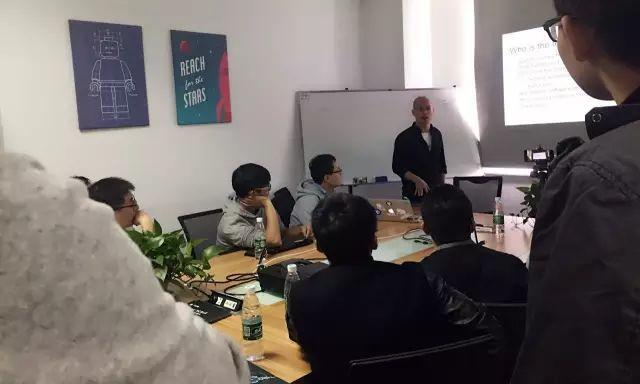
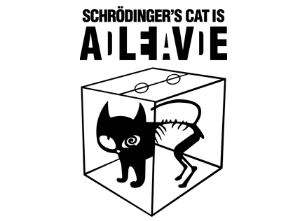
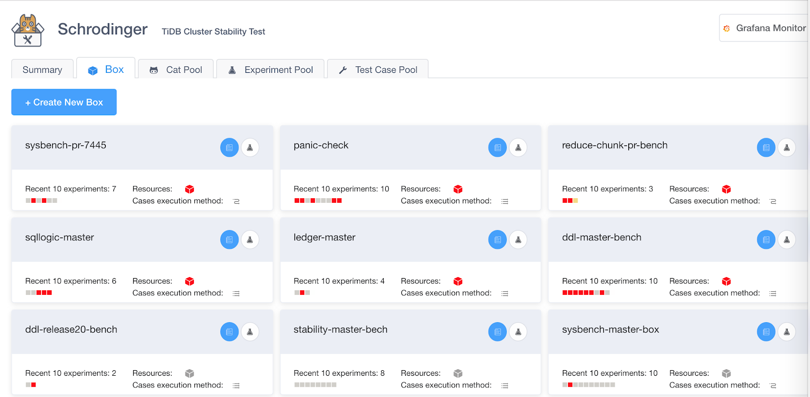
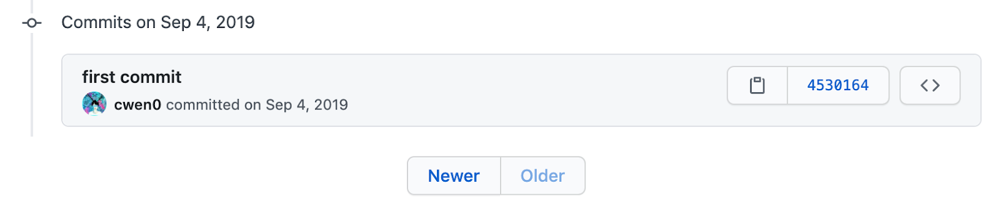
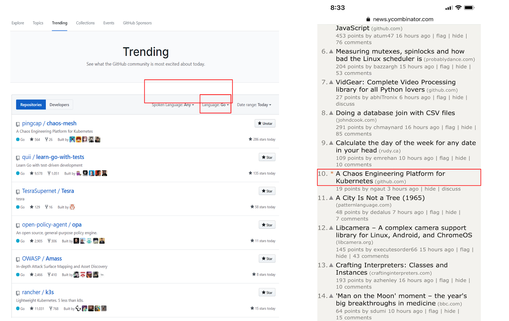
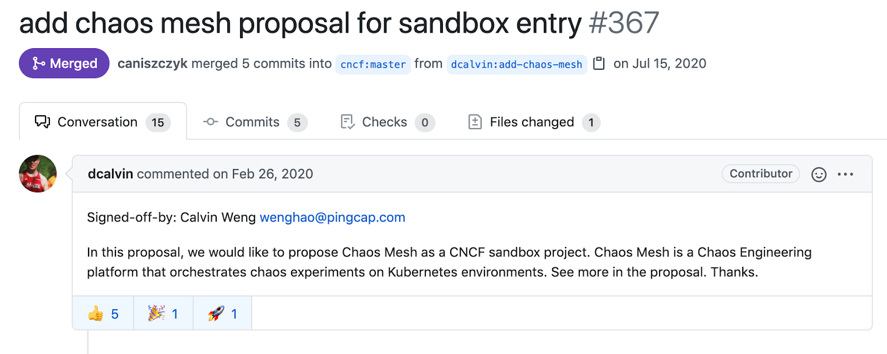
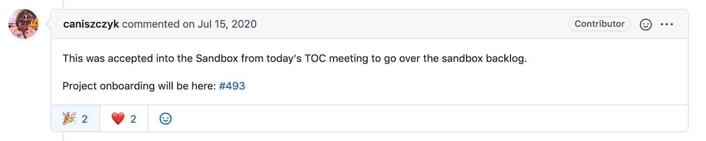
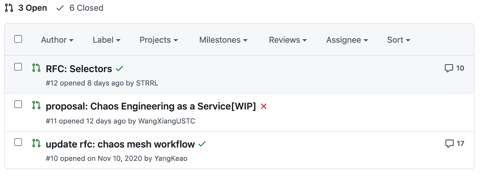

---
title:「我的工作是制造混沌」，我与 Chaos Mesh® 的故事
author: ['殷成文']
date: 2020-09-15
summary: 本文将向大家介绍自己与 Chaos Mesh 一起成长的点滴。
tags: ['TiDB']
---

> 作者：殷成文，Maintainer of Chaos Mesh

这段时间北京真是冷得可怕，朋友圈晒出各种零下 20 度的照片，在这样一个寒冷的时候，总是想给自己找点温暖的事情去做。这几天闲时就回顾起自己从实习到现在这段时间的经历，前不久是 Chaos Mesh 开源一周年（2020.12.31），于是就将自己与 Chaos Mesh 一起成长的点滴整理出来和大家分享。 一方面为了庆祝，另一方面也希望能够在这个寒冷的冬天给大家带来点温暖。 

## 与 PingCAP 结缘

开始 Chaos Mesh 故事之前，先说点自己和 PingCAP 的故事。

第一次真正接触 PingCAP 是在 2016 年的时候，我参加了一场 PingCAP CTO 黄东旭大佬的技术分享，正好当时在参与一个 Go 语言项目，对 Go 语言生态更加关注，对 Go 圈里的明星项目 TiDB 更是佩服。本以为这会是一个很有深度的分享，会涉及分布式、CAP 定理等等。没想到最后东旭和我们聊了一个小时的 Unix  哲学，说好的数据库？说好的 CAP 定理呢？ 相信当时好多小伙伴和我的心情是一样的——懵逼。但 PingCAP 这个公司却更加吸引我了。 

再次接触 PingCAP 是陪同学一起去北京面试的时候，偶然在 Go 社区看到 PingCAP 的一条实习生招聘信息，一下就被吸引了，在同学的撺掇下就尝试投个简历试一下。 当天晚上八点左右，我就接到秋哥 (PingCAP 创始人崔秋) 的电话，说他们正在 TB，在一家烧烤店撸串看足球，问我要不过去聊聊。当时把我惊到了，哪有大晚上约人去烧烤店面试的！到了烧烤店，他们还真是在看足球，我记得当时还是中国队的比赛，这场神奇的面试就和这场球赛同步进行着。最后球赛结束，中国队输了，但我收到了个 offer，感谢中国队！给了我这次机会！

## Chaos Mesh 前世 

上面聊了一下我与 PingCAP 结缘的故事，下面就是我与 Chaos Mesh 的故事。 

正式来 PingCAP 实习前，我在某个周六的上午去参加了一期 PingCAP 组织的 Meetup。小小的会议室里面挤满了人，大多数人都是站着的。我记得其中一个主题是由 PingCAP 另一位创始人兼 CEO 刘奇带来的《深度探索分布式系统测试》，奇叔的分享给我留下了深刻的印象。我第一次知道测试还可以这样搞，各种故障注入手段层出不穷，目的就是为了去虐我们的系统。现在想想，当初奇叔分享的不正是混沌工程的思想，同样没有想到的是这个主题会成为我后面一段时间内持续耕耘的事情。

正式开始实习后，我的第一个任务是对 TiDB 进行性能压测。如果只是想简单地跑出一组数字，这就是一个很简单的任务。但是如果需要去找目前集群的性能瓶颈，并找到集群拓扑的优化方案，这个任务就变得不那么简单了。也正是因为这个任务，让我开始学习 TiDB 的架构设计，以及传说中的玄学调参。这里大家可能觉得和我说的和混沌工程无关，其实不然，在混沌工程中，状态检查以及压力模拟是两个必不可少的步骤。同样从这个任务开始，后续我的很多事情都跟测试或者捣蛋有关。

### CTO 捣蛋事件  

大多数情况下，我们都希望系统环境越稳定越好，但是往往情况并不是如此。为了更好地验证系统稳定性以及快速恢复能力，我们的 CTO 东旭大佬，在我们的 IDC 业务测试集群搞起了突然袭击。当时是一个非常重要的用户上线前夕，我们内部有一整套业务测试集群，为了测试系统的可靠性和故障自恢复能力，东旭大佬深夜连上 TiDB 服务器，直接暴力删除物理文件，重启机器各种骚操作，记得当时还真是把许多研发大佬惊出一身冷汗，还好，最后我们的系统抗住了 CTO 的捣蛋。  

程序员都是懒惰的，这个事件之后我们就开始谋划着如何去偷懒，其一是手动实验很难持续，其二是为了更加全面地测试 TiDB ，做一个数据库其实不难，但是如何证明一个分布式系统的正确性和健壮性确是一件很有挑战的事情，而且同时要将这个事情做得高效，自动化就是一个更大的挑战，为了保证每次发出去的版本都是通过各种摧残的版本。我们开始了自动化混沌工程之路，Schrödinger 项目开始登上舞台。

### 开始 Schrödinger 之旅   

从项目名字就能看出来我们的设计思想：把待测试集群看作盒子中的猫，然后不断给这个盒子增加各种异常，最后检验这只猫的状态。

用技术的语言来说，Schrödinger 的核心思想很简单，使用 K8s 作为底座，将不同的 TiDB 测试集群以及测试用例跑在一个个受控的容器集群中（盒子），然后对底层的容器平台进行错误注入。

开始 Schrödinger 项目还是 2017 年九月份的时候，遇到的第一个挑战就是如何去管理多 TiDB 集群，那时候我们有两个方案：一是使用已经比较成熟的 tidb-ansible 为底座自己去搞个多集群的管理；二是选择刚刚开始搞没多久的 tidb-operator。在和老大简单沟通后，Schrödinger 就成为了 tidb-operator 的第一个用户，作出这个选择的主要原因是我们坚定不移的云原生方向。 

### 后 Schrödinger 时期 

经过一年多的时间，Schrödinger 项目逐渐稳定。 同时随着 TiDB 生态的不断成熟，各类周边工具 [TiCDC](https://github.com/pingcap/ticdc)、[TiDB Data Migration](https://github.com/pingcap/dm)、[TiDB Lightning](https://github.com/pingcap/tidb-lightning) 等的出现，测试需求也越来越多。逐渐地，我们发现把这些工具接入 Schrödinger 的困难越来越大。应该是在 19 年初，在和部门老大一起吃饭的时候，聊起这个事情，当时他提了个想法，建议我们可以把故障注入能力单独抽象出来，故障定义成 [CRD](https://kubernetes.io/docs/tasks/extend-kubernetes/custom-resources/custom-resource-definitions/) 对象，并使用 [controller](https://kubernetes.io/docs/concepts/architecture/controller/) 的方式去监控管理故障对象。听到这个想法后，我顿时感觉一扇新的窗户被打开了。

## Chaos Mesh 这一年

2019 年九月份提交了 Chaos Mesh  迟到半年的第一个 Commit。可能和很多项目一样，Chaos Mesh 第一个 Commit 只有一行，初始化 README 文件。 

经历了一个月的开发，Chaos Mesh 终于具有了最基本的功能，这个时候也迎来了 Chaos Mesh 的第二位开发者[可奥同学](https://github.com/YangKeao)，当时可奥同学还是实习生，可是战斗力十足。在后续的一个月里，可奥同学推动使用 [Kubebuilder](https://github.com/kubernetes-sigs/kubebuilder) 替换之前原生的 controller, 进一步优化了 Chaos Mesh 中多 controller 的逻辑，进一步拥抱生态。看到自己写的代码逐渐被优化掉，刚开始还真是有点不舍。

### 开源之路

经过三个多月的密集开发，期间将很多混沌测试成功迁移到 Chaos Mesh 后，我们决定在年底把这个工具开源出去。希望这个工具能够帮助到有需求的小伙伴，也希望能够借助社区的力量更好地推动 Chaos Mesh 发展。

开源前的几天，是我们几个人(我，强哥，可奥)最忙的时候：测试、文档、视频、文章齐头并进。有些小伙伴可能觉得开源不就是把源码公开就可以了吗？但是从我们以往的经验来看，一个好的开源工具，只开放源码远远不够，想要用户放心快速地使用，必要的测试，入门教程，原理介绍这些都必不可少，完善的文档更是尤为重要。

实现一个功能往往很简单，但是想要用户放心快速地使用，则需要花费更多的精力。有时候，我们经常看到某某用户在使用某些开源工具时，会经历踩坑到弃坑，分析其中原因，往往归结于文档的缺失，如果这样的用户多了，那这个工具将最终被社区所抛弃。为了能够分享给大家一个开源即可用的工具，我们在开源前这几天一直努力查漏补缺，不断测试，完善文档。努力总是会有收获，终于，我们在 2019 的最后一天顺利开源了 Chaos Mesh。

Chaos Mesh 开源消息发布的当天，直接登上了 Hacker News 首页，后面连续几天还登顶 Github Go 语言 Treding 项目榜首。Chaos Mesh 的火爆出乎了我的意料，但是开心的同时也多了些压力。

### 加入 CNCF 

云原生从 Chaos Mesh 创立之初就写在项目的基因里，成为云原生混沌事实标准一直是我们坚定不移的目标。为了更好地实现我们的目标，让更多的人，乃至全世界的人都可以享受到 Chaos Mesh 的红利，根据之前 TiKV 项目托管到 CNCF 后快速发展的经验， Chaos Mesh 开源后，我们就开始探索把 Chaos Mesh 托管到 CNCF。

经过调研，CNCF 生态中刚好缺少一个推动混沌工程标准的项目，这更加坚定了我们把 Chaos Mesh 托管到 CNCF 的决心。这里不得不说的是 PingCAP 的理想主义和坚定的全球化战略，让我们在做任何项目的时候，都是毫无保留，考虑的不再是简单的某几个人，而是整个生态，整个世界。这进一步坚定了我们把 Chaos Mesh 去和全世界分享的决心， CNCF 正是一个最佳的选择与平台。在短暂准备后，我们就开始了这段漫长的托管申请之路。

在申请期间，也发生了很多故事，惊险不断。期间，CNCF 修改了选择 Sandbox 项目的规则，直接导致我们的申请被延期，甚至还出现了一家和 Chaos Mesh 同名的公司，这些意外都一度让我们紧张。同时，为了更好地适应社区发展，我们构建了更加完善的自动测试流程，建立了 Chaos Mesh 的官方网站，增加了开发者指导等等，为 Chaos Mesh 社区之后的发展打下来坚实的基础。最终在 2020 年七月的 CNCF TOC 会议上，Chaos Mesh 成为 Sandbox 项目的提案通过了。

[加入 CNCF](https://chaos-mesh.org/blog/chaos-mesh-join-cncf-sandbox-project) 是 Chaos Mesh 在过去一年里的重要里程碑，这对我个人也产生了深远的影响：第一次进行英文分享，第一次和大家一起组织社区会议，同时我对 Chaos Mesh 项目的目标也有了全新的认识和想法。

### 角色转变 

随着 Chaos Mesh 项目的成长，小小的团队也渐渐扩大起来，不断有新的力量加入我们：有了专业的前端工程师，有了更多有经验的小伙伴，同时我们的社区开始茁壮成长。还记得最初我们开发新功能的时候，就是觉得这个需求有道理，那就开始搞。现在发现，当初的模式虽然效率高，但是缺乏思考，往往会实现一些没有实际用途的功能。社区的发展推动我们必须转换自己的角色，因为 Chaos Mesh 项目不再是几个人的项目，而是一个社区化的项目，我们也只是社区中的普通一员。同时， Chaos Mesh 也逐渐建立起了用户群体，我们每一个 PR 都要对社区和用户负责。为此我们创建了 [RFCs](https://github.com/chaos-mesh/rfcs) 仓库，用来收集和讨论 Chaos Mesh 的需求和设计。如此一来，既保证了我们的设计都经过社区的讨论和认可，也在一定程度上能够吸引更多小伙伴一起帮助 Chaos Mesh 项目成长。 

我们始终相信一个优秀的开源项目，一个人或者几个人的力量是远远不够的，为了吸引更多的小伙伴加入到 Chaos Mesh 项目中，让更多人能够参与进来，Chaos Mesh 为之做了更多工作和努力。

除了 RFCs 仓库以外，我们对 Issue 进行了更多的分类，把遇到的问题和发版计划都通过 Issues 公开，对于刚接触 Choas Mesh 的小伙伴，带有 “[good first issue](https://github.com/chaos-mesh/chaos-mesh/issues?q=is%3Aissue+is%3Aopen+label%3A%22good+first+issue%22)” 标签的 Issues 是一个好的开始，如果有想要在我们后续的版本中加入某些功能，可以在我们的 [Release Issues](https://github.com/chaos-mesh/chaos-mesh/issues/1395) 留下评论，一起讨论。除此之外，我们提供了完善的[开发者文档](https://chaos-mesh.org/docs/development_guides/development_overview)，帮助开发者快速开始 Chaos Mesh 的开发之旅。当然如果想好和我们进行进一步交流沟通，可以加入到 [CNCF Slack](https://join.slack.com/t/cloud-native/shared_invite/zt-fyy3b8up-qHeDNVqbz1j8HDY6g1cY4w) 并搜索 #project-chaos-mesh channel，参与到我们的讨论中来。另外，我们在每个月的最后一个星期四晚上定期举行[社区会议](https://docs.google.com/document/d/1H8IfmhIJiJ1ltg-XLjqR_P_RaMHUGrl1CzvHnKM_9Sc/edit?usp=sharing)，一起讨论 Chaos  Mesh 的问题以及后续计划，并且会定期邀请社区的小伙伴一起分享自己的 Chaos Mesh 经历。期待更多小伙伴加入我们，一起打造更加开放、友好的 Chaos Mesh 社区！

这里我就不多分享 Chaos Mesh 项目本身的成长了，如果有兴趣，可以期待后面我们对 Chaos Mesh 的一周年总结。

## 最后 

从 2016 年底到现在，意外地加入 PingCAP，意外地与混沌工程结缘。在这四年里自己见证了混沌工程在 PingCAP 的探索和应用，也伴随着 Chaos Mesh 从 idea 阶段到落地实现。其实上面的经历算不上轰轰烈烈，只是在这个一周年的特殊时刻，自己的一点小矫情罢了。 
时间在继续，我和 Chaos Mesh 的故事也才刚刚开始。在接下来的日子里，挑战不止，精彩无限存在！我将与社区一起努力，将 Chaos Mesh 打造成为真正的混沌工程标准！Chaos Mesh，未来可期！ 

最后附上 Chaos Mesh 社区调查链接，填写有惊喜哦：[https://bit.ly/2LzES5o](https://bit.ly/2LzES5o)

