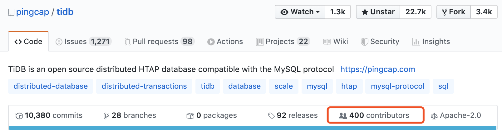
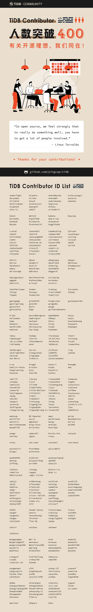

从 2015 年 5 月写下第一行代码，TiDB 作为一款新型开源分布式数据库项目，走过了 0 到 1 的**蜕变之日**；走过了存储层 TiKV 项目晋级为 CNCF Incubating Projects 的**光辉时刻**；周边工具逐步完善，**羽翼渐丰**；逐渐走向**成熟稳健**，在近 1000 家用户的生产环境中不断打磨升级。

**这一切荣誉和成就都属于社区——**

**TiDB Repo Contributor 突破 400,**
**Thanks for your contributions!**

**近一年 TiDB 开源社区架构和治理规则也在不断规范和升级迭代中：**

* 社区自治组织和角色：
  * 目前为止，社区启动过 20 个 [Working Group (WG)](https://github.com/pingcap/community/tree/master/working-groups) ， 成立了 5 个 [Special Interest Group（SIG）](https://github.com/pingcap/community/tree/master/special-interest-groups)，它们都有了丰富的阶段性产出；
  * 除了已有的 Maintainer、Committer、Contributor 角色之外， 新增了 Reviewer、Active Contributor 角色，让大家找到了“一步步升级打怪”的乐趣。

* 社区活动愈加丰富：
  * 除了传统的 [Infra Meetup](https://pingcap.com/meetup/)、[TiDB TechDay](https://pingcap.com/community-cn/techday2019/)、[TiDB DevCon](https://pingcap.com/community-cn/devcon2019/) 线下交流活动，颇具 Geek 精神的 TiDB Hackathon 已成功举办两届，诞生了很多奇思妙想的项目；
  * [TiDB 性能挑战赛第一季](https://pingcap.com/blog-cn/pcp-report-202002/) 落幕，[第二季易用性挑战赛](https://pingcap.com/blog-cn/TiDB-usability-challenge-program/) 正在进行中，接下来的 3 个月参赛选手将挑战“让 TiDB 变得更好用”；
  * 本周末即将举办 [Book Rush 活动](https://pingcap.com/blog-cn/tidb-book-rush-write-a-book-in-48-hours/)，社区伙伴们挑战 48 小时合写一本 5～6 万字的 TiDB 技术书籍。

* 社区学习版图不断拓宽：
  * 面向开源社区开放的 [Talent Plan](https://university.pingcap.com/talent-plan/) 学习计划正在筹备 2.0 升级，整合更多优质学资源，让更多社区伙伴能学、善用，在开源世界、在分布式数据库领域更自在玩耍；
  * [PingCAP University](https://university.pingcap.com/) 上也有面向 DBA 同学的学习资料库，包含线上视频课程还有线下培训，内容干货、形式丰富。

* [TiDB Map](https://github.com/pingcap/tidb-map) 正在完善：
  * 为了让每位 TiDB Developer 清晰了解 TiDB 社区的“玩法”，找到自己擅长的方向，我们整理了 [Contribution Map](https://github.com/pingcap/tidb-map/blob/master/maps/contribution-map.md)，展示各个 Repo 中大家可以上手做的事情&参考资料，同时 Map 版图还在不断扩充中；
  * 针对 TiDB User Group，我们整理了 [TiDB 集群问题排查地图](https://github.com/pingcap/tidb-map/blob/master/maps/diagnose-map.md)、[性能调优地图](https://github.com/pingcap/tidb-map/blob/master/maps/performance-map.png) ，欢迎大家提出自己的建议。

随着越来越多的人了解和使用 TiDB，我们也愈发认识到要做一款真正解决用户痛点的、属于未来的数据库产品，“道阻且长”，但初心不变：

和一群志同道合的朋友一起做酷且正确的事情，哪怕它是困难的、甚至曾被人认为是不可能的。但，让世界变得更美好，不正是我们踏入开源世界的初衷吗？

*In open source, we feel strongly that to really do something well, you have to get a lot of people involved.（Linus Torvalds）*

**期待未来与更多 TiDB 社区伙伴并肩同行！**

**再次感谢以下 400 位 TiDB Repo Contributor 及所有社区伙伴们的贡献：**

**我们下一个里程碑见！**
