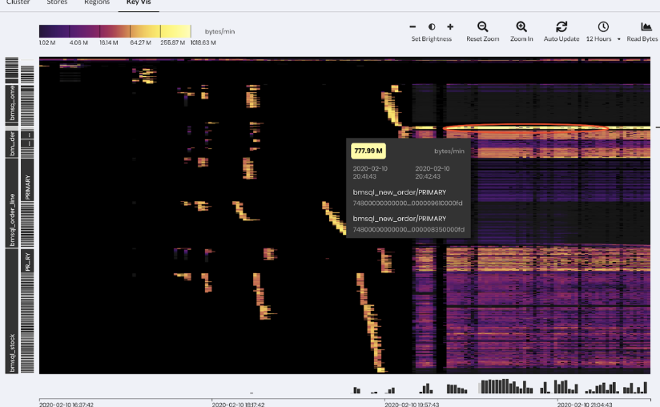
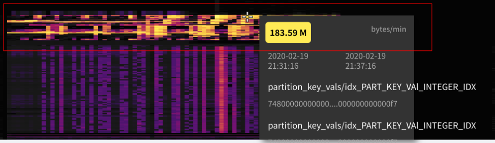
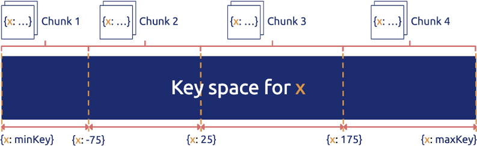
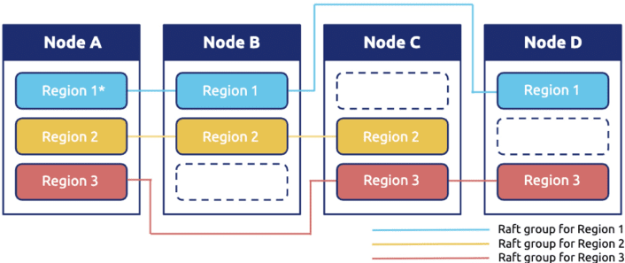
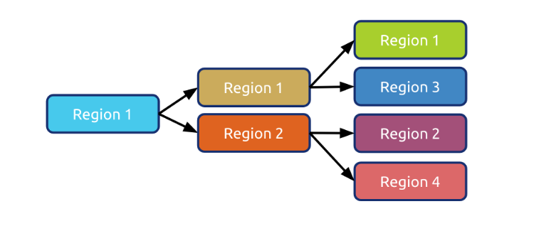
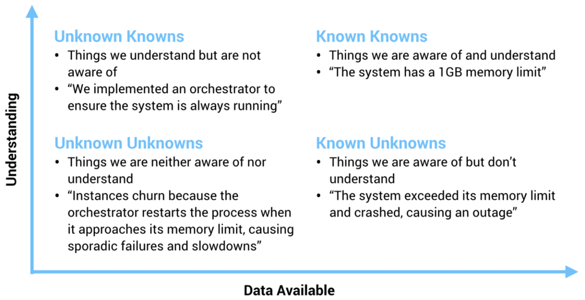
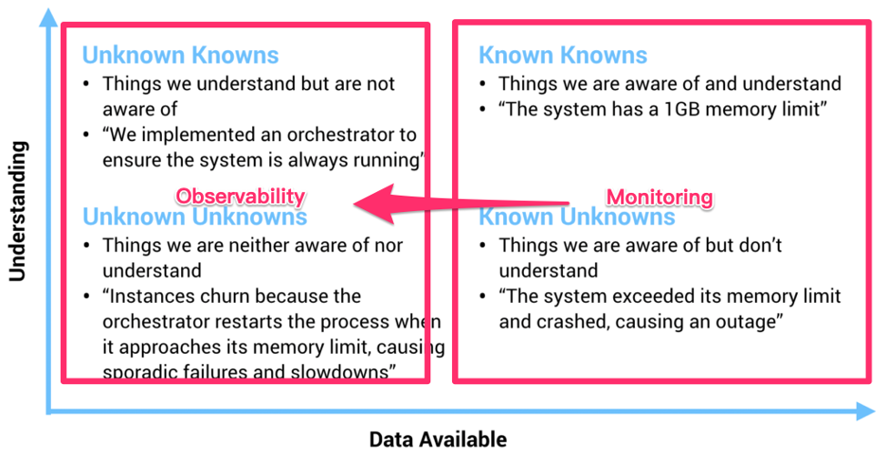
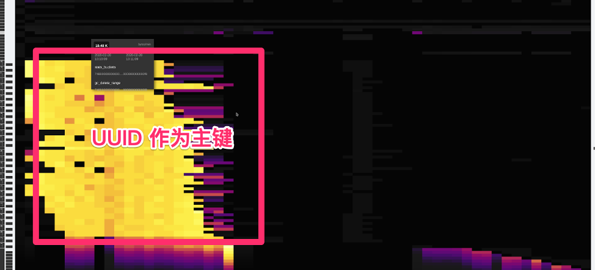
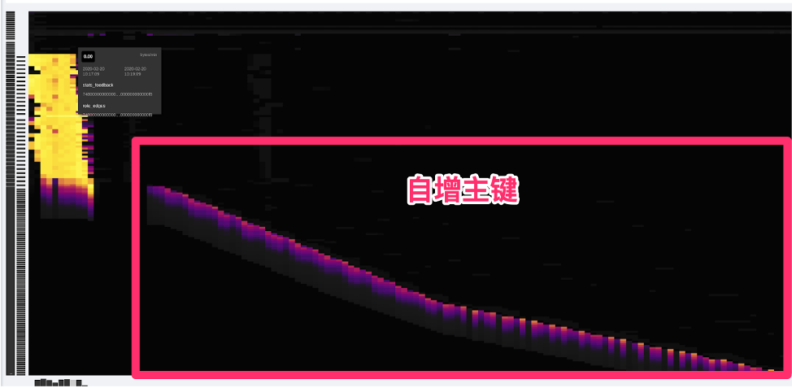

位于 M87 中心的特大质量黑洞示意图（© EHT Collaboration）

今天的文章我想从这张模糊的照片说起。

相信很多小伙伴对这张照片并不陌生，这是去年人类第一次拍摄的 M87 中心黑洞的照片，从1915年，爱因斯坦提出相对论预言黑洞的存在到 2019 年我们终于第一次「**看到**」了黑洞的样子，中间整整相隔了 100 多年，这对于人类认识黑洞乃至认识宇宙都是一个里程碑式的事件。人类是一个感性的动物，所谓「**一图胜千言**」很多时候一张图传达的信息超过千言万语。

关于黑洞我不想展开太多，今天我们聊聊「**望远镜**」。

前几天，在 TiDB 4.0 的开发分支中，我们引入了一个新功能叫做：Key Visualizer（下面简称 KeyViz），说起来这个小工具也并不复杂，就是用不同颜色的方框来显示整个数据库的不同位置数据访问频度和流量。一开始我们只是仅仅将它定位为一个给 DBA 用来解决数据库热点问题的调优辅助小工具，但是从昨晚开始我就一直在把玩这个小东西，突然觉得它对于分布式数据库来说背后的意义远不及此。

**在 CNCF 对 Cloud Native 的定义中，有一条叫做「Observability」，通用的翻译叫系统的「可观测性」。过去我一直苦于寻找一个例子说明什么叫做一个「可观测」的系统，在 KeyViz 这个项目上，我找到了对这点绝佳的体现。**

**举几个直观的小例子。你知道 TPC-C 测试「长」什么样子吗？请看下图：**

图中横轴是时间，纵轴是数据的分布，左半部分是数据导入的过程，有零星的亮点，可以看到写入分散到多个区块；右边密集的色块是测试在运行时系统的实时读写状态，越暗表示流量越小，越亮表示流量越高。从密集的色块我们能够看得出来，workload 基本分布均匀，但是大概有两处是明显偏亮的区域，其中靠近最上方，有一个特别明显的**局部访问热点**（最亮的那条线）。

**第二个例子，你见过 Sysbench 测试 「长」什么样子吗？看看下面。**

左边比较密集的明亮黄块部分，是导入数据阶段；右半段明暗相间的部分是在进行 oltp_point_select 测试，因为选取的模式是 uniform 模式，并且导入的时候是 32 线程 32 张测试表，可以看到的数据和分布和访问都比较均匀。
如果你看懂了上面两个小例子，下面是一个小作业：这是我们模拟的一个实际用户的生产环境的照片，**这个用户的系统遇到了一些瓶颈，你能看出问题吗？**

  
上面几个小例子是让大家对 KeyViz 有个感性的认识，在介绍这个东西背后的意义之前，我想先介绍一下 TiDB 这类典型的分布式数据库的系统架构，方便大家更好的理解。

一个典型的分布式数据库的数据分布策略

分布式数据库，顾名思义，数据一定是分散在不同机器上的。对于一张表的数据，我们会在逻辑上切分成若干个连续的区间，将这些区间内的数据分给不同的机器存储，不管是写入还是读取，只需要知道目标数据属于哪个区间，就可以直接到那个机器上进行访问。然后加上对每一个区间的数据在物理上做多副本冗余，实现高可用。如下图所示，Region 在 TiDB 的内部就是一个个连续的数据区间。

和很多分布式数据库不太一样的是，我们的 Region 的大小比较小（默认 96MB) ，另外数据的分布并不是静态的，而是动态的，Region 会像细胞一样分裂/合并，也会在不同机器之间移动进行动态的负载均衡。

现在回头看这个设计，还是觉得无比的简洁和优雅。对用户而言再也不用去思考怎么分库，怎么分表，数据在最底层的细胞就像有生命一样繁衍和迁徙。

**然后问题就来了，对于这样的数据库而言，有没有一种办法能够直观地描述系统的运行时状态？我怎么知道它是不是「生病」了？我能不能预测这个系统的未来？我能不能发现未知的风险？**

过去，不管是业务开发者还是 DBA，衡量一个数据库的状态，来来回回就是几个指标，QPS 、TPS、查询时间、机器负载（CPU、网络、磁盘），但很多时候就像是盲人摸象一样对于系统的全局我们是不清楚的。再加上在一个分布式的架构下，很多时候，我们可能会被海量的数字蒙蔽了双眼。一些有经验的 DBA 或许可以通过自己的经验，从多个指标里模糊构建出业务全局状态，但是到底这个经验往往是不可描述的，这就是为什么一些老运维、老 DBA 那么值钱的原因，但是我认为这种做事方式是很难 scale 的。

CT 、B 超、核磁共振，这些现代化的手段极大地促进了现代医学的发展，因为我们第一次能「看见」我们身体的内部状态，从而才能得出正确的判断。**在计算机的世界道理也是相通的，最好通过某些工具让人清晰地「看见」系统运行的健康状态、帮助诊断病灶，从而降低经验门槛和不确定性。**

过去也经常有朋友问我：“你说我这个业务适不适合使用 TiDB？”这时我们只能问，你的 QPS 多少 TPS 多少，数据量多少？读写比？典型查询？数据分布怎么样？表结构是什么呀？等等一连串的灵魂拷问，而且很多术语都非常专业，不是在这个行业摸爬滚打很久的老司机可能都搞不太清楚。而且有些信息可能是敏感的，也不方便共享。所以「**预判** TiDB 到底适不适合某项业务」就成了一个玄学问题，这个问题困扰了我很久，很多时候也只能凭个人感觉和经验。其实这个问题也并不是 TiDB 特有，尤其是最近几年，几乎所有现代的分布式系统，都或多或少有类似的问题。

**在过去，一个物理机器的状态确实可以通过几个监控指标描述，但是随着我们的系统越来越复杂，我们的观测对象正渐渐的从「Infrastructure」转到「应用」，观察行为本身从「Monitoring（监控）」到「Observability（观测）」。**虽然看上去这两者只是文字上的差别，但是请仔细思考背后的含义。关于这个话题，我很喜欢引用下面这张图：

上图坐标描述了我们对系统的理解程度和可收集信息之间的关系。在 X 轴的右侧（Known Knows 和 Known Unknowns）这些称为**确定性的已知和未知**，图中也给出了相对应的例子，这些信息通常是最基础的普适的事实，也就是在系统上线之前我们一定就能想到，一定能够监控起来的（CPU Load、内存、TPS、QPS 之类的指标），我们过去已有的大多数运维监控都是围绕这些确定的东西。

但是有一些情况是这些基础信息很难描述和衡量的，例如这个坐标的左上角：**Unknown Knowns**，用通俗的话来说，叫做「**假设**」。举个数据库的例子：有经验的架构师在设计一个基于分布式数据库的应用时，通常不会将表的主键设成自增主键，会尽可能的用 UUID 或者其他方式打散数据，这样在即使有突发写入压力的时候，系统也能很好的扩展。

注意在这个例子中，其实「**假设**」的事情（写入压力突然增大）并没有发生，如果在日常压力不大，数据量不多的情况下，即使使用自增主键，从已有的基础监控中，可能也很难看出任何问题。但是到出事的时候，这个设计失误就会变成 **Unknown Unkowns（意外）**，这是任何人都不想看到的。有经验的架构师能通过种种的蛛丝马迹证实自己的推测，也从无数次翻车的 Post-mortem 中将 Unknown Unknowns 的范围变小。**但是更合理的做法是通过技术手段描绘系统更全面的状态。在 Cloud Native 和微服务的世界里，最近几年一个行业的大趋势是将「系统的可观测性」放在一个更高的位置（监控只是可观测性的一个子集），这是有道理的。**

回到数据库的世界，TiDB KeyViz 的意义在于，就像上面提到的，这个工具不仅仅是一个监控工具，而且**它能以一个非常低门槛且形象的方式让架构师具象化的看到自己对于业务的「假设」是否符合预期，这些「假设」不一定是能够通过监控反映的，以获得对业务更深刻的 Insight。**

还是说回上面那个主键的小例子。对于两种不同的主键设计，KeyViz 这边是怎么表现的呢？看看下面两张图，是不是非常一目了然？

所以现在如果有朋友问我，“这个业务适不适合 TiDB？”我只需要通过录制线上流量，或者搭建一个从集群，只需要把 KeyViz 的图给我看一眼，我甚至都不需要压力测试就能判断这个业务是否适合，而且即使不适合，我也能准确的给出修改建议，因为 KeyViz 的图对我的「假设」的可解释性有了很强的支持。

我们不妨在此基础上再放飞一下想象力，为什么人类能够一眼就从这图片中理解这些信息，这说明这些图形背后有**模式**，有模式我们就可以识别——

想象一下，如果所有的 TiDB 用户，都使用 KeyViz 将自己的系统具象化后分享出来（其实这些图片已经高度抽象，已经不具有任何的业务机密信息），**我们是不是可以通过机器学习，挖掘背后更深层次的价值？AI 能不能通过这种形式更加理解我们的业务？**

最后，我想以我最喜欢的科幻小说《三体：黑暗森林》中的一段话结束这篇文章，大致是面壁人希恩斯在冬眠后被妻子唤醒后的一个场景：

>……与此同时，希恩斯感觉到围绕着他们的白雾发生了变化，雾被粗化了，显然是对某一局部进行了放大。他这时发现所谓的雾其实是由无数发光的小微粒组成的，那月光般的光亮是由这些小微粒自身发出的，而不是对外界光源的散射。放大在继续，小微粒都变成了闪亮的星星。希恩斯所看到的，并不是地球上的那种星空，他仿佛置身于银河系的核心，星星密密麻麻，几乎没有给黑夜留出空隙。
>
>“每一颗星星就是一个神经元。”山杉惠子说，一千亿颗星星构成的星海给他们的身躯镀上了银边。