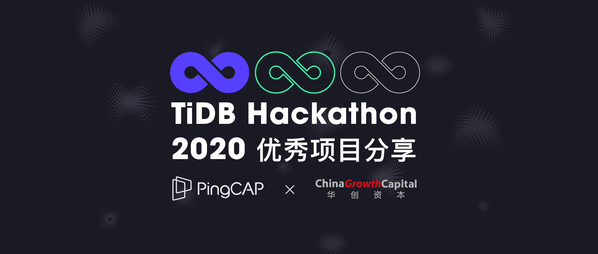
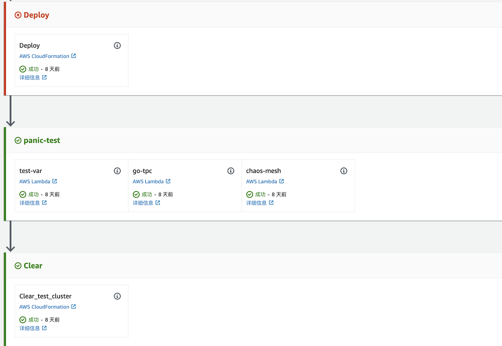
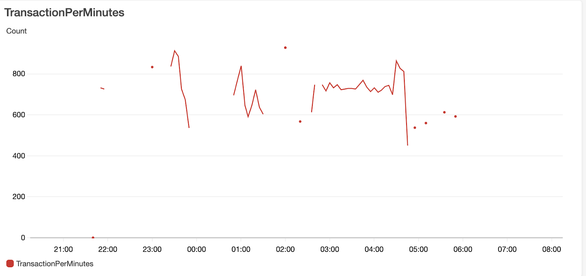

Ti-Improve 作为截止报名前 1 小时才临时组建的团队，4 位同学周强、方祝和、赵一霖、李德竹分别在北京、上海、杭州三地，在本届 TiDB Hackathon 中他们远程协作，**在 24 小时内克服困难，借助 AWS 的全套设施，搭建一站式分布式数据库测试的基本框架，最终极大地减少测试成本，扩大测试的多样性。最终这个项目获得华创资本 — 最具市场潜力奖。**

华创资本企业软件投资负责人谢佳对 Ti-Improve 团队高度赞赏，他认为， Ti-Improve 团队的项目，不仅在技术实现上提升了整体工程效率 ，同时在 TiDB 生态中也具备很强的商业潜力。借此契机，我们邀请谢佳与 Ti-Improve 团队的四位同学一起进行访谈，通过投资人与程序员的思维碰撞，探寻更多 Ti-Improve 的 TiDB Hackathon 2020 精彩之旅。

## Q：Ti-Improve 的组队过程是怎样的？这个队名的由来有什么故事？

**Ti-Improve ：** 我们团队是临时组成的，在截止报名前 1 小时才有了项目的想法并且找到另外三位同学组成了战队，由于时间太着急，我们就沿用了去年的队伍名称，也就是 Ti-Improve 。

在团队里周强主要负责测试基础设施，方祝和是 TiFlash 的核心开发、赵一霖是 TiCDC 的核心人员、李德竹是 HTAP 的开发人员。在本次 Hackathon 报名时间截止的前 1 小时，各种机缘巧合下才临时组队，最终完成了自认为超过预期的项目。

## Q：可以分享下做这个项目最初的灵感和契机是什么吗？

**Ti-Improve ：** TiDB 本身设计就是云原生的，也希望在云上能够有比较好的运行，这也是后续重点发展的方向。因此，我们就想能不能在 hackathon 上做一个在云上很方便导入导出数据，弹性的测试体系相关的项目。

通过一些简单的调研我们认为这个事情是可以做的，最终定下来希望把 AWS 中足够多的组件完全组合，比如 lambda 和 cloudformation 及 cloudwatch，再加上 pipeline ，成为一个特别强大的平台，我们可以随时随地做各种各样的测试，比如说把错误注入如 Chaos Mesh，Fuzzing 等等把所有东西都能很有机的组合起来。

我们也有一直做测试基础设施的同学，在做测试平台的实际过程中也会遇到各类问题，调研了 AWS 的这些组件，发现这些组件已经能很好的解决比如调试、编排、可观测性问题，是可以直接看到背后的效果。其实 TiDB 也一直面临着一个问题，我们虽然一直尽全力保证测试的案例足够多、足够广，但实际上，很难将整个 TiDB 质量的全景图全部展示出来。除了开发、测试外，我们还可以做 serverless TiDB，甚至做一些的其他的东西，比如与数据湖对接起来等。

其实 Hackathon 结束之后，我们团队的小伙伴也在一起研究，后续还可以用 AWS 的基础设施做什么，我们也发现了另四五个新的东西，后续可以在 TiDB 上尝试与结合。我们最初的想法是考虑是否其可以全部在 AWS 上一步到位，我们自己不需要花太多精力去开发，从而使得整个开发、测试迭代更快。

## Q：本次 Hackathon 共有 14 位评委，作为机构评委对 Ti-Improve 一直情有独钟，可以分享一下最喜欢这个团队哪一点，团队在比赛过程中给您留下什么深刻印象？

**华创资本谢佳：** 这次 Hackathon 主要是线上协作，Ti-Improve 的 idea 本身就很吸引我。从我的角度来看，希望能尽量找到一些与另外 13 位技术评委们不同的角度，我想表达的是，有巧妙商业价值角度的创新也是一种 hacking，可能 Ti-Improve 不是最有技术难度的项目，但这个 idea 背后的商业意义我很认可。

我认为非常宝贵的一点是在于它提升了customer adoption 的润滑度。比方说， AWS 上的客户想要使用 TiDB 产品，他们如何尽快的完成可用性测试，这个过程如果有可能尽量减少客户所花的时间和摩擦的话，将非常有利于客户把TiDB产品顺利使用起来，而 Ti-Improve 就是这样一个工具。其次，Ti-Improve 的技术特点也很好的实践了 Cloud Native 的理念，Cloud Native 的 customer experience 就应该是能够把公有云上的各种能力充分的调度协同起来。

## Q：在这次比赛过程中，团队有遇到过什么比较大的技术困难？是如何解决的？

**Ti-Improve ：** 我们所有人都没有想到的一个问题是在这次 Hackathon 中遇到最大的拦路虎是 AWS 的权限系统，由于 AWS 的权限系统非常复杂且庞大，是完全出乎意料的。与此同时，我们没有操作自己账号的权限，每操作一步就会碰到两到三个权限问题，需要逐一去解决权限问题，效率非常低。因此我们就去找相关负责人开通权限还碰到负责人请假，直到周六（活动当天）11点才彻底解决权限问题。这其实是我们遇到的最大问题，虽然不算技术问题，但是却在这个上面浪费了很长时间。

## Q：从机构评委的角度看，为什么会选中这个项目？这个获奖项目的技术和现实意义是什么？

**华创资本谢佳：** 这次我们一共有 40 多个项目，其实作为投资机构评委我选择起来是非常纠结的，因为很多项目我都非常喜欢，但最终只能选出一个项目，所以特别纠结。因此，我当时是把喜欢的项目分成三类价值，每一类下再按商业价值、技术难度、商业迫切性、提案准备完成度等综合考虑进行排序：

**一、在 TiDB 生态中有机会独立产品化、商业化的项目；**

**二、帮助 TiDB 在底层的稳定性和其它性能各方面有提升，对 TiDB 底层核心能力有长远意义的项目；**

**三、对 TiDB 商业化 adoption 有加速、优化作用的项目；**

Ti-Improve 项目完全使用 AWS 的基础设施来进行 TiDB 的测试，我觉得属于第三类中很典型的，不仅解决了具体的技术问题，同时也十分具有商业价值。

## Q：由于今年的 Hackathon 时间只有 24 个小时，Ti-Improve 还是在周五的晚上才组队成功，在这个过程中你们觉得会有什么遗憾吗？如果时间能更充裕的话还有哪些地方是可以提升的？

**Ti-Improve ：** 我觉得如果时间充足的化，对我们来说有以下几个点是可以提升的：

1）整个系统的体系可以搭建的更完善一些，Hackathon 属于吃螃蟹类型，相当于是给后面的测试体系的架构开了一条路，如果有更多的时间来完善的话，希望整个流程和细节能够更好的扩展和完善；

2）在 PPT 和 Demo 展示上可以做的更好，如果一开始能够很快把前面的路走通的话，展示的 PPT 的和 Talk 能够有更多的时间准备可以做得更好；

3）应该有更多的时间去做调研，甚至应该结合特别多的东西到整个测试体系平台，由于时间的问题我们其实当天都还在读很多文档，熟悉该如何使用，在初赛的时候看到有队伍对我们最后的 Demo 有期待，但是由于时间因素，最后只跑了一个基本的流程，没有做到更灵活、更炫，希望有更多的时间能把这个东西做得功能更全一点，更有想象力一点，这是最大的遗憾。

## Q：Ti-Improve 这次获得了华创资本的最具市场潜力奖，谢佳老师对这个项目未来有什么展望与期待？

**华创资本谢佳：** 刚刚说到遗憾，感觉应该有点 Rock Music，笑～

对 Ti-Improve 的期待方面，我觉得顺着这个思路，确实可以做的事情还是蛮多的。期待看到 Ti-Improve 这个项目能更细化。另一方面，我理解 PingCAP 接下来很重要的一步是在主流的公有云 AWS 和 Google Cloud 等平台上能够有更好的用户场景和更好的客户案例出来。所以，我也期待 Ti-Improve 能够顺着它的思路把更多类似的功能完善形成体系，能够实际到客户那边用起来。

## Q：Ti-Improve 对自己这个项目有什么未来的规划或者是期望吗？

**Ti-Improve ：** 此前由于人力问题，有些基础测试设施是没有达到我们期待的，因此对于这次 Hackathon ，我们希望能够利用 AWS 把这部分短板完全补齐，从而节省的人力成本可以把更多事情做好。对于测试与测试体系方面，我们认为测试是非常重要的，作为一款非常硬核的基础软件，稳定性绝对是最重要的没有之一的。

我们很期待这个事情以后能够真正的在公司里跑起来，对我们内部来说不仅极大的提高了效率，云上的测试也给我们提供了另外的新思路，以后都可以在云上去做测试，让人很期待。

## Q：作为软件工程专业出身的投资人，并且对企业服务领域的投资很资深，谢佳老师是如何看待 Hackathon 这类活动的？

**华创资本谢佳：** 我之前参加过一些非技术性的此类活动，但基本是想一个商业模式或者 idea，最后进行演讲展示，而不是最终可以 Run 起来的程序。所以决赛时候看到参赛选手们 Demo 的实际效果，我觉是非常有感染力和冲击力的。Hackathon 本身是一个偏即兴创造的过程，这种创新的发生是自底向上的，我非常喜欢这种自发性的创新形式。

## Q：除了自己的项目（Ti-Improve）外，最喜欢哪个项目？

**Ti-Improve 周强：** 我最喜欢的是 VR 的那个项目，名字叫滑滑蛋，让大家看起来特别爽。

**Ti-Improve 方祝和：** 我印象里最喜欢的是做提高 Bug 修复效率的项目，团队名字叫 zhangyushao ，我觉得在产品的稳定性、质量提升上很有意义，我很看好这个项目。

**Ti-Improve 李德竹：** 我最喜欢第一名的 'or 0=0 or' 项目，我觉得特别有想象力，把一个看似很传统的东西用在这里，然后很好的解决这个问题，我觉得这个思路真的非常赞，可以向他们学习。

**Ti-Improve 赵一霖：** 我也是比较喜欢第一名的 'or 0=0 or' ，他吸引我的点是他用 WASM 去做的这件事儿，WASM 相关的技术栈其实我一直都有关注，但是我也没想到能结合 TiDB 实现 UDF。我觉得之后可以借鉴这种思路，是一个很好的方式。

**华创资本谢佳：** 除了 Ti-Improve，我其实喜欢的项目还蛮多的，我最开始列出来有 12 个，像 Ti-Graph 团队我也蛮喜欢的，因为有些类型的数据分析确实更适合用图数据库的来解决，我觉得类似的创新也在 TiDB 生态当中开启了一些新的可能性。

>关于华创资本

>成立于 2006 年的华创资本专注于企业软件、前沿科技、生命科学、消费升级等领域的早期投资，并利用深厚的资源与经验帮助所投企业进行战略规划、业务拓展和团队组建。目前华创资本管理的人民币基金和美元基金合计 80 亿元人民币。代表投资项目包括：什么值得买（创业板: 300785）、每日优鲜、Wish（NASDAQ:WISH）、同盾科技、老虎证券（NASDAQ:TIGR）、Ezbuy（NASDAQ:LITB）、别样红（美团 HKEX:03690 收购）、才云科技（字节跳动收购）、小满科技（阿里巴巴 NYSE:BABA 收购）、PingCAP、深鉴科技（赛灵思 NASDAQ:XLNX 收购）、Airlango（美团 HKEX:03690收购）、Nreal、爱笔智能、蓝箭航天、华科精准、新格元、福贝生物、璧辰生物、应世生物等。
