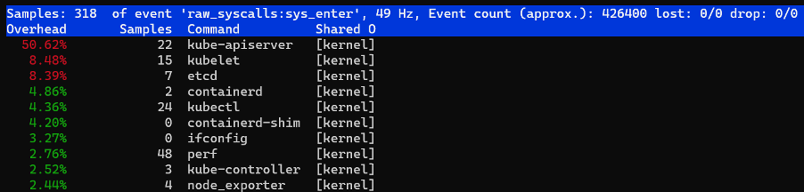
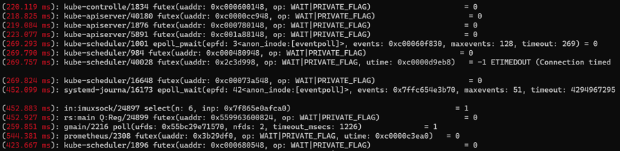
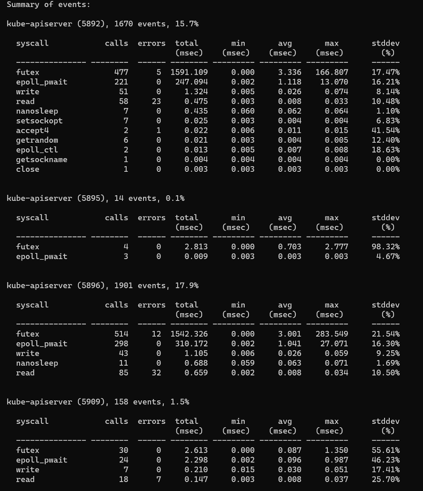
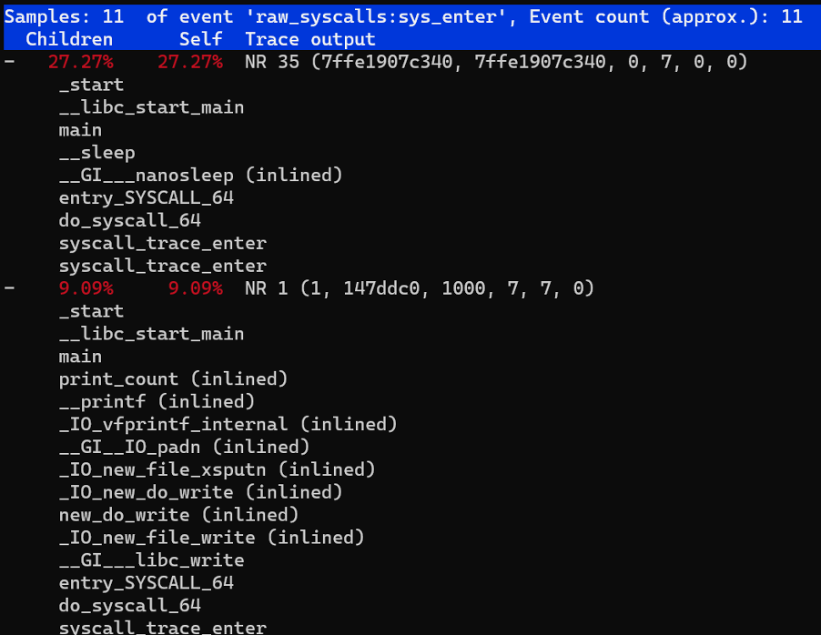
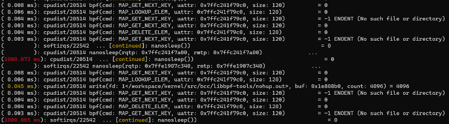
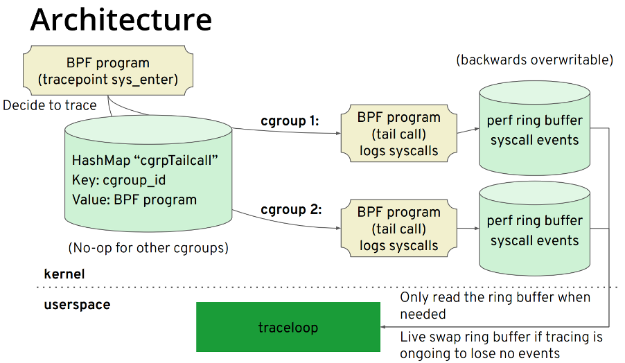
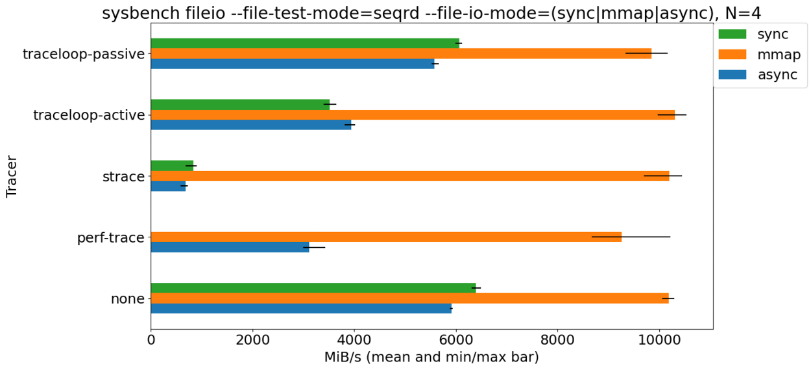

提到如何动态追踪进程中的系统调用，相信大家第一时间都能想到 strace，它的基本用法非常简单，非常适合用来解决 “为什么这个软件无法在这台机器上运行？” 这类问题。但如果需要分析线上服务 （特别是延迟敏感型）的某些系统调用的延迟时，strace 则不那么合适，因为它引入的开销会非常大，从性能分析大师 Brendan Gregg 的测试结果得知，被 strace 追踪的目标进程的运行速度会降低 100 倍以上，这对生产环境来说将是个灾难。

那么是否有比较好用的工具用在生产环境上呢？答案是肯定的，下面将介绍两款工具的常用命令，方便大家需要时查阅。

## Perf

众所周知，perf 是 Linux 系统下非常强大的性能工具，由 Linux 内核开发人员在不断演进和优化。除了可以分析  PMU (Performance Monitoring Unit) 硬件事件，内核事件等通用功能外，perf 还提供了其他“子模块”，比如 sched 分析调度器，timechart 根据负载特征可视化系统行为，c2c 分析可能存在的 false sharing （RedHat 在大量 Linux 的应用上，测试过这套 c2c 的开发原型，成功地发现了很多热点的伪共享缓存行问题。）等, 而 trace 则可用于分析系统调用，其功能非常强大，并保证了可以接受的开销—— 运行速度仅放慢 1.36 倍(dd 作为测试负载) 。我们一起看下几个常用的场景：

1. 调用 syscall 数量的 top 排行榜 

    ```
    perf top -F 49 -e raw_syscalls:sys_enter --sort comm,dso --show-nr-samples
    ```

   

   从输出可以看到在采样期间，kube-apiserver 的调用 syscall 的次数最多。

2. 显示超过一定延迟的系统调用信息

    ```
    perf trace --duration 200
    ```

   

   从输出中可以看到进程名称、pid ，超过 200 ms 的具体系统调用参数和返回值。


3. 统计某个进程一段时间内系统调用的开销

    ```
    perf trace -p $PID  -s
    ```

    

    从输出中可以看到各系统调用的次数，返回错误次数，总延迟，平均延迟等信息。


4. 我们也可以进一步分析高延迟的调用栈信息

    ```
    perf trace record --call-graph dwarf -p $PID -- sleep 10
    ```

    

5. 对一组任务进行 trace，比如后台有 2 个 bpf 工具在运行，我们想看下它们系统调用使用情况，就可以先将它们添加到 perf_event 这个 cgroup 下，再执行 perf trace：

    ```
    mkdir /sys/fs/cgroup/perf_event/bpftools/
    echo 22542 >> /sys/fs/cgroup/perf_event/bpftools/tasks
    echo 20514 >> /sys/fs/cgroup/perf_event/bpftools/tasks
    perf trace -G bpftools -a -- sleep 10
    ```

   
 
perf-trace 的使用就介绍到这里，更多的用法请参考 man 手册，从上面可以看到 perf-trace 的功能非常强大，根据 pid 或 tid 就可以进行过滤。但似乎没有对容器和 Kubernetes（K8s） 环境进行便捷的支持。不用着急，接下来介绍的这个工具就是针对容器和 K8s 环境的。

## Traceloop

对于 Traceloop 大家可能有点陌生，但提到 BCC 想必大家就觉得熟悉了。BCC 的前端是 Python/C++，其所属 iovisor 下还有一个项目叫 gobpf 是 BCC 的 go binding。而 Traceloop 则是基于 gobpf 库进行开发的，此项目的主要目标应用场景是容器、K8s 环境。其原理比较简单，其架构如图所示：



核心步骤如下：

1. 利用 bpf helper 获取 cgroup id，根据 cgroup id 而不是 pid、tid 进行过滤。

2. 每个 cgroup id 对应一个 bpf tail call，通过这种方式实现对此 cgroup id 对应的 perf ring buffer 进行写入。

3. 用户空间根据 cgroup id 读取对应的 perf ring buffer。

需要注意的是，当前 cgroup id 的获取方式是通过 bpf helper：bpf_get_current_cgroup_id 来获取的，这个 id 是 cgroup v2 才有的。因此只适用于开启了 cgroup v2 的环境。尚不确定此项目团队是否有意向通过读取 nsproxy 数据结构等方式来对 cgroup v1 进行支持，因此在这里只做简单介绍。随着 K8s 1.19 版本开始支持 cgroup v2，期待 cgroup v2 能尽快普及起来。以下使用 Centos 8 4.18 版本内核进行简单的演示：在 traceloop 退出时 dump 系统调用信息

```
sudo -E ./traceloop cgroups  --dump-on-exit /sys/fs/cgroup/system.slice/sshd.service
```


从输出中可以看到，其输出和 strace/perf trace 类似，只是针对 cgroup 进行过滤。需要注意的是 Centos 8 没有像 Ubuntu 将 cgroup v2 挂载到 /sys/fs/cgroup/unified，而是直接挂载到 /sys/fs/cgroup 下，在使用前建议执行 `mount -t cgroup2` 来确定挂载信息。

对于 K8s 平台，该团队将 traceloop 集成到 Inspektor Gadget 项目中，通过 kubectl 插件来运行，由于管网给出详细的 gif 示例，在这里就不做过多介绍了，对 cgroup v2 有需求的朋友可以试一试。

## Benchmark



从 benchmark 结果看，strace 的引起的目标程序性能下降最大，perf trace 次之，traceloop 最小。

## 总结

strace 依然是解决 “为什么这个软件无法在这台机器上运行？” 相关问题的利器，但对于分析系统调用延迟等问题，perf trace 是合适的选择，其也是基于 BPF 的实现，对于使用 cgroup v2 的容器、K8s 环境，traceloop 会更方便一些。

