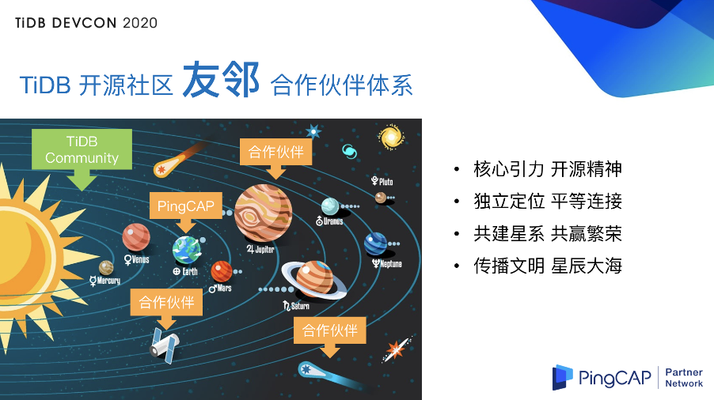
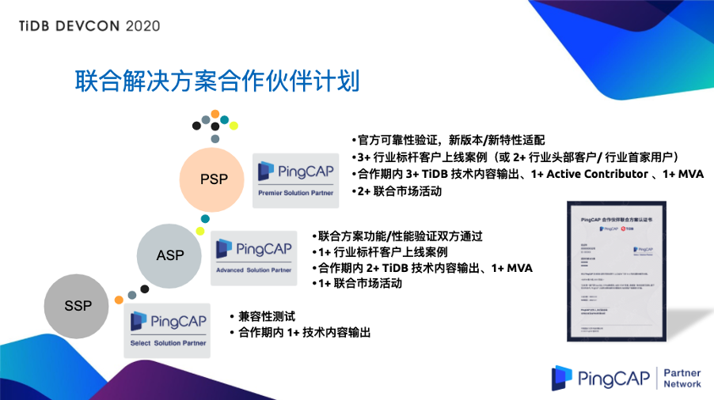

>作者简介：余梦杰，PingCAP 合伙人、执行副总裁。

2020 年 PingCAP 合作伙伴生态体系构建全面启动，基于 TiDB 社区，秉承开放平等的全新社区化合作伙伴生态理念，产业生态合作、解决方案合作、联合技术中心等众多计划百花齐放，下面介绍一下我们的合作伙伴生态体系理念、整体框架和一些落地成果。

## 传统模式下的合作伙伴游戏规则

在传统的体系下，原厂商和渠道商是处于供应链上下游的位置，彼此之间是通过商业利益进行连接的。在整个过程中，原厂商往往处于主导地位，如果我们用一个星系来比喻这套合作体系的话，那么处于太阳系这个星系的圆心，即绝对中心的就是原厂商，各个渠道商就像一颗颗行星一样围绕着原厂商去转动、发生连接、创造商业价值。

但是在我看来，这样的引力是不可持续的，并且粘性是脆弱的。在 PingCAP 之前我本人也曾服务过数家软件企业，亲眼见证了诸多原厂商和渠道商的合作不顺利、合作破裂、不成功的情况。

从本质上来讲，只要这家原厂商从源头上去切断他和渠道商的引力，那么合作关系在这样一个体系下就很难继续了。因为从生态角度来看，一旦渠道商被切断了引力，就无法继续同这个星系去发生连接了。

## PingCAP 与合作伙伴间的游戏规则

大家都知道 TiDB 本身是以开源为主导的模式。在这样的模式下，我们与合作伙伴之间的合作方式有没有可能有不一样的地方呢？
基于 TiDB 的开源社区，我们希望打造一套 “友邻式” 的合作伙伴体系。在 TiDB 的这个星系里面，处于核心位置，处于引力源、太阳系位置的，不再是 PingCAP 这样一家商业公司，而是 TiDB 开源社区。因为 TiDB 本身是基于 Apache-2.0 的协议来开发和运营的，任何个人、公司、云厂商，只要不违反  Apache-2.0 协议的相关规定，都可以自由的去下载、研读、改写、编译 TiDB 的原代码，甚至可以发行自己的发行版，进行相应的商业活动。

在这样的体系下，PingCAP 公司与合作伙伴之间是完全平等、独立的行星关系，PingCAP 公司是不可能切断合作伙伴与 TiDB 开源社区，也就是星系中的行星与太阳之间的连接的。即使有一天 PingCAP 这家商业公司不存在了，但是只要 TiDB 的社区还在，整个的生态还在，合作伙伴还是可以在这个大的 TiDB 的星系里面去持续的发掘和创造商业价值的。

可能有一个比较好的例子就是 PostgreSQL（PG），现在有多少人知道 PG 的原厂是谁呢？

刚才提到了整个 TiDB 星系里面的核心、引力源、太阳是 TiDB 的社区。目前为止，TiDB 社区已有超过 500 家的全球用户，超过 1000 位 Contributors，并且这些用户、Contributors 的数量是在不断加速增长的，他们不是 PingCAP 这家商业公司的资产，而且属于整个 TiDB 星系的。

这个星系里面有各种各样的角色，除了总代和分销这样的角色以外，我们认为其他的合作伙伴都是和 PingCAP 完全平等、独立的行星。总代和分销商更像是 PingCAP 这一家商业公司的卫星，除此之外，整个星系中其他角色都是独立、与 PingCAP 平等的行星。大家彼此之间可以建立连接，有通航，有商业的合作；同时也可以不建立连接、不通航、不进行合作。但这并不妨碍整个 TiDB 星系的玩家以 TiDB 的社区作为辐射，在里面去寻找商业价值。

当然我们是非常愿意为这些行星、伙伴提供相应的商业计划的。接下来我将逐一的介绍一下我们这些合作伙伴的类型以及我们为他提供的商业方案。

## PingCAP 合作伙伴类型及商业方案

### 1. 解决方案合作伙伴

第一类行星，是解决方案合作伙伴。大家都知道 TiDB 本身是一个 Infra 的 database，它是不可能独立于应用去提供价值的，所以我们必须要和解决方案合作伙伴一起把产品的价值转化为解决方案的价值，从而转化为业务价值，乃至于战略价值，去成就我们的客户，去共同的帮助客户成功。
所以针对这样的解决方案的合作伙伴，我们提供了一系列层次分明的合作伙伴计划，从优选、到高级、到白金 进行分层，同时对不同级别的合作伙伴也有对应的要求。

比如我们要进行可靠性的验证，对新版本、新特性，包括功能、性能的一些测试；在行业标杆客户有落地的案例。同时在社区，我们有相应的 TiDB 技术内容的输出；有活跃的社区贡献者；有社区的布道师以及相应的联合市场活动等等。当然，我们也为不同级别的合作伙伴提供了对应的权利，包括但不限于，商机的共享、培训、售前和售后的支持以及分润和返点等。

从 4 月份启动该合作方案的计划以来，我们已经和数家行业领先的解决方案厂商建立了合作伙伴关系。我们一起完成了兼容性的测试，性能和功能的测试，并且对大多数的合作伙伴，我们都在行业客户进行了落地。比如：神州信息的分布式核心系统、分布式网贷系统；长亮科技的银行分布式核心业务系统；文思海辉的金融分布式核心系统；开科唯识的银行互联网代销系统；汉得的清结算系统；北大医信的临床数据中心等。在这部分，我们也期望和更多解决方案合作伙伴一起来打造更蓬勃发展的 TiDB 星系。

### 2. 技术服务合作伙伴

第二类行星，是技术服务的合作伙伴。技术服务的合作伙伴是指，坚定地看好 TiDB 的技术栈，愿意和 TiDB 共同成长，愿意以 TiDB 作为主航道之一的合作伙伴。因为 TiDB 还比较年轻，且头部客户对技术服务的要求比较高，所以，我们推出了联合技术中心的商业计划，来帮助我们的合作伙伴去培养 TiDB 的专业人才，为客户提供有 PingCAP 品质保证、价格有差异的技术服务能力。

### 3. 产业生态合作伙伴

第三类行星，是我们的产业生态合作伙伴。数据库的产业生态上下游，会包括如操作系统、芯片、中间件厂商等合作伙伴。对这些合作伙伴，我们提供了产品兼容性的测试以及相应的认证计划。截止到目前我们已经完成了和华为鲲鹏、中国电子飞腾、浪潮 OpenPOWER、统信 UOS、麒麟软件银河麒麟、东方通应用中间件、宝兰德应用中间件的兼容性测试和认证工作，值得一提的是 TiDB 是第一家同华为鲲鹏完成 validated 认证的数据库，后续还有更多的产业生态的合作也在推进过程中。

### 4. 产品研发合作伙伴

第四类行星，是我们的产品研发合作伙伴。因为 TiDB 本身是一个开源的数据库产品，研发实力比较强的合作伙伴可以基于自己对数据库、行业、运维和服务的理解，对 TiDB 进行定制化的开发。比如：独立的存储引擎；异构平台的打通；运维相关经验的平台产品等。针对这样的合作伙伴，我们是非常欢迎的，也相应的推出了联合产品的开发以及产品运营的计划。目前已有多家合作伙伴正在推进过程中。

### 5. 云服务合作伙伴

最后一类行星，是我们云服务的合作伙伴。云既是未来，更是现在。TiDB 作为一个 Cloud-Native 的 HTAP 分布式数据库，同云的结合是 “丝滑柔顺” 的。我们在这个行业也有大量的落地以及相应的行业经验，我们非常愿意同云服务的合作伙伴一起，基于公有云、行业云的合作计划，共同为客户提供价值，为合作伙伴创造利润。

在 TiDB 的这样的星系里面，PingCAP 只是一个很小的行星，为了蓬勃发展 TiDB 的星系，今年我们成立了独立的合作伙伴生态部门，来为 TiDB 的星系添砖加瓦。截止到目前，短短半年的时间里，我们已经拥有了众多 解决方案的行星、技术服务和产品研发的行星、产业生态的行星以及云服务的行星。随着 TiDB 星系的玩家越来越多，我们对更美好的未来充满自信。

## PingCAP 爱可生战略合作

最后我想借今天这个场合（注：6 月 6～7 日举办的 [TiDB DevCon 2020 技术大会](https://pingcap.com/community-cn/devcon2020/)），正式宣布 PingCAP 公司同爱可生公司的战略合作。

爱可生公司是行业领先的基于 MySQL 的解决方案提供商，在金融、电信等行业有诸多的头部客户和极大的行业影响力。PingCAP 将和爱可生一起打造业界领先的基于 MySQL Family 的联合解决方案，为我们的客户持续创造价值。

双方的合作包括：

+ 爱生可将进入 TiDB 的社区，成为 TiDB 社区的企业级的贡献者；
+ 爱可生将实现其运维管理平台 DMP 对 TiDB 多集群可视化管理的全面支持；
+ 构建 DBLE 到 TiDB 的双向实时复制的产品级的解决方案以及相应的数据迁移服务能力；
+ 双方将建立联合技术中心，共同研究和推广 TiDB 在智能运维管理、私有云建设、多中心容灾等领域的解决方案，并面向我们的商业客户提供整体打通的企业级运维服务。

爱可生的 CEO 李恒先生也给我们发来的致辞：

>作为 NewSQL 分布式数据库的代表产品，爱可生非常看好 TiDB 在 HTAP 领域为各行业应用带来的创新体验。同时，TiDB 开发的生态体系也为像爱可生这样的解决方案厂商带来了全新的市场空间。此次 PingCAP 与爱可生的战略合作源于爱可生在数据库管理平台领域的深厚技术积累以及金融数据库解决方案的丰富落地。在数据库领域除了数据库内核能力，管理平台和体系化管理服务对于数据库的大规模使用也至关重要。
>
>TiDB 是优秀的分布式数据库产品，爱可生将致力于把这样优秀的开源数据库内核纳入我们的数据库管理产品能力和服务范畴，未来爱可生将提供面向私有云的更多数据库的管理平台产品和服务，更好地帮助客户解决数据库国产化替代当中的实际问题。
>
>最后我相信 PingCAP 的产品能力，加之爱可生的管理解决方案能力的强强联合，会将 TiDB 推动到新的高度，谢谢大家。

感谢李恒先生的致辞。我们也怀着真诚的、开放的态度，诚邀各行各业的合作伙伴加入以 TiDB 社区为核心的 TiDB 星系，打造独立、平等、长期可持续发展的合作关系。

**星辰大海，与你同行，谢谢大家！**

>本文整理自余梦杰在 [TiDB DevCon 2020](https://pingcap.com/community-cn/devcon2020/) 上的演讲，大会相关视频回顾可以关注官方 Bilibili 账号 [TiDB_Robot](https://space.bilibili.com/86485707)。
