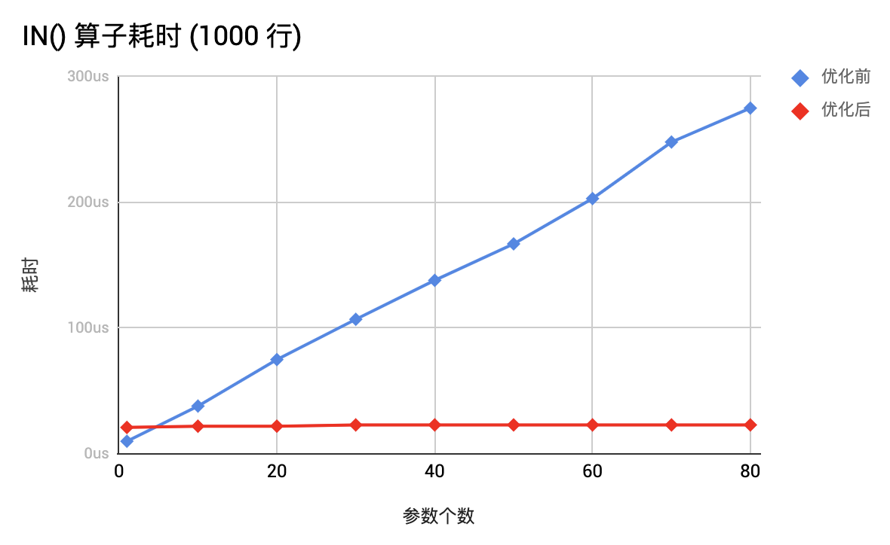
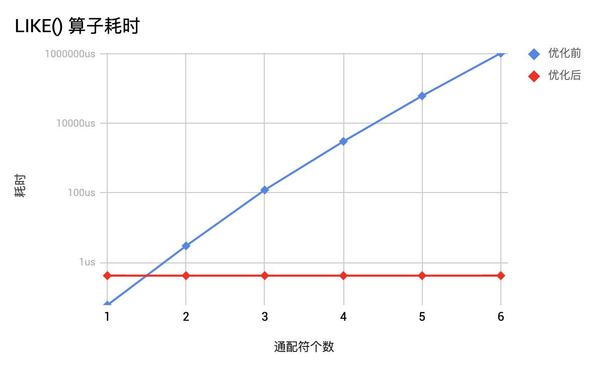
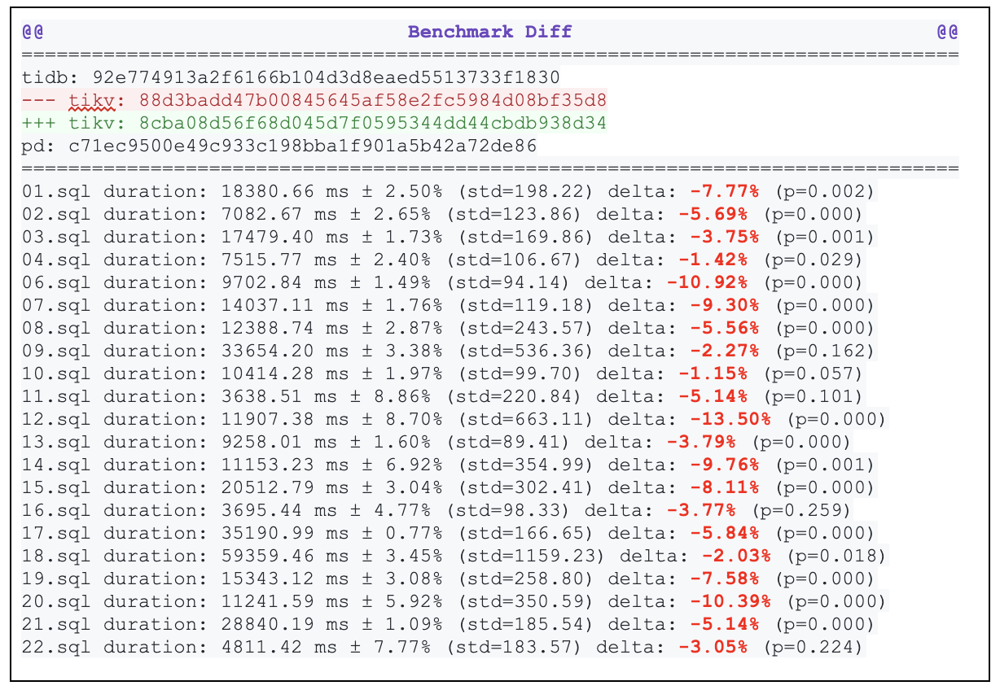

11 月初我们开启了一项社区新活动「TiDB 性能挑战赛」(Performance Challenge Program，简称 PCP)，这项积分赛将持续 3 个月，选手将完成一系列难度不同的任务，赢得相应的积分。目前赛程刚刚过去三分之一，已经取得了十分耀眼的阶段性成果：

+ 过去一个月共吸引了来自社区的 156 位贡献者，包括：
    - 14 支队伍。
    - 110 位个人参赛者。
+ 参赛选手们总共完成了 147 个性能挑战赛任务，这些成果已经逐步落地到 TiDB 产品中：
    - TiDB 表达式框架中完成了 70+ 个函数的向量化。
    - TiKV 协处理器中完成了 40+ 个函数的向量化，其中 34 个已在 TiDB 侧新开启了下推，让下推的函数计算速度大幅上升。

**截至发稿时积分排行榜前五名的参赛选手 / Team 分别是：.* team、ekalinin、mmyj、AerysNan、js00070。**

其中 .* team 表现尤为优异，他们已经拿到了 4150 积分，在排行榜上遥遥领先。而来自俄罗斯的个人参赛者 ekalinin 获得了 1450 积分，他共提交了 17 个任务，目前完成了 12 个，其中有一个是 Medium 难度的任务，成为积分最高的个人参赛者。


<center>积分排行榜</center>

>“因为对 Rust 感兴趣参加了这次 PCP，能够亲自改善一个自己会使用的工具的感受非常令人愉悦，项目的文档，代码结构和社区都非常友好,带来了很强的正反馈。”
>
>—— Renkai（PCP 个人参赛者）
>
>“参加PCP是很有趣的体验，既能深度参与开源项目，又能在这个过程中学到很多数据库和rust的知识，还能通过获得积分兑换奖励，导师的指导非常耐心，希望能有更多的人参与进这个项目来。”
>
>—— TennyZhuang (PCP 团队参赛者，.* team）

>“I like Go & databases. TiDB has both of them. So I just decided to deep dive into internals of the TiDB and check if I can be useful for it. I'm a big fan of open source. I have a couple of open sourced projects and I understand the importance of the contribution into open source projects. 
>
>I feel great after joining the PCP and TiDB community! Good docs, a lot of tests, well written code :)”
>
>—— ekalinin (PCP 个人参赛者，来自俄罗斯）

**下面让我们来看看过去的一个月里大家在「性能提升」方面有哪些突破性的战绩吧！**

### 1. IN() 函数性能提升 150+ 倍

相关 PR [链接](https://github.com/tikv/tikv/pull/6000)，作者：[TennyZhuang](https://github.com/TennyZhuang)（ .* team ）



`IN()` 是一个大家用的很多的 SQL 内置函数。这个 PR 使得 `IN()` 内置函数的性能有了复杂度级别的提升，从 `O(N)` 提升到 `O(1)`，如上图所示。这对于 `IN()` 函数中有很多参数的情况能有很大的帮助，例如以下 1000 个参数场景中提升可达 150+ 倍：

```
CREATE TABLE `foo` (
  `id` int(11) NOT NULL AUTO_INCREMENT,
  `c` char(100),
  PRIMARY KEY (`id`)
);

select * from foo where c in (
"271a76b46731d9", "a7a69f89d4b32e", "8d969b6b76f6f4", "8ea63d5c33dabe", "4c5dabf74df99f", "897ab55a20218b", "80d73f4331a342", "a4747627a2e05d",
"e20beca46373", "4dbc295621b4c5", "79ab1ea844c293", "86d75b32f6b1b8", "7fd827adcc7cd0", "bf26b53dd73dd",
...
);
```

大家不要觉得这么多参数是很少见的情况，实际上我们已经遇到多个用户给 IN() 内置函数传递多达几千个参数的场景。

[TennyZhuang](https://github.com/TennyZhuang)（ .* team ）成功通过这个 PR 获得了 2100 积分，这个是目前选手获得的单个贡献最高积分。不过这还只是 Medium 难度的任务，我们还有许多更高积分奖励的 Hard 级别任务等待大家来挑战。

### 2. LIKE() 函数性能指数级提升

相关 PR [链接](https://github.com/tikv/tikv/pull/5866)，作者：[TennyZhuang](https://github.com/TennyZhuang)（ .* team ）



这个 PR 通过修改了算法，实现了对 `LIKE()` 内置函数性能的指数级别改进，从 `O(2^N)` 优化到 `O(N)`。在优化前，仅仅是 6 个通配符就能将单行计算性能降低到秒级，对性能可以造成非常严重的影响。上图直观展示了这个 PR 带来的性能提升（纵坐标是对数坐标）。[TennyZhuang](https://github.com/TennyZhuang)（ .* team ）通过这个 PR 获得了 1500 积分。

### 3. 全面提升 TPC-H 性能

相关 PR [链接](https://github.com/tikv/tikv/pull/5979)，作者：[Renkai](https://github.com/Renkai)

[TPC-H](http://www.tpc.org/tpch/) 是目前业界通用的衡量数据库分析处理能力的基准测试。这个任务通过减少内存复制的方式，全面提升了 TPC-H 各查询 5%~14% 的耗时，可以说是非常令人惊艳的结果了，以下是对比结果：


下表加红加粗部分每个语句提升的百分比。



## 更多有意思的任务

目前还有更多更有挑战，更高积分的任务在等待着大家来挑战：

+ [PCP-27](https://github.com/tikv/rust-rocksdb/issues/375)：通过跳过 RocksDB Compaction 阶段的某些 SST，以减少 RocksDB 写放大（积分：3600）。

+ [PCP-26](https://github.com/pingcap/pd/issues/1847)：优化 PD 获取 TSO 的性能 （积分：20000）。

+ [PCP-10](https://github.com/pingcap/tidb/issues/12979) ：优化宽表情况下的查询效率（积分：3000）。
+ ……

当前开放的任务列表可分别在 [TiDB Tasks](https://github.com/pingcap/tidb/projects/26)、[TiKV Tasks](https://github.com/tikv/tikv/projects/20)、[PD Tasks](https://github.com/pingcap/pd/projects/2) 中找到。

更多参（奖）赛（励）详情，可以进入 [官方网站](https://pingcap.com/community-cn/tidb-performance-challenge/) 查看。

## 致谢

这里也需要对各个 Special Interest Group（SIG） 的 Tech Lead 以及 Mentor 表达感谢，他们为 PCP 完成了出题以及指导参赛者们完成了这些令人印象深刻的挑战：

+ [breeswish](https://github.com/breeswish)（[@Coprocessor SIG](https://github.com/tikv/community/tree/master/sig/coprocessor)）
+ [lonng](https://github.com/lonng)（[@Coprocessor SIG](https://github.com/tikv/community/tree/master/sig/coprocessor)）
+ [sticnarf](https://github.com/sticnarf) （[@Coprocessor SIG](https://github.com/tikv/community/tree/master/sig/coprocessor)）
+ [yiwu-arbug](https://github.com/yiwu-arbug) （[@Storage Engine SIG](https://github.com/tikv/community/tree/master/sig/engine)）
+ [zhangjinpeng1987](https://github.com/zhangjinpeng1987)（[@Storage Engine SIG](https://github.com/tikv/community/tree/master/sig/engine)）
+ [SunRunAway](https://github.com/SunRunAway)（[@Expression SIG](https://github.com/pingcap/community/blob/master/special-interest-groups/sig-expr)）
+ [qw4990](https://github.com/qw4990)（[@Expression SIG](https://github.com/pingcap/community/blob/master/special-interest-groups/sig-expr)）

>[TiDB 性能挑战赛](https://pingcap.com/community-cn/tidb-performance-challenge/) 由 PingCAP 发起，旨在激发社区创造性，参赛选手可以通过完成一系列的任务提升 TiDB 产品的性能。赛事于 2019 年 11 月 4 日正式开启，将持续 3 个月，比赛任务分为三个难度：Easy、Medium、Hard，不同难度对应不同积分，参赛选手获得的积分可以兑换 TiDB 限量周边礼品等丰富的奖励。
