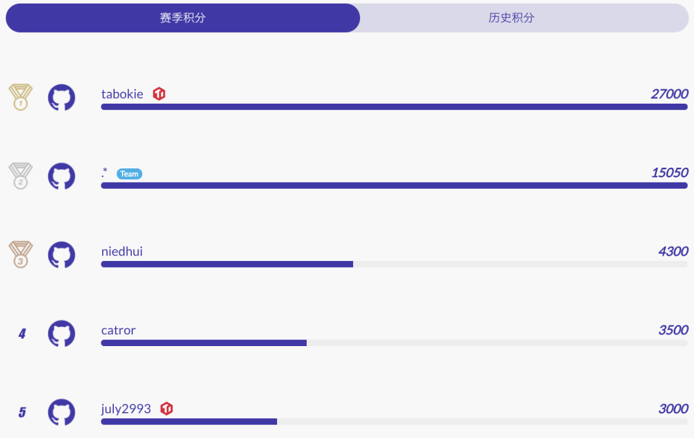
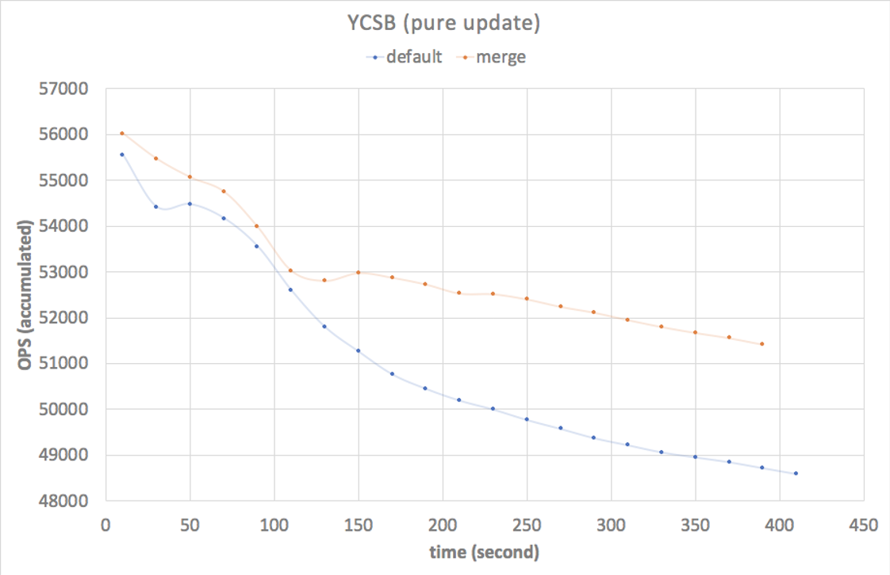
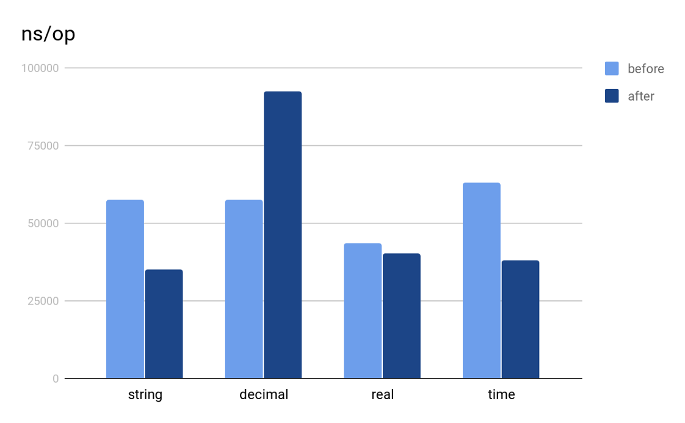
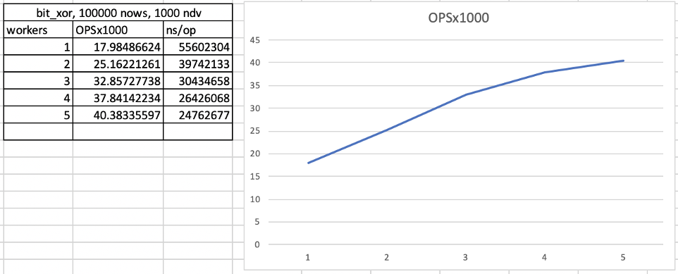
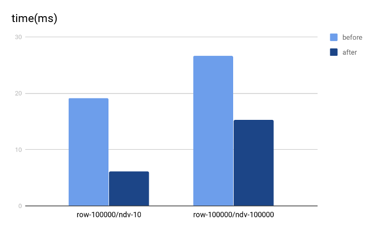
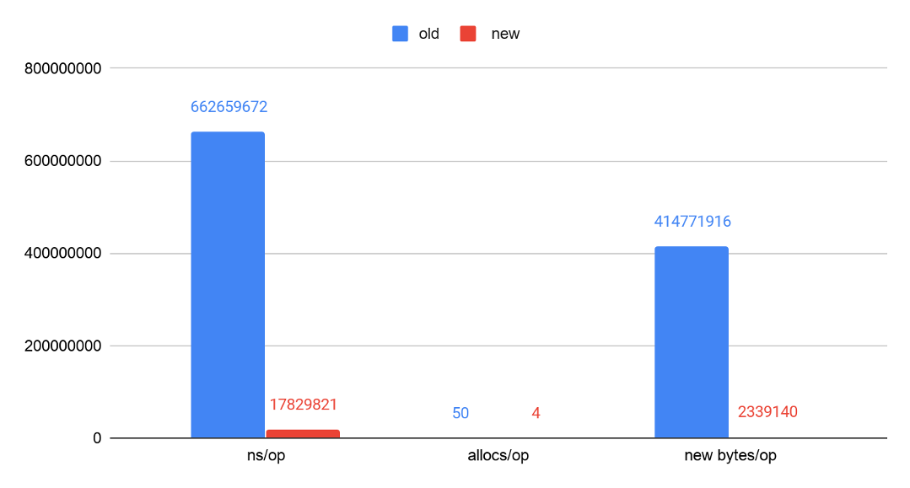

2019 年 11 月初，我们开启了「TiDB 挑战赛第一季之 [性能挑战赛](https://pingcap.com/community-cn/tidb-performance-challenge/)」，比赛为期三个月，期间选手将通过完成一系列难度不同的任务来获得相应的积分。赛程过去三分之一时，已经取得了十分耀眼的 [阶段性成果](https://pingcap.com/blog-cn/pcp-report-201911/)。三个月过去，性能挑战赛已经圆满落幕，最终的积分排行也新鲜出炉，选手们的参赛成果让人非常惊喜，让我们回顾一下选手们是如何在“TiDB 性能提升”之路上，过五关斩六将的吧～

## 最终积分排名与奖项揭晓

>注：本次比赛的完整积分榜详见 [活动页面](https://pingcap.com/community-cn/tidb-performance-challenge/) 。

本次 TiDB 性能挑战赛，总共有 165 位社区开发者参赛，包括 23 支参赛队伍和 122 位个人参赛者（按照比赛规则，有 PingCAP 人员参与的小组不计入挑战赛最终排名，即上图中有 TiDB Logo 标示的选手）。

本次比赛奖项设置为：一等奖 1 名，二等奖 2 名，三等奖 3 名，其余分数高于 600 分的团队或个人为优秀奖，各团队和个人的获奖情况如下：

* 一等奖：.* Team（15050 积分）。

* 二等奖：niedhui（4300 积分）和 catror（3500 积分）。

* 三等奖：pingyu（2600 积分）、Renkai（2550 积分）和 js00070（1800 积分）。

* 优秀奖：ekalinin（1450 积分）、mmyj（1050 积分）、AerysNan（750 积分）、MaiCw4J（650 积分）、Rustin-Liu（650 积分）和 koushiro（650 积分）。

感谢这些非常优秀的团队和个人参赛者，在他们的贡献下，TiDB 各方面的性能都有了飞跃式的提升（后文会为大家展示其中几个优秀项目的提升效果）。此外，非常感谢 PingCAP 内部的参赛同学，他们利用自己的业余时间参赛，为 TiDB 的性能提升做出了突出的贡献，他们将获得我们颁发的突出贡献奖：

* tabokie：通过“[PCP-21: Titan GC doesn’t affect online write](https://github.com/tikv/tikv/issues/5739)”直接获得 27000 积分，一举登顶积分榜首。

* july2993：通过完成多项 PCP 任务获得高达 3000 的积分，位于总积分榜第 5 名。

## 选手感想

“作为内部人员参加这次大赛，最大的体验就是周末工作还是蛮累的;)，但和日常工作不同的是，PCP 的难题更具探索性和未知性。作为参与者担当了一次业界前沿工业实践的先头兵，忘掉 OKR 轻装上马，重新找回了初恋代码的滋味。最后，尽管贵司从来不缺夸奖，我还是得夸一夸这赏心悦目的代码库，功能扩展不费吹灰之力，当然还要感谢 mentor 兼同事们对选题的前期探索，在宝贵周末共同探讨难题，我的工作只是从纸面迈出的一小步，优秀的团队给了我最大的鼓励。”

——tabokie

“我们参加了去年的 hackathon 比赛并斩获了二等奖。这次性能挑战赛在队长的带领下也取得了总积分榜第二的好成绩。导师很认真负责，交流起来完全没有架子。前期的分数有时候有 bug 但反馈之后很快修复，希望下一届规则可以更完善一些，学到了很多东西（比如 Rust），下一届会继续参赛！”

—— .* team

“参与性能挑战赛收获很大，有厉害的导师针对选定问题进行指导，把以前很多零碎的知识汇成了完成的知识体系，最终能看到自己的代码对 TiDB / TiKV 的性能提升是一件非常有成就感事（TiDB Robot 插播：niedhui 已经是 TiKV Committer 了！）”

—— niedhui

“TiDB 的知乎和公众号我一直在关注，看到这个活动觉得还挺有意思的，做开源贡献的同时竟然还有奖品。另外因为去年下半年学习了 Go 语言就借此机会多练习一下。比赛体验很好，稍微难一点的题目都有导师指导，而且 code review 也做的很细心，这对刚开始接触 TiDB 代码的人十分友好。要说获得了什么，那就是还在你们手里没有给我寄的奖品哈哈（TiDB Robot：等我们回公司了就给你寄～）”

——Catror

## 优秀成果展示

在比赛开始一个月的时候我们曾经做过一次 [成果展示](https://pingcap.com/blog-cn/pcp-report-201911/)，已经过去了两个月，让我们再来回顾一下两个月中参赛选手们取得的优秀成果吧！

### PCP-21: Titan GC doesn’t affect online write

* [相关 PR 链接](https://github.com/tikv/tikv/issues/5739)

* 作者：tabokie

这是整个赛季中唯一一个被完成的 Hard 等级的任务，tabokie 凭借该任务直接获得 27000 分，在比赛的最后一天逆袭绝杀，登顶性能挑战赛榜首！

#### 题目简介

Titan 是 TiKV 开发的一款实现键值分离的 RocksDB 插件，简单来说，就是将较长的用户键值对单独存储在 Blob 文件中，而将数据在 Blob 文件中的物理地址写在 RocksDB 中。当用户删除 RocksDB 中的数据时，物理地址对应的数据随之失效，Titan 通过对 Blob 文件的定时垃圾回收来清理这些无效的数据。GC 的过程就产生了本题目所描述的问题：数据清理后多个 Blob 文件的重新整合产生了新的物理地址，我们需要把它们一一写回 RocksDB 中，而 Titan 当前的 GC 机制要求写回 RocksDB 的同时阻塞用户对 RocksDB 的写入操作。

具体来说，GC 写回时执行了读操作，当且仅当需要写回的数据较新时才会确认写回，整个过程中 RocksDB 不能有新数据插入。这一机制严重影响了数据库的写入性能，尤其对于更新频繁进而导致 GC 频繁的场景，写入性能将急剧下降。

#### 实现方法

tabokie 采用了一种稍微妥协的方式，利用 RocksDB 提供的 Merge Operator 特性，优化 GC 性能。开启 Merge Operator 后，除了正常数据，还可以插入 Merge 类型的数据，RocksDB 会自行将正常数据与其后的 Merge 数据按照插入时序进行合并，这样的合并发生在 Read/Flush/Compaction 过程中，在读写性能之间找到了一个可以接受的平衡。使得后台 GC 不再影响写入，大大提升了 Titan 的写入性能。

#### 效果展示

我们使用 YCSB（一款专门针对 NoSQL 数据库的基础测试工具）测试开启了 Titan 的 TiKV 数据库，本例中使用了纯 update 配置，后台 GC 线程为 6，测试结果如下：

在持续 8 分钟的测试中，因为测试前期 GC 频率较轻，优化前后两种 GC 机制的写入性能差距很小。随着写入时间的增加，到后期，两种 GC 机制下的写入性能差距迅速扩大，二者的 QPS 差距可达到 3000！可以期待的是，在长时的生产环境中这样的优势能够持续保持，将显著地提升用户的写入体验！

### PCP-6: Optimize the performance of builtin function `IN`

* [相关 PR 链接](https://github.com/pingcap/tidb/issues/12970)

* 作者：js00070（张之逸）

#### 题目简介

内置函数 `IN()` 被用来处理 SQL 中的 in 操作，如 select id, age from students where age in (18, 19, 20)，是一个比较常见的函数。有时应用拼接的 SQL 中 `IN()` 表达式的参数个数能够达到上万个，且基本上都是常量，如上面的例子。在此种情况下，每收到一行待处理的数据，TiDB 都会去这些常量做一次重复的求值计算，非常低效。

#### 实现方法

该任务由 js00070（张之逸）完成，主要思路是在内部构造 `IN()` 表达式时，区分出常量和非常量参数，用一个 HashMap 保存常量的值，避免运行时的重复计算。对于上面例子中的 SQL，18、19 和 20 这三个常量就会被保存在 HashMap 中。经过这个优化后，对于常量参数，其计算复杂度从原来的 O(n) 降低到了 O(1)。大大提升了这种情况下 `IN()` 表达式的运行效率。

#### 效果展示

优化的效果主要取决于参数内的常量个数，我们以 IN 包含 2 个常量参数，1 个非常量参数作为输入，对各类型数据处理 1024 行的 benchmark 结果如下图：

### PCP-4: Improve the performance of `WindowExec` by using multi-thread hash grouping

* [相关 PR 链接](https://github.com/pingcap/tidb/issues/12966)

* 作者：pingyu

#### 题目简介

TiDB 的 Window 算子原来实现是单线程的，对于 Window 算子的每个窗口，因为是数据隔离的，所以每个窗口之间可以通过并行计算来提升计算效率。

#### 实现方法

算法的原理很简单，按照窗口函数的 partition by 从句指定的列来进行哈希分组，再对于每个分组，单独起一个线程做计算。pingyu 经过多次实验、测试和改进，把 Window 算子和 Sort 算子结合起来，一起进行哈希分组，在每个线程内先将数据排序，再做窗口函数计算。最终得到了非常好的性能提升，超出预期的完成了此 PCP 题目。

附上 pingyu 本人对这项工作的分享：[Optimize the Performance of Window Executor](https://docs.qq.com/slide/DRG5qZkdmRW9CZ2NM)。

目前 pingyu 正在研究周靖人的 Paper 《[Incorporating Partitioning and Parallel Plans into the SCOPE Optimizer](http://www.cs.albany.edu/~jhh/courses/readings/zhou10.pdf)》，尝试将 partitioning 属性集成到 TiDB 的优化器当中去，使优化器可以根据代价来选择是否插入 shuffle 算子，这一优化有望改变 TiDB 执行引擎的并发模型，使其充分利用计算机的 CPU 资源，提升执行引擎性能，非常值得期待！

#### 效果展示

如下图，横轴代表并发数量，纵轴代表一个有窗口函数的 SQL 的 QPS，并发数量为 1 时和原来单线程的执行性能一样。可以看到，在并发数为 4 时，Window 算子的计算效率达到了单并发执行的 2.2 倍：

### PCP-2: Improve the performance of `groupChecker` by vectorization

* [相关 PR 链接](https://github.com/pingcap/tidb/issues/12976)

* 作者：Reminiscent（鄢程鹏）

该任务由杭州电子科大的鄢程鹏同学完成，他去年参加了 Talent Plan 并顺利结业，除了参加性能挑战赛以外，也正在积极参加 Cascades Planner 的优化器重构工作，为优化器添加了很多优化规则。

#### 题目简介

`groupChecker` 在 TiDB 中被用来分组，会被 Stream Aggregate，Merge Join，Window 这三个算子使用。为保证正确性，它要求输入数据是有序的，通过两两比较的方式判断前后两行数据是否属于同一个数据分组。

在分组过程中，有可能按照某个表达式来进行分组，如 `GROUP BY col1 + col2`，`groupChecker` 会逐行的调用表达式的 `Eval()` 接口进行计算，这个过程的计算开销非常大。

#### 实现方法

TiDB 在计算时，内存中的数据是按列存放的，考虑到 Cache Locality，按列计算性能会更快。针对这个特点，程鹏做了两个优化：

1. 使用表达式最新的列式计算接口，一次性求解一列的值，降低 Cache Miss。

2. 分组时也借用向量化的思想，按列进行比较，进一步降低 Cache Miss。

#### 效果展示

后续程鹏帮助我们把优化后的 `vecGroupChecker` 用在了 Window 和 Stream Aggregate 算子内，另一位同学 Catror 把它用在了 Merge Join 算子内，都对这三个算子产生了很大的性能提升。

效果如下图所示，Window 算子优化前后的执行时间对比，越低性能越好：

### PCP-24: Improve the performance of the HTTP API for getting all regions

* [相关 PR 链接](https://github.com/pingcap/pd/issues/1837)

* 作者：ekalinin

该任务由俄罗斯小哥 ekalinin 完成，这位小哥曾凭借一己之力拿到 PCP 单日榜首，目前已完成 20+ 向量化表达式的工作。

#### 题目简介

在生产环境中，有时需要通过获取所有的 region 信息来帮忙分析集群的状态。在实验环境中，有时也需要通过收集 region 的信息对集群访问模式进行一些分析。当集群存储的数据越来越多，region 的个数达到百万级别以上后，获取全量的 region 信息所需要的计算和时间开销变得巨大无比。本题目希望优化该 API 的性能，减少资源使用，降低对 PD 在线服务的影响。

#### 实现方法

在获取 Region 过程中，主要消耗在于中间的内存拷贝和序列化，因此这两块是优化的大头：

1. 从 []byte 到 string 的转化做到 zero-copy。

2. 优化 Hex Encoding 和大小写转换中的内存消耗，减少内存的申请。

3. 使用 Streaming 的方式序列化输出。

#### 效果展示

在我们简单测试场景中 100w regions 对比中，API 的整体性能提升了 3.5 倍，尤其是 Hot Path 上的 `RenderJSON()` 函数，其运行时间和内存开销都被大大减小，前后对比的 benchmark 结果如下图所示：

## 总结与展望

目前这些优化都会合进 4.0 分支，将随着 TiDB 4.0 版本发布并交付给用户，预计 5 月底 4.0 的用户就能够享受到这些性能优化带来的体验改进了，让我们小小的期待下 4.0 版本的惊艳表现。

**至此 TiDB 挑战赛第一季落幕，错过比赛或没玩够的小伙伴们不用遗憾，第二季挑战赛也即将开启！**

第二季主题的灵感来自去年 AskTUG 上发起的 [“我的 TiDB 听我的”](https://asktug.com/t/topic/2156) 活动，该活动累计收到 TiDB 用户们关于 DDL、分区表、性能优化、TiKV、PD 等方面的近 40 个需求。经过一轮筛选，我们列出了 20 个尚未实现的需求 [向用户征集投票](https://asktug.com/t/topic/2684)，后续我们将结合用户的投票结果及其他 TiDB 易用性相关的问题，开启第二季 TiDB 挑战赛，敬请期待！
