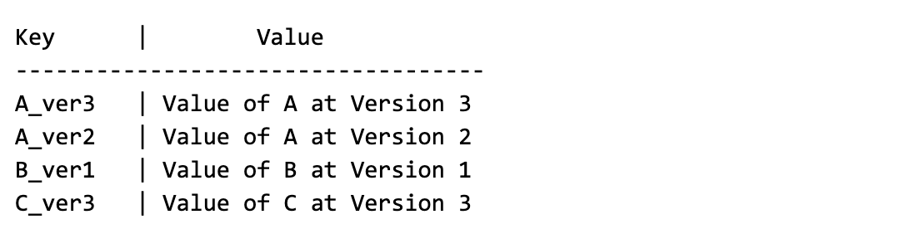
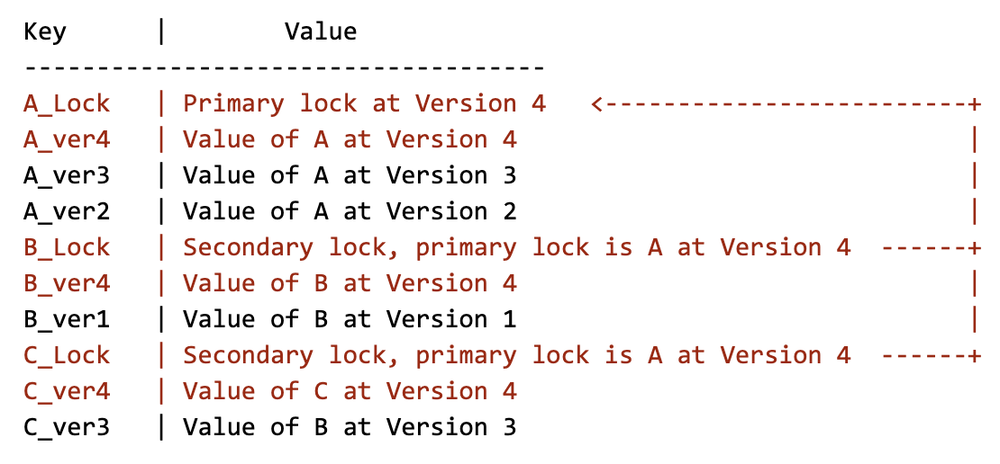
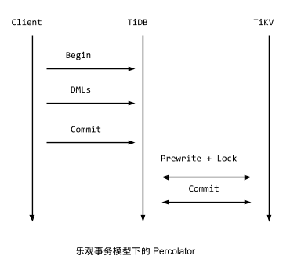
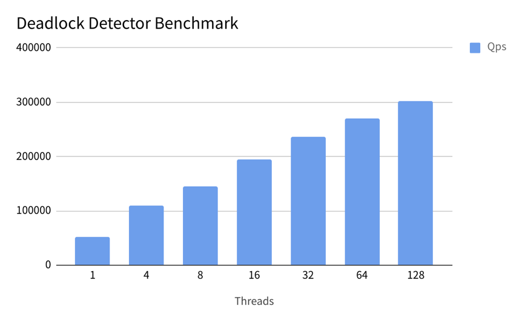
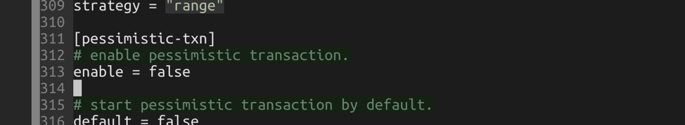

关注 TiDB 的朋友大概会注意到，TiDB 在 3.0 中引入了一个实验性的新功能：悲观事务模型。这个功能也是千呼万唤始出来的一个功能。

大家知道，发展到今天，TiDB 不仅仅在互联网行业广泛使用，更在一些传统金融行业开花结果，而悲观事务是在多数金融场景不可或缺的一个特性。另外事务作为一个关系型数据库的核心功能，任何在事务模型上的改进都会影响无数的应用，而且在一个分布式系统上如何漂亮的实现悲观事务模型，是一个很有挑战的工作，所以今天我们就来聊聊这块“硬骨头”。

## ACID 和分布式事务？

在聊事务之前，先简单科普一下 ACID 事务，下面是从 Wikipedia 摘抄的 ACID 的定义：

* Atomicity（原子性）：一个事务（transaction）中的所有操作，或者全部完成，或者全部不完成，不会结束在中间某个环节。事务在执行过程中发生错误，会被 [回滚](https://zh.wikipedia.org/wiki/%E5%9B%9E%E6%BB%9A_(%E6%95%B0%E6%8D%AE%E7%AE%A1%E7%90%86))（Rollback）到事务开始前的状态，就像这个事务从来没有执行过一样。

* Consistency（一致性）：在事务开始之前和事务结束以后，数据库的完整性没有被破坏。

* Isolation（隔离性）：数据库允许多个并发事务同时对其数据进行读写和修改的能力，隔离性可以防止多个事务并发执行时由于交叉执行而导致数据的不一致。

* Durability（持久性）：事务处理结束后，对数据的修改就是永久的，即便系统故障也不会丢失。

举个直观的例子，就是银行转账，要么成功，要么失败，在任何情况下别出现这边扣了钱那边没加上的情况。

所谓分布式事务，简单来说就是在一个分布式数据库上实现和传统数据库一样的 ACID 事务功能。

## 什么是乐观？什么是悲观？一个小例子

很多人介绍乐观事务和悲观事务的时候会扯一大堆数据库教科书的名词搞得很专业的样子，其实这个概念并不复杂， 甚至可以说非常好理解。我这里用一个生活中的小例子介绍一下。

想象一下你马上出发要去一家餐厅吃饭，但是你去之前不确定会不会满桌，你又不想排号。这时的你会有两个选择，如果你是个乐观的人，内心戏可能会是「管他的，去了再说，大不了没座就回来」。反之，如果你是一个悲观的人，可能会先打个电话预约一下，先确认下肯定有座，同时交点定金让餐厅预留好这个座位，这样就可以直接去了。

上面这个例子很直观的对应了两种事务模型的行为，乐观事务模型就是直接提交，遇到冲突就回滚，悲观事务模型就是在真正提交事务前，先尝试对需要修改的资源上锁，只有在确保事务一定能够执行成功后，才开始提交。 

理解了上面的例子后，乐观事务和悲观事务的优劣就很好理解了。对于乐观事务模型来说，比较适合冲突率不高的场景，因为直接提交（“直接去餐厅”）大概率会成功（“餐厅有座”），冲突（“餐厅无座”）的是小概率事件，但是一旦遇到事务冲突，回滚（回来）的代价会比较大。悲观事务的好处是对于冲突率高的场景，提前上锁（“打电话交定金预约”）的代价小于事后回滚的代价，而且还能以比较低的代价解决多个并发事务互相冲突、导致谁也成功不了的场景。

## TiDB 的事务模型 - Percolator

在 TiDB 中分布式事务实现一直使用的是 Percolator 的模型。在聊我们的悲观事务实现之前，我们先简单介绍下 Percolator。

Percolator 是 Google 在 OSDI 2010 的一篇 [论文](https://ai.google/research/pubs/pub36726) 中提出的在一个分布式 KV 系统上构建分布式事务的模型，其本质上还是一个标准的 2PC（2 Phase Commit），2PC 是一个经典的分布式事务的算法。网上介绍两阶段提交的文章很多，这里就不展开了。但是 2PC 一般来说最大的问题是事务管理器（Transaction Manager）。在分布式的场景下，有可能会出现第一阶段后某个参与者与协调者的连接中断，此时这个参与者并不清楚这个事务到底最终是提交了还是被回滚了，因为理论上来说，协调者在第一阶段结束后，如果确认收到所有参与者都已经将数据落盘，那么即可标注这个事务提交成功。然后进入第二阶段，但是第二阶段如果某参与者没有收到 COMMIT 消息，那么在这个参与者复活以后，它需要到一个地方去确认本地这个事务后来到底有没有成功被提交，此时就需要事务管理器的介入。

聪明的朋友在这里可能就看到问题，这个事务管理器在整个系统中是个单点，即使参与者，协调者都可以扩展，但是事务管理器需要原子的维护事务的提交和回滚状态。

Percolator 的模型本质上改进的就是这个问题。下面简单介绍一下 Percolator 模型的写事务流程：

其实要说没有单点也是不准确的，Percolator 的模型内有一个单点 TSO（Timestamp Oracle）用于分配单调递增的时间戳。但是在 TiDB 的实现中，TSO 作为 PD leader 的一部分，因为 PD 原生支持高可用，所以自然有高可用的能力。

每当事务开始，协调者（在 TiDB 内部的 tikv-client 充当这个角色）会从 PD leader 上获取一个 timestamp，然后使用这个 ts 作为标记这个事务的唯一 id。标准的 Percolator 模型采用的是乐观事务模型，在提交之前，会收集所有参与修改的行（key-value pairs），从里面随机选一行，作为这个事务的 Primary row，剩下的行自动作为 secondary rows，这里注意，primary 是随机的，具体是哪行完全不重要，primary 的唯一意义就是负责标记这个事务的完成状态。

在选出 Primary row 后， 开始走正常的两阶段提交，第一阶段是上锁+写入新的版本，所谓的上锁，其实就是写一个 lock key, 举个例子，比如一个事务操作 A、B、C，3 行。在数据库中的原始 Layout 如下：



假设我们这个事务要 Update (A, B, C, Version 4)，第一阶段，我们选出的 Primary row 是 A，那么第一阶段后，数据库的 Layout 会变成：



上面这个只是一个释义图，实际在 TiKV 我们做了一些优化，但是原理上是相通的。上图中标红色的是在第一阶段中在数据库中新写入的数据，可以注意到，`A_Lock`、`B_Lock`、`C_Lock` 这几个就是所谓的锁，大家看到 B 和 C 的锁的内容其实就是存储了这个事务的 Primary lock 是谁。在 2PC 的第二阶段，标志事务是否提交成功的关键就是对 Primary lock 的处理，如果提交 Primary row 完成（写入新版本的提交记录+清除 Primary lock），那么表示这个事务完成，反之就是失败，对于 Secondary rows 的清理不需要关心，可以异步做（为什么不需要关心这个问题，留给读者思考）。

理解了 Percolator 的模型后，大家就知道实际上，Percolator 是采用了一种化整为零的思路，将集中化的事务状态信息分散在每一行的数据中（每个事务的 Primary row 里），对于未决的情况，只需要通过 lock 的信息，顺藤摸瓜找到 Primary row 上就能确定这个事务的状态。

## 乐观事务的局限性，以及为什么我们需要悲观事务

对于很多普通的互联网场景，虽然并发量和数据量都很大，但是冲突率其实并不高。举个简单的例子，比如电商的或者社交网络，刨除掉一些比较极端的 case 例如「秒杀」或者「大V」，访问模式基本可以认为还是比较随机的，而且在互联网公司中很多这些极端高冲突率的场景都不会直接在数据库层面处理，大多通过异步队列或者缓存在来解决，这里不做过多展开。

但是对于一些传统金融场景，由于种种原因，会有一些高冲突率但是又需要保证严格的事务性的业务场景。举个简单的例子：发工资，对于一个用人单位来说，发工资的过程其实就是从企业账户给多个员工的个人账户转账的过程，一般来说都是批量操作，在一个大的转账事务中可能涉及到成千上万的更新，想象一下如果这个大事务执行的这段时间内，某个个人账户发生了消费（变更），如果这个大事务是乐观事务模型，提交的时候肯定要回滚，涉及上万个个人账户发生消费是大概率事件，如果不做任何处理，最坏的情况是这个大事务永远没办法执行，一直在重试和回滚（饥饿）。

另外一个更重要的理由是，有些业务场景，悲观事务模型写起来要更加简单。此话怎讲？

因为 TiDB 支持 MySQL 协议，在 MySQL 中是支持可交互事务的，例如一段程序这么写（伪代码）：

```
mysql.SetAutoCommit(False);
txn = mysql.Begin();
affected_rows = txn.Execute(“UPDATE t SET v = v + 1 WHERE k = 100”);
if affected_rows > 0 {
	A();
} else {
	B();
}
txn.Commit();

```

大家注意下，第四行那个判断语句是直接通过上面的 UPDATE 语句返回的 `affected_rows` 来决定到底是执行 A 路径还是 B 路径，但是聪明的朋友肯定看出问题了，**在一个乐观事务模型的数据库上，在 COMMIT 执行之前，其实是并不知道最终 `affected_rows` 到底是多少的**，所以这里的值是没有意义的，程序有可能进入错误的处理流程。这个问题在只有乐观事务支持的数据库上几乎是无解的，需要在业务侧重试。

这里的问题的本质是 MySQL 的协议支持可交互事务，但是 MySQL 并没有原生的乐观事务支持（MySQL InnoDB 的行锁可以认为是悲观锁），所以原生的 MySQL 在执行上面这条 UPDATE 的时候会先上锁，确认自己的 Update 能够完成才会继续，所以返回的 `affected_rows` 是正确的。但是对于 TiDB 来说，TiDB 是一个分布式系统，如果要实现几乎和单机的 MySQL 一样的悲观锁行为（就像我们在 3.0 中干的那样），还是比较有挑战的，比如需要引入一些新的机制来管理分布式锁，所以呢，我们选择先按照论文实现了乐观事务模型，直到 3.0 中我们才动手实现了悲观事务。下面我们看看这个“魔法”背后的实现吧。

## TiDB 3.0 中的悲观事务实现

在讨论实现之前，我们先聊聊几个重要的设计目标：

1. 兼容性，最大程度上的兼容 MySQL 的悲观事务的行为，使用户业务改造的成本最小。

2. 灵活性，支持 Session 级别甚至事务级别的悲观/乐观行为变更，所以需要考虑乐观事务和悲观事务共存的情况。

3. 高性能，死锁检测和维护锁的代价不能太高。

4. 高可用 + 可扩展性，系统中不存在单点故障（single point of failure），并且可扩展。

TiDB 实现悲观事务的方式很聪明而且优雅，我们仔细思考了 Percolator 的模型发现，其实我们只要将在客户端调用 Commit 时候进行两阶段提交这个行为稍微改造一下，将第一阶段上锁和等锁提前到在事务中执行 DML 的过程中不就可以了吗，就像这样：




**TiDB 的悲观锁实现的原理确实如此，在一个事务执行 DML (UPDATE/DELETE) 的过程中，TiDB 不仅会将需要修改的行在本地缓存，同时还会对这些行直接上悲观锁，这里的悲观锁的格式和乐观事务中的锁几乎一致，但是锁的内容是空的，只是一个占位符，待到 Commit 的时候，直接将这些悲观锁改写成标准的 Percolator 模型的锁，后续流程和原来保持一致即可，唯一的改动是：**

**对于读请求，遇到这类悲观锁的时候，不用像乐观事务那样等待解锁，可以直接返回最新的数据即可（至于为什么，读者可以仔细想想）。**

至于写请求，遇到悲观锁时，只需要和原本一样，正常的等锁就好。

这个方案很大程度上兼容了原有的事务实现，扩展性、高可用和灵活性都有保证（基本复用原来的 Percolator 自然没有问题）。

但是引入悲观锁和可交互式事务，就可能引入另外一个问题：死锁。这个问题其实在乐观事务模型下是不存在的，因为已知所有需要加锁的行，所以可以按照顺序加锁，就自然避免了死锁（实际 TiKV 的实现里，乐观锁不是顺序加的锁，是并发加的锁，只是锁超时时间很短，死锁也可以很快重试）。但是悲观事务的上锁顺序是不确定的，因为是可交互事务，举个例子：

* 事务 1 操作顺序：UPDATE A，UPDATE B

* 事务 2 操作顺序：UPDATE B，UPDATE A

这俩事务如果并发执行，就可能会出现死锁的情况。

所以为了避免死锁，TiDB 需要引入一个死锁检测机制，而且这个死锁检测的性能还必须好。其实死锁检测算法也比较简单，只要保证正在进行的悲观事务之间的依赖关系中不能出现环即可。

例如刚才那个例子，事务 1 对 A 上了锁后，如果另外一个事务 2 对 A 进行等待，那么就会产生一个依赖关系：事务 2 依赖事务 1，如果此时事务 1 打算去等待 B（假设此时事务 2 已经持有了 B 的锁）， 那么死锁检测模块就会发现一个循环依赖，然后中止（或者重试）这个事务就好了，因为这个事务并没有实际的 prewrite + 提交，所以这个代价是比较小的。


<center>TiDB 悲观锁的死锁检测</center>

在具体的实现中，TiKV 会动态选举出一个 TiKV node 负责死锁检测（实际上，我们就是直接使用 Region1 所在的 TiKV node），在这个 TiKV node 上会开辟一块内存的记录和检测正在执行的这些事务的依赖关系。在悲观事务在等锁的时候，第一步会经过这个死锁检测模块，所以这部分可能会多引入一次 RPC 进行死锁检测，实际实现时死锁检测是异步的，不会增加延迟（回想一下交给饭店的定金 :P）。因为是纯内存的，所以性能还是很不错的，我们简单的对死锁检测模块进行了 benchmark，结果如下：



**基本能达到 300k+ QPS 的吞吐，这个吞吐已经能够适应绝大多数的并发事务场景了**。另外还有一些优化，例如，显然的悲观事务等待的第一个锁不会导致死锁，不会发送请求给 Deadlock Detector 之类的，其实在实际的测试中， 悲观事务模型带来的 overhead 其实并不高。另一方面，由于 TiKV 本身支持 Region 的高可用，所以一定能保证 Region 1 会存在，间接解决了死锁检测服务的高可用问题。

关于悲观锁还需要考虑长事务超时的问题，这部分比较简单，就不展开了。

## 如何使用？

在 TiDB 3.0 的配置文件中有一栏：



将这个 `enable` 设置成 `true` 即可，目前默认是关闭的。

第二步，在实际使用的时候，我们引入了两个语法：

* `BEGIN PESSIMISTIC`

* `BEGIN /*!90000 PESSIMISTIC */ `

用这两种 BEGIN 开始的事务，都会进入悲观事务模式，就这么简单。

**悲观事务模型是对于金融场景非常重要的一个特性，而且对于目标是兼容 MySQL 语义的 TiDB 来说，这个特性也是提升兼容性的重要一环，希望大家能够喜欢，Enjoy it!**
