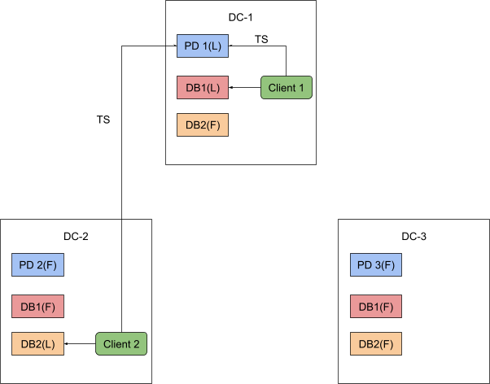
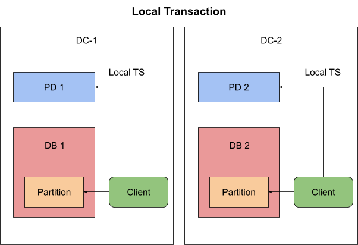
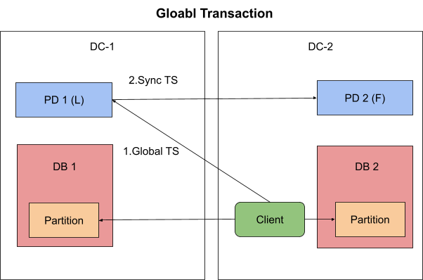
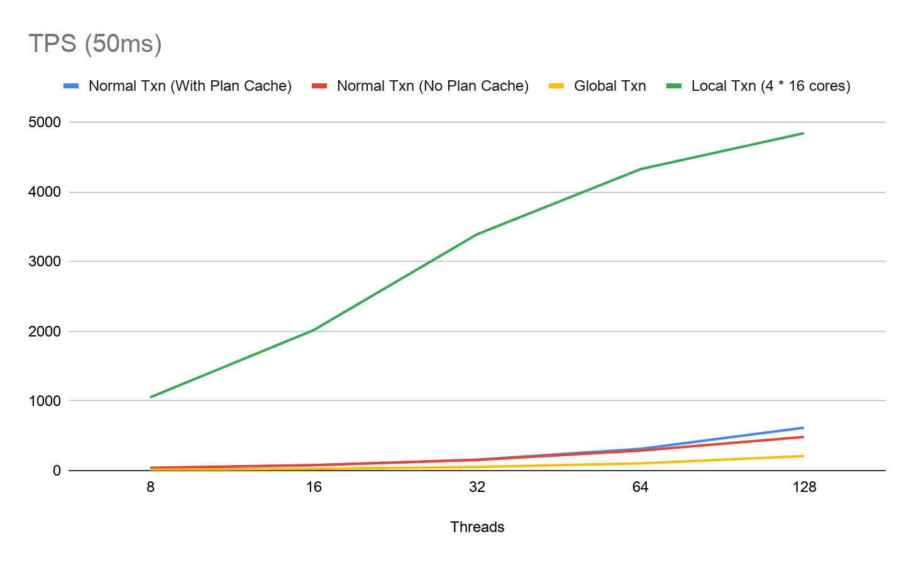

TiDB 5.0 发布在即，在这个大版本更新中提升 TiDB 集群的跨中心部署能力是我们重要的一个着力点。其中，新的分布式本地事务能力及其对应的授时服务改造是基础且又重要的一环。本文将会从 TiDB 现有的授时服务出发，一步步阐释新分布式授时服务的改造思路和本地事务的性能表现，最后将会为大家分享一个应用场景与上手步骤，供感兴趣的用户把这个新特性上手试用起来。

## 单点 TSO 服务

作为一个 NewSQL 分布式数据库，TiDB 自然会从骨子里由内而外地散发着一股分布式系统应该有的气质——高可用且几乎无限的水平扩容能力。事实上，既然决定了走上 Shared-nothing 这条充满未来感的道路，拥有这样的优点自然而然也是无可厚非之事，但如果你仔细打量一番曾经的 TiDB 集群，你会发现在这个无处不分布式的系统里面，有一个东西的存在似乎格外的“独特”——集群的授时服务 TSO。

全局的授时服务器称为 TSO （Timestamp Oracle），名字里虽然有 Oracle，但我相信至少跟 Oracle 数据库没什么关系，仅仅代表其单词本意：“神授的，不可置疑的“。TSO 授时服务可以保证按照递增的方式分配时间戳，任何一次申请得到的时间戳都不会重复，在分布式系统中往往用于给事件定序，最常见和重要的作用即保证事务版本号的单调递增，确保分布式事务的时序。TSO 有实现简单、严格定序、性能好等优点，因此有很多分布式系统采用了 TSO 作为时钟方案，TiDB 也是其中一员，在一个 TiDB 集群中，PD leader 节点会作为全局单点的授时服务进行时间戳分配，为集群的分布式事务，数据隔离级别，版本控制等提供稳固的基石，PD 的 TSO 服务性能也久经考验，可以轻松达到百万级别的 QPS。但你可以注意到一点——TSO 服务是整个集群中的一个单点。一个庞大的分布式系统依赖于一个单点，自然存在着一些问题。

首先是单点故障。整个系统依赖 TSO 的高可用，这个问题我们通过 PD 本身的高可用进行了一定程度上的解决，同时结合 etcd 强一致性的持久化存储也保证了 TSO 在发生服务切换后的不回退。但尽管如此，由于 PD leader 的选举基于 etcd 本身的 Raft 构建，一旦发生网络分区或其他原因触发重新选主，在选举过程造成的不可用问题依然无法避免。

其次是延迟问题。获取时间戳需要 PD client 与 PD leader 进行通信。如下图所示，如果 TiDB 实例和 PD leader 并不在一个机房，延迟就会比较高，更甚者若是全球化跨数据中心部署，这个延迟是跨中心级别的，可能会变得非常大，这样一来势必会对集群的性能产生很大的影响。



上述两个问题，尤其是后者，大大制约了 TiDB 在跨数据中心场景下的部署应用，而单点的 TSO 授时服务便是其中关键的影响因素，试想，如果每个事务的执行都需要容忍跨中心请求时间戳带来的延迟，加之 TiDB 使用了 Percolator 作为事务模型，在写场景下一次事务至少需要 Prewrite 和 Commit 的两次时间戳获取，遇上高强度 OLTP 负载，远在另一个数据中心的 PD leader 显然因为网络延迟成为了整个集群性能的瓶颈。TiDB 其实在 5.0 版本中对写场景做了诸多优化，上述每次事务写都需要的两次 TSO 获取，可以通过开启 1PC 一阶段和异步提交 Async Commit 这两个特性来省去其中一次网络开销，从而提升性能，但其实这两个特性并没有本质上消除跨中心带来的网络延迟问题本身，如何从根源上下手去优化，甚至说彻底抹除这部分延迟带来的影响呢？

## 跨中心部署的问题

在跨数据中心部署的场景下，影响 TiDB 性能的关键性因素就是不同数据中心间的高网络延迟，具体结合到 TiDB 的运行机制中去，会包含以下几个方面：

- TiDB 与 Region（注：TiDB 的数据分片单位）的 leader 不在同一数据中心

- Region 的 leader 和 follower 不在同一数据中心

- TiDB 与 PD leader 不在同一数据中心

由于这些原因，实践中用户往往会设置调度策略把业务请求、Region Leader 以及 PD leader 集中在同一个数据中心。这样做的坏处是只有一个数据中心对外提供服务，硬件资源利用率太低，显然是一个“折衷调和”的非最优解。

继而，为了能多个数据中心提供服务，一些用户会选择把数据库拆解成多条业务线，每条业务线部署一套跨数据中心的集群，不同业务线在不同的数据中心提供服务。这样做的缺点主要有两个，一是多套集群的运维会更麻烦，二是不支持跨越多个集群的事务。

基于此，我们期望有一套这样的方案：能实现多套业务线运行在一套集群内，不同的业务线在不同的数据中心提供服务，当事务只涉及到本地数据时，不用负担跨数据中心的延迟开销，而当事务涉及到多个数据中心的读写时，又能不破坏事务一致性。也就是说，为了完成兼顾性能，又支持同一集群跨数据中心部署的重要历史使命，我们需要对 TiDB 的事务的一致性模型进行改造。

## 分布式的一致性

作为一个强一致性 HTAP 数据库，TiDB 基于 Raft 共识算法提供了满足强一致性（线性一致性）且高可用的数据库服务，同时在隔离级别上做到了快照隔离 (Snapshot Isolation) 级别（为与 MySQL 保持一致，又称其为“可重复读”）。尽管可序列化（Serializability）是最理想且严格并发控制方案，但其实现后所带来的性能却难称高效，TiDB 自然也和诸多老牌数据库系统（PostgreSQL，Oracle 以及 Microsoft SQL Server）一样选择了多版本并发控制 MVCC（Multi-Version Concurrency Control）来解决并发读写问题。MVCC 中用来代表版本标示的，便是由 TSO 授时服务提供的全局唯一，且严格递增的时间戳。在 TiDB 集群中，一个 TSO 时间戳是一个 int64 的整型，它由物理时间 Physical time 和逻辑事件 Logical time 两个部分组成。

- 物理时间 Physical time 是当前的 Unix 系统时间戳（毫秒）

- 逻辑时间 Logical time 则是一个范围在 [0, 1 << 18] 的计数器。这样一来便做到了在每毫秒的物理时间粒度上又可以继续细化成最多 262144 个 TSO

TSO 作为一个单点，能够轻松地确保时间戳的全序关系，物理时间随着自然时间流逝，更细粒度的定序则由逻辑时间来保证。同时再引入额外的机制保证高可用与时间戳不会受系统时间紊乱的影响而回退，具体可以参考我们之前写过的[关于 TSO 设计的博客](https://pingcap.com/blog-cn/placement-driver/)。

单点虽好，但如前文所述的跨中心部署场景下，TSO 服务与其他节点间的高网络延迟让我们无法美好地享受跨数据中心部署。考虑到在具体实践场景中，往往用户的业务是有数据中心关联特性的，即除了少部分事务会进行跨数据中心的数据读写，来自一个数据中心的事务所涉及的数据读写往往只会发生在当前数据中心之内，那么对于这部分事务，作为 TSO 授时服务其实只需要保证当前数据中心内的线性一致性即可，如下图所示。


如此一来，数据中心之间的延迟不再是大部分事物所要负担的一部分，即便出现了需要进行全局事务的场景，我们也可以通过某种机制来对所有数据中心的 TSO 进行同步，保证全局和本地的线性一致性不被破坏。总而言之就是要将曾经的单点 TSO 服务分布式化，同时兼顾一定范围内和全局的一致性保证。于是乎，自然便引出了 TiDB 5.0 中 PD 的一个新 feature——Local TSO。具体到用户层面，即 TiDB 的新功能 Local Transaction 本地事务。





如上图所示，TiDB 会在事务执行过程中通过 TiKV 的 Location Label 和 Placement Policy 功能对数据位置属性就行检查，确保本地事务只被允许读写访问本数据中心的数据。而全局事务则无此限制，可以任意的读写所有中心的数据。本地事务由本地的 TSO 提供授时服务，和执行本地事务的 TiDB 实例同处一个数据中心，无跨中心延迟。全局事务由全局的 TSO 提供授时服务，使用需要进行同步计算。

## 分布式化 TSO

前文说到，很久以来 PD leader 都是作为一个单点提供 TSO 服务的，但既然有了 Local TSO 这个概念，每一个 DC 都要有一个 Local TSO 的分配者，那我们自然要把 TSO 服务与 PD leader 解藕，作为一个单独的服务在跨中心 PD 集群中进行运作，而这个角色我们称之为 TSO Allocator。从上述的场景中，我们可以抽象出以下两种 TSO。

- Local TSO，只可服务于访问单个数据中心数据的本地事务，保证在单个数据中心内的线性增长即可，由 Local TSO Allocator 来进行分配。

- Global TSO，可服务于访问任意数据中心的全局事务，保证在整个集群范围内的线性增长，由 Global TSO Allocator 来进行分配。

### 线性一致性

单点 TSO 的大小是全序的，即任意两个 TSO 均可以确定的比较出大小，而任意两个 Local TSO 的大小则不再是全序关系，原因也很简单，这两个 TSO 可能分别来自不同的数据中心，由于只需维持在各自数据中心的一致性，节点间不同的系统时间，不同的逻辑时间都会导致它们的 Local TSO 进度不同，从而无法比较。本地事务存在的初衷即限定了其只能访问统一数据中心内的数据，所以我们可以沿用之前的 TSO 功能设计，唯一的区别是需要为每个数据中心在 PD 节点中选举出来对应的 Local TSO Allocator 提供 Local TSO 服务（可以理解成为每个数据中心提供一个单点的 TSO 服务）并限制其服务的范围即可（只允许该中心发起的事务请求该中心的 Local TSO 服务），这一点会在之后的可用性部分说明。

而对于 Global TSO，因为其对应服务的是全局事务，全局事务没有数据访问的约束，也就意味着持有一个 Global TSO，我们需要和之前分配过的所有 Global TSO 以及 Local TSO 建立起全序的比较关系，即对于任意一个全局事务持有的 Global TSO 时间戳 t，我们有：

- 在自然时间意义上，对于任意发生在 t 之前的事务所持有的时间戳 t1，要有 t1 < t

- 在自然时间意义上，对于任意发生在 t 之后的事务所持有的时间戳 t2，要有 t < t2

满足上述约束，Global TSO 才可以安全地，保证在存在多个 Local TSO 的前提下，全局范围内满足线性一致性。而要实现这一点，我们将 Global TSO 做成了一个算法计算的产物，不再如曾经的单点 TSO 一样有存储和推进的逻辑，具体的算法过程如下：

1. Global TSO Allocator 与当前集群内的所有 Local TSO Allocator 通信，收集已分配过的最大 Local TSO。

2. Global TSO Allocator 将收集到最大的 Local TSO 进行处理后（增加逻辑计数等）作为 MaxTSO 向所有 Local TSO Allocator 发送进行同步。

3. Local TSO Allocator 收到 MaxTSO 后判断其是否大于自己的当前 Local TSO 进度，若是，则直接更新内存中的当前 Local TSO 为 MaxTSO，并返回成功；若否，则不进行更新，直接返回成功。

4. Global TSO Allocator 收集到所有成功回复，把 MaxTSO 作为 Global TSO 结果返回。

Global TSO Allocator 是通过收集+写入这一两阶段的同步过程来满足一个 Global TSO 作为集群内此时此刻最大，且之后也不会出现比它小 TSO 的约束。出于兼容性和设计直觉上的考虑，Global TSO Allocator 不像 Local TSO Allocator 一样需要单独选举，依然是由 PD leader 作为 Global TSO Allocator 来对外提供服务。

以一言蔽之，对于 Local TSO 的改造，PD 把原有的「TSO 由 PD leader 单点分配」这个设计剥离，将 TSO Allocator 的选举以及 Local TSO 分配均变成以数据中心为单位的分布式存在。而将 Global TSO 作为和所有 Local TSO Allocator 同步校对后产生的算法结果，即 PD Leader 节点和所有的 Local TSO Allocator 授时服务节点达成一个共识作为 Global TSO 分配的结果。

### 全局唯一性

由于 TiDB 实例在整个运行过程中，会使用事务开始时获取的 StartTS 作为事务 ID 进行相关状态信息的存储，在一些 Corner Case 下，例如同时执行本地事务和全局事务，亦或甚者在同一个 TiDB 上同时执行两个不同数据中心的本地事务，很可能会因为各自独立的 TSO 进度导致重复 TSO 出现，这不仅会因为事务 ID 相同而导致 TiDB 产生未定义的行为，也存在破坏一致性的潜在风险。

我们的解决方法也比较“粗暴”，TSO 的逻辑时间有 18 位，假设我们存在一个 3 中心的集群，那么只需要从这逻辑位中拿出低位 2 位，即可用后缀标示的方式独一无二地区分来自 2 个中心的 Local TSO 和 Global TSO 这三种 TSO，保证每一个 TSO 的全局唯一性。

诚然，这不是一个完美的解决方案，考虑到作为 TiDB 爸爸的 Google Spanner 那全球级别部署的数以千计数据中心，一味地让渡逻辑位并不是长久之计，如果开辟太多逻辑位用于后缀，可能会导致 TSO 在高强度的请求中过快的耗尽逻辑位而加快物理时间的推进，与真实时间产生偏差。但在目前，对于实现的复杂度以及必要性上来看，这仍然是一个不错的“技术债”解决方案。

### 可用性

既然作为分布式集群中的服务，自然要保证可用性，Local TSO Allocator 通过选举产生，具体机制借由 etcd 的事务功能实现，所有参选的 PD 通过一次 etcd 事务写入特殊键值，成功写入者即可当选该数据中心下的 Local TSO Allocator，这一点其实和 PD leader 的选举类似，在此不表，感兴趣的同学可以阅读这篇[关于 PD 的功能介绍](https://pingcap.com/blog-cn/placement-driver/)。尽管默认所有 PD 都可以参选某个数据中心的 Local TSO Allocator 竞选，但是我们也要保证这样的选举优先级：大多数情况下限制某个数据中心的 Local TSO Allocator 只能在该数据中心的 PD 节点中选出，仅在一些极端情况（例如整个 DC 的 PD 节点全部挂掉）允许其他数据中心的 PD 节点为自己服务。

而 Global TSO Allocator 在前文已经提过了，依然由 PD Leader 提供，自然也随 PD Leader 的高可用一同保证了。

### 性能取舍

在完成了功能实现后，我们结合 Chaos Mesh 在 K8s 环境上对普通事务（旧的单点 TSO），本地事务（Local TSO）和全局事务（Global TSO）的性能表现进行了测试，使用 Chaos Mesh 在不同节点之间注入 50ms 的往返延迟来模拟跨中心部署，结果也非常喜人，相比于旧的，受跨中心延迟影响的单点 TSO，本地事务使用 Local TSO 让性能得到了成倍的提升，在 Sysbench 的 oltp_write_only 测试中 QPS 最大表现出了 25～30 倍的差异。下图是在 50ms 跨中心延迟下，oltp_write_only 的 TPS 表现



有得必有失，从 Global TSO 的算法本身的机制就可以看出来，要保证全局范围的线性增长，需要与所有中心的 Local TSO Allocator 节点进行每个至少两次的通信，可以说是把跨中心延迟吃到了极致，也就避免不了较大的性能损失，测试结果中相比于旧的单点 TSO 服务，全局事务的 QPS 表现下降了 50% 左右。但数据中心数据本地访问居多的自然属性也算是平衡了这一点性能短板，在真实使用场景中，大家对全局事务高延迟的接受度还是比较高的。如果业务以本地事务为主，很少进行全局事务或者对全局事务的延迟要求不严格，那么这一块的性能取舍还是相当划算的。虽然如此，但我们还在进一步优化 Global TSO 的获取延迟，使用诸如估算一个 MaxTSO 来减少一次集群内 PD 间通信这类方式来尽可能减少延迟代价，使其尽量接近于旧单点 TSO 授时服务的延迟表现。

## 应用场景

作为用户，什么情况下可以用上 Local Transaction 功能呢？综合上述来看，如果有以下需求和业务特征，那么即为 Local Transaction 的适用场景：

- 希望部署单集群跨数据中心，且不同数据中心间延迟较高

- 数据的访问呈数据中心相关，即大多数事务局限于数据中心内读写，少量事务有跨数据中心读写需求。

- 对跨数据中心读写的事务延迟不敏感，能够接受较高的延迟。

综合以上几点，对比不开启 Local Transaction 的 PD leader 提供单点 TSO 服务，假若一共有三个数据中心存在，分别为 DC-1，DC-2 和 DC-3，当 PD leader 选举于 DC-1 时，则 DC-2 和 DC-3 的 TiDB 对本数据中心的数据进行读写也要付出去 DC-1 获取 TSO 时间戳的延迟代价，通过开启 Local Transaction 即可避免这种情况发生，使得每个 DC 均有一个 TSO Allocator 服务于本地事务，同时，仅在有跨数据中心事务的需求时才在不同 DC 之间进行同步。如此一来可以将大多数本地事务控制在低延迟，高延迟代价仅需少量的全局事务承担即可。

Local Transaction 特性将作为实验特性在 5.0 版本中提供，届时如果想体验 TiDB 新的跨数据中心部署能力，需要通过以下几个步骤。

## 实例拓扑配置

首先，我们需要对集群中的 TiDB/PD/TiKV 进行数据中心级别的拓扑划分，假设我们现在有 3 个数据中心分别为 DC-1，DC-2 和 DC-3。预期规划是每个 DC 内有 1 台 TiDB，3 台 PD 和 3 台 TiKV。我们需要对这三个组件的 Labels 标签配置进行区域划分，指明不同实例所在的具体数据中心拓扑，以 DC-1 为例：

对于 TiKV 来说，首先需要进行拓扑 label 的配置，我们目前要求需要使用 zone 这个 label 来作为 DC 级别的配置描述，这一块具体的步骤请参考文档[通过拓扑 label 进行副本调度](https://docs.pingcap.com/zh/tidb/dev/schedule-replicas-by-topology-labels)。在完成了对 DC-1 的三台 TiKV 打上 zone=dc-1 的标签并在 PD 的 location-labels 设定好对应键以后，对 TiKV 的配置就完成了。

对于 PD 来说，我们只需要对这 3 台 PD 的配置里对 labels 配置打上同样的 zone=”dc-1” 并打开 enable-local-tso 开关即可。

对于 TiDB 来说，同 PD 一样，只需要在 TiDB 的 labels 配置里打上 zone=”dc-1” 即可。不设置 zone 标签的 TiDB 会默认在新建 Session 中进行全局事务；在设置了 zone 标签的 TiDB 实例上，TiDB 会默认进行本地事务，此时你也可以通过手动修改 Session Variable @@txn_scope 的值来手动控制 “local” 和 “global” 两种模式。

### 数据位置配置

在完成了对实例的划分后，我们还需要对数据进行位置划分，好让 TiDB 正确地检查数据约束，从正确的 PD 获取 Local TSO，保证本地事务在中心内的一致性。这一块我们可以通过 Placement Policy 来进行配置，由于目前 Placement Policy 仅支持 Partition 分区级别的控制，所以会需要数据在建表时对应不同数据中心划分好不同分区。举个例子，假设我们有表 t1 如下：

```sql
CREATE TABLE t1 (c int)
PARTITION BY RANGE (c) (
    PARTITION p1 VALUES LESS THAN (100),
    PARTITION p2 VALUES LESS THAN (200),
    PARTITION p3 VALUES LESS THAN MAXVALUE
);
```

分区 p1 数据对应 DC-1 内的数据，我们可以使用以下 SQL 对 t1 表的 p1 分区进行约束划分：

```sql
ALTER TABLE t1 ALTER PARTITION p1 ADD PLACEMENT POLICY CONSTRAINTS='["+zone=dc-1"]' ROLE=leader REPLICAS=1;
```

在设置以后，DC-1 内的 TiDB 仅可通过本地事务访问 p1 分区的数据，对任何没有设置 zone 约束的分区或者设置了非 dc-1 的分区数据进行访问都会被拒绝。

完成上述对组件实例和数据的拓扑划分后，对应数据中心的 TiDB 实例即会默认在进行事务时走本地事务，但同时也会自动识别 DDL 等操作，将其转化为全局事务进行，以保证整个集群的  Scheme 信息等元数据一致。

## 后记

目前，新的 TSO 服务还有许多不那么完美的地方，为了解决跨中心部署场景下的这个最大痛点，我们对技术方案做了不少权衡，也对既有成果进行了许多改进。除了这些写出来的变化，我们还有一众问题需要去思考改进：怎样优化 Global TSO 生成过程进一步减少耗时？怎样处理网络分区的情况，从而进一步提供 TSO 服务的可用性？怎样让本地事务和全局事务的配置划分更方便优雅？这些都是我们应该做且正在做的一些持续性工作，各位可以尽情期待每一天都在变得更好的 TiDB。以上便是对 TiDB 5.0 跨中心部署能力中，分布式授时服务和本地事务特性的初探。
