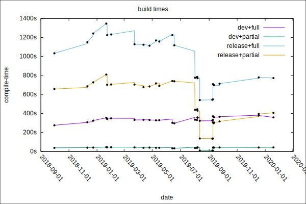

*Rust 编译缓慢的根由在于语言的设计。*

我的意思并非是此乃 Rust 语言的*设计目标*。正如语言设计者们相互争论时经常说的那样，编程语言的设计总是充满了各种权衡。其中最主要的权衡就是：**运行时性能** 和 **编译时性能**。而 Rust 团队几乎总是选择运行时而非编译时。

因此，Rust 编译时间很慢。这有点让人恼火，因为 Rust 在其他方面的表现都非常好，唯独 Rust 编译时间却表现如此糟糕。

## Rust 与 TiKV 的编译时冒险：第1集

在 [PingCAP](https://pingcap.com/)，我们基于 Rust 开发了分布式存储系统 [TiKV](https://github.com/tikv/tikv/) 。然而它的编译速度慢到足以让公司里的许多人不愿使用 Rust。我最近花了一些时间，与 TiKV 团队及其社区中的其他几人一起调研了 TiKV 编译时间缓慢的问题。

通过这一系列博文，我将会讨论在这个过程中的收获：

* 为什么 Rust 编译那么慢，或者说让人感觉那么慢；
* Rust 的发展如何造就了编译时间的缓慢；
* 编译时用例；
* 我们测量过的，以及想要测量但还没有或者不知道如何测量的项目；
* 改善编译时间的一些思路；
* 事实上未能改善编译时间的思路；
* TiKV 编译时间的历史演进
* 有关如何组织 Rust 项目可加速编译的建议；
* 最近和未来，上游将对编译时间的改进；

## PingCAP的阴影：TiKV 编译次数 “余额不足”

在 [PingCAP](https://pingcap.com/en/)，我的同事用Rust写 [TiKV](https://github.com/tikv/tikv/)。它是我们的分布式数据库 [TiDB](https://github.com/pingcap/tidb) 的存储节点。采用这样的架构，是因为他们希望该系统中作为最重要的节点，能被构造的快速且可靠，至少是在一个最大程度的合理范围内。（译注：通常情况下人们认为快和可靠是很难同时做到的，人们只能在设计/构造的时候做出权衡。选择 Rust 是为了尽可能让 TiKV 能够在尽可能合理的情况下去提高它的速度和可靠性。）

这是一个很棒的决定，并且团队内大多数人对此都非常满意。

但是许多人抱怨构建的时间太长。有时，在开发模式下完全重新构建需要花费 15 分钟，而在发布模式则需要 30 分钟。对于大型系统项目的开发者而言，这看上去可能并不那么糟糕。但是它与许多开发者从现代的开发环境中期望得到的速度相比则慢了很多。TiKV 是一个相当巨大的代码库，它拥有 200 万行 Rust 代码。相比之下，Rust 自身包含超过 300 万行 Rust 代码，而 [Servo](https://github.com/servo/servo)  包含 270 万行（请参阅 [此处的完整行数统计](https://gist.github.com/brson/31b6f8c5467b050779ce9aa05d41aa84) ）。

TiDB 中的其他节点是用 Go 编写的，当然，Go 与 Rust 有不同的优点和缺点。PingCAP 的一些 Go 开发人员对不得不等待 Rust 组件的构建而表示不满。因为他们习惯于快速的构建-测试迭代。

在 Go 开发人员忙碌工作的同时，Rust 开发人员却在编译时间休息(喝咖啡、喝茶、抽烟，或者诉苦)。Rust 开发人员有多余的时间来跨越内心的“阴影（译注：据说，TiKV 一天只有 24 次编译机会，用一次少一次）”。

## 概览: TiKV 编译时冒险历程

本系列的第一篇文章只是关于 Rust 在编译时间方面的历史演进。因为在我们深入研究TiKV编译时间的具体技术细节之前，可能需要更多的篇章。所以，这里先放一个漂亮的图表，无需多言。

* TiKV 的 Rust 编译时间

## 造就编译时间缓慢的 Rust 设计

Rust 编译缓慢的根由在于语言的设计。

我的意思并非是此乃 Rust 语言的*设计目标*。正如语言设计者们相互争论时经常说的那样，编程语言的设计总是充满了各种权衡。其中最主要的权衡就是：**运行时性能** 和 **编译时性能**。而 Rust 团队几乎总是选择运行时而非编译时。

刻意的运行时/编译时权衡不是 Rust 编译时间差劲的唯一原因，但这是一个大问题。还有一些语言设计对运行时性能并不是至关重要，但却意外地有损于编译时性能。Rust编译器的实现方式也抑制了编译时性能。

所以，Rust 编译时间的差劲，既是刻意为之的造就，又有出于设计之外的原因。尽管编译器的改善、设计模式和语言的发展可能会缓解这些问题，但这些问题大多无法得到解决。还有一些偶然的编译器架构原因导致了 Rust 的编译时间很慢，这些需要通过大量的工程时间和精力来修复。

如果迅速地编译不是 Rust 的核心设计原则，那么 Rust 的核心设计原则是什么呢？下面列出几个核心设计原则：

* **实用性（Practicality）** — 它应该是一种可以在现实世界中使用的语言。
* **务实（Pragmatism）** — 它应该是符合人性化体验，并且能与现有系统方便集成的语言。
* **内存安全性（Memory-safety）** — 它必须加强内存安全，不允许出现段错误和其他类似的内存访问违规操作。
* **高性能（Performance）** — 它必须拥有能和 C++ 比肩的性能。
* **高并发（Concurrency）** — 它必须为编写并发代码提供现代化的解决方案。

但这并不是说设计者没有为编译速度做**任何**考虑。例如，对于编译 Rust 代码所要做的任何分析，团队都试图确保合理的算法复杂度。然而，Rust 的设计历史也是其一步步陷入糟糕的编译时性能沼泽的历史。

讲故事的时间到了。

## Rust 的自举

我不记得自己是什么时候才开始意识到，Rust 糟糕的编译时间其实是该语言的一个战略问题。在面对未来底层编程语言的竞争时可能会是一个致命的错误。在最初的几年里，我几乎完全是对Rust编译器进行Hacking（非常规暴力测试），我并不太关心编译时间的问题，我也不认为其他大多数同事会太关心该问题。我印象中大部分时间Rust编译时总是很糟糕，但不管怎样，我能处理好。

针对 Rust 编译器工作的时候，我通常都会在计算机上至少保留三份存储库副本，在其他所有的编译器都在构建和测试时，我就会 Hacking 其中的一份。我会开始构建 Workspace 1，切换终端，记住在 Workspace 2 发生了什么，临时做一下修改，然后再开始构建 Workspace 2，切换终端，等等。整个流程比较零碎且经常切换上下文。

这（可能）也是其他 Rust 开发者的日常。我现在对 TiKV 也经常在做类似的 Hacking 测试。

那么，从历史上看，Rust 编译时间有多糟糕呢？这里有一个简单的统计表，可以看到 Rust 的自举（Self-Hosting）时间在过去几年里发生了怎样的变化，也就是使用 Rust 来构建它自己的时间。出于各种原因，Rust 构建自己不能直接与 Rust 构建其他项目相比，但我认为这能说明一些问题。

首个 [Rust 编译器](https://gist.github.com/brson/31b6f8c5467b050779ce9aa05d41aa84/edit) 叫做 rustboot，始于 2010 年，是用OCaml编写的，它最终目的是被用于构建第二个由 Rust 实现的编译器 rustc，并由此开启了 Rust 自举的历程。 除了基于 Rust 编写之外，rustc 还使用了 [LLVM](https://llvm.org/) 作为后端来生成机器代码，来代替之前 rustboot 的手写 x86 代码生成器。

Rust需要自举，那样就可以作为一种“自产自销（Dog-Fooding）”的语言。使用 Rust 编写编译器意味着Rust 的作者们需要在语言设计过程的早期，使用自己的语言来编写实用的软件。在实现自举的过程中让 Rust 变成一种实用的语言。

Rust 第一次自举构建是在 2011 年 4 月 20 日。该过程总共花了[一个小时](https://mail.mozilla.org/pipermail/rust-dev/2011-April/000330.html)，这个编译时间对当时而言，很漫长，甚至还觉得有些可笑。

最初那个超级慢的自举程序慢的有些反常，在于其包含了糟糕的代码生成和其他容易修复的早期错误(可能，我记不清了)。rustc 的性能很快得到了改善，Graydon 很快就[抛弃了旧的 rustboot 编译器](https://github.com/rust-lang/rust/commit/6997adf76342b7a6fe03c4bc370ce5fc5082a869) ，因为没有足够的人力和动力来维护两套实现。

在 2010 年 6 月首次发布的 11 个月之后，Rust 漫长而艰难的编译时代就此开始了。

**注意**

我本想在这里分享一些有历史意义的自举时间，但在经历了数小时，以及试图从2011年开始构建Rust修订版的障碍之后，我终于放弃了，决定在没有它们的情况下发布这篇文章。作为补充，这里作一个类比：

* **兔子飞奔几米（7）** - rustboot 构建 Rust 的时间
* **仓鼠狂奔一公里（49）** - 在 rustboot 退役后使用 rustc 构建 Rust 的时间
* **树獭移动一万米（188）**  - 在 2020 年构建 rustc 所需的时间

反正，几个月前我构建 Rust 的时候，花了五个小时。

Rust 语言开发者们已经适应了 Rust 糟糕的自举时间，并且在 Rust 的关键早期设计阶段未能识别或处理糟糕编译时间问题的严重性。

## （非）良性循环

在Rust项目中，我们喜欢能够增强自身基础的流程。 无论是作为语言还是社区，这都是Rust取得成功的关键之一。

一个明显非常成功的例子就是 [Servo](https://github.com/servo/servo)。 Servo 是一个基于 Rust 构建的 Web 浏览器，并且 Rust 也是为了构建 Servo 而诞生。Rust 和 Servo 是姊妹项目。它们是由同一个（初始）团队，在（大致）同一时间创造的，并同时进化。不只是为了创造 Servo 而创建 Rust，而且 Servo 也是为了解 Rust 的设计而构建的。

这两个项目最初的几年都非常困难，两个项目都是并行发展的。此处非常适合用 [忒修斯之船](https://en.wikipedia.org/wiki/Ship_of_Theseus) 做比喻 —— 我们不断地重建 Rust，以便在 Sevro 的海洋中畅行。毫无疑问，使用 Rust 构建 Servo 的经验，来构建 Rust 语言本身，直接促进了很多好的决定，使得 Rust 成为了实用的语言。

这里有一些关于 Servo-Rust 反馈回路的例子：

* 为了[自动生成HTML解析器](https://github.com/rust-lang/rust/issues/2216)，实现了带标签的 break 和 continue 。 

* [在分析了 Servo 内闭包使用情况之后实现了](https://github.com/rust-lang/rust/issues/2549#issuecomment-19588158) ，所有权闭包（Owned closures）。

* 外部函数调用曾经被认为是安全的。[这部分变化（改为了 Unsafe ）得益于 Servo 的经验](https://github.com/rust-lang/rust/issues/2628#issuecomment-9384243) 

* 从绿色线程迁移到本地线程，也是由构建 Sevro、观察 Servo 中 SpiderMonkey 集成的 FFI 开销以及剖析“hot splits”的经验所决定的，其中绿色线程堆栈需要扩展和收缩。

Rust 和 Servo 的共同发展创造了一个 [良性循环](https://en.wikipedia.org/wiki/Virtuous_circle_and_vicious_circle) ，使这两个项目蓬勃发展。今天，Servo 组件被深度集成到火狐（Firefox）中，确保在火狐存活的时候，Rust 不会死去。

任务完成了。

前面提到的早期自举对 Rust 的设计同样至关重要，使得 Rust 成为构建 Rust 编译器的优秀语言。同样，Rust 和 [WebAssembly](https://webassembly.org/)  是在密切合作下开发的（我与 [Emscripten](https://github.com/emscripten-core/emscripten)  的作者，[Cranelift](https://github.com/CraneStation/cranelift)  的作者并排工作了好几年)，这使得 WASM 成为了一个运行 Rust 的优秀平台，而 Rust 也非常适合 WASM。

遗憾的是，没有这样的增强来缩短 Rust 编译时间。事实可能正好相反 —— Rust越是被认为是一种快速语言，它成为最快的语言就越重要。而且，Rust 的开发人员越习惯于跨多个分支开发他们的 Rust 项目，在构建之间切换上下文，就越不需要考虑编译时间。

直到 2015 年 Rust 1.0 发布并开始得到更广泛的应用后，这种情况才真正有所改变。

多年来，Rust 在糟糕的编译时间[“温水中”被慢慢“亨煮”](https://en.wikipedia.org/wiki/Boiling_frog)，当意识到它已经变得多么糟糕时，已为时已晚。已经 1.0 了。那些（设计）决策早已被锁定了。

这一节包含了太多令人厌倦的隐喻，抱歉了。

## 运行时优先于编译时的早期决策

如果是 Rust 设计导致了糟糕的编译时间，那么这些设计具体又是什么呢? 我会在这里简要地描述一些。本系列的下一集将会更加深入。有些在编译时的影响比其他的更大，但是我断言，所有这些都比其他的设计耗费更多的编译时间。

现在回想起来，我不禁会想，“当然，Rust 必须有这些特性”。确实，如果没有这些特性，Rust将会是另一门完全不同的语言。然而，语言设计是折衷的，这些并不是注定要成 Rust 的部分。

* **借用（Borrowing）** —— Rust 的典型功能。其复杂的指针分析以编译时的花费来换取运行时安全。

* **单态化（Monomorphization）** —— Rust 将每个泛型实例转换为各自的机器代码，从而导致代码膨胀并增加了编译时间。

* **栈展开（Stack unwinding）** —— 不可恢复异常发生后，栈展开向后遍历调用栈并运行清理代码。它需要大量的编译时登记（book-keeping）和代码生成。

* **构建脚本（Build scripts）** —— 构建脚本允许在编译时运行任意代码，并引入它们自己需要编译的依赖项。它们未知的副作用和未知的输入输出限制了工具对它们的假设，例如限制了缓存的可能。

* **宏（Macros）** —— 宏需要多次遍历才能展开，展开得到的隐藏代码量惊人，并对部分解析施加限制。 过程宏与构建脚本类似，具有负面影响。

* **LLVM 后端（LLVM backend）** —— LLVM产生良好的机器代码，但编译相对较慢。

* **过于依赖LLVM优化器（Relying too much on the LLVM optimizer）** —— Rust 以生成大量LLVM IR 并让 LLVM 对其进行优化而闻名。单态化则会加剧这种情况。

* **拆分编译器/软件包管理器（Split compiler/package manager）** —— 尽管对于语言来说，将包管理器与编译器分开是很正常的，但是在 Rust 中，至少这会导致 cargo 和 rustc 同时携带关于整个编译流水线的不完善和冗余的信息。当流水线的更多部分被短路以便提高效率时，则需要在编译器实例之间传输更多的元数据。这主要是通过文件系统进行传输，会产生开销。

* **每个编译单元的代码生成（Per-compilation-unit code-generation）** —— rustc每次编译单包（crate）时都会生成机器码，但是它不需要这样做，因为大多数 Rust 项目都是静态链接的，直到最后一个链接步骤才需要机器码。可以通过完全分离分析和代码生成来提高效率。

* **单线程的编译器（Single-threaded compiler）** —— 理想情况下，整个编译过程都将占用所有CPU。 然而，Rust并非如此。由于原始编译器是单线程的，因此该语言对并行编译不够友好。目前正在努力使编译器并行化，但它可能永远不会使用所有 CPU 核心。

* **trait 一致性（trait coherence）** —— Rust 的 trait（特质）需要遵循“一致性（conherence）”，这使得开发者不可能定义相互冲突的实现。trait 一致性对允许代码驻留的位置施加了限制。这样，很难将 Rust 抽象分解为更小的、易于并行化的编译单元。

* **“亲密”的代码测试（Tests next to code）** —— Rust 鼓励测试代码与功能代码驻留在同一代码库中。 由于 Rust 的编译模型，这需要将该代码编译和链接两次，这份开销非常昂贵，尤其是对于有很多包（crate）的大型项目而言。

## 改善 Rust 编译时间的最新进展

现状并非没有改善的希望。一直有很多工作在努力改善 Rust 的编译时间，但仍有许多途径可以探索。我希望我们能持续看到进步。以下是我最近一两年所知道的一些进展。感谢所有为该问题提供帮助的人。

* Rust 编译时[主要问题](https://github.com/rust-lang/rust/issues/48547) 
	* 跟踪各种工作以缩短编译时间
	* 全面概述了影响 Rust 编译性能的因素和潜在的缓解策略

* 流水线编译 ([1](https://github.com/rust-lang/rust/issues/60988),[2](https://github.com/rust-lang/cargo/issues/6660),[3](https://internals.rust-lang.org/t/evaluating-pipelined-rustc-compilation/10199))
	* 与上游代码生成并行地对下游包进行类型检查。现在默认情况下在稳定（Stable）频道上
	* 由 [@alexcrichton](https://github.com/alexcrichton)  和  [@nikomatsakis](https://github.com/nikomatsakis) 开发

* 并行 rustc ([1](https://internals.rust-lang.org/t/parallelizing-rustc-using-rayon/6606),[2](https://github.com/rust-lang/rust/issues/48685),[3](https://internals.rust-lang.org/t/help-test-parallel-rustc/11503/14))
	* 并行运行编译器的分析阶段。稳定（Stable）频道尚不可用
	* 由 [@Zoxc](https://github.com/Zoxc) ,  [@michaelwoerister](https://github.com/michaelwoerister) ,  [@oli-obk](http://github.com/oli-obk) , 以及其他一些人开发

*  [MIR 级别的常量传播（constant propagation）](https://blog.rust-lang.org/inside-rust/2019/12/02/const-prop-on-by-default.html) 
	* 在 MIR 上执行常量传播，从而减少了 LLVM 对单态函数的重复工作
	* 由 [@wesleywiser](https://github.com/wesleywiser) 开发

*  [MIR 优化](https://github.com/rust-lang/rust/pulls?q=mir-opt) 
	* 优化 MIR 应该比优化单态 LLVM IR 更快
	* 稳定（Stable）编译器尚不可用
	* 由 [@wesleywiser](https://github.com/wesleywiser) 和其他人一起开发

* cargo build -Ztimings ([1](https://internals.rust-lang.org/t/exploring-crate-graph-build-times-with-cargo-build-ztimings/10975),[2](https://github.com/rust-lang/cargo/issues/7405))
	* 收集并图形化有关 Cargo 并行建造时间的信息
	* 由 [@ehuss](https://github.com/ehuss)  和  [@luser](https://github.com/luser) 开发

* rustc -Zself-profile ([1](https://rust-lang.github.io/rustc-guide/profiling.html),[2](https://github.com/rust-lang/rust/issues/58967),[3](https://github.com/rust-lang/rust/pull/51657))
	* 生成有关 rustc 内部性能的详细信息 
	* 由 [@wesleywiser](https://github.com/wesleywiser)  和  [@michaelwoerister](https://github.com/michaelwoerister) 开发

*  [共享单态化（Shared monomorphizations）](https://github.com/rust-lang/rust/issues/47317) 
	* 通过消除多个包（crate）中出现的单态化来减少代码膨胀
	* 如果优化级别小于 3，则默认启用
	* 由[@michaelwoerister](https://github.com/michaelwoerister) 开发

*  [Cranelift 后端](https://www.reddit.com/r/rust/comments/enxgwh/cranelift_backend_for_rust/) 
	* 通过使用 [cranelift](https://github.com/bytecodealliance/cranelift) 来生成代码，减少了 Debug 模式的编译时间。
	* 由 [@bjorn3](https://github.com/bjorn3) 开发

*  [perf.rust-lang.org](https://perf.rust-lang.org/) 
	* 详细跟踪了 Rust 的编译时性能，基准测试持续增加中
	* 由 [@nrc](https://github.com/nrc) ,  [@Mark-Simulacrum](https://github.com/Mark-Simulacrum) ,  [@nnethercote](https://github.com/nnethercote) 以及其他人一起开发

*  [cargo-bloat](https://github.com/RazrFalcon/cargo-bloat) 
	* 查找二进制文件中占用最多空间的地方。膨胀（Bloat）会影响编译时间
	* 由 [@RazrFalcon](https://github.com/RazrFalcon) 和其他人一起开发

*  [cargo-feature-analyst](https://github.com/psinghal20/cargo-feature-analyst) 
	* 发现未使用的特性（features）
	* 由 [@psinghal20](https://github.com/psinghal20) 开发

*  [cargo-udeps](https://github.com/est31/cargo-udeps) 
	* 发现未使用的包 （crate）
	* 由 [@est31](https://github.com/est31) 开发

*  [twiggy](https://github.com/rustwasm/twiggy) 
	* 分析代码大小，该大小与编译时间相关
	* 由 [@fitzgen](https://github.com/fitzgen) ,  [@data-pup](https://github.com/data-pup) 以及其他人一起开发

*  [rust-analyzer](https://github.com/rust-analyzer/rust-analyzer) 
	* 用于Rust的新语言服务器，其响应时间比原始  [RLS](https://github.com/rust-lang/rls) 更快
	* 由 [@matklad](https://github.com/matklad) ,  [@flodiebold](https://github.com/flodiebold) ,  [@kjeremy](https://github.com/kjeremy) 以及其他人一起开发

*  [“如何缓解 Rust 编译时间带来的痛苦”](https://vfoley.xyz/rust-compile-speed-tips/)
	* vfoley 写的博文

*  [“关于 Rust 代码膨胀的思考”](https://raphlinus.github.io/rust/2019/08/21/rust-bloat.html) 
	* [@raphlinus](https://github.com/raphlinus) 写的博文

* Nicholas Nethercote 对 rustc 的优化工作
	*  [“2019 年 Rust 编译器如何提速”](https://blog.mozilla.org/nnethercote/2019/07/17/how-to-speed-up-the-rust-compiler-in-2019/) 
	*  [“Rust 编译器的速度持续变快”](https://blog.mozilla.org/nnethercote/2019/07/25/the-rust-compiler-is-still-getting-faster/) 
	*  [“可视化 Rust 编译”](https://blog.mozilla.org/nnethercote/2019/10/10/visualizing-rust-compilation/) 
	*  [“如何在 2019 年进一步提升 Rust 编译器的速度”](https://blog.mozilla.org/nnethercote/2019/10/11/how-to-speed-up-the-rust-compiler-some-more-in-2019/)
	*  [“如何在 2019 年最后一次提升 Rust 编译器”](https://blog.mozilla.org/nnethercote/2019/12/11/how-to-speed-up-the-rust-compiler-one-last-time-in-2019/) 

对于未上榜的人员或项目，我需要说一声抱歉。

## 下集预告

所以多年来，Rust 把自己深深地逼进了一个死角，而且很可能会持续逼进，直到玩完。Rust 的编译时能否从 Rust 自身的运行时成功中得到拯救？TiKV 的构建速度能否让我的管理者满意吗？

在下一集中，我们将深入讨论 Rust 语言设计的细节，这些细节会导致它编译缓慢。

继续享受 Rust 吧，朋友们！

## 鸣谢

很多人参与了本系列博客。特别感谢 Niko Matsakis、Graydon Hoare 和 Ted Mielczarek 的真知卓见，以及 Calvin Weng 的校对和编辑。

## 关于作者

 [Brian Anderson](https://github.com/brson) 是 Rust 编程语言及其姊妹项目 Servo Web 浏览器的共同创始人之一。 他现在在 PingCAP 担任高级数据库工程师。
