> 作者介绍：黄潇 ， TUG 北京区 Leader ，TUG 2020 年度 MOA。

如今分布式数据库百花齐放，在做数据库架构选型时应该从哪些方面进行考虑？在 TUG 陆金所企业行活动上， TUG 北京区 Leader 黄潇分享了 TiDB 的常见架构应用场景，以下内容整理自当天活动分享实录。

本文主要分为以下三部分：

1. 当今分布式数据库产品呈现百花⻬放的状态

2. 在这种场景下数据库架构选型的一些思考

3. TiDB 常⻅应⽤场景

## 分布式数据库产品百花⻬放

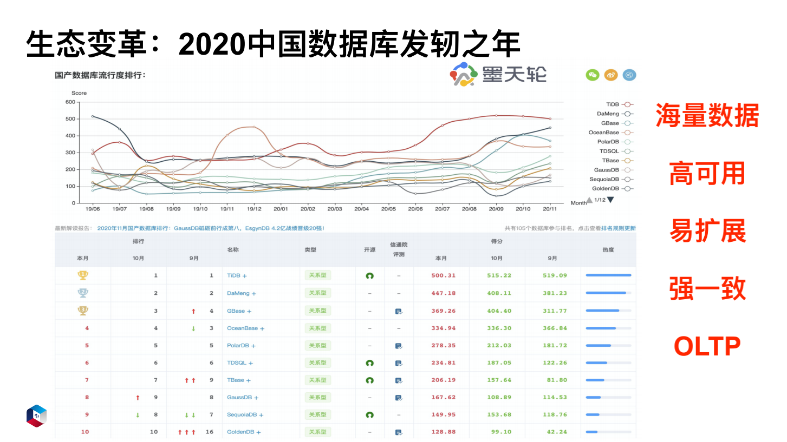

从墨天轮发布的国产数据库流行度排行榜中可以看到，TiDB 排在首位。第二位到第五位分别是老牌的国产数据库 DM，GBase，OceanBase，PolarDB。从上图的曲线趋势可以看出，国产数据库目前处在一个蓬勃发展的时期。对于分布式数据库来说，目前我们最为关注的有以下五点：

- 可以处理海量数据；
    
- 数据库高可用；
    
- 易扩展，像以前的拆库拆表、应用改造，成本很高，合并起来也非常麻烦；
    
- 强一致；
    
- OLTP。

## 数据库架构选型的思考

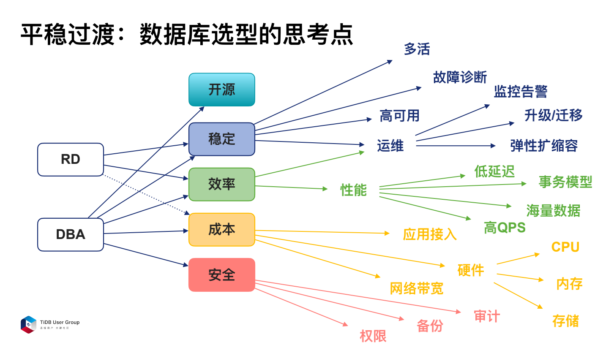

对于一个线上高并发的服务来说，要考虑以下几点：

- **稳定**。对于任何一个线上服务来说，可以容忍交易稍微慢一点，但一定不可能容忍频繁宕机。稳定是第一要务，脱离了稳定，效率没有任何意义。
    
- **效率**。在系统非常稳定的情况下，速度越快，就意味着用户体验越好。比如外卖下单，秒接单的用户感受一定很好。如果30分之后才接单，用户会想到底是系统出了问题还是外卖小哥偷懒。
    
- **成本**。当稳定有了，效率也有了，就要思考花的成本值不值？因为成本降下来才能赚到收益。
    
- **安全**。安全是一个大家都绕不开的问题。但凡做交易，大家都担心自己的数据被泄露。

所以在数据库上面，我们最关注的就是保稳定、提效率、降成本、保安全。除了这四项之外，还有就是开源。在做技术选型时，我希望这个数据库是开源的，因为当我遇到一些问题，是有社区支持的。另外当我想为产品做一些贡献时，是可以和社区一起迭代的。在**稳定方面**，我们会考虑这几方面：

- 这个数据库能不能做多活，能否有一些附加诊断以及高可用能力？
    
- 运维时，做监控告警是否容易？
    
- 是不是平滑滚动的升级？对业务有没有影响？
    
- 做数据迁移的时候，有没有问题？
    
- 数据校验好不好做？
    
- 运维上弹性扩缩容的效率如何？

**性能方面**，我们最关注四点：

- 第一，**低延迟**。
    
- 第二，**事务模型是不是我们平常使用的**。大家都知道 MySQL 是一个悲观事务模型，我希望的是迁移到新型的数据库上，还能保持原来的使用习惯。
    
- 第三，**高 QPS**。就是说这个数据库能否支持高的访问量。比如做一个活动，今晚流量涨了三倍，这种情况数据库能不能抗得住？抗不住会有什么样的场景？是完全挂掉还是服务端有自动的性能保护机制。
    
- 第四，**能支撑海量数据**。如果不能支撑海量数据，意味着需要提前跟业务沟通基础设计，确定能否先分库分表以及相应的分片数量。

**成本方面**，主要考虑三个方面：

- 第一，**应用接入成本**，指接入数据库容易不容易，是否需要提前沟通跟培训。
    
- 第二，**硬件成本，就是 CPU + 内存 + 磁盘**。像有一款分布式数据库，它是一个 Scale up 类型的数据库，它要求的内存是 384 G，但并不是所有的互联网公司都能负担这种高配机型的成本。众所周知，在一般的机型上大概要花费四万多成本，像互联网行业常用的机器，大概 128G 内存，30 核 CPU 或 40核 CPU，带一张 3.2T 的 PCIE 卡。但如果采用高密度机型，其价格会呈指数级上涨。所以在这种场景下，所选型的数据库会导致非常高的硬件成本。
    
- 第三，**网络带宽**。

**安全方面**，有三点需要考虑：

- 第一，**数据库是否有审计功能**。拿金融行业数据库举例，用户肯定希望能审计出来谁访问了这些数据，以及对这些数据做了什么操作。
    
- 第二，**数据是可恢复的**，不管用户做了什么异常操作，最后的数据都可以通过备份找回。
    
- 第三，**数据库的权限**。我们要考虑的是权限的力度会有多细，因为一些特殊场景下我们希望数据库的呈现精细到表级别，甚至字段级别。比如个人信息里的身份证信息、手机号，还有密码帐号，这些涉及个人隐私的信息是不希望展示给 DBA 或其他 RD 的。

## TiDB 常用应用场景

#### 业务规模和体量

目前我司的 TiDB 的业务规模大概有 1700 多个节点，集群数百个。单集群最大的节点数大概是 40 多个，单表有最大上千亿条记录。目前处于小规模接入状态，还在探索更加丰富的业务场景。访问量方面，每日访问量达百亿以上。单集群的 QPS 峰值大概是 10 万以上。

在什么样的场景下，我们会选择 TiDB 数据库？

### 弹性伸缩场景

选择分布式数据库是因为它是弹性伸缩的。我希望它能弹出去，也能收回来，不希望不停的去拆合。用过 MySQL 的同学都知道，当流量上来我们要拆库拆表，一拆二，二拆四，四拆八，越拆这个数量越可怕，成本指数级增长。但流量并不一定是指数级增长。产品流量上涨了你拆吗？拆的成本受不了，不拆外卖小哥就该抱怨以前发单 5 秒内就能接单，现在 10 秒 20 秒都看不到。除此之外，还会面临友商的竞争。所以这种场景下业界主要解决方案就是存储和计算分离。那这时候其实是因为我们计算资源不足了，而非存储资源不足。存储我只希望以 1.5 倍的比例去扩展，但是计算我希望以四倍的比例去扩展。这样两个其实不那么 match。在不 match 的情况下，把存储计算分给架构来解决这个事情。所以选择 TiDB 很大一个原因就是因为它是计算存储分离的架构。

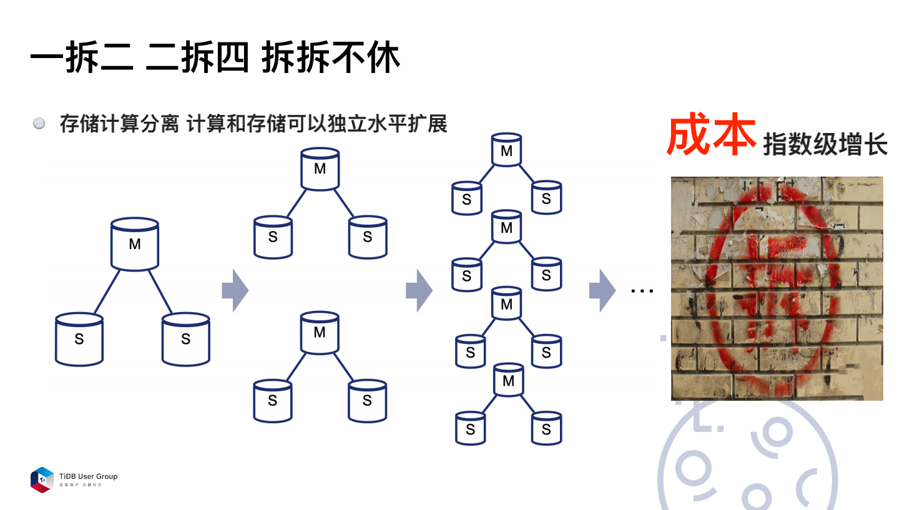

互联网高速发展的时代，经常会有黑天鹅的事件出现。但是出现黑天鹅之后，流量在短期内处在爆发式增长的状态。但流量爆发式增长并不代表你的 DBA 人数爆发增长，也不代表你的机制是爆发式增长，这种情况下，DBA 投入再多人力，也来不及拆。另外从下单订购这个机器，机器到机房压测没问题，真正上线，到你能用的时候，可能至少一个月过去了。所以，我们遇到的一大痛点就是在**业务爆发式增长的情况下，我们来不及拆**。

在活动大促期间，会出现一个非常陡峭的流量高峰。而活动之后，这个高峰会立刻下去。针对这种情况，DBA 需要在大促前配合业务方进行全链路的流量压测，该拆的拆，该扩容的扩容。如果拆出去的，需要一拆二，或者是一拆四，一拆八。拆出去那些库，最后还需要通过 DTS 把数据导回来。导回来需要考虑数据是否一致，无论业务方还是 DBA 都非常痛苦。

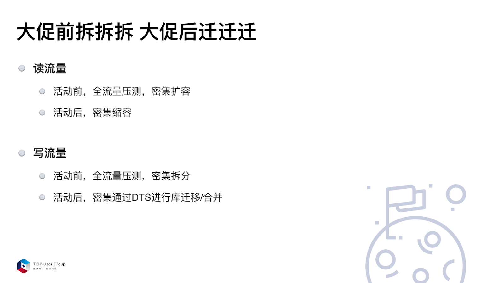

所以，从以上三个场景来说，**我们遇到的最大的痛点是存储计算没有分离**。

我们选型 TiDB 的一个原因是它的存储分离的计算架构。在存储方面，TiDB 内存主要是负责 SQL 解析以及 SQL 引擎的执行。PD 主要提供元数据信息以及分布式数据库的时间戳功能。TiKV 提供的是无限扩展的分布式存储功能。

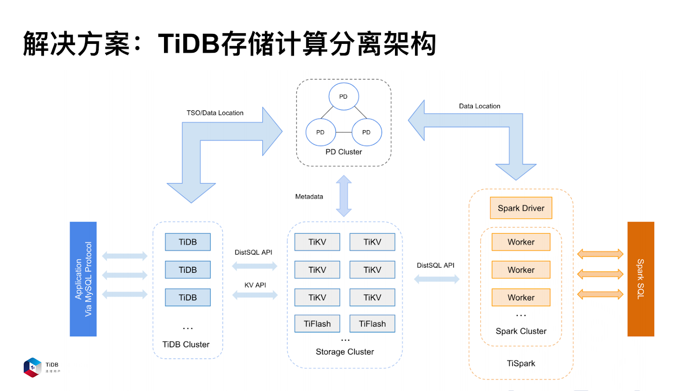

在这种场景下，存储是 TiKV 的一个集群，计算是 TiDB 的一个集群，它们互不关联，它们之间可以独立的扩容或者缩容，完全不影响其他的组件。这非常完美的解决了我们的诉求。所以，我们选择了 TiDB。

### 金融级强一致场景

除了弹性伸缩的场景，我们用 TiDB 还会考虑到金融级强一致场景。下面我来解释一下为什么要引进这个场景。

先看一下在 MySQL 上遇到的一个问题。MySQL 5.6 的时候是半同步，MySQL 5.7 的时候是增强型半同步，也叫做 Loss-Less，指更少丢失数据的半同步。在 COMMIT 成功之前，先把事务的 Binlog 日志传输到某一个从库，这个从库返回给我 ACK 之后，才去改主库上的 Innodb 引擎。

但这样会带来风险，相当于这个时候还没有告诉业务方 COMMIT 操作成功了。但是 Binlog 其实已经发送给了从库。这个时候如果主库 Crash 掉，从库却已经提交了，这就有风险了。

Loss-Less 半同步复制也没有解决掉数据一致性的问题。

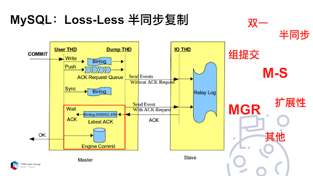

当把半同步的超时时间调成无限长，也并非一个强一致的场景。

虽然可以把超时时间调到无限长。在这个时候，如果主从之间网络断了，任何从库都收不到 ACK。MySQL 后来引用了 MGR 来解决这个问题。**虽然 MGR 解决了数据的强一致，但是并没有解决数据的扩展性**。一个 MGR 最多只能接受九个节点，而且不管 5.7 还是 8.0 版本的 MGR 对网络抖动都是非常敏感的，秒级网络抖动会导致写节点切换。MGR 多写模式在社区里面发现了太多的 BUG，所以目前大家使用 MGR，都是使用单写模式，避免事务冲突，避免触发更多的问题。

MySQL 的半同步是没有解决一致性问题的。而 TiDB 是通过 Multi-Raft 协议来解决这个问题。

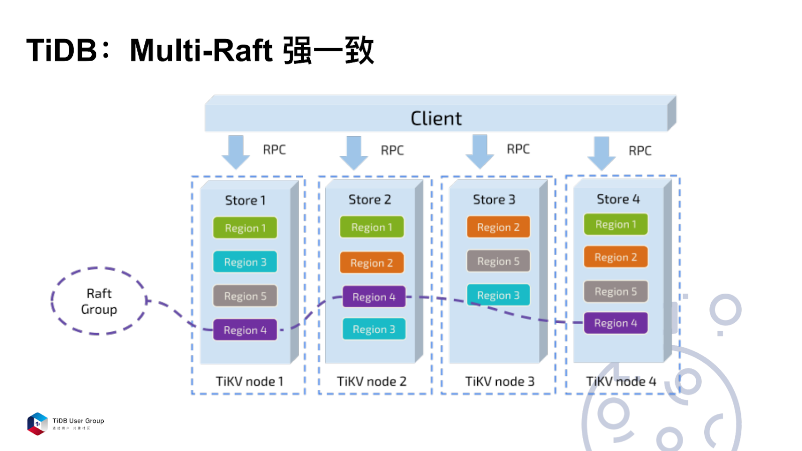

在 TiKV 这一层，把数据分成不同的 Region，每一组 Region 有多个副本，然后组成了一个 Raft Group。Raft Group 里面会有一个 Leader，负责读取和写入。这样就保证当这一组 Region 的 Leader 挂了的时候，那么剩下的节点会重新选取出一个 Leader 来，负责读取和写入。通过这种方式保证写到 Raft Group 里面的数据，一定不会丢失。至少单个节点挂了的话，故障是不会丢失的。

下面看一下需要分布式事务的典型金融场景。

#### 跨库事务场景

金融体系除了强一致，还要求事务。MySQL 半同步的超时时间无限长是不行的。

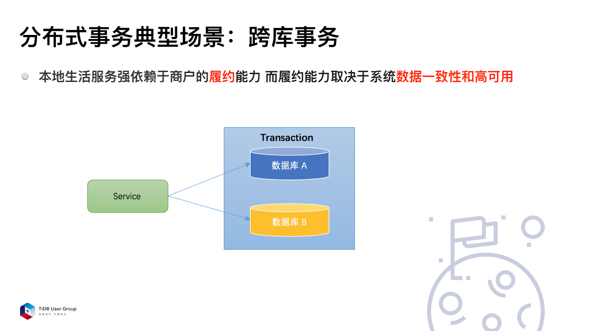

本地生活服务的公司强依赖于商户的履约能力，但商户的履约能力取决于系统的数据一致性和高可用。以外卖订单举例，订单在分别记录到用户端与商家端，这就涉及到了跨库业务，这个时候单纯依赖 MySQL 的数据一致性是搞不定的。

#### 分库分表场景

分布式数据库的一个典型场景就是分库分表。

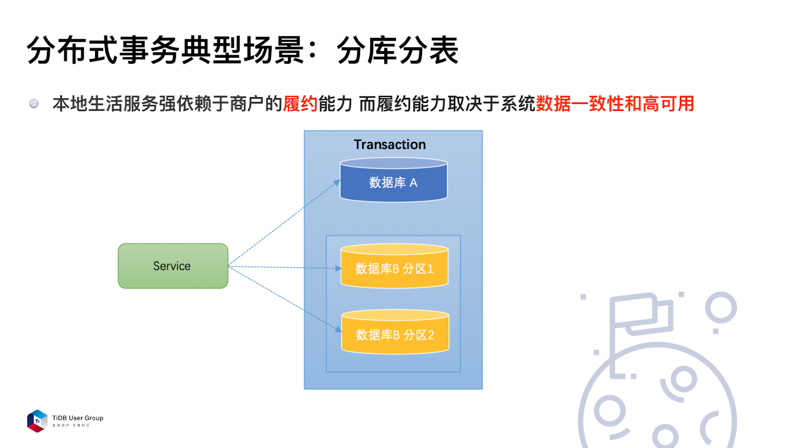

比如用户维度下的转帐场景，在用户 A 的账户上减了一百元，在用户 B 的账户上加了一百元，他们可能在不同的数据分片上。这个事务肯定不希望一笔提交成功而另外一笔不成功。所以这个时候在分库分表的场景下，要保持分布式事务的一致性。

#### 服务化 SOA 场景

分布式事务典型的场景是服务化 SOA。

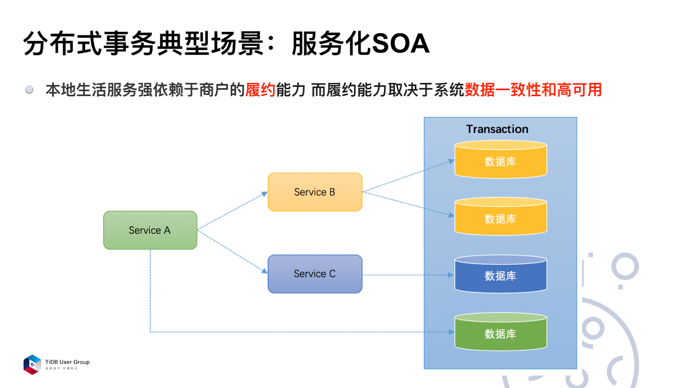

如上图所示，在微服务化的过程中，黄色、蓝色和绿色这三个数据库我们希望整体保持一致性。那么，在这种场景下应该如何保证事务整体的一致性？

在没有分布式数据库以前，订单类业务是可以写多笔的，当用户端 MySQL 集群挂了的时候，商家端的 MySQL 集群未必同时挂掉，这个时候通过校验服务可以发现商家端存在这笔订单，但是用户端没有这笔订单，那这时可以通过旁路补单的方式来把数据补回来。**但这样的方式非常依赖于业务场景，而且非常复杂**。下图是补单的逻辑，首先是轮询集群状态，判断是否宕机。

如果是，则判断是商家端还是用户端。如果是商家端的，就检查用户端，把用户端的数据拉过来补，如果发现是商家端的掉了，那么就在用户端查 Binlog，看能否把 Binlog 拉回来，推动 BCP （Business Check Platform），它相当于是商业上的一个事务校验机制。把 Binlog 解析并补偿到另一个维度，这也是一种补单逻辑。

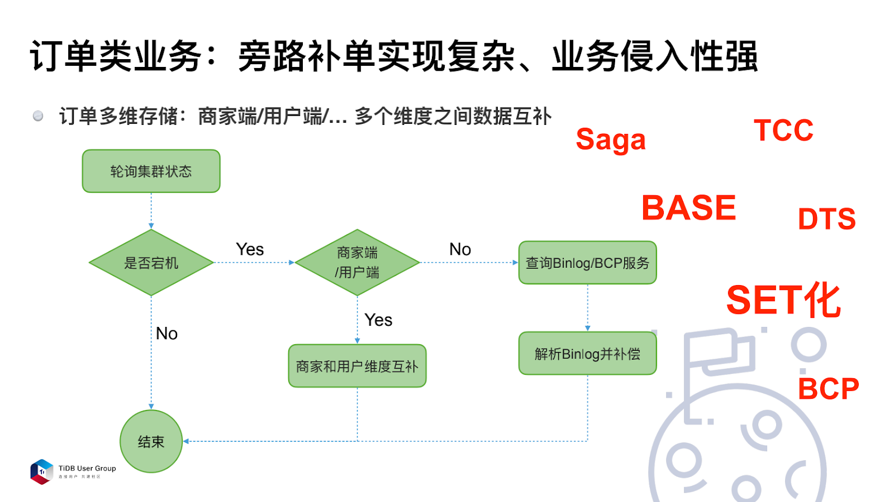

业界现在推崇的一个概念叫做 BASE 的柔性事务。BA 代表业务的基本可用性，S 代表是柔性事务，相当于单性事务，E 代表的是最终的一致性。在 BASE 场景上，业界基本采用两种方式。一个是 TCC，即 Try / Confirm / Cancel 。这里面有多个参与方，都去试一下，可以做就提交，不可以做就 Cancel 掉。另外当一个事务持续时期很长的话，可能用 Saga 模式去做这个事情。这是业界的一些常规方案，但是我们发现订单业务单纯依赖这种补单的逻辑，实现的效果并不好。

比如说在这种场景下，北京的一个机房宕了该怎么办？上海的一个机房网络不好该怎么办？所以这个时候就需要在整个配送链路上做 SET 化。SET 化是指从流量入口就把流量按用户维度进行分配，例如 A、B、C 三个用户全部分到第一个 SET 里面，D、E、F 三个用户分到第二个 SET 里面去。两个 SET 之间通过 DTS 进行双向的数据同步，当一个SET 出问题，会有短暂时间不可用，这时可以把全部的流量迁到第二个 SET 上。这样就能保证另外一个 SET 也可以继续下单，服务是可用的。但是 SET 化是一个比较伤筋动骨的解决方案，因为要从流量入口、当前的业务，数据库进行完整的改造。

在这种情况下，并不是所有的业务都愿意做这个改造，因为这是一件很痛苦的事情。除了订单类的业务，实际上还有一种业务叫做帐户类型的业务。订单类的业务是说下了订单，多个维度都写入记录。但对于帐户类型的业务来说，对于金融层的业务是有强制诉求的。而且对金融来说，有异地多活和异地容灾的强诉求。

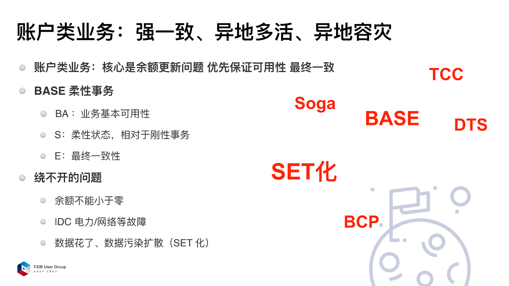

这里面有绕不开的三个问题：

1. 余额不能小于零，一定要是一个刚性事务，数据一致。

2. 遇到 IDC 电力 或者是网络故障，整个机房宕了，该怎么办？

3. 用 SET 化解决订单的业务的时候，单个机房可以用 SET 化来解决，但如果是帐户类业务则解决起来相对困难，在 SET 化双向复制场景下，写坏的数据已经扩散到多个集群。这时想要找回数据是非常困难的。

以上就是我们在交易型事务上会遇到的两个痛点。首先是订单类的业务，通过补单的方式效果欠佳，而且业务方不一定愿意去配合做整套修改。其次帐户类型的业务在对数据有强一致性诉求的情况下，不能通过补单，而且数据写坏的情况下我们该如何去做。这就是我们对金融级强一致的数据的强烈诉求。

**解决方案：Percolator 分布式事务模型**

所以，基于上述场景诉求，我们选择了 Percolator 分布式事务模型。

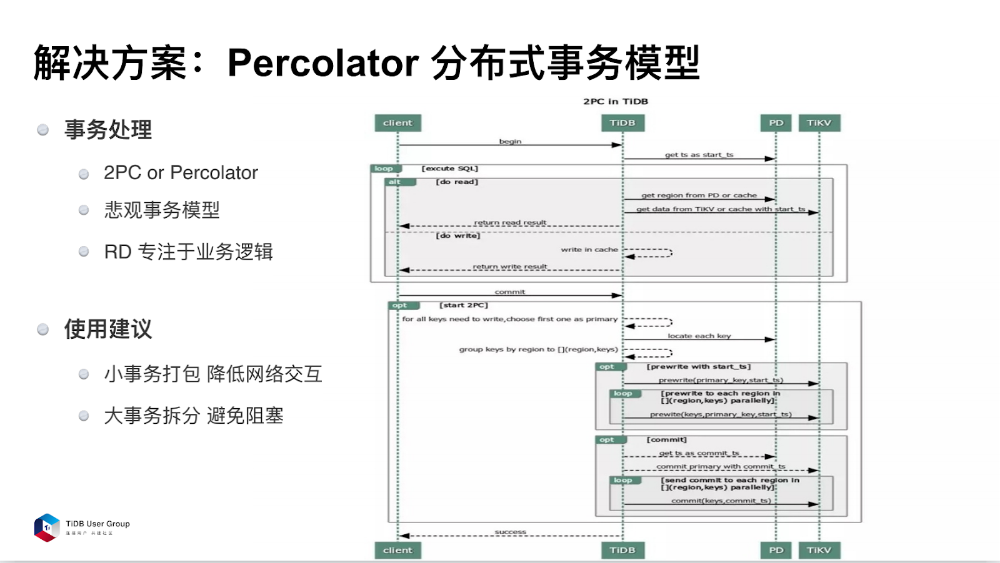

在金融级的产品数据库上，建议选择悲观模式，因为这和原来的 MySQL 是保持一致的，对业务方的改动量比较少，更容易做兼容。另外，把 RD 从烦琐的补单逻辑、拆分逻辑里面解脱出来，这样他们就可以专注自身的业务，也节省了成本。在使用 TiDB 分布式事务时，有两点建议：

- 第一，小事务打包。TiDB 是分布式事务，要进行非常多的网络交互，如果把小事务拆分成一条条去执行，多次网络交互会导致网络延迟会非常长，对性能影响非常大。
    
- 第二，大事物要做拆分。事务模型如果特别大，更新时间就会很长。因为比较大的事务更新的 Key 比较多，期间发起的读取要等待事务的提交。这样对读取的响应延迟有比较严重的影响，所以建议大家把大事务进行拆分。

### 数据中台场景

我们遇到的第三个场景对数据中台的场景，也就是对于海量数据，其数据的场景开始慢慢的模糊化、复杂化。

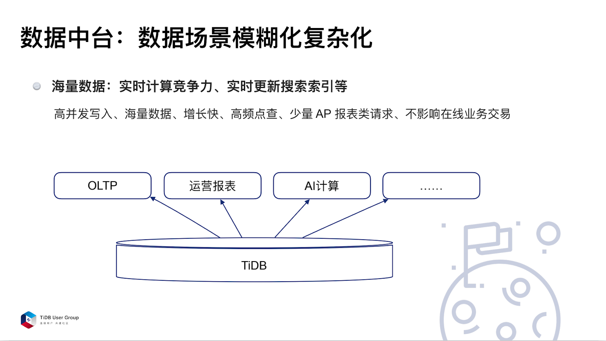

这里的模糊化、复杂化是指有些之前偏 AP，或偏数据分析的一些请求，现在希望能够拿到实时的数据，放在 TiDB 上来实现。

以我们实际应用的场景为例，当我们要计算酒店房间价格是否有竞争力时，会抓取大量数据进行计算。要求实时数据，并且计算时也不能影响线上房间的价格。如果不拆分出去，而在同一个库上就会导致实时计算能力不停的拉线上 OLTP 的数据，就会造成一定的响应延迟。

这种场景下，通过 Binlog 同步，把数据拉到 TiDB 里面，在这个集群上我们进行大量计算、高频点查的操作。对于比较大的数据量来说，写入量也是非常高的，TiDB 底层的存储 RockDB 采用 LSM-Tree 模型，对写入来说是友好的一个数据结构。所以这种场景 TiDB 写入可以满足我们的需求。

在这样的集群上面也会有少量的报表类请求。第一个就是实时计算的场景。第二个在构建搜索引擎时也是采用这样的方案来实现。

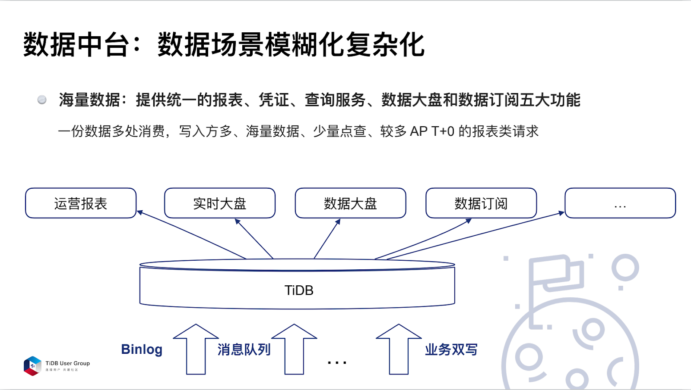

我们在金融上有一些付款、收单等凭证相关的消费的数据，我们希望这些数据能够从各个系统里抽取出来，汇总在一起形成数据大盘。这份数据形成后，可以多次使用。比如去做一个运营报表、实时大盘、数据大盘，或者作为一个数据订阅方去使用。数据同步需要介入的系统是非常多的，通过 Binlog 、消息队列或者业务双写这种方式进行同步都可以。

### 其他场景

以下是我们使用 TiDB 的时候可能还会考虑的一些其他场景。

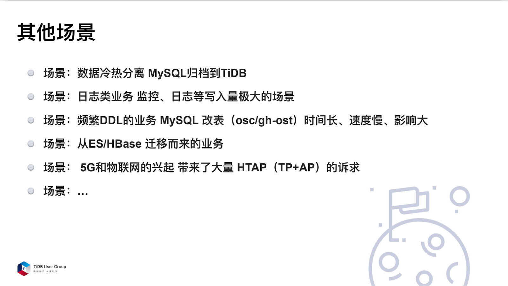

第一，数据冷热分离。我们的线上数据量随着公司的运营历史数据增加会非常多，我们会把一部分历史数据导到 TiDB 集群里面去，这样也能适当降低成本。

第二，公司内部的日志类和业务监控的数据。这种是因为 TiDB 是底层的 LSM-Tree 数据模式，对写入非常友好，基本上可以无限扩容。所以拿这个日志去做分析是比较合适的。

第三， MySQL 改表存在非常多的限制条件。这种场景下，为了保证数据不延迟，同时能够控制在线改表过程中遇到业务高峰期，或者主从延迟时可以暂停改表操作，目前线上大部分还是使用 pt-osc 或者是 gh-ost 进行改表。但分表过多耗时会非常长。或者让业务方接受在高峰时间段改表，降低写入能力，要不就是想其他办法解决这个问题。所以 TiDB 秒级的 DDL 解决了我们非常大的痛点。

第四，是一个比较特殊的场景，即从 ES 或者 HBase 迁移过来的业务。从 HBase 迁移的主要问题是 HBase 不支持二级索引，而从 ES 迁移过来的业务是由于 ES 可用性欠佳，于是就迁到了 TiDB 。

第五，是今年比较火的一个场景，随着 5G、物联网的兴起，数据量爆炸式增长，我们会遇到非常多 TP 和 AP 类结合的诉求。这种场景下，我们其实在一个系统里面同时实现 TP 和 AP 类的 T+0 分析需求。比如在做大促活动时会针对优惠券的发放计算活动效果，这其中有非常多的大数据 T+0 分析诉求，仅仅依赖 T+1 报表是很难实现的，但是如果有 HATP，就能在线上传数据，提供给市场进行判断，降低了试错成本以及营销成本。

以上就是 TiDB 的常见架构应用场景，希望能对大家有所帮助。