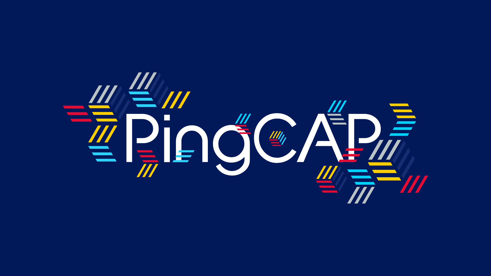

**企业级开源分布式数据库厂商 PingCAP 日前宣布完成 2.7 亿美元的 D 轮融资，创造全球数据库历史新的里程碑**。本轮融资由纪源资本（GGV Capital）、Access Technology Ventures、晨曦投资 （Anatole Investment）、时代资本（Jeneration Capital）、五源资本（5Y Capital 原晨兴资本）共同领投，贝塔斯曼亚洲投资基金（BAI）、Coatue、天际资本（FutureX Capital）、昆仑资本（Kunlun）、挚信资本（Trustbridge Partners）及老股东经纬中国（Matrix Partners China）、云启资本（Yunqi Partners）跟投，瑞银担任本轮融资的独家财务顾问。

本轮融资将用于分布式数据库关键核心技术的研发，聚焦解决方案和专业服务支持体系的不断完善，持续加大开源社区生态体系建设，进一步推进云数据库服务在全球市场的覆盖，持续领跑全球新一代分布式数据库赛道。

PingCAP 成立于 2015 年，是一家企业级开源分布式数据库厂商，提供包括开源分布式数据库产品、解决方案与咨询、技术支持与培训认证服务，致力于为全球行业用户提供稳定高效、安全可靠、开放兼容的新型数据基础设施，解放企业生产力，加速企业数字化转型升级。

由 PingCAP 创立的分布式关系型数据库 TiDB，为企业关键业务打造，具备「分布式强一致性事务、在线弹性水平扩展、故障自恢复的高可用、跨数据中心多活」等企业级核心特性，帮助企业最大化发挥数据价值，充分释放企业增长空间。

## 打造新一代云原生分布式数据库

HTAP （Hybrid transaction/analytical processing） 是近年数据库界重点关注的研究方向。这种架构打破了在线交易业务与分析业务之间的壁垒，在全面支持关键在线交易业务的同时，让业务数据得以被实时分析和处理，极大提升业务决策和平台构建效率，形成业务全链路闭环，从而成为未来企业的核心竞争力之一。

2020 年 5 月， TiDB 推出 4.0 版本，作为 TiDB「新一代云原生分布式数据库」道路上的重要里程碑，TiDB 4.0 在提供良好的交易处理能力前提下，创新性地引入了基于 Raft 算法的 HTAP 架构解决方案。这套架构设计成功地解决了以往困扰 HTAP 架构的隔离性，一致性和性能之间的矛盾，以此为基础的论文《TiDB: A Raft-based HTAP Database》被国际顶级数据库会议 VLDB 2020 收录，标志着该架构得到了全球学术界的认可。

云原生技术的普及加速了企业数字化转型，极大的降低上云的成本。基础设施借助于云的能力，变得更加弹性、无限扩展、可用性更强，按需付费更加节省成本。根据 Gartner 预测，到 2022 年将有 75% 的数据库将被部署或迁移到云上。

TiDB 作为开源分布式数据库，弹性伸缩的架构天然具备云原生的特性，通过与 Kubernetes 无缝对接，TiDB 可以轻松部署在任何公有云、私有云和混合云之上，极大降低用户的总体拥有成本（TCO），提升资源利用率。2020 年 6 月，PingCAP 发布了 TiDB Cloud 产品，依托于公有云提供开箱即用的 TiDB 云数据库托管服务。借助于云，TiDB Cloud 可以通过水平扩展，拥有近乎无限的存储容量和计算能力，使用户可以专注在自身业务的快速增长。

## 助力行业数字化转型

大数据时代，信息数据爆炸性增长，几乎所有的企业数据都呈现指数级暴涨，数据库作为基础软件领域的重要基石，是企业全面数字化转型的关键引擎。PingCAP 成立五年多来，TiDB 作为通用分布式数据库，已被全球超过 1500 家企业用于线上生产环境，包括中国银行、光大银行、浦发银行、浙商银行、北京银行、微众银行、亿联银行、百信银行、中国银联、中国人寿、平安人寿、平安财险、国泰君安、华泰证券、陆金所、马上消费、拉卡拉、中国移动、中国联通、中国电信、新华财经、人民在线、吉林祥云、中体骏彩、国家电网、新奥燃气、北大人民医院、北京友谊医院、格力电器、理想汽车、小鹏汽车、VIVO、OPPO、麦当劳、百胜中国、中国邮政、顺丰速运、中通快递、腾讯、美团、京东、拼多多、小米、新浪微博、58同城、360、知乎、爱奇艺、哔哩哔哩、喜马拉雅、新东方、伴鱼、小红书、汽车之家、网易游戏、盖娅互娱、游族网络、Square（美国）、PayPay（日本）、Dailymotion（法国）、Shopee（新加坡）、ZaloPay（越南）、BookMyShow（印度）等，涉及金融、电信、政府、能源、公共事业、高端制造、高科技、新零售、物流、互联网、游戏等多个行业。

以金融行业为例，TiDB 已成功在多家头部金融机构成功上线并长期稳定运行，支撑了包括核心总账交易、支付结算、在线贷款、零售理财、风控反欺诈、互联网金融、管理驾驶舱等诸多关键业务系统，全面满足金融行业对数据库稳定性、安全性和性能的高标准要求，成为金融机构数字化转型中 “稳态+敏态” 双轮驱动发展的关键赋能平台。

## 开源文化构建国际化生态体系

PingCAP 从成立之初就以开源为长期核心战略，并坚定地认为开源是基础软件在全球范围取得成功的最优道路。截止到 2020 年 10 月，TiDB 项目在 GitHub 上已总计获得超过 25000 颗星，近 1200 位开源代码贡献者，参与企业包括美团、知乎、伴鱼、丰巢、小米、微众银行、UCloud、Zoom、Samsung、Square、PayPay 等行业领军企业，TiDB 已成为全球基础软件领域的知名开源项目。高度活跃的开源社区为 TiDB 产品发展带来了正向反馈闭环，TiDB 的研发能力、工程质量、迭代速度都已处于世界一流水平，成为 PingCAP 最核心的、具有加速度的竞争力和护城河。

PingCAP 一贯坚持开源精神，积极回馈开源社区，力争成为全球技术标准的引领者。2020 年 9 月，由 PingCAP 创立的分布式存储引擎 TiKV 正式从云原生基金会（CNCF）毕业；2020 年 7 月，由 PingCAP 创立的混沌工程测试平台 Chaos Mesh® 正式成为 CNCF 托管项目；CNCF 2019 年年度报告提到，PingCAP 在 2019 年 CNCF 全球代码贡献排行榜中名列第六。PingCAP 已成为全球知名的开源软件厂商。

PingCAP 以开源社区为依托，积极打造全球产业生态。PingCAP 已与复星、长亮科技、神州信息、文思海辉、中科软、汉得信息、迪思杰、爱可生、知乎、伴鱼、RedHat、Databricks、Datadog、Confluent 等行业领军企业建立了合作伙伴关系，涵盖产品研发、解决方案、技术服务、上下游生态、云服务等多个领域。广泛而高效的生态协同，使 TiDB 可以与合作伙伴一起持续创新，为用户创造更多的业务价值。

PingCAP 创始人、CEO 刘奇表示：“我相信开放的社区生态与最具挑战的业务场景才能够催生出更好的产品。在过去五年，PingCAP 的产品历经了来自全球多个行业，不同业务场景的打磨，得到了全球用户的认可。未来 PingCAP 将继续夯实产品、完善生态合作，助力企业及开发者简化开发，加速迭代，专注于创新、创造，为全球企业的数字化转型贡献自己的力量。“

GGV 纪源资本管理合伙人符绩勋表示：“开源基础软件是个巨大的市场，也是 GGV 重点投资的领域。PingCAP 的新一代分布式数据库，引领了全球的技术发展，受到了全球顶尖的大型企业客户的认可。我们相信在创始团队的带领下，PingCAP 能发展成为世界一流的技术公司。”

五源资本创始合伙人刘芹表示：“这一轮融资，PingCAP 吸引到了全球最顶尖投资人的支持,  无论从投资规模还是投资人阵容上看，都是数据库及全球开源领域新的标杆和里程碑。公司在疫情期间，加速完成了全球化业务的扩张和国际化团队的落地，从一家技术极客公司进化到了一家全球化科技产品公司。”

瑞银证券董事总经理、投资银行部科技媒体及电信组主管陈洁表示：“作为本次交易的独家财务顾问，瑞银非常荣幸能够协助 PingCAP 完成此次 D 轮融资，创造了全球基础软件领域的新历史。在市场充满挑战的背景下，PingCAP 的商业模式以及其开放的社区共荣理念获得了全球范围内最优质投资机构的认可，预祝 PingCAP 在助力全球企业数字化转型过程中持续承担关键角色，并不断发展壮大。”

PingCAP 此前曾在 2015 年获得经纬中国领投的天使轮融资，2016 年获得云启资本领投 A 轮融资，2017 年获得华创资本领投 B 轮融资，2018 年获得复星、五源资本（原晨兴资本）领投的 C 轮融资。