>作者介绍：我和我的 SQL 队（成员：杜沁园、韩玉博、黄宝灵、满俊朋），他们的项目「基于路径统计的 sql bug root cause 分析」获得了 TiDB Hackathon 2019 的三等奖。

曾在 Hacker News 上看到过一个 Oracle 工程师处理 bug 的 [日常](https://news.ycombinator.com/item?id=1842637)：

*   先花两周左右时间来理解 20 个参数如何通过神奇的组合引发 bug。
*   改了几行代码，尝试对 bug 进行修复，提交测试集群开始跑近百万个测试 case，通常要 20~30 小时。
*   运气好的话会有 100 多个 case 没过，有时候上千个也有可能，只好挑选几个来看，发现还有 10 个参数之前没有注意到。
*   又过了两周，终于找到了引起 bug 的真正参数组合，并跑通了所有测试。并增加 100 多个测试 case 确保覆盖他的修改。
*   经过一个多月的代码 review，他的修改终于合并了，开始处理下一个 bug……

后来这个工程师感慨说：“I don't work for Oracle anymore. Will never work for Oracle again!”

Oracle 12.2 有将近 2500 万行 C 代码，复杂系统的测试是一件艰难、艰苦和艰巨的事情。而测试一个分布式数据库的情况就更复杂了，我们永远不知道用户可能写出什么样的 SQL，表结构和索引有多少种组合，此外还要考虑集群在什么时候节点发生宕机，以及受到网络抖动、磁盘性能退化等因素的影响，可能性几乎是无限的。

**那么有没有一种方法能让程序自动帮我们查 bug？**

这似乎是个不错的主意，带着这个想法我们组了团队，来参加 [TiDB Hackathon 2019](https://pingcap.com/community-cn/hackathon2019/) 比赛，并意外地斩获了三等奖。

## 如何做到「睡觉的时候让程序自动定位 bug」？

项目的思路其实很简单，如果在每次跑 case 的时候能用统计学的方法对足够多次实验的代码路径进行分析，就可以找出疑似 bug 的代码，最终结果以代码染色的方式由前端可视化呈现，就得到了如下图展示的效果：

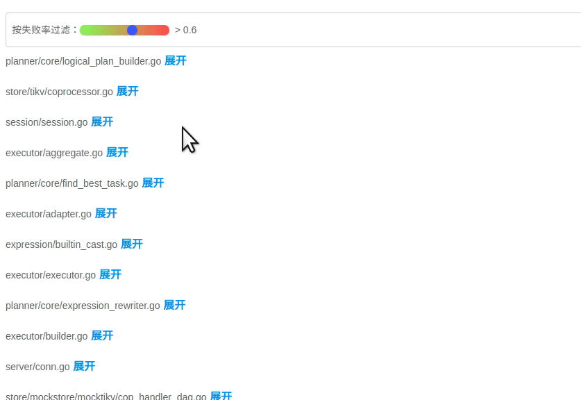

这是我们在 Hackathon 比赛中针对一个 TiDB 的 [PR](https://github.com/pingcap/tidb/pull/12476) 所做的实验，颜色越深，亮度越高表示包含错误逻辑的可能性越大。该方法不仅适用于数据库系统的测试，同样适用于其他任何复杂的系统。

## 背后的原理

项目最初是受到 VLDB 的一篇论文的启发 [APOLLO: Automatic Detection and Diagnosis of Performance Regressions in Database Systems](http://www.vldb.org/pvldb/vol13/p57-jung.pdf)，在此感谢一下乔治亚理工学院和 eBay 公司的几位作者。该论文主要围绕如何诊断引发数据库性能回退的代码，其核心思想也同样适用于排查 bug。论文中提到的自动诊断系统由 SQLFuzz，SQLMin 和 SQLDebug 三个模块组成。

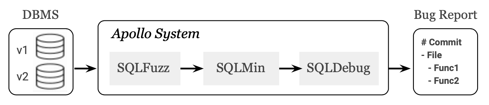

*   SQLFuzz：负责随机生成 SQL，并利用二分查找定位到性能回退的前后两个版本，传递给 SQLMin 模块。
*   SQLMin：通过剪枝算法将 SQLFuzz 生成的 SQL 进行化简，得出能够复现该问题的最小 SQL ，传递给 SQLDebug 模块。目的是减少无关的代码路径，降低噪音。
*   SQLDebug：对源码进行插桩，使其在执行 SQL 时能够输出代码的执行路径。然后对两个版本的代码路径进行分析，建立一个统计模型来定位问题的位置。

最终系统自动生成测试报告，内容包含：

*   哪一次的代码 commit 引入了性能回退。
*   存在问题的代码源文件。
*   具体的函数位置。

而实际上，考虑到并发、循环、递归等带来的影响，代码执行路径分析会非常复杂。为了保证能够在 Hackathon 那么短的时间内展示出效果，我们又参考了另一篇论文 [Visualization of Test Information to Assist Fault Localization](https://www.cc.gatech.edu/~john.stasko/papers/icse02.pdf)，其核心思想是通过统计代码块被正确和错误测试用例经过次数，再基于分析算法来涂上不同的颜色，简单而实用。

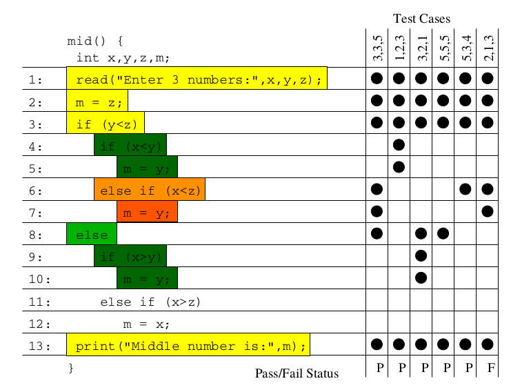

其实借助这个思路也可以应用到其他领域，后面我们将展开来介绍。接下来我们先来看看 SQLDebug 是如何实现的。

## 聊聊细 (gān) 节 (huò)

### 如何自动产生测试 case？

由于是基于统计的诊断，我们需要先构建足够多的测试用例，这个过程当然最好也由程序自动完成。事实上，grammar-based 的测试在检验编译器正确性方面有相当长的历史，DBMS 社区也采用类似的方法来验证数据库的功能性。比如：微软的 SQL Server 团队开发的 [RAGS](http://vldb.org/conf/2007/papers/industrial/p1243-bati.pdf) 系统对数据库进行持续的自动化测试，还有社区比较出名的 [SQLSmith](https://github.com/anse1/sqlsmith) 项目等等。今年 TiDB  Hackathon 的另一个获奖项目 [sql-spider](https://github.com/zyguan/sql-spider) 也是实现类似的目的。

这里我们暂时采用 PingCAP 开源的随机测试框架 [go-randgen](https://github.com/pingcap/go-randgen) 实现 SQL fuzzing，它需要用户写一些规则文件来帮助生成随机的 SQL 测试用例。规则文件由一些产生式组成。randgen 每次从 query 开始随机游走一遍产生式，生成一条 SQL，产生一条像下图红线这样的路径。

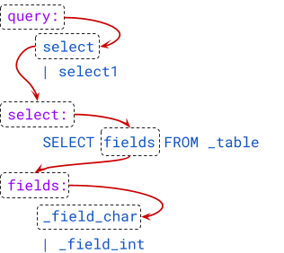

我们将每个产生式生成正确与错误用例的比例作为该产生式的颜色值，绘制成一个页面，作为 SQLFuzz 的展示页面。通过该页面，可以比较容易地看出哪条产生式更容易产生错误的 SQL。

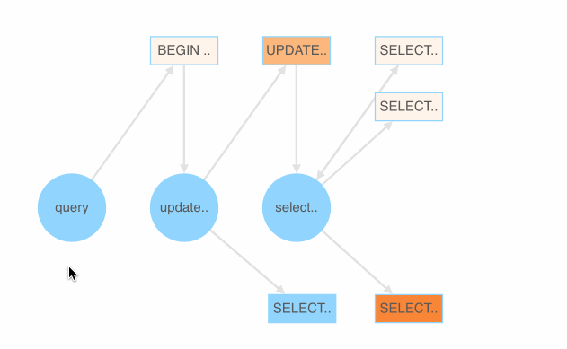

### 代码跟踪

为了跟踪每一条 SQL 在运行时的代码执行路径，一个关键操作是对被测程序进行插桩 (Dynamic Instrumentation)。VLDB 论文中提到一个二进制插桩工具 [DynamoRIO](https://www.dynamorio.org/)，但是我们不确定用它来搞 Go 编译的二进制能否正常工作。换一个思路，如果能在编译之前直接对源码进行插桩呢？

参考 [go cover tool](https://github.com/golang/tools/blob/master/cmd/cover/cover.go) 的实现，我们写了一个专门的代码插桩工具 [tidb-wrapper](https://github.com/fuzzdebugplatform/tidb-wrapper)。它能够对任意版本的 TiDB 源码进行处理，生成 [wrapped](https://github.com/DQinYuan/tidb-v3.0.0-wrapped) 代码。并且在程序中注入一个 HTTP Server，假设某条 SQL 的摘要是 `df6bfbff`（这里的摘要指的是 SQL 语句的 32 位 MurmurHash 计算结果的十六进制表示，主要目的是简化传输的数据），那么只要访问 `http://<tidb-server-ip>::43222/trace/df6bfbff` 就能获得该 SQL 所经过的源码文件和代码块信息。

```
// http://localhost:43222/trace/df6bfbff

{
  "sql": "show databases",
  "trace": [
    {
      "file": "executor/batch_checker.go",
      "line": null
    },
    {
      "file": "infoschema/infoschema.go",
      "line": [
        [
          113,
          113
        ],
        [
          261,
          261
        ],
       //....
    }
   ],
}
```
line 字段输出的每个二元组都是一个基本块的起始与结束行号（左闭右闭）。基本块的定义是绝对不会产生分支的一个代码块，也是我们统计的最小粒度。那是如何识别出 Go 代码中基本块的呢？其实工作量还挺大的，幸好 Go 的源码中有这一段，我们又刚好看到过，就把它裁剪出来，成为 [go-blockscanner](https://github.com/DQinYuan/go-blockscanner)。

因为主要目标是正确性诊断，所以我们限定系统不对 TiDB 并发执行 SQL，这样就可以认为从 `server/conn.go:handleQuery` 方法被调用开始，到 SQLDebug 模块访问 trace 接口的这段时间所有被执行的基本块都是这条 SQL 的执行路径。当 SQLDebug 模块访问 HTTP 接口，将会同时删除该 SQL 相关的 trace 信息，避免内存被撑爆。

### 基本块统计

SQLDebug 模块在获取到每条 SQL 经过的基本块信息后，会对每个基本块建立如下的可视化模型。

**首先是颜色，经过基本块的失败用例比例越高，基本块的颜色就越深。**


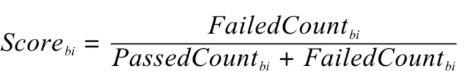

**然后是亮度，经过基本块的失败用例在总的失败用例中占的比例越高，基本块的亮度越高。**

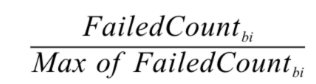

已经有了颜色指标，为什么还要一个亮度指标呢？其实亮度指标是为了弥补“颜色指标 Score”的一些偏见。比如某个代码路径只被一个错误用例经过了，那么它显然会获得 Score 的最高分 1，事实上这条路径不那么有代表性，因为这么多错误用例中只有一个经过了这条路径，大概率不是错误的真正原因。所以需要额外的一个亮度指标来避免这种路径的干扰，**只有颜色深，亮度高的代码块，才是真正值得怀疑的代码块。**

上面的两个模型主要是依据之前提到的 Visualization 的论文，我们还自创了一个文件排序的指标，失败用例在该文件中的密度越大（按照基本块），文件排名越靠前：

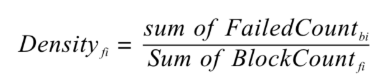

前端拿到这些指标后，按照上面计算出的文件排名顺序进行展示，越靠前的文件存在问题的风险就越高。

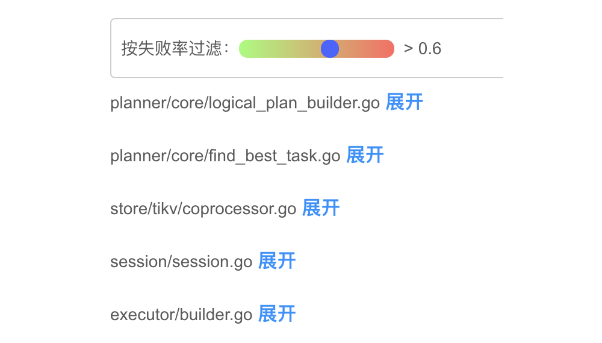

当点击展开后可以看到染色后的代码块：

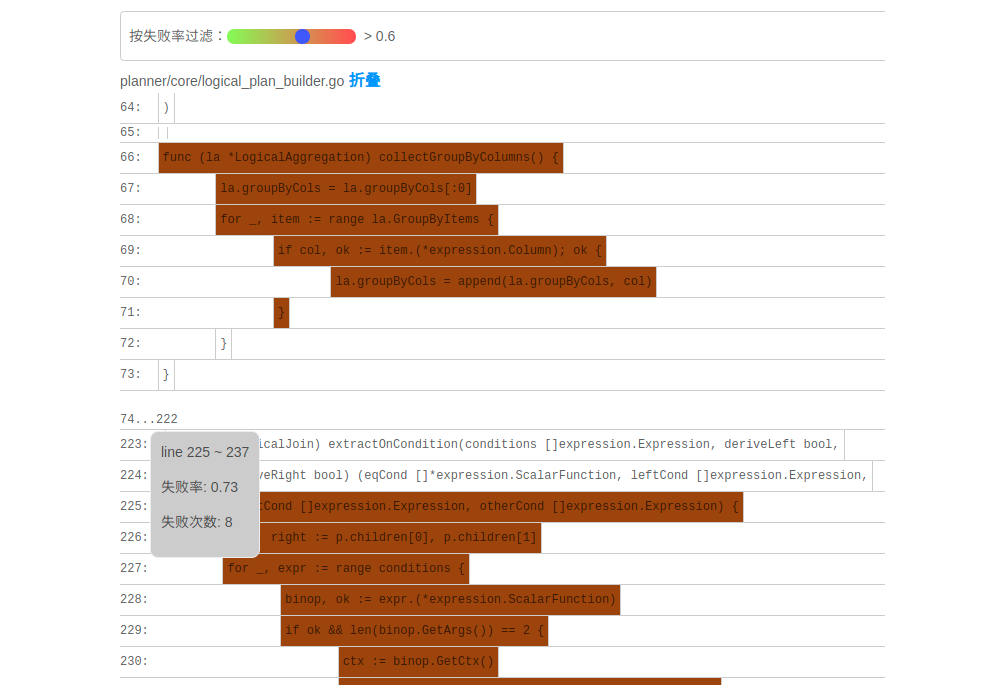

**我们经过一些简单的实验，文件级别的诊断相对比较准确，对于基本块的诊断相对还有些粗糙，这跟没有实现 SQLMin 有很大关系，毕竟 SQLMin 能去除不少统计时的噪声。**

## 还能不能做点别的？

看到这里，你可能觉得这个项目不过是针对数据库系统的自动化测试。而实际上借助代码自动调试的思路，可以给我们更多的启发。

### 源码教学

阅读和分析复杂系统的源码是个头疼的事情，TiDB 就曾出过 [24 篇源码阅读系列文章](https://pingcap.com/blog-cn/#TiDB-%E6%BA%90%E7%A0%81%E9%98%85%E8%AF%BB)，用一篇篇文字为大家解读源码​，江湖人称 “二十四章经”。那么是否可以基于源码的运行时可视化跟踪做成一个通用工具呢？这样在程序执行的同时就可以直观地看到代码的运行过程，对快速理解源码一定会大有帮助。更进一步，配合源码在线执行有没有可能做成一个在线 web 应用呢？

### 全链路测试覆盖统计

语言本身提供的单测覆盖统计工具已经比较完备了，但一般测试流程中还要通过 e2e 测试、集成测试、稳定性测试等等。能否用本文的方法综合计算出各种测试的覆盖度，并且与 CI 系统和自动化测试平台整合起来。利用代码染色技术，还可以输出代码执行的热力图分析。结合 profiler 工具，是不是还可以辅助来定位代码的性能问题？

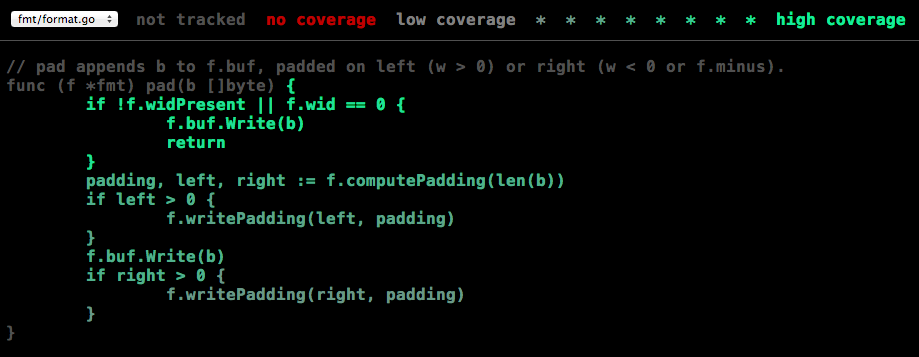

### Chaos Engineering

在 [PingCAP](https://pingcap.com/) 内部有诸多的 [Chaos](https://www.infoq.cn/article/EEKM947YbboGtD_zQuLw) 测试平台，用来验证分布式系统的鲁棒性，譬如像 Schrodinger，[Jepsen](https://github.com/jepsen-io/jepsen) 等等。混沌测试有个弊端就是，当跑出问题之后想再次复现就很难，所以只能通过当时的情形去猜代码可能哪里有问题。如果能在程序运行时记录代码的执行路径，根据问题发生时间点附近的日志和监控进一步缩小范围，再结合代码路径进行分析就能精确快速的定位到问题的原因。

### 与分布式 Tracing 系统集成

Google 有一篇论文是介绍其内部的 [分布式追踪系统 Dapper](https://ai.google/research/pubs/pub36356) ，同时社区也有比较出名的项目 [Open Tracing](https://opentracing.io/) 作为其开源实现，Apache 下面也有类似的项目 [Skywalking](https://skywalking.apache.org/)。一般的 Tracing 系统主要是跟踪用户请求在多个服务之间的调用关系，并通过可视化来辅助排查问题。但是 Tracing 系统的跟踪粒度一般是服务层面，如果我们把 `trace_id` 和 `span_id` 也当作标注传递给代码块进行打桩，那是不是可以在 Tracing 系统的界面上直接下钻到源码，听起来是不是特别酷？

## 接下来的工作

因为 Hackathon 时间有限，我们当时只完成了一个非常简单的原型，距离真正实现睡觉时程序自动查 bug 还有一段路要走，我们计划对项目持续的进行完善。

接下来，首先要支持并行执行多个测试用例，这样才能在短时间得到足够多的实验样本，分析结果才能更加准确。另外，要将注入的代码对程序性能的影响降低到最小，从而应用于更加广泛的领域，比如性能压测场景，甚至在生产环境中也能够开启。

看到这里可能你已经按耐不住了，附上 [项目的完整源码](https://github.com/fuzzdebugplatform/fuzz_debug_platform)，Welcome to hack!
