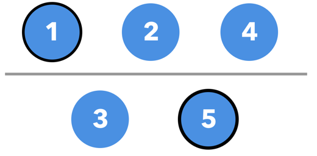
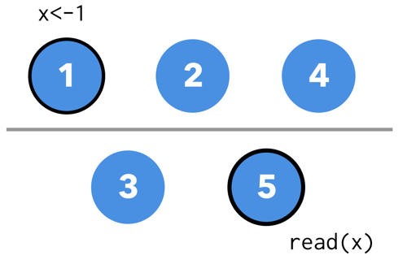
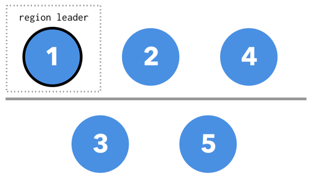
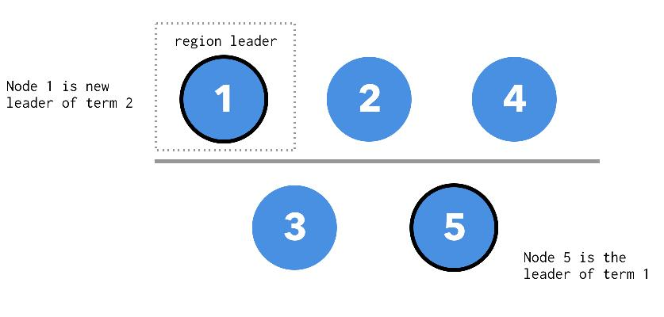

**问题：**
当 raft group 发生脑裂的情况下，老的 raft leader 可能在一段时间内并不知道新的 leader 已经被选举出来，这时候客户端在老的 leader 上可能会读取出陈旧的数据（stale read）。
比如，我们假想一个拥有 5 个节点的 raft group:

其中 Node 5 是当前的 raft leader，当出现网络分区时，在 Node 5 的 raft lease 任期还没结束的一段时间内，Node 5 仍然认为自己是当前 term 的 leader，但是此时，另外一边分区已经在新的 term 中选出了新的 leader。

如果此时，客户端在新的 leader 上更新了某个值 x，此时是可以更新成功的（因为还是可以复制到多数派）。但是在分区的另一端，此时一个客户端去读取 x 的值，Node 5 还会返回老的值，这样就发生了 stale read。

**解决方案**

引入一个新的概念, region leader。region leader 是一个逻辑上的概念, 任意时刻对于某一个 region 来说, 一定只拥有一个 region leader, 每个 region leader 在任期之内尝试每隔 t 时间间隔, 在 raft group 内部更新一下 region leader 的 lease. 所有的读写请求都必须通过 region leader 完成，
但是值得注意的是， region leader 和 raft leader 可能不是一个节点，当 region leader 和 raft leader 不重合的时候，region leader 会将请求转发给当前的 raft leader，当网络出现分区时，会出现以下几种情况：

1. region leader 落在多数派，老 raft leader 在多数派这边
2. region leader 落在多数派，老 raft leader 在少数派这边
3. region leader 落在少数派，老 raft leader 在多数派这边
4. region leader 落在少数派，老 raft leader 在少数派这边

用开篇的例子来分情况讨论：

对于第一种情况，region leader 的 lease 不会过期，因为 region leader 的心跳仍然能更新到多数派的节点上，老的 raft leader 仍然能同步到大多数节点上，少数派这边也不会选举出新的 leader， 这种情况下不会出现 stale read。

第二种情况，就是开篇提到会出现 stale read 的典型情况，老的 raft leader 被分到了少数派这边，多数派这边选举出了新的 raft leader ，如果此时的 region leader 在多数派这边。

因为所有的读写请求都会找到 region leader 进行，即使在原来没有出现网络分区的情况下，客户端的请求也都是要走 node 1 ，经由 node 1 转发给 node 5，客户端不会直接访问 node 5，所以此时即使网络出现分区，新 leader 也正好在多数派这边，读写直接就打到 node 1 上，皆大欢喜，没有 stale read。

第三种情况，region leader 落在少数派这边，老 raft leader 在多数派这边，这种情况客户端的请求找到 region leader，他发现的无法联系到 leader（因为在少数派这边没有办法选举出新的 leader），请求会失败，直到本次 region leader 的 lease 过期，同时新的 region leader 会在多数派那边产生（因为新的 region leader 需要尝试走一遍 raft 流程）。因为老的 region leader 没办法成功的写入，所以也不会出现 stale read。但是付出的代价是在 region leader lease 期间的系统的可用性。

第四种情况和第三种情况类似，多数派这边会产生新的 raft leader 和 region leader。

总体来说，这种方法牺牲了一定的可用性（在脑裂时部分客户端的可用性）换取了一致性的保证。