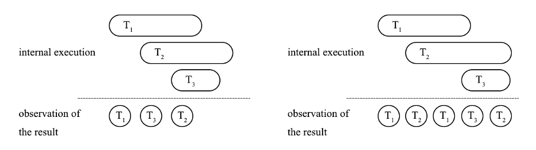
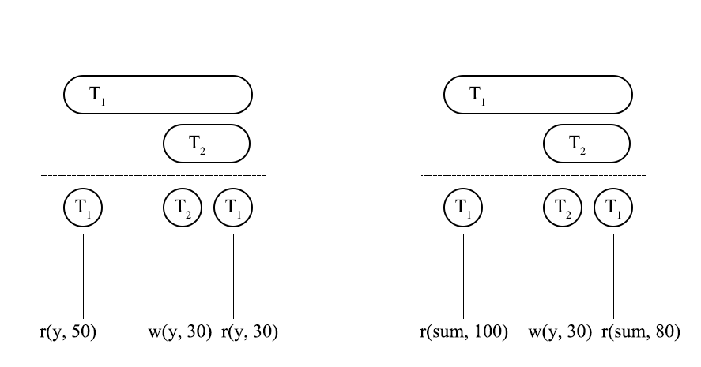
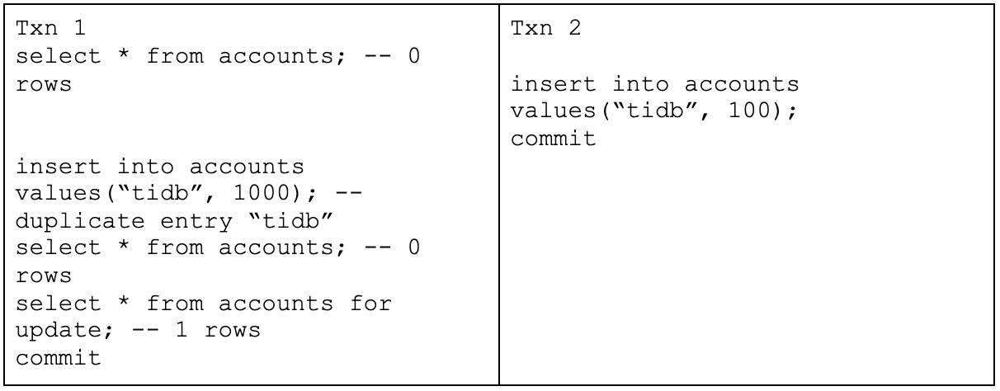
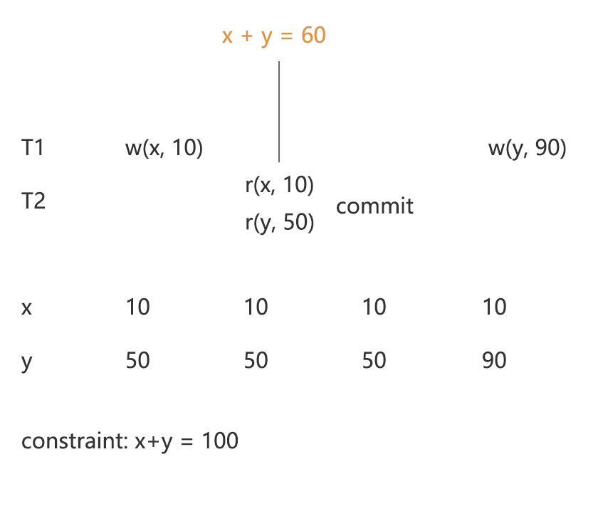
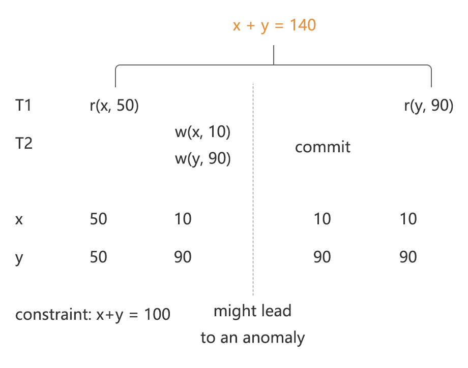
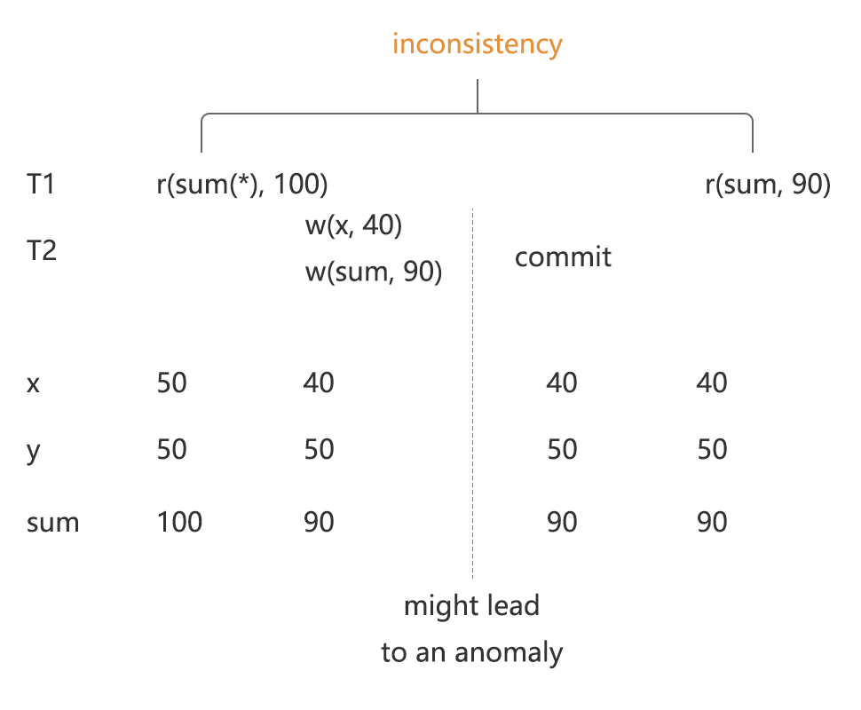
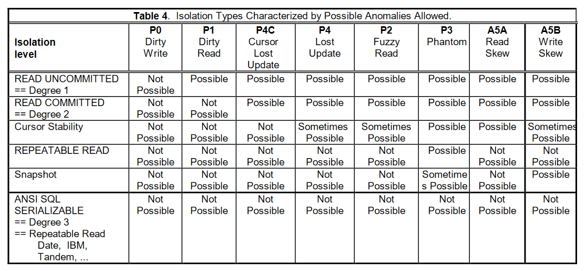

## 绪论

「事务前沿研究」系列文章目的是给大家分享一些学术前沿的事务方面的研究内容，因为事务内容的专业性很强，本系列的分享也将以循序渐进的方式进行，会从一些事务的基础理论开始讲起，为后续的内容做铺垫。本系列文章的目的有三点：

- 理清事务的隔离性，解释常见的认知误区；

- 理解事务的复杂性，并能够将其化繁为简；

- 了解学术前沿的研究热点，如果能给大家的工作研究带来一些启发就更好了。

第一次分享的内容会着眼于事务的隔离级别定义，因为后续的内容都会以此为基础，而隔离级别的一些较为先进的学术定义并未被广泛接受，本文将按照不同的隔离级别定义提出的顺序，分析各种定义的合理性和不足。

最早的 ANSI SQL-92 提出了至今为止仍然是应用最广的隔离级别定义，读提交、可重复读、可序列化。但是 「A Critique of ANSI SQL Isolation Levels」这篇文章指出了 ANSI SQL-92 的缺陷，并对其做出了补充。「Generalized Isolation Level Definitions」这篇文章，指出了此前对隔离级别定义重度依赖数据库的实现，并且提出了与实现无关的隔离级别定义。最后本文会在这些定义的基础上分析 MySQL 和 TiDB 的隔离级别，正确理解在 Snapshot Isolation 隔离级别下同时存在快照读和当前读时出现的一些异常现象的内在原因。

因为这篇文章涵盖的内容较多，跨度较大，所以将其分为上下两篇。上篇将介绍对在两阶段锁理解下，人们对隔离级别的理解；而下篇将会介绍与数据库实现无关的隔离级别定义，并且对 TiDB 进行分析。

## 事务隔离性的基础概念

事务是一系列操作的集合，具有 ACID 的特性，其中 A 指的是原子性（Atomicity），I 指的是隔离性（Isolation）。

原子性指的是一个事务中的所有操作，要么全部成功、要么全部失败。但是原子性并不能确保事务的过程也是原子发生的，约束事务过程的是隔离性。一个理想的数据库执行多个事务时，从结果看来，这些事务可以看作是顺序执行的，即每个事务的过程也是原子发生的。图 1 展示了是否可序列化在外部观测的区别，左图表示的是从结果看来，可以将看成是按照顺序完整执行了 T1 -> T3 -> T2；但是在右图中，T1 的执行过程中掺入了 T2 的执行，T2 的执行过程中掺入了 T3 的执行，即发生了语义上的非 serializable。在这种情况下，隔离级别定义的是数据库事务间的隔离程度。

图1 - 可序列化和不可序列化的对比

## ANSI SQL-92

ANSI SQL-92 提出了最经典的隔离级别定义，包括读未提交（Read Uncommitted）、读提交（Read Committed）、可重复读（Repeatable Read）和可序列化（Serializable）。

|    | Dirty Read  | Non-repeatable Read  | Phantom Read  |
|  ----  | ----  | ----  | ----  |
|  Read Uncommitted  |  Possible  |  Possible  |  Possible  |
|  Read Committed  | Not Possible  | Possible  | Possible  |
|  Repeatable Read  | Not Possible  | Not Possible  | Possible  |
|  Serializable  | Not Possible  | Not Possible  | Not Possible  |

表1 - ANSI SQL-92 隔离级别

相比于 Phantom Read，Dirty Read 和 Non-repeatable Read 要好理解很多，但因为大部分网络资料对于 MySQL 的 Phantom Read 的解释是存在误区的（把混淆快照读和当前读出现的现象当作 Phantom Read），本文仅对 Phantom Read 做详细的解释。

### Predicate - Item

Predicate 的中文翻译是谓词，严格来说，所有的查询条件都属于谓词；而相对的，在 KV 存储引擎中直接读取某个 key 的行为则称为 item。然而关系型数据库在 KV 之上还有 SQL 层，SQL 层即使是读取某个 key 也是通过一些查询条件（predicate）来进行描述的，当我们在 SQL 层面之上讨论是 predicate 还是 item 的时候，需要考虑它是否是一个点查询。点查询是一种查找数据的方法，通过建立好的索引去定位数据的 key，一般能够用非常高的效率查找到所需的数据，其查询的过程和读取某个 key 相似，所以本文的观点认为：

- 点查询是 item 类型的查询条件。

- 其他查询均是 predicate 类型的查询条件。

### Phantom Read

Phantom Read 是 Non-repeatable Read 的 predicate 的版本，这两种异常现象都需要在一个事务中进行两次读操作，Non-repeatable Read 指的是两次 item 类型的读操作读到了不同的内容，而 Phantom Read 则是指两次 predicate 类型的读操作读到了不同的结果。如图 2 所示，左图表示的是 Non-repeatable Read，右图表示的是 Phantom Read。

图2 - Non-repeatable Read 与 Phantom Read

|Txn1|Txn2|
|-|-|
|`select * from accounts; -- 0 rows`||
||`insert into accounts values("tidb", 100);`|
||`commit;`|
|`insert into accounts values("tidb", 1000); -- duplicate entry "tidb"`||
|`select * from accounts; -- 0 rows`||
|`select * from accounts for update; -- 1 rows`||
|`commit;`||

例1 - 虚假的 Phantom Read

例 1 给出了一种对 MySQL 下 Phantom Read 常见的举例，本文认为这是一种虚假的 Phantom Read，因为其本质原因在于 MySQL 的快照读和当前读的混合使用。在有些地方当前读被描述为“降级到 Read Committed 隔离级别”，这个例子所展示的，是两种隔离级别混合使用所带来的一些不符合直觉的现象，在后文讲述快照读和当前读的时候会更加详细的说明这一点。

### 小结

ANSI SQL-92 所给出的隔离级别的定义被广泛使用，但也造成了今天隔离级别指代混乱的现象，其原因在于这一套定义是不够严谨的，例如 Serializable 被定义为不会发生 Dirty Read，Non-repeatable Read 和 Phantom Read，但这并不与真正的 Serializable 在语义上等价，后来所提出的 Write Skew 现象就是一种违反 Serializable 的行为，但这并没有被 ANSI SQL-92 所包含。

## A Critique of ANSI SQL Isolation Levels

「A Critique of ANSI SQL Isolation Levels」这篇文章指出了 ANSI SQL-92 所遗漏的一些问题，同时针对 ANSI SQL-92 的隔离级别在两阶段锁（2PL） 的数据库实现之下提出了更高的要求，最后，这篇文章给出了 Snapshot Isolation 的隔离级别。

### 异常现象

在异常现象中，P1 - P3 是来自于 ANSI SQL-92 的异常现象，因为 ANSI SQL-92 只有语言上的描述，没有准确的定义这些异常，所以这篇文章对其做了两种解释，用 P (Phenomenon) 表明可能发生异常的现象，用 A (Anomaly) 表示已经发生的异常。因为 P 只是代表可能发生异常，所以也被称为扩大解释（broad interpretation），而 A 则称为严格解释（strict interpretation）。

#### P0 - Dirty Write

脏写是两个事务同时写一个 key 发生冲突的现象，在 2PL 的数据库实现下，如果两个未提交的事务同时写一个 key 失败了，就代表可能会发生异常，如例 2，理由有两点：

- 当 T1 先成功提交，T2 随后发生 rollback 时，应该回滚到哪个值是不明确的；

- 如果还写了其他的 key，可能会破坏约束的一致性。

|Txn1|Txn2|
|-|-|
|`w(x, 1)`||
||`w(x, 2)`|

例2 - Dirty Write 的扩大解释

#### P4 - Lost Update

写丢失指的是一个事务在尝试根据读到的数据进行写入之前，在其他事务上有另外的写入发生在了读写操作之间，并且成功提交，于是当这个事务继续进行的时候，就会将已经成功提交的写入覆盖掉的现象，造成写入丢失。在例 3 中，T1 和 T2 都需要把 x 的值加一，T1 根据读到的值 10 将 11 写入，写入前，T2 也将 11 写入 x，在 Serializable 的情况下，最后 x 的值是 12，而此时因为丢失了一个事务的写入，x 的最终值是 11。注：根据论文的解释，T2 不一定需要被 commit，此处为了方便理解所以稍微改造了例子。

|Txn1|Txn2|
|-|-|
|`r(x, 10)`||
||`w(x, x + 1)`|
||`commit`|
|`w(x, x + 1) x = 10`||
|`commit`||

例3 - Lost Update 的扩大解释

#### P4C - Cursor Lost Update

在数据库的实现中，为了保证性能，往往会将读操作分为两类，不加锁读和加锁读，有的数据库可以通过加锁读来防止出现 Lost Update 的现象，对于这种情况，我们就称数据库防止了 P4C 现象的发生，例 4 表示了 P4C 现象。加锁读在关系型数据库里一般实现为 select for update。

|Txn1|Txn2|
|-|-|
|`rc(x, 10)`||
||`w(x, x + 1)`|
||`commit`|
|`w(x, x + 1) x = 10`||
|`commit`||

例4 - Cursor 条件下的 Lost Update

#### A5A - Read Skew

Read Skew 的现象是因为读到两个状态的数据，导致观察到了违反约束的结果，例 5 中的 x 和 y 的和应该等于 100，而在 T1 里，却读到了 x + y = 140，需要注意的是因为 Read Skew 现象中没有重复读取同一个 key，所以不属于 Non-repeatable Read。

|Txn1|Txn2|
|-|-|
|`r(x, 50)`||
||`w(x, 10)`|
||`w(y, 90)`|
||`commit`|
|`r(y, 90)`||

例5 - Read Skew 的违反约束的现象

#### A5B - Write Skew

Write Skew 是两个事务在写操作上发生的异常，例 6 表示了 Write Skew 现象，即 T1 尝试把 x 的值赋给 y，T2 尝试把 y 的值赋给 x，如果这两个事务 Serializable 的执行，那么在结束之后 x 和 y 应该拥有一样的值，但是在 Write Skew 中，并发操作使得他们的值互换了。

|Txn1|Txn2|
|-|-|
|`r(x, 10)`||
||`r(y, 20)`|
|`w(y, 10)`||
||`w(x, 20)`|
|`commit`|`commit`|
|`r(x, 20)`||
|`r(y, 10)`||

例6 - Write Skew 的违反约束的现象

#### P1 - A1 - Dirty Read

Dirty Read 的严格解释是需要一个成功提交的事务读取到一个不会提交的事务的写入内容，如例 7 所示；但是其扩大解释只需要 T1 读取到还未提交的事务的写入内容就算发生了 Dirty Read，如例 8 所示。图 3 解释了采用扩大解释的原因，在这个例子中，T2 读到了 T1 对 x 的写入之后的值，但是读到了 T1 对 y 写入之前的值，因此造成了读到破坏约束的数据。

|Txn1|Txn2|
|-|-|
||`w(x, 1)`|
|`r(x, 1)`||
|`commit`|`abort`|

例7 - Dirty Read 的严格解释

|Txn1|Txn2|
|-|-|
||`w(x, 1)`|
|`r(x, 1)`||
|`...`|`...`|

例8 - Dirty Read 的扩大解释

图3 - Dirty Read 在扩大解释下的异常

#### P2 - A2 - Non-repeatable(Fuzzy) Read

Non-repeatable Read 指的是两次 item 类型的读操作读到了不同的数据。如例 9 所示，在严格解释下需要进行完整的两次读取；但是扩大解释则认为在一个事务读了某个 key 之后，如果读事务还没提交，有事务写这个 key 成功了就可能出现异常，换句话说，读请求应该阻塞写请求。图 4 解释了采用扩大解释的原因，因为 T1 对 x 的读取没能阻塞住 T2 对 x 的写入，导致之后读到了 T2 写入的 y，结果从 T1 观察到的结果来看，x + y = 140 破坏了约束。

|Txn1|Txn2|
|-|-|
|`r(x, 1)`||
||`w(x, 2)`|
||`commit`|
|`r(x, 2)`||
|`commimt`||

例9 - Non-repeatable Read 的严格解释

|Txn1|Txn2|
|-|-|
|`r(x, 1)`||
||`w(x, 2)`|
|`...`|`...`|

例10 - Non-repeatable Read 的扩大解释

图4 - Non-repeatable Read 在扩大解释下的异常

#### P3 - A3 - Phantom

和 ANSI SQL-92 所定义的 Phantom Read 不同，这篇文章把这一异常现象称为 Phantom，例 11 列举了标准的 Phantom Read，其特点是需要两次 predicate 类型的读操作读到了不同的数据。Phantom 现象比 Phantom Read 的定义要更加广一些，如例 12 所示，Phantom 现象的扩大解释只要在一个事务进行了 predicate 类型的读取，而另一个事务对其中的某个 key 进行了写操作，就可能出现异常，换言之，predicate 类型的读请求应该阻塞对它所读取到的数据的写请求。图 5 解释了采用扩大解释的原因，并且指出了以一种一个 predicate 和一个 item 类型的读取到的结果不一致的情况，在 Serializable 的数据库下，通过 predicate 类的查询计算 x 和 y 的和应当获得和通过 item 类的查询直接读取 sum 这个 key 一样的结果。

|Txn1|Txn2|
|-|-|
|`r(sum(x-y), 11)`||
||`w(x, 2)`|
||`commit`|
|`r(sum(x-y), 12)`|||
|`commit`||

例11 - Phantom 的严格解释（Phantom Read）

|Txn1|Txn2|
|-|-|
|`r(sum(x-y), 11)`||
||`w(x, 2)`|
|`...`|`...`|

例12 - Phantom 的扩大解释

图5 - Phantom 在扩大解释下的异常

### Snapshot Isolation

这篇文章还提出了 Snapshot Isolation (SI)，在 SI 的隔离级别下，事务会从它开始时间点的快照进行数据的读取，不同于两阶段锁，SI 一般利用 MVCC 的无锁特性来提高性能，因为对一个 key 能够保存多个版本的数据，SI 能够做到读不阻塞写，甚至写也不阻塞写。

熟悉 TiDB 乐观事务的同学可能会发现，如果根据上面给出的 P0 - Dirty Write 的定义，SI 是属于可能发生异常现象的。在乐观事务中，两个事务同时写一个 key 都会成功，但是最后在提交的时候会有一个事务失败，这一机制被称为 “first-committer-wins”。虽然 SI 可能会发生 P0（可能出现异常的现象），但不会发生 Dirty Write 的异常现象（我们可以将其称为 A0）。

P1 描述的现象对 SI 来说并没有意义，因为 SI 能够找到它需要读取的版本，并不会因为出现 P1 而读到违反约束的现象。P2 - P3 所描述的可能发生异常状态的现象会出现在 SI 当中，但是因为 SI 总是从一个快照版本中去读取，所以在所有读到的数据都是同一个版本下的，也不会因此出现违反约束的现象。因此，我们使用 A1 - A3 （严格解释）来约束 SI。

### 隔离级别

图 6 给出了补充后的隔离级别定义，在 ANSI SQL-92 的基础上加入了 Cursor Stability 和 Snapshot Isolation 的隔离级别。Cursor Lost Update 指的是数据库能够通过 cursor 来防止 lost update，而 Snapshot Isolation 没有对 Phantom 现象做出强制性的要求。

图6 - 隔离级别的定义

### 小结

这是一篇有里程碑意义的文章，不管是对异常现象的补充，还是提出 Snapshot Isolation 的隔离级别都有着巨大的意义，到今天这些概念被广泛应用。但是其中依然有些在今天看来不合适的观点：

- 实现相关，P0 - P4 在指出异常的同时甚至还规定了要怎么加锁。

- 使用了扩大解释，对于论文中给的理由，本文认为出现破坏约束的真实原因是 P0 (Dirty Read) 读到了事务的中间状态、而 P1(Fuzzy Read) 和 P2 (Phantom) 则是从两个状态中读取了数据，导致发生了约束被破坏和不一致的结果。

- 默认 Snapshot Isolation 是一种存储了多版本的隔离级别，但标准的定义不应该考虑数据库实现的方式。

- 扩大解释没有被 Snapshot Isolation 所采用，这里存在标准的不一致。

- 所定义的 Serializable 依旧在语义上和真正的 Serializable 不等价。

## 总结

在本篇文章中，我们总结了对于隔离级别的早期认知，这些观点大部分都是建立在两阶段锁的数据库之上的。但是以今天的观点来看，其中多少有些不合适之处，但这些观点已经被广泛接受，所以正确理解这些异常现象的真正内涵是十分有必要的。
