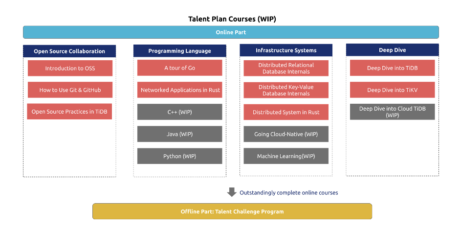

了解 TiDB 社区的朋友应该都知道 [PingCAP Talent Plan](https://university.pingcap.com/talent-plan/) 这门课程，它的初衷是希望造一个“梯子”，帮助小伙伴们一步步从 Go/Rust 语言、分布式系统基础，到实操练习，最终踏上分布式数据库“高阶玩家”的平台。

目前 PingCAP Talent Plan 诞生 1 年多了，我们想把“梯子”替换成更稳定的“台阶”（未来搞成“自动扶梯”也不一定 ;D），给课程装备来点升级。

**现在我们有了一些课程设计雏形，欢迎大家来“试玩”并提供建议、贡献自己的智慧，一起来打造这门课程！希望 Talent Plan 2.0 课程最终成为 TiDB 社区“共建共享”的智慧结晶，帮助更多社区伙伴们学习、成长。**

## 升级版课程规划

下面是我们构思的 PingCAP Talent Plan  2.0 版本的课程结构：

Talent Plan Courses 2.0 Framework如上图所示，我们将 Talent Plan 1.0 的优质资源进行整合，同时增加了一些全新的课程系列，形成了一个**更大的 Talent Plan 学习版图**。Talent Plan 2.0 将涵盖 4 个课程系列，包括：

* **Open Source Collaboration**：面向零基础开源爱好者的开源协作课程，这是一个全新的模块，下文将详细介绍。

* **Programming Language**：面向各种编程语言爱好者，目前已有的是 Go、Rust 语言课程，后续准备新增其他语言。

* **Infrastructure Systems**：面向爱折腾基础架构系统的同学。

* **Deep Dive**：TiDB 生态项目深度解读课程，课程难度由浅入深、层层递进。在已有的 TiDB/TiKV 课程基础上，计划新增 Cloud TiDB 等其他生态项目的课程。

每个课程系列都将新增更多内容，比如 Infrastructure Systems 课程系列，除了大家喜欢的 Distributed System in Rust 课程之外，还将新增用 Go 语言设计的分布式关系型数据库（TinySQL）课程和分布式 Key-Value 数据库（TinyKV）课程，下面将详细介绍。

## Talent Plan 2.0 新亮点

### 1. 面向开源爱好者的开源协作系列课程

这是我们专门为**零基础开源爱好者**准备的全新课程，希望即使是技术小白也能进入开源世界玩耍，比如不同开源软件许可协议的差异、知名开源基金会（Linux、Apache、CNCF 等）的运作方式以及开源社区运营的基础知识，快速掌握参与开源项目的小技巧。目前这个课程系列的学习资料已经准备完毕，3 月 2 日将开启为期 10 天的开源协作系列课程体验计划，任何对开源感兴趣的小伙伴都可以加入 [Talent Plan Courses Working Group](https://tidbcommunity.slack.com/archives/CR746G049) 参与课程体验，体验过程中你可以：

* 分享学习成果和感受；

* 补充其他开源相关的有价值的学习资料；

* 为课程作业的设计贡献 Idea。

无论是以上哪种方式，你都能为这个课程系列贡献自己的一份力量。

## 2. 用 Go 语言设计的分布式关系型数据库（TinySQL）课程

[TinySQL](https://github.com/pingcap-incubator/tinysql) 课程是基于 Go 语言实现的分布式关系型数据库，相比于 Talent Plan 1.0，会更加全面，几乎涵盖了分布式数据库 SQL 层最重要的部分。该课程会按照一个由简单到复杂，由静态到动态的顺序展开：

* 首先我们将对 SQL 和关系代数有一个简单的了解，为后面的课程做准备；

* 接下来，我们将聚焦一个只读 SQL 的执行，从 Parser 如何解析语义，到执行器如何执行语义，并在最后去了解优化器如何选出最优的执行计划；

* 最后，我们将聚焦在那些改变数据状态的 SQL（包括 DML 以及 DDL），以及如何处理它们和只读语句之间的相互影响。

目前课程的代码框架已经完成实现，课程材料也正在准备中，欢迎社区小伙伴参与早期测试或者课程材料的编写。

### 3. 用 Go 语言设计的分布式 Key-Value 数据库（TinyKV）课程

[TinyKV](https://github.com/pingcap-incubator/tinykv) 课程是基于 Go 语言全新设计的分布式 Key-Value 数据库课程。类似已有的 Distributed System in Rust 课程，TinyKV 同样受著名的 MIT 6.824 所启发，但更加接近 TiKV 的实现。我们引入调度相关逻辑，学员可以从 0 到 1 实现一个完整可用的分布式 KV 服务。课程主要分为四个部分：

* LAB1：实现单机 KV server；

* LAB2：基于 Raft 实现多副本高可用 KV server；

* LAB3：实现 Multi-Raft 以及数据均衡调度；

* LAB4：基于 Percolator 模型实现分布式事务。

当完成课程后，大家将会从实践中对 Raft 协议、Percolator 分布式事务模型有更深刻的理解。同时大家在实现 TinyKV 的过程中，也会更加了解 TiDB + TiKV + PD 的实际框架了，之后深入研究 TiDB/TiKV/PD 的源码会更加游刃有余。目前，我们已经完整实现了一个可用的 TinyKV 和相关测试，接下来会通过不断修剪得到课程需要的框架代码，同时课程材料也在紧锣密鼓地进行编写中。欢迎社区小伙伴参与早期测试反馈建议以及文档的查漏补缺。

### 4. 作业分发、提交、分数评估及反馈更加自动化

为了给小伙伴们更好的参与体验，并提高作业分发效率，我们调研了国内外大学在教学过程中使用的优秀工具，目前在重点针对 Github Classroom 进行作业分发功能的测试。除此之外，作业评估工作也将采用在工业界被广泛采用的 CI 技术，作业结果反馈会更加快速、高效、自动化。

## 试玩及反馈通道

以上课程及自动化作业分发工具都还处于调试阶段，大家可以加入 [Talent Plan Courses Working Group](https://tidbcommunity.slack.com/archives/CR746G049) 参与 2.0 课程体验、交流或吐槽，期待与各位共同打磨这门课程！

另外，在 2.0 课程细节完全敲定对外公布之前，大家依然可以继续学习 Talent Plan 1.0，作业提交与成绩评定规则与之前保持一致，更多细则详见 [PingCAP University 官网](https://university.pingcap.com/talent-plan/)。 
