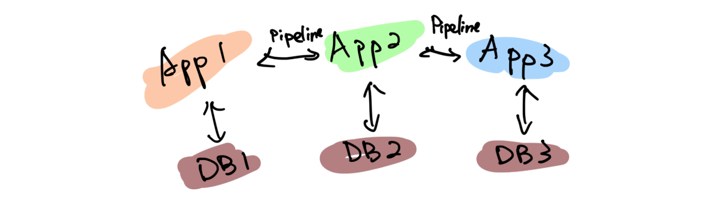
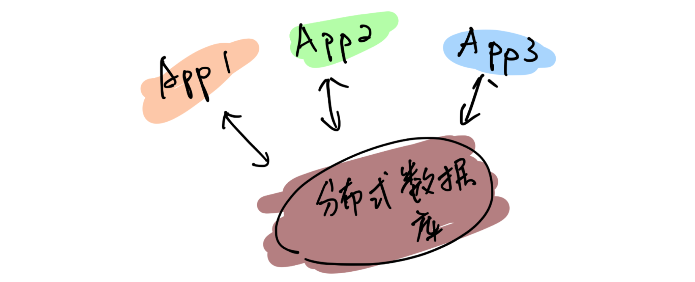
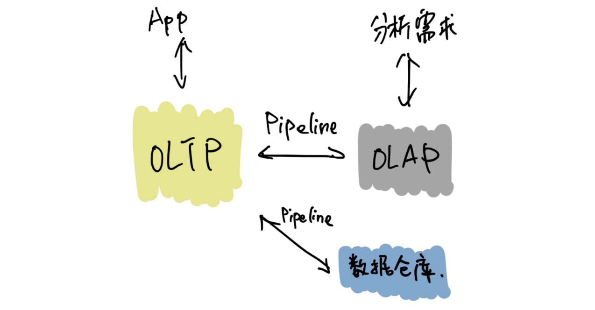
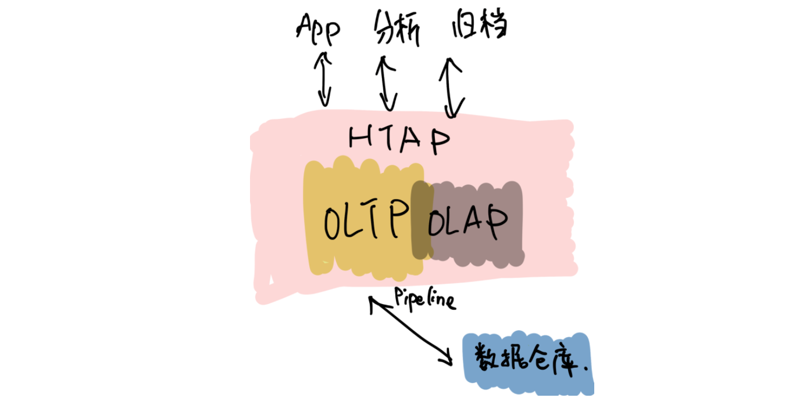

>我还清楚记得，五年前的这个时候，当时还在豌豆荚，午后与刘奇和崔秋的闲聊关于未来数据库的想象，就像一粒种子一样，到了今天看起来也竟枝繁叶茂郁郁葱葱，有点感慨。按照惯例，五年是一个重要的节点，没有十年那么冗长，也没有一两年的短暂，是一个很好的回顾节点，就在此认真的回顾一下过去，展望一下未来。

五年前创业的出发点其实很朴素：做一个更好的分布式数据库。从学术的角度上看起来，并不是提出了什么惊天地泣鬼神的神奇算法，我们选择的 Shared-nothing 的架构其实在当时的业界也不是什么新鲜的事情了，但真正令我激动的是：**我们要造的是一个真正能作为整个系统的 Single Source of Truth 的基础软件**。这句话怎么理解呢？我在后边会好好聊聊。

## 数据是架构的中心

作为一个互联网行业的架构师，几乎是天天都在和各种类型的数据打交道，这么多年的经验，不同行业不同系统，从技术层面来说，抽象到最高，总结成一句话就是：

**数据是架构的中心。**

仔细想想，我们其实做的一切工作，都是围绕着数据。数据的产生，数据的存储，数据的消费，数据的流动……只不过是根据不同的需求，变化数据的形态和服务方式。计算机系的同学可能还记得老师说过的一句话：程序 = 算法 + 数据结构，我这里斗胆模仿一下这个句式：**系统 = 业务逻辑 x 数据**。可以说很多架构问题都是出在数据层，例如常见的「烟囱式系统」带来的种种问题，特别是数据孤岛问题，其实本质上的原因就出在没有将数据层打通，如果不从数据架构去思考，就可能「头疼医头、脚疼医脚」，费了半天劲还是很别扭，反过来如果将数据层治理好，就像打通「任督二脉」一样，起到四两拨千斤的效果。

但是理想通常很丰满，现实却很骨感。至少在我们五年前出来创业那会儿，我们觉得并没有一个系统能够很好的解决数据的问题。可能好奇的读者就要问了：不是有 Hadoop？还有 NoSQL？再不济关系型数据库也能分库分表啊？其实列出的这几个几乎就是当年处理存储问题的全部候选，这几个方案的共同特点就是：不完美。

**具体一点来说，这几个解决方案对于数据应用的场景覆盖其实都不大，对于复杂一点的业务，可能需要同时使用 n 多个方案才能覆盖完整**。这就是为什么随着近几年互联网业务越来越复杂，类似 Kafka 这样的数据 Pipeline 越来越流行，从数据治理的角度其实很好理解：各种数据平台各负责各的，为了做到场景的全覆盖，必然需要在各个「岛」之间修路呀。

**我们当年就在想，能不能有一个系统以一个统一的接口尽可能大的覆盖到更多场景。**

**我们需要一个 Single Source of Truth**。数据应该是贯穿在应用逻辑各个角落，我理想中的系统中对于任意数据的存取都应该是可以不加限制的（先不考虑权限和安全，这是另一个问题），这里的“不加限制”是更广义的，例如：没有容量上限，只要有足够的物理资源，系统可以无限的扩展；没有访问模型限制，我们可以自由的关联、聚合数据；没有一致性上的限制；运维几乎不需要人工干预……

## 以分布式数据库为统一中心的架构

我当年特别着迷于一个美剧：Person of Interest （疑犯追踪），这个电视剧里面有一个神一样的人工智能 The Machine，收集一切数据加以分析，从而预测或是干预未来人们的行动。虽然这部美剧还是比较正统的行侠仗义之类的主题，但是更让我着迷的是，是否我们能设计一个 The Machine？虽然直到目前我还不是一个 AI 专家，但是给 The Machine 设计一个数据库似乎是可行的。这几年创业过程中，我们发现更令人兴奋的点在于：

**以分布式数据库为统一中心的架构是可能的。**

这个怎么理解呢？举个例子，就像在上面提到的分裂带来的问题，数据层的割裂必然意味着业务层需要更高的复杂度去弥补，其实很多工程师其实偏向于用线性的思维去思考维护系统的成本。但是实际的经验告诉我们，事情并不是这样的。一个系统只有一个数据库和有十个数据库的复杂程度其实并不是的简单的 10x，考虑到数据的流动，维护成本只可能是更多，这里还没有考虑到异构带来的其他问题。

以分布式数据库为中心的架构是什么样子的呢？**很好理解，整个架构的中心是一个场景覆盖度足够广，且具有无限的水平伸缩能力的存储系统。大部分数据的流动被限制在这个数据库内部，这样应用层就可以几乎做到无状态，因为这个中心的数据库负责了绝大部分状态，每个应用可以通过自己的缓存来进行加速。
这里我想提醒的是，为什么我在上面强调水平扩展能力，是因为受限的扩展能力也是导致分裂的一个重要的原因。我们从来都没有办法准确的预测未来，我们很难想象甚至是一年后业务的变化（想想这次疫情），有句老话说的很好：唯一不变的就是变化。**

另外一个经常被问到的问题，为什么要强调缓存层需要离业务层更近，或者说，为什么位于中心的这个巨型数据库不应该承担缓存的责任？我的理解是，只有业务更懂业务，知道应该以什么样的策略缓存什么样的数据，而且出于性能（低延迟）考虑，缓存离业务更近也是有道理的。

对应上面那句话「唯一不变的就是变化」，这个架构带来最大的好处正是「以不变应万变」，或者更简单的一个词：**简洁**。Google 其实在很早就想清楚了这个问题，因为他们很早就明白什么是真正的复杂。

另一个例子是 **HTAP**，如果关注的数据库的发展的话，最近一定对 HTAP 这个词很熟悉，其实在我看来的 HTAP 的本质在于上面提到的覆盖度，下面是一个典型的架构：

传统的数据架构通常将 OLTP、OLAP、离线数仓分离，各个系统各司其职，中间通过独立的 Pipeline 进行同步（有时候还会加上 ETL）。

**下面是一个 HTAP 的系统的样子：**

虽然从表面上看，只是简单的将接口层进行整合，但是这个意义其实是深远的，首先数据同步的细节被隐藏了一起来，这意味着数据库层面可以自己决定通过何种方式同步数据，另外由于 OLTP 引擎和 OLAP 引擎在同一个系统内部，使得很多细节信息不会在同步的过程中丢失，比如：事务信息，这就意味着在内部的分析引擎能够做到传统的 OLAP 没办法做的事情。另外对于业务层的使用来说，少一个系统意味着更统一的体验和更小的学习和改造成本，**不要低估统一带来的力量**。

## 未来在哪里？

上面这些是过去五年发生的事情，也几乎按照我们创业时候的设想一步步的变为现实，那么接下来的五年会发什么？随着对于行业和技术的理解的加深，至少有一点我深信不疑的是：

### 弹性调度会是未来的数据库的核心能力

谁都不会否认，最近十年在 IT 技术上，最大的变革是由云带来的，这场革命还在进行时。云的核心能力是什么？我认为是弹性。计算资源分配的粒度变得越来越细，就像从只能买房变成可以租房，甚至可以像住酒店一样灵活。这意味着什么？**本质在于我们可以不用为「想象中」的业务峰值提前支付成本。**

过去我们的采购服务器也好，租赁机柜也好，都是需要设定一个提前量的，当业务峰值没有到来之前，其实这些成本是已经提前支付的了。云的出现将弹性变成了基础设施的一个基础能力，我预计数据库也会发生同样的事情。

可能有很多朋友会有疑问，现在难道不是几乎所有数据库都号称能够支持透明水平扩展嘛？其实这里希望大家不要将**「弹性调度」**狭隘的理解为扩展性，而且这个词的重点在**「调度」**上，我举几个例子以方便大家理解：

1. **数据库能不能够自动识别 workload，根据 workload 进行自动伸缩**？例如：预感到峰值即将来临，自动的采购机器，对热数据创建更多副本并重分布数据，提前扩容。在业务高峰过去后，自动回收机器进行缩容。

2. **数据库能不能感知业务特点，根据访问特点决定分布**？例如：如果数据带有明显的地理特征（比如，中国的用户大概率在中国访问，美国用户在美国），系统将自动的将数据的地理特征在不同的数据中心放置。

3. **数据库能不能感知查询的类型和访问频度，从而自动决定不同类型数据的存储介质**？例如：冷数据自动转移到 S3 之类比较便宜的存储，热数据放在高配的闪存上，而且冷热数据的交换完全是对业务方透明的。

这里提到的一切背后都依赖的是「弹性调度」能力。未来我相信物理资源的成本会持续的降低，计算资源的单价持续下降带来的结果是：当存储成本和计算资源变得不是问题的时候，问题就变成**「如何高效的分配资源」**。如果将高效分配作为目标的话，「能调度」就是显而易见的基础。
当然就像一切事物发展的客观规律一样，学会跑步之前，先要学会走路，我相信在接下来的一段时间内，我们会看到第一批初步拥有这样能力的新型数据库，让我们拭目以待。

### 下一个阶段是智能

对于更远的未来是怎么样子的？我不知道，但是就像 The Machine 一样，只有足够数据才能诞生出智能，我相信就像我们不了解宇宙和海洋一样，我们现在对于数据的认识一定是肤浅的，甚至大量的数据我们都还没记录下来，一定有更大奥秘隐藏在这海量的数据中，从数据中能获取什么样的洞察，能够怎么样更好的改变我们的生活，我并不知道，但是做这件事情的主角我猜不会是人类。虽然在这个小节我们讨论的东西可能就有点像科幻小说了，不过我愿意相信这样的未来，从数据的海洋中诞生出新的智能体。

## 尾声

创业这五年的时间，回头看看那个最朴素的出发点：写一个更好的数据库彻底解决烦人的 MySQL 分库分表问题。似乎也算没有偏离初心，但是在这个旅途中一步步看到了更大的世界，也越来越有能力和信心将我们相信的东西变为现实：

我有一个梦想，未来的软件工程师不用再为维护数据库加班熬夜，各种数据相关的问题都将被数据库自动且妥善的处理；

我有一个梦想，未来我们对数据的处理将不再碎片化，任何业务系统都能够方便的存储和获取数据；

我有一个梦想，未来的我们在面临数据的洪流时候，能从容地以不变应万变。

最近我听到一句话，我个人很喜欢：**雄心的一半是耐心**。构建一个完美的数据库并不是一朝一夕的工作，但是我相信我们正走在正确的道路上。

**凡所过往，皆为序章。**