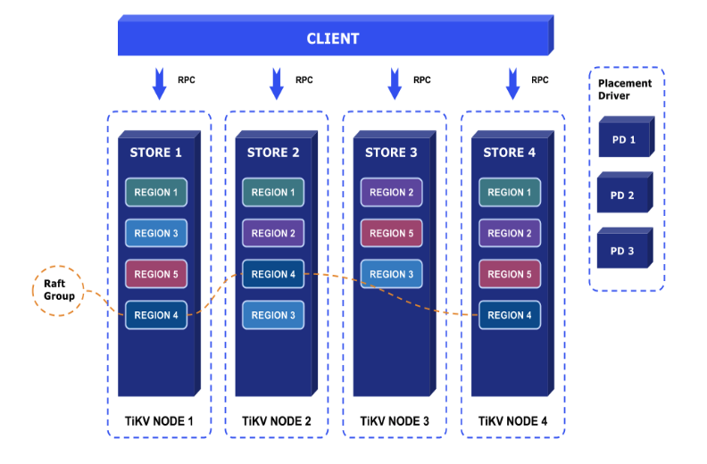

### 概述

本文档主要面向 TiKV 社区开发者，主要介绍 TiKV 的系统架构，源码结构，流程解析。目的是使得开发者阅读文档之后，能对 TiKV 项目有一个初步了解，更好的参与进入 TiKV 的开发中。

需要注意，TiKV 使用 [Rust](https://www.rust-lang.org/) 语言编写，用户需要对 Rust 语言有一个大概的了解。另外，本文档并不会涉及到 TiKV 中心控制服务 Placement Driver(PD) 的详细介绍，但是会说明一些重要流程 TiKV 是如何与 PD 交互的。

TiKV 是一个分布式的 KV 系统，它采用 Raft 协议保证数据的强一致性，同时使用 MVCC + 2PC 的方式实现了分布式事务的支持。

### 架构

TiKV 的整体架构比较简单，如下：



**Placement Driver** : Placement Driver (PD) 负责整个集群的管理调度。

**Node** : Node 可以认为是一个实际的物理机器，每个 Node 负责一个或者多个 Store。

**Store** : Store 使用 RocksDB 进行实际的数据存储，通常一个 Store 对应一块硬盘。

**Region** : Region 是数据移动的最小单元，对应的是 Store 里面一块实际的数据区间。每个 Region 会有多个副本（replica），每个副本位于不同的 Store ，而这些副本组成了一个 Raft group。

### Raft

TiKV 使用 Raft 算法实现了分布式环境下面数据的强一致性，关于 Raft，可以参考论文 “[In Search of an Understandable Consensus Algorithm](https://raft.github.io/raft.pdf)” 以及[官网](https://raft.github.io/)，这里不做详细的解释。简单理解，Raft 是一个 replication log + State Machine 的模型，我们只能通过 leader 进行写入，leader 会将 command 通过 log 的形式复制到 followers，当集群的大多数节点都收到了这个 log，我们就认为这个 log 是 committed，可以 apply 到 State Machine 里面。

TiKV 的 Raft 主要移植 [etcd Raft](https://github.com/coreos/etcd/tree/master/raft)，支持 Raft 所有功能，包括：

* Leader election

* Log replication / Log compaction

* Membership changes / Leader transfer

* Linearizable / Lease read

这里需要注意，TiKV 以及 etcd 对于 membership change 的处理，跟 Raft 论文是稍微有一点不一样的，主要在于 TiKV 的 membership change 只有在 log applied 的时候生效，这样主要的目的是为了实现简单，但有一个风险在于如果我们只有两个节点，要从里面移掉一个节点，如果一个 follower 还没收到 ConfChange 的 log entry，leader 就当掉并且不可恢复了，整个集群就没法工作了。所以通常我们都建议用户部署 3 个或者更多个奇数个节点。

Raft 库是一个独立的库，用户也可以非常方便的将其直接嵌入到自己的应用程序，而仅仅只需要自行处理存储以及消息的发送。这里简单介绍一下如何使用 Raft，代码在 TiKV 源码目录的 /src/raft 下面。

#### Storage

首先，我们需要定义自己的 Storage，Storage 主要用来存储 Raft 相关数据，trait 定义如下：

```
pub trait Storage {
    fn initial_state(&self) -> Result<RaftState>;
    fn entries(&self, low: u64, high: u64, max_size: u64) -> Result<Vec<Entry>>;
    fn term(&self, idx: u64) -> Result<u64>;
    fn first_index(&self) -> Result<u64>;
    fn last_index(&self) -> Result<u64>;
    fn snapshot(&self) -> Result<Snapshot>;
}
```

我们需要实现自己的 Storage trait，这里详细解释一下各个接口的含义：

initial_state：初始化 Raft Storage 的时候调用，它会返回一个 RaftState，RaftState 的定义如下：

```
pub struct RaftState {
    pub hard_state: HardState,
    pub conf_state: ConfState,
}

```
HardState 和 ConfState 是 protobuf，定义：

```
message HardState {
    optional uint64 term   = 1;
    optional uint64 vote   = 2;
    optional uint64 commit = 3;
}

message ConfState {
    repeated uint64 nodes = 1;
}
```
在 HardState 里面，保存着该 Raft 节点最后一次保存的 term 信息，之前 vote 的哪一个节点，以及已经 commit 的 log index。而 ConfState 则是保存着 Raft 集群所有的节点 ID 信息。

在外面调用 Raft 相关逻辑的时候，用户需要自己处理 RaftState 的持久化。

**entries**: 得到 [low, high) 区间的 Raft log entry，通过 max_size 来控制最多返回多少个 entires。

term，first\_index 和 last\_index 分别是得到当前的 term，以及最小和最后的 log index。

**snapshot**：得到当前的 Storage 的一个 snapshot，有时候，当前的 Storage 数据量已经比较大，生成 snapshot 会比较耗时，所以我们可能得在另一个线程异步去生成，而不用阻塞当前 Raft 线程，这时候，可以返回 SnapshotTemporarilyUnavailable 错误，这时候，Raft 就知道正在准备 snapshot，会一段时间之后再次尝试。

需要注意，上面的 Storage 接口只是 Raft 库需要的，实际我们还会用这个 Storage 存储 raft log 等数据，所以还需要单独提供其他的接口。在 Raft storage.rs 里面，我们提供了一个 MemStorage，用于测试，大家也可以参考 MemStorage 来实现自己的 Storage。

#### Config

在使用 Raft 之前，我们需要知道 Raft 一些相关的配置，在 Config 里面定义，这里只列出需要注意的：

```
pub struct Config {
    pub id: u64,
    pub election_tick: usize,
    pub heartbeat_tick: usize,
    pub applied: u64,
    pub max_size_per_msg: u64,
    pub max_inflight_msgs: usize,
}
```
**id**: Raft 节点的唯一标识，在一个 Raft 集群里面，id 是不可能重复的。在 TiKV 里面，id 的通过 PD 来保证全局唯一。

**election\_tick**：当 follower 在 election_tick 的时间之后还没有收到 leader 发过来的消息，那么就会重新开始选举，TiKV 默认使用 50。

**heartbeat\_tick**: leader 每隔 hearbeat_tick 的时间，都会给 follower 发送心跳消息。默认 10。

**applied**: applied 是上一次已经被 applied 的 log index。

**max\_size\_per\_msg**: 限制每次发送的最大 message size。默认 1MB。

**max\_inflight\_msgs**: 限制复制时候最大的 in-flight 的 message 的数量。默认 256。

这里详细解释一下 tick 的含义，TiKV 的 Raft 是定时驱动的，假设我们每隔 100ms 调用一次 Raft tick，那么当调用到 headtbeat_tick 的 tick 次数之后，leader 就会给 follower 发送心跳。

#### RawNode

我们通过 RawNode 来使用 Raft，RawNode 的构造函数如下：

```
pub fn new(config: &Config, store: T, peers: &[Peer]) -> Result<RawNode<T>>
```

我们需要定义 Raft 的 Config，然后传入一个实现好的 Storage，peers 这个参数只是用于测试，实际要传空。生成好 RawNode 对象之后，我们就可以使用 Raft 了。我们关注如下几个函数：

**tick**: 我们使用 tick 函数定期驱动 Raft，在 TiKV，我们每隔 100ms 调用一次 tick。

**propose**: leader 通过 propose 命令将 client 发过来的 command 写入到 raft log，并复制给其他节点。

**propose\_conf\_change**: 跟 propose 类似，只是单独用来处理 ConfChange 命令。

**step**: 当节点收到其他节点发过来的 message，主动调用驱动 Raft。

**has\_ready**: 用来判断一个节点是不是 ready 了。

**ready**: 得到当前节点的 ready 状态，我们会在之前用 has_ready 来判断一个 RawNode 是否 ready。

**apply\_conf\_change**: 当一个 ConfChange 的 log 被成功 applied，需要主动调用这个驱动 Raft。

**advance**: 告诉 Raft 已经处理完 ready，开始后续的迭代。

对于 RawNode，我们这里重点关注下 ready 的概念，ready 的定义如下：

```
pub struct Ready {
    pub ss: Option<SoftState>,
    pub hs: Option<HardState>,
    pub entries: Vec<Entry>,
    pub snapshot: Snapshot,
    pub committed_entries: Vec<Entry>,
    pub messages: Vec<Message>,
}
```
**ss**: 如果 SoftState 变更，譬如添加，删除节点，ss 就不会为空。

**hs**: 如果 HardState 有变更，譬如重新 vote，term 增加，hs 就不会为空。

**entries**: 需要在 messages 发送之前存储到 Storage。

**snapshot**: 如果 snapshot 不是 empty，则需要存储到 Storage。

**committed\_entries**: 已经被 committed 的 raft log，可以 apply 到 State Machine 了。

**messages**: 给其他节点发送的消息，通常需要在 entries 保存成功之后才能发送，但对于 leader 来说，可以先发送 messages，在进行 entries 的保存，这个是 Raft 论文里面提到的一个优化方式，TiKV 也采用了。

当外部发现一个 RawNode 已经 ready 之后，得到 Ready，处理如下：

1. 持久化非空的 ss 以及 hs。

2. 如果是 leader，首先发送 messages。

3. 如果 snapshot 不为空，保存 snapshot 到 Storage，同时将 snapshot 里面的数据异步应用到 State Machine（这里虽然也可以同步 apply，但 snapshot 通常比较大，同步会 block 线程）。

4. 将 entries 保存到 Storage 里面。

5. 如果是 follower，发送 messages。

6. 将 committed_entries apply 到 State Machine。

7. 调用 advance 告知 Raft 已经处理完 ready。

### Placement Driver

在继续之前，我们先简单介绍一下 Placement Driver(PD)。PD 是 TiKV 的全局中央控制器，存储整个 TiKV 集群的元数据信息，负责整个 TiKV 集群的调度，全局 ID 的生成，以及全局 TSO 授时等。

PD 是一个非常重要的中心节点，它通过集成 etcd，自动的支持了分布式扩展以及 failover，解决了单点故障问题。关于 PD 的详细介绍，后续我们会新开一篇文章说明。

在 TiKV 里面，跟 PD 的交互是放在源码的 pd 目录下，现在跟 PD 的交互都是通过自己定义的 RPC 实现，协议非常简单，在 pd/mod.rs 里面我们直接提供了用于跟 PD 进行交互的 Client trait，以及实现了 RPC Client。

PD 的 Client trait 非常简单，多数都是对集群元信息的 set/get 操作，需要额外注意的几个：

bootstrap\_cluster：当我们启动一个 TiKV 服务的时候，首先需要通过 is\_cluster\_bootstrapped 来判断整个 TiKV 集群是否已经初始化，如果还没有初始化，我们就会在该 TiKV 服务上面创建第一个 region。

region\_heartbeat：定期 Region 向 PD 汇报自己的相关信息，供 PD 做后续的调度。譬如，如果一个 Region 给 PD 上报的 peers 的数量小于预设的副本数，那么 PD 就会给这个 Region 添加一个新的副本 Peer。

store_heartbeat：定期 store 向 PD 汇报自己的相关信息，供 PD 做后续调度。譬如，Store 会告诉 PD 当前的磁盘大小，以及剩余空间，如果 PD 发现空间不够了，就不会考虑将其他的 Peer 迁移到这个 Store 上面。

ask\_split/report\_split：当 Region 发现自己需要 split 的时候，就 ask\_split 告诉 PD，PD 会生成新分裂 Region 的 ID ，当 Region 分裂成功之后，会 report\_split 通知 PD。

注意，后面我们会让 PD 支持 gRPC 协议，所以 Client API 到时候可能会有变更。

### Raftstore

因为 TiKV 目标是支持 100 TB+ 以上的数据，一个 Raft 集群是铁定没法支持这么多数据的，所以我们需要使用多个 Raft 集群，也就是 Multi Raft。在 TiKV 里面，Multi Raft 的实现是在 Raftstore 完成的，代码在 raftstore/store 目录。

#### Region

因为我们要支持 Multi Raft，所以我们需要将数据进行分片处理，让每个 Raft 单独负责一部分数据。

通常的数据分片算法就是 Hash 和 Range，TiKV 使用的 Range 来对数据进行数据分片。为什么使用 Range，主要原因是能更好的将相同前缀的 key 聚合在一起，便于 scan 等操作，这个 Hash 是没法支持的，当然，在 split/merge 上面 Range 也比 Hash 好处理很多，很多时候只会涉及到元信息的修改，都不用大范围的挪动数据。

当然，Range 有一个问题在于很有可能某一个 Region 会因为频繁的操作成为性能热点，当然也有一些优化的方式，譬如通过 PD 将这些 Region 调度到更好的机器上面，提供 Follower 分担读压力等。

总之，在 TiKV 里面，我们使用 Range 来对数据进行切分，将其分成一个一个的 Raft Group，每一个 Raft Group，我们使用 Region 来表示。

Region 的 protobuf 协议定义如下：

```
message Region {
    optional uint64 id                  = 1 [(gogoproto.nullable) = false];
    optional bytes  start_key           = 2;
    optional bytes  end_key             = 3;
    optional RegionEpoch region_epoch   = 4;
    repeated Peer   peers               = 5;
}

message RegionEpoch {
    optional uint64 conf_ver	= 1 [(gogoproto.nullable) = false];
    optional uint64 version     = 2 [(gogoproto.nullable) = false];
}

message Peer {
    optional uint64 id          = 1 [(gogoproto.nullable) = false];
    optional uint64 store_id    = 2 [(gogoproto.nullable) = false];
}
```
**id**：Region 的唯一表示，通过 PD 全局唯一分配。

**start\_key, end\_key**：用来表示这个 Region 的范围 [start\_key, end\_key)，对于最开始的 region，start 和 end key 都是空，TiKV 内部会特殊处理。

**region\_epoch**：当一个 Region 添加或者删除 Peer，或者 split 等，我们就会认为这个 Region 的 epoch 发生的变化，RegionEpoch 的 conf_ver 会在每次做 ConfChange 的时候递增，而 version 则是会在每次做 split/merge 的时候递增。

**peers**：当前 Region 包含的节点信息。对于一个 Raft Group，我们通常有三个副本，每个副本我们使用 Peer 来表示，Peer 的 id 也是全局由 PD 分配，而 store_id 则表明这个 Peer 在哪一个 Store 上面。

#### RocksDB / Keys Prefix

对于实际数据存储，无论是 Raft Meta，Log，还是 State Machine 的 data，我们都存到一个 RocksDB 实例里面。关于 RocksDB，可以详细参考 [facebook/rocksdb](https://github.com/facebook/rocksdb)。

我们使用不同的前缀来对 Raft 以及 State Machine 等数据进行区分，具体可以参考 raftstore/store/keys.rs，对于 State Machine 实际的 data 数据，我们统一添加 ‘z’ 前缀。而对于其他会存在本地的元数据（包括 Raft），我们统一添加 0x01 前缀。

这里简单说明一下一些重要元数据的 Key 格式，我们忽略最开始的 0x01 前缀。

* 0x01：用于存放StoreIdent，在初始化这个 Store 的时候，我们会将 Store 的 Cluster ID，Store ID 等信息存储到这个 key 里面。

* 0x02：用来存储 Raft 一些信息，0x02 之后会紧跟该 Raft Region 的 ID（8字节大端序 ），然后在紧跟一个 Suffix 来标识不同的子类型：

    + 0x01：用于存放 Raft Log，后面紧跟 Log Index（8字节大端序）

    + 0x02：用于存放 RaftLocalState

    + 0x03：用于存放 RaftApplyState

* 0x03：用来存储 Region 本地的一些元信息，0x03 之后紧跟 Raft Region ID，随后在紧跟一个 Suffix 来表示不同的子类型：

    + 0x01：用于存放 RegionLocalState

对于上面提到的几个类型，都在 protobuf 里面定义：

```
message RaftLocalState {
    optional eraftpb.HardState hard_state        = 1;
    optional uint64 last_index                  = 2;
}

message RaftApplyState {
    optional uint64 applied_index               = 1;
    optional RaftTruncatedState truncated_state = 2;
}

enum PeerState {
    Normal       = 0;
    Applying     = 1;
    Tombstone    = 2;
}

message RegionLocalState {
    optional PeerState state        = 1;
    optional metapb.Region region   = 2;
}
```
**RaftLocalState**： 用于存放当前 Raft 的 HardState 以及最后一个 Log index。

**RaftApplyState**： 用于存放当前 Raft 最后 apply 的 Log index 以及被 truncated 的 Log 信息。

**RegionLocalStaste**： 用于存放 Region 信息以及在该 Store 上面对应的 Peer 状态，Normal 表明是一个正常的 Peer，Applying 表明该 Peer 还没做完 apply snapshot 的操作，而 Tombstone 则表明该 Peer 已经被移除出了 Region，不能在参与到 Raft Group 里面。

#### Peer Storage

前面已经知道，我们通过 RawNode 来使用 Raft。因为一个 Region 对应的一个 Raft Group，Region 里面的 Peer 就对应的是一个 Raft 副本。所以，我们在 Peer 里面封装了对 RawNode 的操作。

要使用 Raft，我们需要定义自己的 Storage，这在 raftstore/store/peer_storage.rs 的 PeerStorage 类里面实现。

当创建 PeerStorage 的时候，首先我们会从 RocksDB 里面得到该 Peer 之前的 RaftLocalState，RaftApplyState，以及 last_term 等，这些会缓存到内存里面，便于后续的快速度访问。

PeerStorage 需要注意几个地方：

首先就是 RAFT\_INIT\_LOG\_TERM 和 RAFT\_INIT\_LOG\_INDEX，它们的值都是 5（只要大于 1 都可以）。在 TiKV 里面，一个 Peer 的创建有如下几种方式：

1. 主动创建，通常对于第一个 Region 的第一个副本 Peer，我们采用这样的创建方式，初始化的时候，我们会将它的 Log Term 和 Index 设置为 5。

2. 被动创建，当一个 Region 添加一个副本 Peer 的时候，当这个 ConfChange 命令被 applied 之后， Leader 会给这个新增 Peer 所在的 Store 发送 Message，Store 收到这个 Message 之后，发现并没有相应的 Peer 存在，并且确定这个 Message 是合法的，就会创建一个对应的 Peer，但此时这个 Peer 是一个未初始化的 Peer，不知道所在的 Region 任何的信息，我们使用 0 来初始化它的 Log Term 和 Index。Leader 就能知道这个 Follower 并没有数据（0 到 5 之间存在 Log 缺口），Leader 就会给这个 Follower 直接发送 snapshot。

3. Split 创建，当一个 Region 分裂成两个 Region，其中一个 Region 会继承分裂之前 Region 的元信息，只是会将自己的 Range 范围修改。而另一个 Region 相关的元信息，则会新建，新建的这个 Region 对应的 Peer，初始的 Log Term 和 Index 也是 5，因为这时候 Leader 和 Follower 都有最新的数据，不需要 snapshot。（注意：实际 Split 的情况非常的复杂，有可能也会出现发送 snapshot 的情况，但这里不做过多说明）。

然后就是需要注意 snapshot 的处理。无论 generate 还是 apply snapshot，都是一件比较费时的操作，为了不让 snapshot 的处理卡主整个 Raft 线程，PeerStore 都是会先只同步更新 snapshot 相关的元信息，这样就不用阻碍后续的 Raft 流程，然后会在另一个线程异步的进行 snapshot 的操作。PeerStorage 会维护一个 snapshot 的 state，如下：

```
pub enum SnapState {
    Relax,
    Generating(Receiver<Snapshot>),
    Applying(Arc<AtomicUsize>),
    ApplyAborted,
}
```
这里注意 Generating 是一个 channel Receiver，当异步 snapshot 生成好之后，就会给这个 channel 发送消息，这样下一次 Raft 检查的时候，就能直接从这个 channel 得到 snapshot 了。Applying 是一个共享的原子整数，这样就能多线程去判断当前 applying 的状态，包括：

```
pub const JOB_STATUS_PENDING: usize = 0;
pub const JOB_STATUS_RUNNING: usize = 1;
pub const JOB_STATUS_CANCELLING: usize = 2;
pub const JOB_STATUS_CANCELLED: usize = 3;
pub const JOB_STATUS_FINISHED: usize = 4;
pub const JOB_STATUS_FAILED: usize = 5;
```
譬如，如果状态是 JOB\_STATUS\_RUNNING，那么表明当前正在进行 applying snapshot 的操作。现阶段，我们是不允许 FAILED 的，也就是如果 apply snapshot 失败，我们会 panic。

#### Peer

Peer 封装了 Raft RawNode，我们对 Raft 的 Propose，ready 的处理都是在 Peer 里面完成的。

首先关注 propose 函数，Peer 的 propose 是外部 Client command 的入口。Peer 会判断这个 command 的类型：

* 如果是只读操作，并且 Leader 仍然是在 lease 有效期内，Leader 就能直接提供 local read，不需要走 Raft 流程。

* 如果是 Transfer Leader 操作，Peer 首先会判断自己还是不是 Leader，同时判断需要变成新 Leader 的 Follower 是不是有足够新的 Log，如果条件都满足，Peer 就会调用 RawNode 的 transfer_leader 命令。

* 如果是 Change Peer 操作，Peer 就会调用 RawNode propose\_conf\_change。

* 剩下的，Peer 会直接调用 RawNode 的 propose。

在 propose 之前，Peer 也会将这个 command 对应的 callback 存到 PendingCmd 里面，当对应的 log 被 applied 之后，会通过 command 里面唯一的 uuid 找到对应的 callback 调用，并给 Client 返回相应的结果。

另一个需要关注的就是 Peer 的 handle\_raft\_ready 系列函数，在之前 Raft 章节里面介绍过，当一个 RawNode ready 之后，我们需要对 ready 里面的数据做一系列处理，包括将 entries 写入 Storage，发送 messages，apply committed\_entries 以及 advance 等。这些全都在 Peer 的 handle\_raft\_ready 系列函数里面完成。

对于 committed\_entries 的处理，Peer 会解析实际的 command，调用对应的处理流程，执行对应的函数，譬如 exec\_admin\_cmd 就执行 ConfChange，Split 等 admin 命令，而 exec\_write\_cmd 则执行通常的对 State Machine 的数据操作命令。为了保证数据的一致性，Peer 在 execute 的时候，都只会将修改的数据保存到 RocksDB 的 WriteBatch 里面，然后在最后原子的写入到 RocksDB，写入成功之后，才修改对应的内存元信息。如果写入失败，我们会直接 panic，保证数据的完整性。

在 Peer 处理 ready 的时候，我们还会传入一个 Transport 对象，用来让 Peer 发送 message，Transport 的 trait 定义如下：

```
pub trait Transport: Send + Clone {
    fn send(&self, msg: RaftMessage) -> Result<()>;
}
```
它就只有一个函数 send，TiKV 实现的 Transport 会将需要 send 的 message 发到 Server 层，由 Server 层发给其他的节点。

#### Multi Raft

Peer 只是单个 Region 的副本，因为 TiKV 是支持 Multi Raft，所以对于一个 Store 来说，我们需要管理多个 Region 的副本，这些都是在 Store 类里面统一进行管理的。

Store 会保存所有的 Peers 信息，使用：region_peers: HashMap<u64, Peer>

region_peers 的 key 就是 Region ID，而 Peer 则是该 Region 在该 Store 上面的副本 Peer。

Store 使用 [mio](https://github.com/carllerche/mio) 驱动整个流程（后续我们会使用 [tokio-core](https://github.com/tokio-rs/tokio-core) 来简化异步逻辑处理）。

我们在 mio 里面注册一个 base Raft Tick，每隔 100ms，调用一次，Store 会遍历所有的 Peer，一次调用对应的 RawNode tick 函数，驱动 Raft。

Store 通过 mio 的 notify 机制，接受外面 Client 的请求处理，以及其他 Store 发过来的 Raft message。 譬如收到 Msg::RaftCmd 消息之后，Store 就会调用 propose\_raft\_command 来处理，而收到 Msg::RaftMessage 消息之后，Store 就会调用 on\_raft\_message 来处理。

在每次 EventLoop 循环的最后，也就是 mio 的 tick 回调里面，Store 会进行 on\_raft\_ready 的处理：

1. Store 会遍历所有的 ready Peers，调用 handle\_raft\_ready\_append，我们会使用一个 WriteBatch 来处理所有的 ready append 数据，同时保存相关的结果。

2. 如果 WriteBatch 成功，会依次调用 post\_raft\_ready\_append，这里主要用来处理Follower 的消息发送（Leader 的消息已经在 handle\_raft\_ready\_append 里面完成）。

3. 然后，Store 会依次调用 handle\_raft\_ready\_apply，apply 相关 committed entries，然后调用 on\_ready\_result 处理最后的结果。

### Server

Server 层就是 TiKV 的网络层，现阶段，TiKV 使用 mio 来实现整个网络的处理，而网络协议则是使用自定义的，如下：

```
message = header + body
header:  | 0xdaf4(2 bytes magic value) | 0x01(version 2 bytes) | msg_len(4 bytes) | msg_id(8 bytes) |
```
任何一个 message，我们都使用 header + body 的方式，body 就是实际的 message 数据，使用 protobuf 编码，而 header，首先就是两个字节的 magic value，0xdaf4，然后就是版本号，再就是 message 的整个长度，以及 message 的唯一 ID。

对于 mio，在 Linux 下面就是封装的 epoll，所以熟悉 epoll 的用户应该能非常方便的使用 mio 进行网络开发，简单流程如下：

* bind 一个端口，生成一个 TcpListener 对象，并且 register 到 mio。

* 处理 TcpListener on_readable 的回调，调用 accept 函数得到生成的 socket TcpStream，register 到 mio，我们后续就用这个 TcpStream 跟客户端进行交互。

* TcpStream 处理 on\_readable 或者 on\_writable 的回调。

同时，Server 通过 mio 的 notify 来接受外面发过来的消息，譬如 TiKV 实现的 Transport，就是 Peer 在调用 send 的时候，将这个 message 直接通过 channel 发给 Server，然后在 notify 里面处理，找到对应的 Store connection，再发送给远端的 Store 的。

对于 snapshot 的发送，Server 会单独新开一个连接，直接使用一个线程同步发送，这样代码逻辑就会简单很多，不需要处理过多的异步 IO 逻辑。而对于接收端来说，在收到一个 message 的时候，会首先看这个 message 的类型，如果发现是 snapshot 的，则会进入接受 snapshot 的流程，会将收到的数据直接发给 snapshot 相关的线程，写到对应的 snapshot 文件里面。如果是其他的 message，也会直接 dispatch 到对应的处理逻辑处理，可以参考 Server 的 on\_conn\_msg 函数。

因为 Server 就是对网络 IO 的处理，逻辑比较简单，这里就不过多说明，但是，鉴于现阶段 TiKV 使用的是自定义的网络协议，并不利于跟外部其他客户端的对接，并且也没有 pipeline，stream 等优秀特性的 支持，所以后续我们会换成 gRPC。

### 总结

这里，我们解释了 TiKV 核心的 Raft 库，Multi Raft。在后续的章节，我们会介绍 Transaction，Coprocessor 以及 PD 是如何对整个集群进行变更的。
