>本文根据黄东旭在 PingCAP D 轮融资线上发布会的演讲实录进行整理。

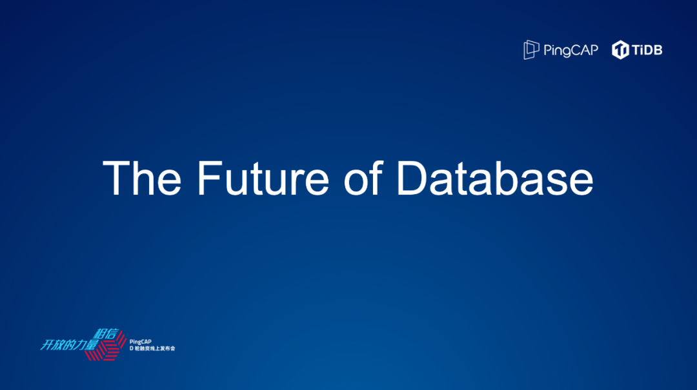

## TiDB 的现在和未来

大家好，我是黄东旭，是 PingCAP 的联合创始人和 CTO，这是 PingCAP 成立以来的第一次发布会，我想跟大家简单聊聊 TiDB 在产品和技术上的更新。考虑到线上的很多观众不一定是有很强的技术背景，我将尽我所能将技术的部分说得让大家都能够理解。

在讲正题之前有一个小故事，我们做基础软件的产品经理去跟客户聊需求的时候，客户经常都会说：对于数据库，我的要求特别简单、特别基础、非常朴素，我不要求很多功能，安全稳定是必须的，最好能高可用，性能一定要好，如果数据量大了，能实现弹性伸缩就更好了；另外，最好别让我学太多新东西，用起来跟过去使用的产品差不多，这就是一款完美的数据库产品。

就像大家在家里用自来水一样，我们对自来水的需求就是拧开水龙头水就能出来，但是背后自来水厂是怎么处理的大家不用知道，我们只需要根据实际情况使用冷水或者热水就好。但是从技术的角度来说，刚才类似冷热水这个非常朴素的基础需求，类比一下放到数据库的世界这就是一个图灵奖级别的基础需求，稍微解释一下图灵奖是计算机行业学术界最顶级的，相当于计算机界的诺贝尔奖。

这里有两位行业泰斗级的人物，左边 Leslie Lamport 在 2013 年研究相关问题拿了图灵奖，右边这位跟我们挺有缘的，发型跟（我们的 CEO）刘奇同学挺像，他是 UC 伯克利分校的一名教授，也是著名 CAP 定理的提出者，PingCAP 中的 CAP 就是来源于此。虽然看上去这个需求是一个很朴素的需求，但是这是一个值得去花很长时间研究，在技术领域很有挑战，也是一个很前沿的研究领域。

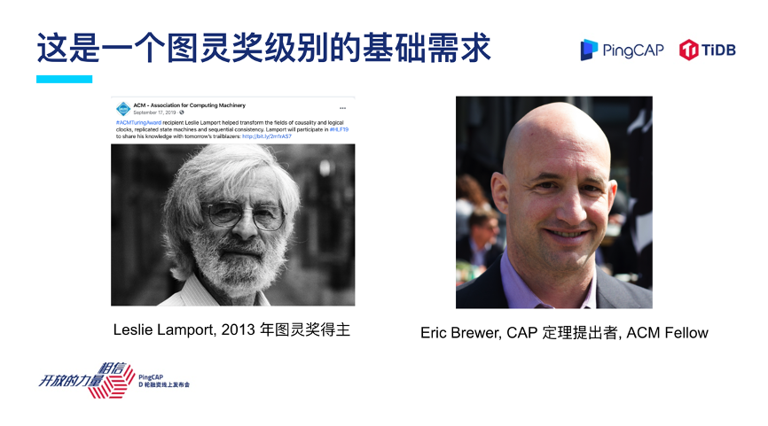

在聊数据库之前，我想带大家回顾一下十年前的电子产品，回顾一下我们当年的生活，大家回想一下十年前我们手上的数码产品有哪些，比如我们打电话有诺基亚，拍照有数码相机，也有用来做导航的独立设备 GPS，听歌用的 MP3 等等，种类繁多。

我们再来回顾一下这十年，这些东西好像在我们的生活中渐渐消失掉了，一台智能手机把很多这些碎片化的东西统一了起来，我觉得这背后一个很重要的点就是我们对于统一用户体验的追求驱动了整个科技界产品发生翻天覆地的变革，现在一台智能手机基本解决了我们生活中百分之七八十的数字化生活场景的需求。

## TiDB 是一个 HTAP 系统

接下来进入正题，PingCAP 是做数据库的厂商，如果我们拉一条数轴来看，左边的业务是更偏实时在线的业务，如果这条数轴的右边是离线业务的话，按照这个数轴来看，数据库这个产品大家可能印象中是在左边的，一些典型场景，比如像 Hadoop 或者一些数据仓库、报表是在右边。

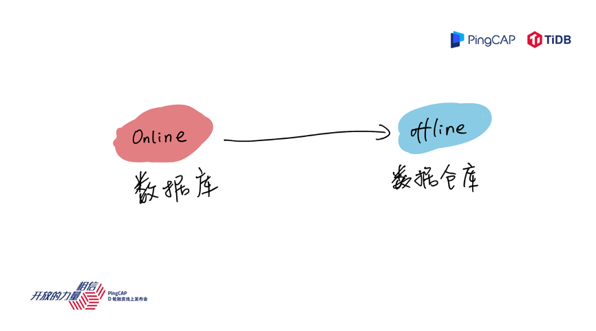

再看一个具体的业务场景，假设是一个公司要打造电商平台的 IT 系统，梳理一下现在电商平台内部有各种各样的应用和场景，我们按照这些场景放到这个数轴上，左边是在线，右边是离线，我们看到比如交易、订单管理、明细查询，这可能是偏在线的业务，用户用手机随时可以打开看；右边离线业务更像是内部运营人员，比如老板查看去年赚了多少钱，这种报表可能是一个更偏离线的业务。

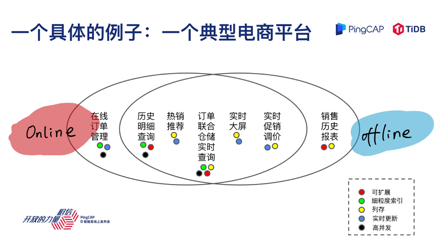

大家有没有发现中间有一些实时的报表，实时的促销调价，热销产品的推荐，你放在左边不合适，放在右边好像也不太对，所以中间部分是一个比较模糊的状态，这是一个业务的语言，比如我们把这个业务放到这条轴上去看，比如说我是电商平台的技术人员，业务人员告诉我，我们上面这些需求，这些需求翻译成技术的语言会变成什么样子呢？

就变成了各种各样的 OLTP 数据库和 OLAP 数据库和数据仓库，比如像 ClickHouse、Greenplum，像离线的数据仓库 Hadoop、HIVE，有很多同学不了解这些名词没关系，我只是想展现一下，业务需求翻译成技术语言，通常需要一系列复杂的数据技术栈来支撑。

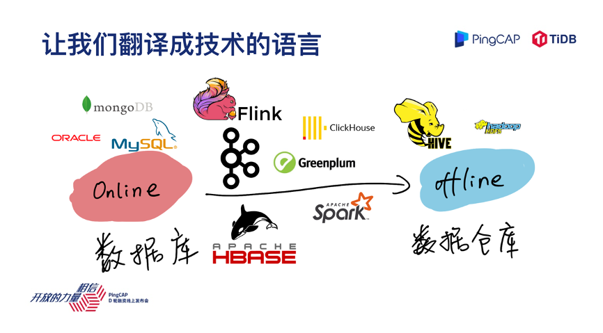

可能有很多观众学过计算机技术，我记得我在上大学的时候，我们有一门课是叫数据库系统，老师上课的时候教我数据库就是增删改查，就是存数据、取数据的一个系统、一个软件，几个关键的命令 INSERT\SELECT\UPDATE\DELETE，我回忆了一下好象也没有教哪些场景是 OLTP 的场景，哪些是 OLAP 的系统，并没有这么复杂。

**数据库应该就是存数据、取数据天经地义，就像水龙头一样一拧开就出水**，我还特地查了一下 database 的定义，在维基百科上面的定义其实并没有说 OLTP 的 database 或者 OLAP 的 database。

我知道这可能是一个细分的领域，但是从数据库这个词的本源来看，本质上像一个容器一样，存储数据和取数据的一个系统，好像也没什么复杂。

为什么今天很多工程师，很多用户就觉得这个数据库或者这个场景一定是个 OLTP，或者是个 OLAP ，要有一个泾渭分明的分类。就像刚才电商的例子，其实有大量中间的场景很难说到底是一个 OLTP 还是 OLAP 。但是现在的现实是对于很多 IT 系统、业务系统来说，对于实时性的要求越来越高，为了解决这个问题，我们构建了各种各样的数据孤岛，构建了各种各样的烟囱式系统。

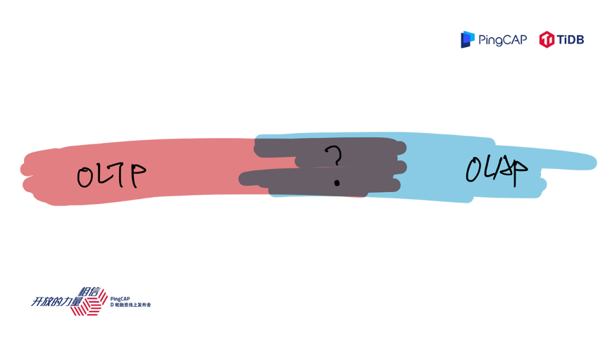

所以过去这种泾渭分明式的分类方式到底适不适用现在有越来越多实时性要求的时代呢？

回过头来思考这个分类是不是有问题的时候，作为一个理工男或者作为一个学理科出身的工程师，我们特别喜欢寻找一个定义或者寻找一个分类。我们找遍了各种各样的定义，从学术界、工业界、到各类咨询机构，发现 HTAP 是一个更加符合或者说更加适合现在 TiDB 应用场景的一个定义。

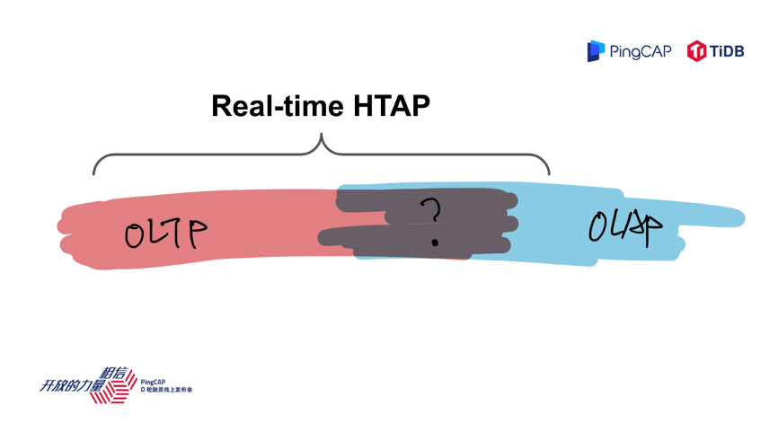

**TiDB 的定位是一个 Real-Time 的 HTAP 系统**，有很多朋友后来问我，TiDB 是一个 HTAP 系统，是不是就意味着你不是一个 OLTP 系统，或者说你到底是一个 OLTP 还是 OLAP？

我们回到智能手机的那个例子，首先智能手机一定是一个 100% 的手机，肯定能打电话，在打电话的基础上再加上很多其他的常用功能，比如相机、GPS、MP3等在一个系统里面搞定。我想强调的是 TiDB 的定位就是 Real-Time HTAP 系统，首先是一个 100% 的 OLTP 系统，同时还能支持一些 Real-Time OLAP Query。

讲到 TiDB，我其实很感慨，我一直看着这个产品一步步成长起来，最近这一年成长速度尤其快，现在我很高兴地看到 TiDB 4.0 已经成为社区的一个主流版本。

在 4.0 发布的时候，我当时很热情洋溢的发表了一段话，说这是一个非常具有里程碑意义的一个版本，事实上 TiDB 4.0 的表现我觉得是不负众望的，现在大家都非常喜欢，成为了主流。

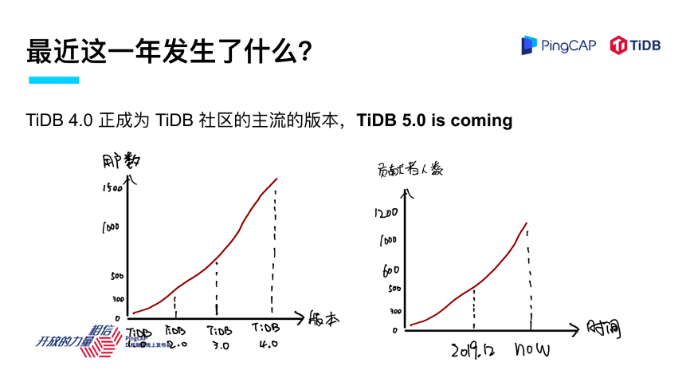

## 展望 TiDB 5.0

我想跟大家展望一下 TiDB 5.0，在讲 5.0 之前我想稍微强调一下 TiDB 做产品的思路。我们都是工程师出身，也比较接地气，不说什么高大上的，用大白话来说就四点：**稳、快、好用和用着放心**。前面提到过用户对于一个数据库产品的朴素需求，我们也是希望按照这种方式来做产品。

但在 TiDB 5.0 里面我们真正把一个具体的目标放到了产品规划的方向里面，那就是 TiDB 要走向各行各业的核心场景。之前，TiDB 从 2.0 到 3.0 和 4.0，已经开始慢慢地走向了各行各业，慢慢地渗透到一些对稳定性、对性能要求非常极致的场景，包括金融、银行的一些核心业务系统。

**在 TiDB 5.0 这个版本，我们第一次明确地提出，至少在产品层面上要达到各行业核心场景对于数据库性能和稳定性的要求**。

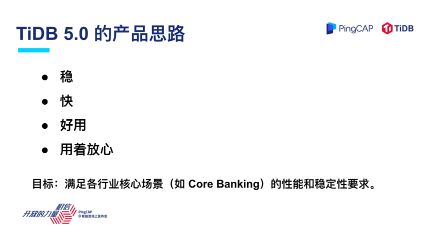

接下来具体谈谈 TiDB 5.0 在这几个方面的进展。

**首先第一点稳定性**，我经常说一句话：把一个东西做对其实是很难的，把一个数据库做出来不难，做对却很难，所以我们构建了各种各样的正确性的测试系统。现在 TiDB 已经做出来了，下一个阶段是更稳，但是要使得 TiDB 更加稳定还有很多的工作要做，这方面没有捷径，道理谁都懂，魔鬼在细节，只有做得越来越深，越来越细，我很高兴的看到，在 TiDB 5.0 中我们和用户一起把 TiDB 的稳定性又往前推进了一个级别。

下图是 5.0 在某个券商机构的测试结果，在 48 小时高压力的测试场景里面 TiDB 5.0 的系统抖动一直小于 5%，同时在性能上跟 4.0 相比有明显的提升。我想强调的是在做稳定性这件事情上，已经开始进入改革深水区，低垂的果实已经摘的差不多了，剩下就是一些场景和技术上比较硬的难题等着我们去攻克，我们很高兴地看到 5.0 对于 4.0 在稳定性上有比较出色的表现。

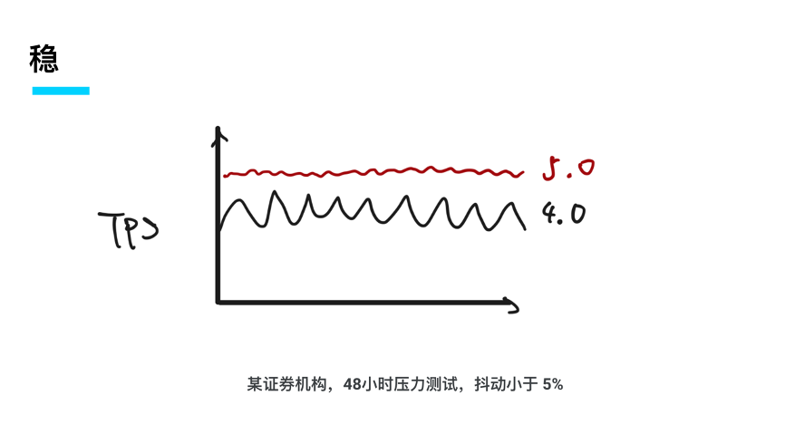

**第二，性能快**。天下武功，唯快不破，尤其是对于数据库这样的基础软件来说，特别是在一些核心应用场景，比如像银行的一些核心交易系统，一个毫秒的额外延迟可能就会对整体的系统和用户体验造成影响。

在 TiDB 5.0 里面我们很高兴地看到，对比 4.0 延迟几乎成倍地下降。这让我想到跟开发团队经常开的玩笑，说 TiDB 每个版本有点像摩尔定律，每一个版本比上一个版本性能提升一倍、延迟下降一倍、成本不变，未来成本还会持续下降。我很高兴看到 5.0 还是保持着这个规律，所以，性能快与延迟降低在 5.0 里面会是一个很重要的标签。

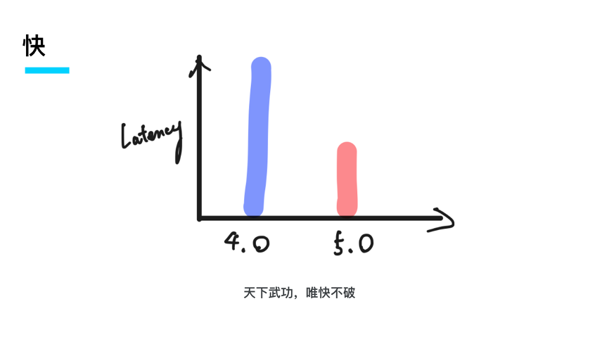

快的另外一个方面，首先熟悉 TiFlash 的同学看到标题肯定会心一笑，我们之前有提到  TiDB 是一个 Real-Time HTAP 架构，AP 这部分是由 TiFlash 分析加速引擎来提供服务的。在  5.0 里面 TiFlash 将支持分布式的聚合和分布式的计算（MPP），能让整个 TiDB 的 OLAP 能力真正延伸到更多的应用场景，应对更多更复杂的 JOIN 场景。

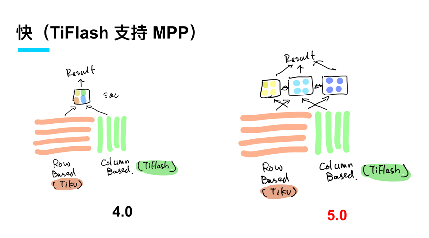

**好用，这个方面我想强调的有两点**。

首先，大家看到跨数据中心、跨地域一个部署，很多做分布式系统的同学会觉得很兴奋，TiDB 终于可以支持做 Geo-Partition（多地多活跨地域数据分布） 。我稍微解释一下，TiDB 是一个分布式数据库，所以有很多用户、很多开发者希望 TiDB 可以实现真正的跨长距离或者跨多个数据中心的部署，可以在全国或者全球都组成一个大的网络。

其次，打通多个流行数据处理栈生态和提供全链路追踪系统，也将使得 TiDB 5.0 变得更加好用。

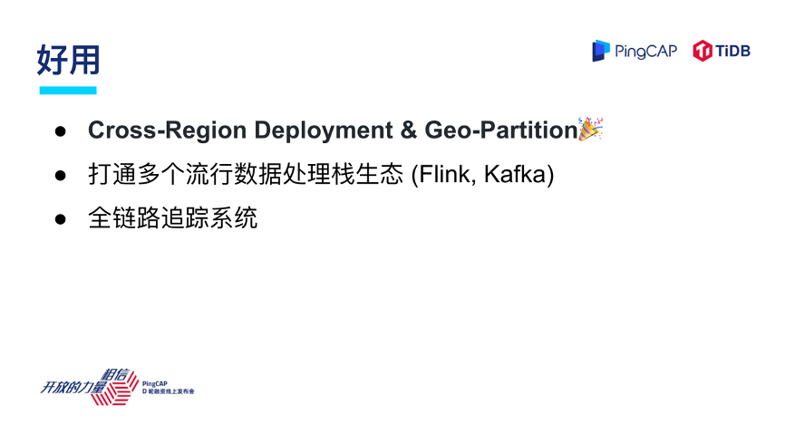

提到 Geo-Partion，实际上，有很多客户有这样的场景需求，特别是对于一些海外客户，比如一家欧洲公司的业务遍布全球，这时候如果有一个数据库系统，能够支持全球跨长距离的区域部署，能够在不同的国家、不同的位置随时提供服务，运维方面也省去了部署多套技术栈和数据库系统的成本，这对于客户来说就是一个理想之选。

举个例子，我们刚才提到多地部署，怎么降低本地的延迟，如果是一个欧洲公司，大家知道欧洲有很严格的 GDPR，企业的数据不能出境，这种场景下 Geo-Partition 就是一个非常实用的特性。

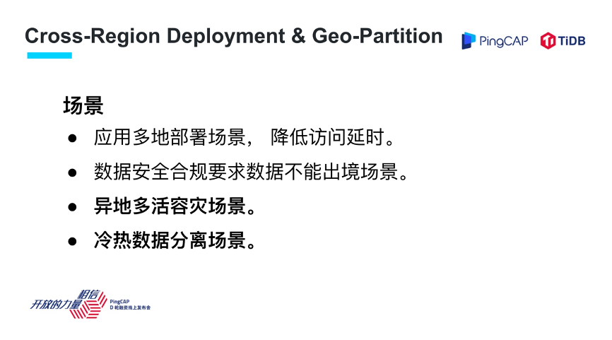

如果是现在的 TiDB 去做这件事情，比如说在欧洲、中国、美国同时提供服务，在一些场景下的数据库性能和延迟可能会不太理想，因为需要到一个中央的服务器上去处理，去拿时间戳，然后才能提供服务。

在 TiDB 5.0 里面，我们将中央的授时服务改成了一个分布式授时的服务，能够让这个系统在本地或者在多数据中心场景里面的性能表现更佳。

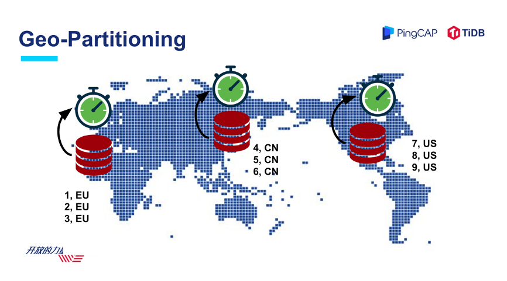

第二个方面是 TiDB 的“朋友”越来越多，作为一个基础软件，虽然 TiDB 的目标是尽可能的把很多场景统一，但我觉得 TiDB 跟业界其他生态技术栈的互联互通也是一个非常重要的方面。

现在对于 TiDB 来说，已经能够与 Flink、Kafka、Spark，包括 Hadoop、AWS S3 以及 MySQL、Oracle 这些传统的数据库进行互联互通。

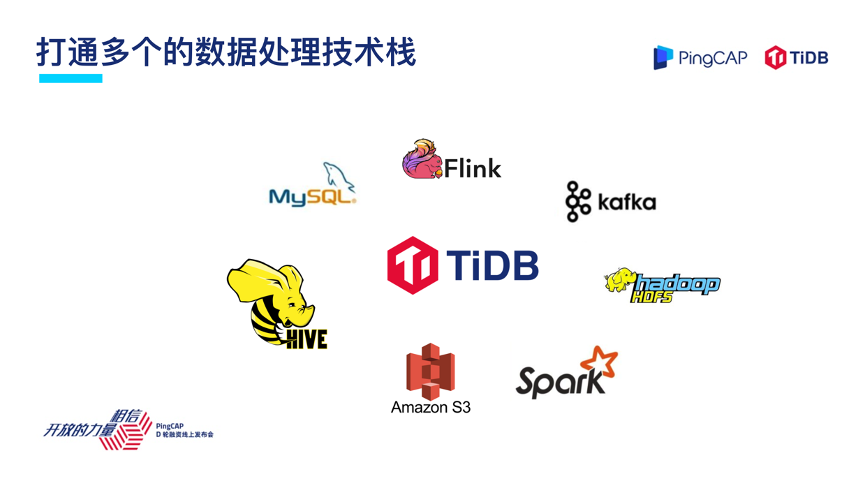

举一个具体用户的例子，这是一个在线的实时数仓业务，线上的业务持续在做交易，在做写入，同时这些数据通过 TiDB TiCDC 增量订阅模块输出到 Kafka，同步到 Flink 流式计算引擎去做归纳、聚合与分析，然后再重新写回到 TiDB。写入到 TiDB 的这些数据再去对在线业务进行补充，TiDB 结合 Kafka、Flink 组成了一个简单易用的实时数仓架构。

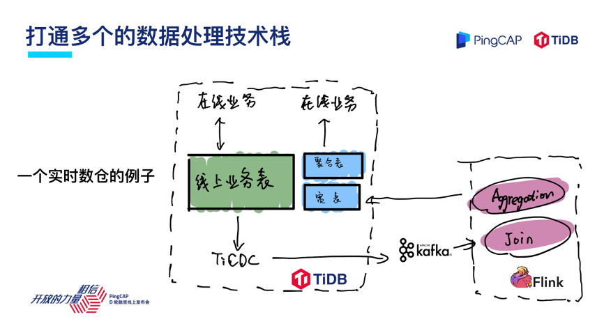

说到安全，对于数据库来说，安全其实是非常重要的，在我们的产品规划里面，安全是放在很高优先级的特性。

我想强调，在 4.0 里面 TiKV 存储层已经支持全链路的数据透明加密。在 DBaaS 平台里面，我们正在引入 RBAC，就是基于用户身份的鉴权系统，同时我们会跟 AWS 的身份认证系统进行打通，给用户提供更加安全、更加可靠的产品与服务保障。

在安全合规方面，随着 TiDB 越来越多地应用在国内、国外一些关键的业务场景，不同的国家，不同的应用场景对于合规的要求呈现多样化特点， TiDB 已经通过了 SOC2Type1 认证，这是在美国金融行业里面非常认可的合规标准，未来我们将在合规上面投入更多的精力。

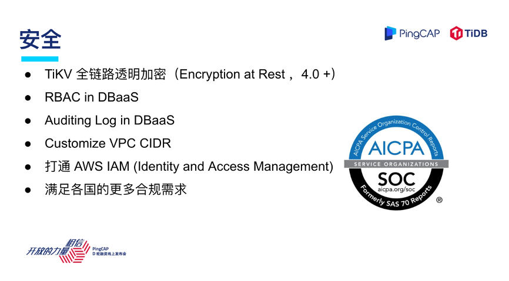

## 未来的数据库是什么样子？

前面是对于 TiDB 5.0 在现在这个时间点的进展同步。但是未来在哪里？

我们每一个分享最后的部分会讲讲到底未来应该是什么样子的，我觉得在比较近的未来，TiDB 一个重要的方向是更加云化。为什么云如此重要？数据库云化的背后我觉得可以展开几点：

- 一个是 Serverless；

- 二是智能的调度能力；

- 第三是利用云的基础设施降低成本。

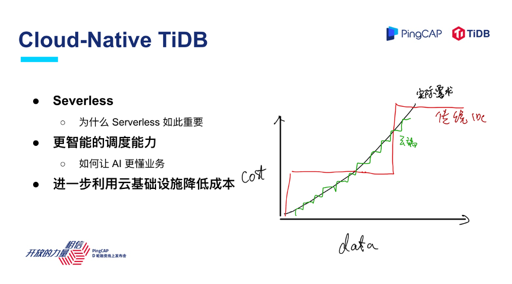

为什么说云如此重要？大家可以看到右边这张图，横轴是数据量和业务需求，纵轴是企业在 IT 上投入的成本，在云诞生之前我们在去做面向不确定性的业务，面向暴涨的数据量，如果采用传统的 IDC 部署方式，成本和投入的曲线跟实际的需求不能完全吻合，其实存在很多资源的浪费。

首先，只有云真正把整个基础软件的商业模式变成了 pay as you go，尽可能地贴合业务的增长曲线，对于数据库这样很重要的基础软件来说，在云上利用云的弹性能够去更合理地满足业务的实际需求。

第二，云很好地屏蔽了底层基础架构实现的复杂性，对于做基础软件的人来说，这具有划时代的意义。比如说利用云的弹性调度能力以及一些 AI 新技术，使得这个系统更好地理解业务的需求，更加智能地规划该把数据放置在什么地方，该建立什么样的索引。

第三，云是很好的基础设施，面向云时代的基础设施如何去设计下一代的基础软件，我觉得是一个很重要的课题。最近关注技术圈的朋友，Snowflake 的消息令大家非常振奋，Snowflake 在技术上的选择也带给我很多启发，怎么通过云的基础设施来打造新一代的基础软件。

以上是我对近期未来的一些展望和看法。最后我想强调的是，回归初心我们想做的事情就是让数据库真正回归原本的样子，把复杂性隐藏在背后，为用户提供一个使用门槛很低，解放大家生产力的好产品，谢谢大家！
