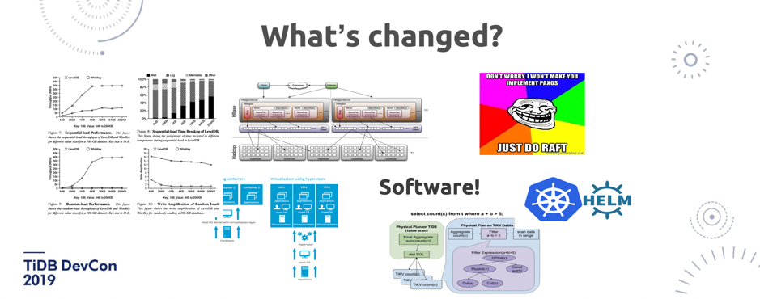
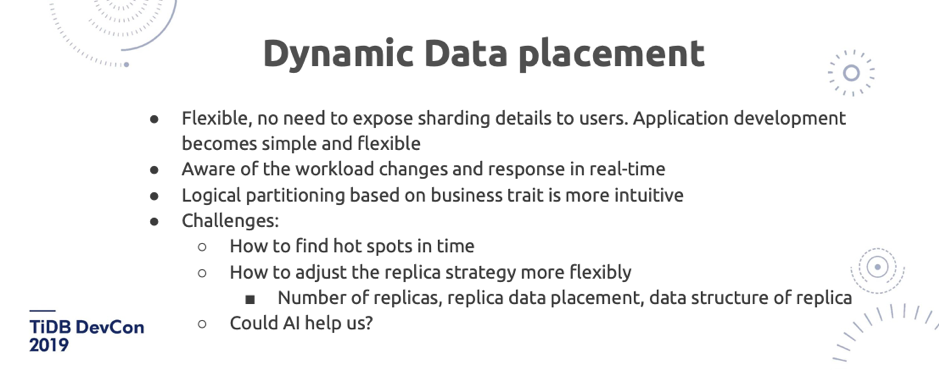
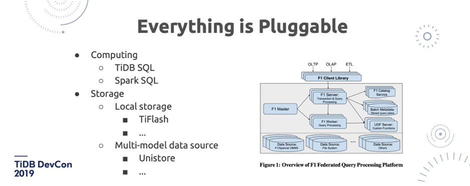

>在 TiDB DevCon 2019 上，我司联合创始人兼 CTO 黄东旭分享了对数据库行业大趋势以及未来数据库技术的看法。以下是演讲实录，enjoy~ 

我司联合创始人兼 CTO 黄东旭

大家今天在这里看到了 TiDB 社区用户实践分享和我们自己的一些技术进展和展望，还有非常好玩的 Demo Show，正好在大会结束之前，我想跟大家聊一聊我心目中未来的 Database 应该是一个什么样子。

其实我们并不是一个特别擅长发明名词的公司，我记得我们第一次去用 HTAP 这个词的时候，应该是 2016 左右。在使用 HTAP 这个词的时候，我们市场部同事还跟我们说 HTAP 这个词从来没人用过，都是论文里的词，大家都不知道，你把你们公司的产品定位改成这个别人都不知道怎么办？我们后来仔细想，还是觉得 HTAP 这个方向是一个更加适合我们的方向，所以还是选了 HTAP 这个词。现在很欣喜的看到现在各种友商、后来的一些数据库，都开始争相说 HTAP，就是说得到了同行的认可。

那么在 HTAP 的未来应该是一个什么样子，我希望能够在今年这个 Talk 里面先说一说，但是这个题目起的有点不太谦虚，所以我特地加了一个「Near」， 分享一下这一年、两年、三年我们想做什么，和对行业大趋势的展望。

图1

**今天我们的分享的一个主题就是：「我们只做用户想要的东西，并不是要去做一个完美的东西」**。其实很多工程师包括我们自己，都会有一个小小的心理的洁癖，就是想要做一个超级快、超级牛的东西，但是做出来一个数据库，单机跑分一百万 TPS ，其实用户实际业务就需要 3000，然后所有的用户还会说我需要这些东西，比如需要 Scalability（弹性扩展）， Super Large 的数据量，最好是我的业务一行代码都不用改，而且 ACID 能够完全的满足，怎么踹都踹不坏，机器坏了可以高可用，业务层完全不用动， 另外可以在跑 OLTP 的同时，完全不用担心任何资源隔离地跑 OLAP（这里不是要说大家的愿望不切实际，而是非常切实际，我们也觉得数据库本身就应该是这样的。所以大家记住这几个要点，然后慢慢看 TiDB 到底是不是朝着这个方向发展的）。**本质上来说用户的需求就是「大一统」。看过《魔戒》的同学都知道这句话 ：ONE RING TO RULE THEM ALL，就是一套解决方案去解决各种问题**。

过去很多，包括一些行业的大佬之前说在各种环境下都要出一个数据库来解决特定的一个问题，但是其实看上去我们想走的方案还是尽可能在一个平台里面，尽可能大范围去解决用户的问题。因为不同的产品之间去做数据的交互和沟通，其实是蛮复杂的。

图 2 理想中的「赛道」

这张图（图 2）什么意思呢？就是很多人设计系统的时候，总是会陷入跑分思维，就是说这个东西在实验室或者说在一个特定的 Workload 下，跑得巨快无比。如果大家去看一下大概 2000 年以后关于数据库的论文，很多在做一个新的模型或者新的系统的时候，都会说 TPCC 能够跑到多大，然后把 Oracle 摁在地上摩擦，这样的论文有很多很多很多。但是大家回头看看 Oracle 还是王者。所以大多数实验室的产品和工程师自己做的东西都会陷入一个问题，就是想象中的我的赛道应该是一个图 2 那样的，但实际上用户的业务环境是下面这样的（图 3）。很多大家在广告上看到特别牛的东西，一放到生产环境或者说放到自己的业务场景里面就不对了，然后陷入各种各样的比较和纠结的烦恼之中。

图 3 实际上用户的业务环境

TiDB 的定位或者说我们想做的事情，并不是在图 2 那样的赛道上，跑步跑得巨快，全世界没人在短跑上跑得过我，我们不想做这样。或者说，**我们其实也能跑得很快，但是并不想把所有优势资源全都投入到一个用户可能一辈子都用不到的场景之中。我们其实更像是做铁人三项的，因为用户实际应用场景可能就是一个土路。这就是为什么 TiDB 的设计放在第一位的是「稳定性」**。

我们一直在想能不能做一个数据库，怎么踹都踹不坏，然后所有的异常的状况，或者它的 Workload  都是可预期的。我觉得很多人远远低估了这个事情的困难程度，其实我们自己也特别低估了困难程度。大概 4 年前出来创业的时候，我们就是想做这么一个数据库出来，我跟刘奇、崔秋三个人也就三个月做出来了。但是到现在已经 4 年过去了，我们的目标跟当年还是一模一样。不忘初心，不是忘不掉，而是因为初心还没达到，怎么忘？其实把一个数据库做稳，是很难很难的。

图 4 近年来硬件的发展

**而且我们这个团队的平均年龄可能也就在二十到三十岁之间，为什么我们如此年轻的一个团队，能够去做数据库这么古老的一件事情。其实也是得益于整个 IT 行业这几年非常大的发展**。图 4 是这几年发展起来的 SSD，内存越来越大，万兆的网卡，还有各种各样的多核的 CPU，虚拟化的技术，让过去很多不可能的事情变成了可能。

举一个例子吧，比如极端一点，大家可能在上世纪八九十年代用过这种 5 寸盘、3 寸盘，我针对这样的磁盘设计一个数据结构，现在看上去是个笑话是吧？因为大家根本没有人用这样的设备了。在数据库这个行业里面很多的假设，在现在新的硬件的环境下其实都是不成立的。比如说，为什么 B-Tree 就一定会比 LSM-Tree 要快呢？不一定啊，我跑到 Flash 或者 NVMe SSD 、Optane 甚至未来的持久化内存这种介质上，那数据结构设计完全就发生变化了。过去可能需要投入很多精力去做的数据结构，现在暴力就好了。

图 5 近年来软件变革

同时在软件上也发生了很多很多的变革，图 5 左上角是 Wisckey 那篇论文里的一个截图，还有一些分布式系统上的新的技术，比如 2014 年 Diego 发表了 Raft 这篇论文，另外 Paxos 这几年在各种新的分布式系统里也用得越来越多。

**所以我觉得这几年我们赶上了一个比较好的时代，就是不管是软件还是硬件，还是分布式系统理论上，都有了一些比较大突破，所以我们基础才能够打得比较好**。

图 6  Data Type

除了有这样的新的硬件和软件之外，我觉得在业务场景上也在发生一些比较大变化。过去，可能十年前就是我刚开始参加工作的时候，线上的架构基本就是在线和离线两套系统，在线是 Oracle 和 MySQL，离线是一套 Hadoop 或者一个纯离线的数据仓库。**但最近这两年越来越多的业务开始强调敏捷、微服务和中台化，于是产生了一个新的数据类型，就是 warm data，它需要像热数据这样支持 transaction、支持实时写入，但是需要海量的数据都能存在这个平台上实时查询， 并不是离线数仓这种业务**。

所以对 warm data 来说，过去在 TiDB 之前，其实是并没有太好的办法去很优雅的做一层大数据中台架构的，**「the missing part of modern data processing stack」，就是在 warm data 这方面，TiDB 正好去补充了这个位置，所以才能有这么快的增长**。当然这个增长也是得益于 MySQL 社区的流行。

图 7 应用举例

想象一下，我们如果在过去要做这样很简单的业务（图 7），比如在美国的订单库跟在中国的订单库可能都是在不同的数据库里，用户库可能是另外一个库，然后不同的业务可能是操作不同的库。如果我想看看美国的消费者里面有哪些在中国有过消费的，就是这么一条 SQL。过去如果没有像 TiDB 这样的东西，大家想象这个东西该怎么做？

图 8 过去的解决方案

假如说这两边的数据量都特别大，然后已经分库分表了。过去可能只能第二天才可以看到前一天的数据，因为中间比如说一个 T+1  要做一个 ETL 到一个 data ware house 里。或者厉害一点的架构师可能会说，我可以做一套实时的 OLAP 来做这个事情，怎么做呢？比如说 MySQL 中间通过一个 MQ 再通过 Hadoop 做一下 ETL，然后再导到 Hadoop 上做一个冷的数据存储，再在上面去跑一个 OLAP 做实时的分析。先不说这个实时性到底有多「实时」，大家仔细算一算，这套架构需要的副本数有多少，比如 M 是我的业务数，N 是每一个系统会存储的 Replica，拍脑袋算一下就是下面这个数字（图 9 中的 **R** ）。

图 9 过去解决方案里需要的 Replica 数量

所以大家其实一开始在过去说，TiDB 这个背后这么多 Replica  不好，但其实你想想，你自己在去做这个业务的时候，大家在过去又能怎么样呢？所以我觉得 TiDB 在这个场景下去统一一个中台，是一个大的趋势。今天在社区实践分享上也看到很多用户都要提到了 TiDB 在中台上非常好的应用。

图 10 现在的解决方案 

**回顾完行业和应用场景近年来的一些变化之后，我们再说说未来。假设要去做一个面向未来的数据库，会使用哪些技术？**

## 1. Log is the new database

第一个大的趋势就是日志，「log is the new database」 这句话应该也是业界的一个共识吧。现在如果有一个分布式数据库的复制协议，还是同步一个逻辑语句过去，或者做 binlog 的复制，那其实还算比较 low 的。

图 11  Log is the new database 

上面图 11 左半部分是 Hyper，它是慕尼黑工业大学的一个实验性数据库项目，它做了一些分析，第一个柱形是正常的 SQL 语句的执行时间，比如说直接把一语句放到另外一个库里去执行，耗时这么多。第二个柱形是用逻辑日志去存放，耗时大概能快 23%，第三个柱形能看到如果是存放物理日志能快 56%。所以大家仔细想想，**TiDB 的架构里的 TiFlash 其实同步的是 Raft 日志，而并不是同步 Binlog 或者其他的**。

上面图 11 右半部分是 Aurora，它的架构就不用说了，同步的都是 redo log 。其实他的好处也很明显，也比较直白，就是 I/O 更小，网络传输的 size 也更小，所以就更快。

然后在这一块 TiDB 跟传统的数据库有点不一样的就是，其实如果很多同学对 TiDB 的基础架构不太理解的话就觉得， Raft 不是一个一定要有 Index 或者说是一定强顺序的一个算法吗？那为什么能做到这样的乱序的提交？**其实 TiDB 并不是单 Raft 的架构，而是一个多 Raft 的架构，I/O 可以发生在任何一个 Raft Group 上**。传统的单机型数据库，就算你用更好的硬件都不可能达到一个线性扩展，因为无论怎么去做，都是这么一个架构不可改变。比如说我单机上 Snapshot  加 WAL，不管怎么写， 总是在 WAL  后面加，I/O 总是发生在这。但 TiDB 的 I/O 是分散在多个 Raft Group、多个机器上，这是一个很本质的变化，这就是为什么在一些场景下，TiDB 能够获取更好的吞吐。

## 2. Vectorized

第二个大趋势是全面的向量化。向量化是什么意思？我举个简单的例子。比如我要去算一个聚合，从一个表里面去求某一列的总量数据，如果我是一个行存的数据库，我只能把这条记录的 C 取出来，然后到下一条记录，再取再取再取，整个 Runtime 的开销也好，还有去扫描、读放大的每一行也好，都是很有问题的。但是如果在内存里面已经是一个列式存储，是很紧凑的结构的话，那会是非常快的。

图 12 TiDB 向量化面临的挑战

这里面其实也有一些挑战。我们花了大概差不多 2018 年一年的时间去做向量化的改造，其实还挺难的。为什么？首先 TiDB SQL 引擎是用了 Volcano 模型，这个模型很简单，就是遍历一棵物理计划的树，不停的调 Next，每一次 Next 都是调用他的子节点的 Next，然后再返回结果。这个模型有几个问题：第一是每一次都是拿一行，导致 CPU 的 L1、L2 这样的缓存利用率很差，就是说没有办法利用多 CPU 的 Cache。第二，在真正实现的时候，它内部的架构是一个多级的虚函数调用。大家知道虚函数调用在 Runtime  本身的开销是很大的，在[《MonetDB/X100: Hyper-Pipelining Query Execution》](http://cidrdb.org/cidr2005/papers/P19.pdf)里面提到，在跑 TPC-H 的时候，Volcano 模型在 MySQL 上跑，大概有 90% 的时间是花在 MySQL 本身的 Runtime  上，而不是真正的数据扫描。所以这就是 Volcano 模型一个比较大的问题。第三，如果使用一个纯静态的列存的数据结构，大家知道列存特别大问题就是它的更新是比较麻烦的， 至少过去在 TiFlash 之前，没有一个列存数据库能够支持做增删改查。那在这种情况下，怎么保证数据的新鲜？这些都是问题。

图 13 TiDB SQL 引擎向量化

TiDB 已经迈出了第一步，我们已经把 TiDB SQL 引擎的 Volcano 模型，从一行一行变成了一个 Chunk 一个 Chunk，每个 Chunk 里面是一个批量的数据，所以聚合的效率会更高。而且在 TiDB 这边做向量化之外，我们还会把这些算子推到 TiKV 来做，然后在 TiKV 也会变成一个全向量化的执行器的框架。

## 3. Workload Isolation

另外一个比较大的话题，是 Workload Isolation。今天我们在演示的各种东西都有一个中心思想，就是怎么样尽可能地把 OLTP 跟 OLAP 隔离开。这个问题在业界也有不同的声音，包括我们的老前辈 Google Spanner，他们其实是想做一个新的数据结构，来替代 Bigtable-Like SSTable 数据结构，这个数据结构叫 Ressi，大家去看 2018 年 《Spanner: Becoming a SQL System》这篇 Paper 就能看到。它其实表面上看还是行存，但内部也是一个 Chunk 变成列存这样的一个结构。但我们觉得即使是换一个新的数据结构，也没有办法很好做隔离，因为毕竟还是在一台机器上，在同一个物理资源上。最彻底的隔离是物理隔离。

图 14 TiFlash 架构

我们在 TiFlash 用了好几种技术来去保证数据是更新的。一是增加了 Raft Leaner，二是我们把 TiDB 的 MVCC 也实现在了 TiFlash 的内部。第三在 TiFlash 这边接触了更新（的过程），在 TiFlash 内部还有一个小的 Memstore，来处理更新的热数据结果，最后查询的时候，是列存跟内存里的行存去 merge 并得到最终的结果。**TiFlash 的核心思想就是通过 Raft 的副本来做物理隔离**。

这个有什么好处呢？这是我们今天给出的答案，但是背后的思考，到底是什么原因呢？为什么我们不能直接去同步一个 binlog 到另外一个 dedicate 的新集群上（比如 TiFlash 集群），而一定要走 Raft log？**最核心的原因是，我们认为 Raft log 的同步可以水平扩展的**。因为 TiDB 内部是 Mult-Raft 架构，Raft log 是发生在每一个 TiKV 节点的同步上。大家想象一下，如果中间是通过 Kafka 沟通两边的存储引擎，那么实时的同步会受制于中间管道的吞吐。比如图 14 中绿色部分一直在更新，另一边并发写入每秒两百万，但是中间的 Kafka 集群可能只能承载 100 万的写入，那么就会导致中间的 log 堆积，而且下游的消费也是不可控的。**而通过 Raft 同步， Throughput 可以根据实际存储节点的集群大小，能够线性增长。这是一个特别核心的好处**。

## 4. SIMD

说完了存储层，接下来说一说执行器。TiDB 在接下来会做一个很重要的工作，就是全面地 leverage  SIMD 的计算。我先简单科普一下 SIMD 是什么。

图 15 SIMD 原理举例（1/2）

如图 15，在做一些聚合的时候，有这样一个函数，我要去做一个求和。正常人写程序，他就是一个 for 循环，做累加。但是在一个数据库里面，如果有一百亿条数据做聚合，每一次执行这条操作的时候，CPU 的这个指令是一次一次的执行，数据量特别大或者扫描的行数特别多的时候，就会很明显的感受到这个差别。

图 16 SIMD 原理举例（2/2）

现代的 CPU 会支持一些批量的指令，比如像 _mm_add_epi32，可以一次通过一个32 位字长对齐的命令，批量的操作 4 个累加。看上去只是省了几个 CPU 的指令，但如果是在一个大数据量的情况下，基本上能得到 4 倍速度的提升。

**顺便说一句，有一个很大的趋势是 I/O 已经不是瓶颈了**，大家一定要记住我这句话。再过几年，如果想去买一块机械磁盘，除了在那种冷备的业务场景以外，我相信大家可能都要去定制一块机械磁盘了。未来一定 I/O 不会是瓶颈，那瓶颈会是什么？CPU。**我们怎么去用新的硬件，去尽可能的把计算效率提升，这个才是未来我觉得数据库发展的重点**。比如说我怎么在数据库里 leverage GPU 的计算能力，因为如果 GPU 用的好，其实可以很大程度上减少计算的开销。所以，如果在单机 I/O 这些都不是问题的话，下一个最大问题就是怎么做好分布式，这也是为什么我们一开始就选择了一条看上去更加困难的路：我要去做一个 Share-nothing 的数据库，并不是像 Aurora 底下共享一个存储。

## 5. Dynamic Data placement

图 17 Dynamic Data placement (1/2)分库分表方案与 TiDB 对比

在今天大家其实看不到未来十年数据增长是怎样的，回想十年前大家能想到现在我们的数据量有这么大吗？不可能的。所以新的架构或者新的数据库，一定要去面向我们未知的 Scale 做设计。比如大家想象现在有业务 100T 的数据，目前看可能还挺大的，但是有没有办法设计一套方案去解决 1P、2P 这样数据量的架构？**在海量的数据量下，怎么把数据很灵活的分片是一个很大的学问**。

为什么分库分表在对比 TiDB 的时候，我们会觉得分库分表是上一代的方案。这个也很好理解，核心的原因是分库分表的 Router 是静态的。如果出现分片不均衡，比如业务可能按照 User ID 分表，但是发现某一地方/某一部分的 User ID 特别多，导致数据不均衡了，这时 TiDB 的架构有什么优势呢？就是 TiDB 彻底把分片这个事情，从数据库里隔离了出来，放到了另外一个模块里。**分片应该是根据业务的负载、根据数据的实时运行状态，来决定这个数据应该放在哪儿。这是传统的静态分片不能相比的，不管传统的用一致性哈希，还是用最简单的对机器数取模的方式去分片（都是不能比的）**。

在这个架构下，甚至未来我们还能让 AI 来帮忙。把分片操作放到 PD 里面，它就像一个 DBA 一样，甚至预测 Workload 给出数据分布操作。比如课程报名数据库系统，系统发现可能明天会是报名高峰，就事先把数据给切分好，放到更好的机器上。这在传统方案下是都需要人肉操作，其实这些事情都应该是自动化的。

图 18 Dynamic Data placement (2/2)

**Dynamic Data placement 好处首先是让事情变得更 flexible ，对业务能实时感知和响应**。另外还有一点，为什么我们有了 Dynamic Placement 的策略，还要去做 Table Partition（[今天上午申砾也提到了](https://zhuanlan.zhihu.com/p/57749943)）？Table Partition 在背后实现其实挺简单的。相当于业务这边已经告诉我们数据应该怎么分片比较好，我们还可以做更多针对性的优化。这个 Partition 指的是逻辑上的 Partition ，是可能根据你的业务相关的，比如说我这张表，就是存着 2018 年的数据，虽然我在底下还是 TiDB 这边，通过 PD 去调度，但是我知道你 Drop 这个 Table 的时候，一定是 Drop 这些数据，所以这样会更好，而且更加符合用户的直觉。

但这样架构仍然有比较大的挑战。当然这个挑战在静态分片的模型上也都会有。比如说围绕着这个问题，我们一直在去尝试解决怎么更快的发现数据的热点，比如说我们的调度器，如果最好能做到，比如突然来个秒杀业务，我们马上就发现了，就赶紧把这块数据挪到好的机器上，或者把这块数据赶紧添加副本，再或者把它放到内存的存储引擎里。这个事情应该是由数据库本身去做的。所以为什么我们这么期待 AI 技术能够帮我们，是因为虽然在 TiDB 内部，用了很多规则和方法来去做这个事情，但我们不是万能的。

## 6. Storage and Computing Seperation

图 19 存储计算分离

还有大的趋势是存储计算分离。我觉得现在业界有一个特别大的问题，就是把存储计算分离给固化成了某一个架构的特定一个指代，比如说只有长的像 Aurora 那样的架构才是存储计算分离。那么 TiDB 算存储计算分离吗？我觉得其实算。**或者说存储计算分离本质上带来的好处是什么？就是我们的存储依赖的物理资源，跟计算所依赖的物理资源并不一样。这点其实很重要**。就用 TiDB 来举例子，比如计算可能需要很多 CPU，需要很多内存来去做聚合，存储节点可能需要很多的磁盘和 I/O，如果全都放在一个组件里 ，调度器就会很难受：我到底要把这个节点作为存储节点还是计算节点？其实在这块，可以让调度器根据不同的机型（来做决定），是计算型机型就放计算节点，是存储型机型就放存储节点。

## 7. Everything is Pluggable

图 20 Everything is Pluggable

今天由于时间关系没有给大家演示的**插件平台**。未来 TiDB 会变成一个更加灵活的框架，像图 20 中 TiFlash 是一个 local storage，我们其实也在秘密研发一个新的存储的项目叫 Unitstore，可能明年的 DevCon 就能看到它的 Demo 了。在计算方面，每一层我们未来都会去对外暴露一个非常抽象的接口，能够去 leverage 不同的系统的好处。今年我其实很喜欢的一篇 Paper 是 [F1 Query](https://mp.weixin.qq.com/s/PrX0yhGkoPzQUZFQ2EkIbw) 这篇论文，基本表述了我对一个大规模的分布式系统的期待，架构的切分非常漂亮。

## 8. Distributed Transaction

图 21 Distributed Transaction（1/2）

说到分布式事务，我也分享一下我的观点。**目前看上去，ACID 事务肯定是必要的**。我们仍然还没有太多更好的办法，除了 Google 在这块用了原子钟，Truetime 非常牛，我们也在研究各种新型的时钟的技术，但是要把它推广到整个开源社区也不太可能。当然，时间戳，不管是用硬件还是软件分配，仍然是我们现在能拥有最好的东西， 因为如果要摆脱中心事务管理器，时间戳还是很重要的。**所以在这方面的挑战就会变成：怎么去减少两阶段提交带来的网络的 round-trips？或者如果有一个时钟的 PD 服务，怎么能尽可能的少去拿时间戳？**

图 22 Distributed Transaction（2/2）

我们在这方面的理论上有一些突破，我们把 Percolator 模型做了一些优化，能够在数学上证明，可以少拿一次时钟。虽然我们目前还没有在 TiDB 里去实现，但是我们已经把数学证明的过程已经开源出来了，我们用了 [TLA+ 这个数学工具去做了证明](https://github.com/pingcap/tla-plus/blob/master/OptimizedCommitTS/OptimizedCommitTS.tla)。此外在 PD 方面，我们也在思考是不是所有的事务都必须跑到 PD 去拿时间戳？其实也不一定，我们在这上面也已有一些想法和探索，但是现在还没有成型，这个不剧透了。另外我觉得还有一个非常重要的东西，就是 Follower Read。很多场景读多写少，读的业务压力很多时候是要比写大很多的，Follower Read 能够帮我们线性扩展读的性能，而且在我们的模型上，因为没有时间戳 ，所以能够在一些特定情况下保证不会去牺牲一致性。

## 9. Cloud-Native Architecture

图 23 Cloud-Native

另外一点就是 Cloud-Native。刚刚中午有一个社区小伙伴问我，你们为什么不把多租户做在 TiDB 的系统内部？**我想说「数据库就是数据库」，它并不是一个操作系统，不是一个容器管理平台。我们更喜欢模块和结构化更清晰的一个做事方式。**而且 Kubernetes 在这块已经做的足够好了 ，我相信未来 K8s 会变成集群的新操作系统，会变成一个 Linux。比如说如果你单机时代做一个数据库，你会在你的数据库里面内置一个操作系统吗？肯定不会。所以这个模块抽象的边界，在这块我还是比较相信 K8s 的。《Large-scale cluster management at Google with Borg》这篇论文里面提到了一句话，BigTable 其实也跑在 Borg 上。

图 24 TiDB 社区小伙伴的愿望列表

当然最后，大家听完这一堆东西以后，回头看我们社区小伙伴们的愿望列表（图 24），就会发现对一下 TiDB 好像还都能对得上 :D 

谢谢大家。

>1 月 19 日 TiDB DevCon 2019 在北京圆满落幕，超过 750 位热情的社区伙伴参加了此次大会。会上我们首次全面展示了全新存储引擎 Titan、新生态工具 TiFlash 以及 TiDB 在云上的进展，同时宣布 TiDB-Lightning Toolset & TiDB-DM 两大生态工具开源，并分享了  TiDB 3.0 的特性与未来规划，描述了我们眼中未来数据库的模样。此外，更有 11 位来自一线的 TiDB 用户为大家分享了实践经验与踩过的「坑」。同时，我们也为新晋 TiDB Committer 授予了证书，并为 2018 年最佳社区贡献个人、最佳社区贡献团队颁发了荣誉奖杯。

