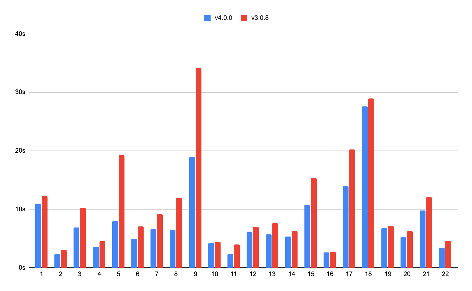

在上篇文章中，我司 CTO 黄东旭分享了 [我们对“未来数据库”的展望](https://pingcap.com/blog-cn/talk-about-the-future-of-databese-on-5th-anniversary-of-pingcap/)，很高兴我们一直走在「写一个更好的数据库」的初心之路上。**4 月 8 日是 PingCAP 成立五周年的日子，我们也在这一天发布了具有里程碑意义的 TiDB 4.0 首个 RC 版本。**

在 4.0 里我们完成了很多重要的、很有潜力的特性，本文将从多角度介绍 TiDB 4.0，让大家从安装、使用、运维、生态及云等多个层面有所了解，也欢迎大家使用并反馈建议。

## 一分钟部署 TiDB 集群

「在单机部署一个 TiDB 集群要多久？」

之前，我们其实很难回答这个问题，但现在可以很自豪的说「**一分钟」**。为什么会这么快？因为我们专门为 TiDB 4.0 做了一个全新的组件管理工具—— [TiUP](https://tiup.io) 。

当然我们要先安装 TiUP，使用如下命令：

```
curl --proto '=https' --tlsv1.2 -sSf https://tiup-mirrors.pingcap.com/install.sh | sh
```

装完之后，控制台会提示使用 `tiup playground` 来在单机启动一个 TiDB 集群，然后我们就可以使用 MySQL 客户端连接 TiDB 集群，并且愉快地开始测试了。

上面只是单机测试的情况，真的要生产环境上线了，我们如何部署 TiDB 集群呢？假设我们现在有十台机器，部署一个 TiDB 集群要多久？之前我们仍然很难回答这个问题，但现在，**答案仍然是「一分钟」**，因为我们可以方便地使用 **TiUP cluster 功能**。

首先我们准备好部署拓扑，可以参考 [TiUP cluster 的样例](https://github.com/pingcap-incubator/tiup-cluster/blob/master/topology.example.yaml)。

然后执行 deploy 命令：

```
tiup cluster deploy test v4.0.0-rc topology.yaml  -i ~/.ssh/id_rsa
```

上面我们就部署好了一个名字叫做 test 的 TiDB 集群，使用最新的 v4.0.0-rc 版本。然后我们可以通过 test 这个名字来运维这个 TiDB 集群了，譬如使用 `tiup cluster start test` 来启动集群。

**是不是很酷？更酷的是，TiUP 会管理 TiDB 整个生态里面的组件，无论是 TiDB、TiFlash，还是生态工具，都可以通过 TiUP 来进行管理和使用，用户也可以给 TiUP 添加对应的组件工具。**

## OLTP or OLAP，还是个难题吗？

我的业务到底是 OLTP 还是 OLAP？我们相信，很多时候，用户都不能很清楚的回答出来。但我们知道，用户最想要的是**「无论我的业务是怎样的，我要在你的数据库里面都能快速的跑出来结果」**。

这个需求看似简单，要满足却是非常的困难，但是在 TiDB 4.0，我们终于可以很自豪的说，离彻底搞定这个需求更接近了一步，因为我们提供一套完备的 Hybrid transaction/analytical processing (HTAP) 解决方案，那就是 [TiDB + TiFlash](https://pingcap.com/blog-cn/10x-improving-analytical-processing-ability-of-tidb-with-tiflash/) 。


简单来说，我们会在 TiDB 里面处理 OLTP 类型业务，在 TiFlash 里面处理 OLAP 类型业务，相比于传统的 ETL 方案，或者其他的 HTAP 解决方案，我们做了更多：

1. **实时的强一致性。在 TiDB 里面更新的数据会实时的同步到 TiFlash，保证 TiFlash 在处理的时候一定能读取到最新的数据**。 

2. **TiDB 可以智能判断选择行存或者列存，以应对各种不同的查询场景，无需用户干预**。

## 让系统更有可观测性

**「我只是想知道哪里出了问题，为啥还需要了解 TiDB 原理？」——来自某用户的呐喊。**

在 TiDB 4.0 之前，如何高效的排查系统出现的问题，其实算一件不算容易的事情。DBA 同学需要了解 TiDB 基本的架构，甚至还需要比较熟悉上千个 TiDB 监控指标，而且还得实战积累一些经验，才能保证下次在遇到问题的时候比较能高效地解决。为了解决这个问题，[我们在 4.0 提供了内置的 Dashboard](https://pingcap.com/blog-cn/tidb-4.0-tidb-dashboard/) ，我们希望大部分问题，都能通过 Dashboard 方便地定位。


我们一直相信**「一图胜千言」**，很多问题通过可视化的方式就能直接地观测到。在 Dashboard 里面，我们提供了：

1. 热点可视化（KeyViz），能让我们非常直观的看到一段时间 workload 访问数据的分布情况，能让我们快速诊断出系统是否有读写热点等异常。

2. SQL 语句分析，能让我们快速地知道到底是哪些 SQL 占用了系统太多的资源。

3. 集群诊断，能自动地分析集群现阶段的状态，给出诊断报告，告诉用户潜在的风险。

## 百 TB+ 集群快速备份恢复

虽然 TiDB 默认使用三副本来保障数据高可用，但很多用户，尤其是在金融、证券等行业的用户，非常希望能定期的将数据进行定期备份。在早期 TiDB 集群规模小的时候，我们还可以使用传统的备份工具进行备份，但是当集群数据到了几十 TB 甚至百 TB 规模的时候，我们就需要考虑另外的方式了。

在 TiDB 4.0 里面，我们提供了一个**分布式备份工具 [BR](https://github.com/pingcap/br)（Backup&Restore）**，它直接对 TiDB 进行分布式备份，并将数据存放到用户的共享存储，或者云上 S3 等地方。可以这么说，**集群规模越大，分布式效果越好，BR 备份就越快。在我们内部的测试中**，[BR 能提供 1GB/s 的备份和恢复速度](https://pingcap.com/blog-cn/cluster-data-security-backup/) 。

我们不光提供了集群全量备份工具 BR，也同时提供了**增量数据变更同步工具  [CDC](https://github.com/pingcap/ticdc/)（Change Data Capture）**，CDC 也是直接对 TiDB 的数据变更进行订阅，可以**提供秒级别、最快毫秒级别**的增量数据变更交付能力。

当然，不光只有 BR 和 CDC，TiDB 4.0 给用户提供了完整的一套生态工具，无论是上面提到的部署运维工具 TiUP，还有**数据迁移工具 [DM](https://github.com/pingcap/dm)（Data Migration）**，数据导入工具 [TiDB Lightning](https://github.com/pingcap/tidb-lightning) 等。通过这些工具，我们能方便地将 TiDB 与用户的其他生态系统整合到一起，给用户提供更多高价值服务。

## 你好！Serverless TiDB

**我们一直希望，让用户无感知的使用 TiDB，他只需要关注自己的业务就可以了**。TiDB 对于用户来说就是一种数据库资源，他可以按需去使用。这个其实就是在云服务领域非常重要的一个理念：Serverless。

在 TiDB 4.0 之前，用户为了保证 TiDB 集群能抗住业务高峰请求，会在一开始就规划好整个集群规模，但大多数时候，这些资源是处于利用率不高状态的。但在 4.0 里面，**基于 Kubernetes，我们实现了弹性调度机制**，真正让 TiDB 在云上成为了一个 Serverless 架构。

现在，用户只需要使用最小规模集群部署 TiDB 集群，然后 TiDB 会根据用户自身的业务负载，自动做一些事情，包括：

1. 弹性的扩缩容，当业务高峰来临，TiDB 会自动增加实例，满足业务请求，反之也能自动收缩实例。

2. 自动分散读负载高的热点区域。

3. 热点隔离，将热点业务数据移动到单独的实例上面，保证不影响其他业务。

听起来是不是很酷？**我们只需要先用很低的成本来启动 TiDB 集群，后面的成本会随着业务自动的进行弹性处理，也就是俗称的“按需付费”。而这一切，都可以在即将推出的 TiDB DBaaS 云平台上面去直接体验**。

## 写在最后

上面只是列举了一些 4.0 的特性，当然还有很多特性没有在这里一一介绍，大家可以慢慢地体验，[TiDB 4.0 RC Release Notes](https://pingcap.com/docs-cn/stable/releases/4.0.0-rc/) 。

另外，这里放上一个简单的跑分，让大家快速感受一下 TiDB 4.0 的性能提升：

**TPC-C** *（注：测试使用 TiDB DBaaS（AWS） 高配置集群，其中 TiDB 使用 2 台 16核 32G 的 c5.4xlarge 实例，TiKV 使用 3 台 16核 122G 的 i3.4xlarge 实例）*


**TPC-H 10G** *（注：TPC-H 单位是秒，数值越小，性能越好，测试 TiDB 使用 2 台 16 核 32G 的 c5.4xlarge 实例，TiKV 使用 3 台 16 核 122G 的 i3.4xlarge 实例）*



**Sysbench 16 table, 10000000 table size** *（注：测试使用 3 台 16 核 62G 虚拟机部署  3 * TiKV，1 台 40 核 189G 服务器部署 1 * TiDB）*

我们相信，TiDB 4.0 是一个会让大家非常兴奋的版本，也是 TiDB 走在「[未来的数据库](https://pingcap.com/blog-cn/talk-about-the-future-of-databese-on-5th-anniversary-of-pingcap/)」道路上面一个坚固的里程碑。当然，这个幸福的时刻里面一定少不了支持我们的用户，因为有大家，我们才能走到现在。我们也相信，未来 TiDB 会变得越来越好，能给用户带来更多的价值。

