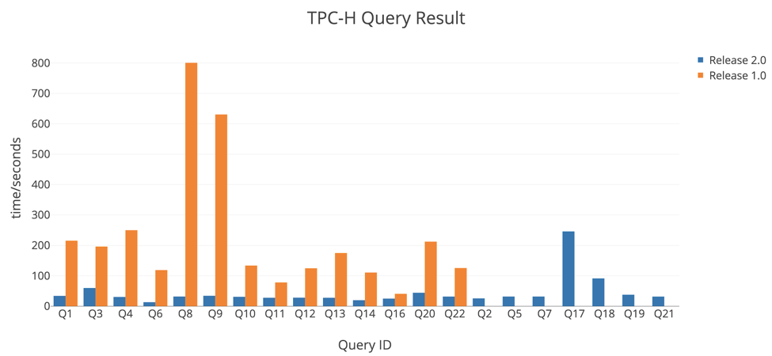

去年十月份的时候，我们发布了 TiDB 1.0 版本，为此我们日夜兼程奋斗了两年半时间，我们认为 1.0 版本达到了可在生产环境中使用的程度。在接下来的六个月中，我们一方面维护 1.0 版本的稳定性并且增加必要的新特性，另一方面马不停蹄的开发 2.0 版本。经过半年时间，6 个 RC 版本，今天 TiDB 2.0 GA 版本正式发布。

## 2.0 版本规划

在 2.0 版本的规划阶段，我们对“这个版本需要做什么”进行了深入思考，我们根据现有用户的情况、技术发展趋势以及社区的声音，认为 2.0 版本需要聚焦在以下几点：

*   **保证 TiDB 的稳定性以及正确性。**这两点是一个数据库软件的基础功能，作为业务的基石，任何一点抖动或者错误都可能对业务造成巨大的影响。目前已经有大量的用户在线上使用 TiDB，这些用户的数据量在不断增加、业务也在不断演进。我们非常关注 TiDB 集群如何保持长期稳定运行、如何减小系统的抖动、如何进行智能的调度，为此做了大量的调研和分析。

*   **提升 TiDB 在大数据量下的查询性能。**从我们接触下来的用户来看，很多客户都有少则上百 GB，多则上百 TB 的数据，一方面数据会持续增加，另一方面也希望能对这些数据做实时的查询。所以如果能提升大数据量下的查询性能，对用户会很有帮助。

*   **优化 TiDB 的易用性和可维护性。**TiDB 整套系统的复杂性比较高，运维及使用的难度要大于单机数据库，所以我们希望能提供尽可能方便的方案帮助用户使用 TiDB。比如尽可能简化部署、升级、扩容方式，尽可能容易的定位系统中出现的异常状态。

围绕上面三点原则，我们做了大量的改进，一些是对外可见（如 OLAP 性能的显著提升、监控项的大量增加以及运维工具的各项优化），还有更多的改进是隐藏在数据库背后，默默的提升整个数据库的稳定性以及正确性。

## 正确性和稳定性

在 1.0 版本发布之后，我们开始构建和完善自动化测试平台 Schrodinger，彻底告别了之前靠手工部署集群测试的方式。同时我们也新增了非常多的测试用例，做到测试从最底层 RocksDB，到 Raft，再到 Transaction，然后是 SQL 都能覆盖。

在 Chaos 测试上面，我们引入了更多的错误注入工具，例如使用 systemtap 对 I/O 进行 delay 等，也在代码特定的业务的逻辑进行错误注入测试，充分保证 TiDB 在异常条件下面也能稳定运行。

之前我们做了很多 TLA+ 的论证工作，也有一些简单的测试，1.0 之后我们开始使用 TLA+ 系统进行论证，保证我们的实现在设计上面都是正确的。

在存储引擎方面，为了提升大规模集群的稳定性和性能，我们优化了 Raft 的流程，引入 Region Merge、Raft Learner 等新特性；优化热点调度机制，统计更多的信息，并根据这些信息做更合理的调度；优化 RocksDB 的性能，使用 DeleteFilesInRanges 等特性，提升空间回收效率，降低磁盘负载，以及更加平滑地使用磁盘资源等等。

## OLAP 性能优化

在 2.0 版本中，我们重构了 SQL 优化器和执行引擎，希望能尽可能快的选择最优查询计划并且尽可能高效地执行查询计划。

1.0 版本已经从基于规则的查询优化器转向基于代价的查询优化器，但是还不够完善，在 2.0 版本中，我们一方面优化统计信息的精确度以及更新及时程度，另一方面提升 SQL 优化器的能力，对查询代价的估算更加精准、对复杂过滤条件的分析更加细致、对关联子查询的处理更加优雅、对物理算子的选择更加灵活准确。

在这一版本中，SQL 执行引擎引入新的内部数据表示方式 --- `Chunk`，一个结构中保存一批数据而不仅是一行数据，同一列的数据在内存中连续存放，使得内存使用更紧凑，这样带来了几点好处：1\. 显著减小了内存消耗； 2\. 批量分配内存，减小了 GC 开销；3\. 算子之间可以对数据进行批量传递，减小调用开销；4\. 在某些场景下，可以进行向量计算以及减小 CPU 的 Cache Miss 的情况。

完成上述两项改动之后，TiDB 在 OLAP 场景下的性能有了大幅的质的提升，从 [TPC-H 的对比结果](https://github.com/pingcap/docs-cn/blob/becd9e76878c9cf507aa626ce96de9dc6c0f85fc/v2.1/benchmark/tpch.md) 来看，所有的 Query 在 2.0 中都运行得更快，一些 Query 大多数都有几倍甚至数量级的提升，特别是一些 1.0 中跑不出结果的 Query 在 2.0 中都能顺利执行。

## 易用性和可运维性

为了让 TiDB 更容易被安装和使用，监控、运维、工具方面我们也做了诸多优化。 

在监控方面，增加了过百个监控项，同时通过 HTTP 接口、SQL 语句等方式暴露出一些运行时信息，用于系统调优或者是定位系统中存在的问题。

在运维方面，我们运维工具做了优化，简化操作流程，降低操作复杂度及操作过程对于线上的影响。同时功能也更加丰富，支持自动部署 Binlog 组件、支持启用 TLS。

## One more thing

**我们也同时发布了 [TiSpark 1.0 GA]( https://github.com/pingcap/tispark/releases/tag/1.0) 版本，了解一下？**

>点击查看 [TiDB 2.0 GA Release Notes](https://pingcap.com/blog-cn/tidb-2.0ga-release/)