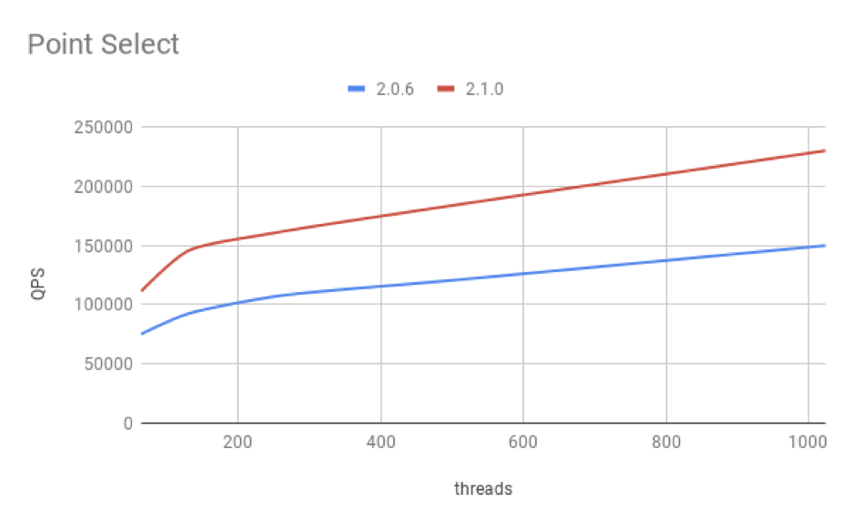
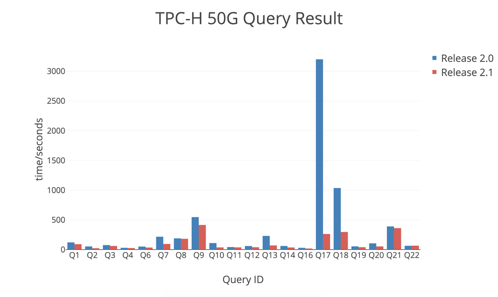

TiDB 是由 PingCAP 开发的分布式关系型数据库，今天我们很高兴地推出 TiDB 2.1 正式版，提供更丰富的功能、更好的性能以及更高的可靠性。

## 回顾 2.0 版本

今年 4 月份我们发布了 [TiDB 2.0 版本](https://pingcap.com/blog-cn/tidb-2.0-ga-release-detail/)，提升了稳定性、性能以及可运维性，这个版本在接下来的半年中得到了广泛的关注和使用。

迄今为止 TiDB 已经在 [数百家用户](https://pingcap.com/cases-cn/) 的生产环境中稳定运行，涉及互联网、游戏、金融、保险、制造业、银行、证券等多个行业，最大集群包含数百个节点及数百 TB 数据，业务场景包含纯 OLTP、纯 OLAP 以及混合负载。另外，既有使用 TiDB 当做关系数据库的场景，也有只用 TiKV 作为分布式 Key Value 存储的场景。

这几个月，在这些场景中，我们亲历了跨机房容灾需求、亲历了几十万级别的高吞吐业务、亲历了双十一的流量激增、亲历了高并发点查、高并发写入与上百行复杂 SQL 的混合负载、见到过多次的硬件/网络故障、见到过操作系统内核/编译器的 Bug。

简而言之，我们的世界充满了未知，而分布式关系型数据库这样一种应用广泛、功能丰富且非常关键的基础软件，最大的困难就是这些“未知”。在 2.1 版本中，我们引入了不少新的特性来抵御这些未知，适配各种复杂的场景，提升性能和稳定性，帮助我们的用户更好地支撑复杂的业务。

## 新特性

### 更全面的 Optimizer

在 2.1 版本中，我们对 TiDB 的 Cost-based Optimizer 做了改进，希望这个优化器能够处理各种复杂的 Query，尽量少的需要人工介入去处理慢 SQL。例如对 Index Join 选择索引、外表的优化，对关联子查询的优化，显著地提升了复杂 SQL 的查询效率。

当然，除了自动的查询优化之外，2.1 也增加了更多的手动干预机制，比如对 Join 算子的 Hint、Update/Delete 语句的 Hint。用户可以在优化器没有指定合适的计划时，手动干预结果或者是用来确保查询计划稳定。

### 更强大的执行引擎

在 2.1 版本中，我们对部分物理算子的执行效率进行了优化，特别是对 Hash Aggregation 和 Projection 这两个算子进行了并行化改造，另外重构了聚合算子的运行框架，支持向量化计算。

得益于这些优化，在 TPC-H 这种 OLAP 的测试集上，2.1 比 2.0 版本有了显著的性能提升，让 2.1 版本更好的面对 HTAP 应用场景。

### Raft 新特性

在 2.1 版本中，我们引入了 Raft PreVote、Raft Learner、Raft Region Merge 三个新特性：

*   PreVote 是在 Raft Group Member 发起投票之前，预先检查是否能被其他成员所支持，以避免集群中被网络隔离的节点重新接入集群中的时候引发性能抖动，提升集群稳定性。2.1 版本已经支持 PreVote 功能，并默认打开。

*   Learner 是只同步数据不参与投票的 Raft Group Member。在新加副本的时候，首先增加 Learner 副本，以避免添加副本过程中，部分 TiKV 节点故障引发丢失多数副本的情况发生，以提升集群的安全性。2.1 版本已经支持 Learner 功能，并默认打开。

*   Region Merge 用于将多个过小的 Region 合并为一个大的 Region，降低集群的管理成本，对于长期运行的集群以及数据规模较大的集群的性能、稳定性有帮助。2.1 版本已经支持 Region Merge 功能，尚未默认打开。

这些新特性的引入，有助于提升存储集群尤其是大规模集群的稳定性和性能。

### 自动更新统计信息

统计信息的及时性对查询计划的正确性非常重要。在 2.1 版本中，我们提供了基于 Query Feedback 的动态增量更新机制。

在制定查询计划时，会根据现有的统计信息估算出需要处理的数据量；在执行查询计划时，会统计出真实处理的数据量。TiDB 会根据这两个值之间的差距来更新统计信息，包括直方图和 CM-Sketch。在我们的测试中，对于一个完全没有统计信息的表，经过十轮左右的更新，可以达到统计信息基本稳定的状态。这对于维持正确的查询计划非常重要。

除了动态增量更新之外，我们对自动全量 Analyze 也提供了更多支持，可以通过 [系统变量](https://www.pingcap.com/docs-cn/sql/statistics/#%E8%87%AA%E5%8A%A8%E6%9B%B4%E6%96%B0) 指定做自动 Analyze 的时间段。

### 并行 DDL

TiDB 所有的 DDL 操作都是 Online 进行，不过在 2.0 以及之前的版本中，所有的 DDL 操作都是串行执行，即使 DDL 所操作的表之间没有关联。比如在对 A 表 Add Index 时候，想创建一个 B 表，需要等待 Add Index 操作结束。这在一些场景下对用户使用造成了困扰。

在 2.1 版本中，我们对 DDL 流程进行拆分，将 Add Index 操作和其他的 DDL 操作的处理分开。由于在 TiDB 的 DDL 操作中，只有 Add Index 操作需要去回填数据，耗时较长，其他的 DDL 操作正常情况下都可以在秒级别完成，所以经过这个拆分，可以保证大多数 DDL 操作能够不需要等待，直接执行。

### Explain 和 Explain Analyze

Explain 对于理解查询计划至关重要，2.1 之前的版本，TiDB 追随 MySQL 的 Explain 输出格式来展示查询计划。但是当 SQL 比较复杂时，MySQL 的格式并不利于展示算子之间的层级关系，不利于用户定位问题。

2.1 版本中，我们使用缩进来展示算子之间的层级关系，对每个算子的详细信息也做了优化，希望整个查询计划一目了然，帮助用户尽快定位问题。[这篇文档](https://www.pingcap.com/docs/sql/understanding-the-query-execution-plan/) 可以帮助用户了解 TiDB 的查询计划。

用户除了通过 Explain 语句查看查询计划之外，在 2.1 版本中还可以通过 Explain Analyze 语句查看语句的运行时信息，包括每个算子运行时的处理时间以及处理的数据量。这样可以通过实际的运行结果，拿到更加精确的信息。

### 热点调度

热点是分布式系统最大的敌人之一，并且用户的业务场景复杂多变，让热点问题捉摸不定，也是最狡猾的敌人。2.1 版本中，我们一方面增强热点检测能力，尽可能详细地统计系统负载，更快的发现热点；另一方面优化热点调度策略，用尽可能小的代价，尽快地打散热点。同时我们也提供了手动分裂 Region 的接口，让用户在特殊场景下将单点瓶颈手动分裂开，再由 PD 进行负载均衡。

### 高效的 GC 机制

2.1 版本对 GC（垃圾回收） 模块进行优化。一方面减少对线上的写入的影响，另一方面加快了空间回收速度。在内部测试场景中，删除一个 1TB 的表，新的 GC 机制能够在 10 秒内回收 99% 左右的空间。

## 更好的性能

### OLTP

我们针对 OLTP 场景中，点查占多数的特点进行了针对性的优化。当通过 Unique Key 或者 Primary Key 进行数据访问时，在优化器和执行引擎中都做了改进，使得语句的执行效率更高，通过 [2.1 和 2.0 版本的 Sysbench 对比](https://github.com/pingcap/docs/blob/master/v2.1/benchmark/sysbench-v3.md) 可以看到，点查性能提升 50%。

### OLAP

发布 2.0 的时候，我们同时发布了在 TPC-H Scale 50 的场景中 [2.0 和 1.0 的对比结果](https://github.com/pingcap/docs/blob/b7c76f7c2b3d55f2a07e18c5d90550284a57c145/v2.0/benchmark/tpch.md)。其中大多数 Query 都有数量级的提升，部分 Query 在 1.0 中跑不出结果，在 2.0 中可以顺利运行。不过对于 Query17 和 Query18，运行时间依然很长。

我们在相同的场景下，对 2.1 和 2.0 进行了 [对比测试](https://github.com/pingcap/docs-cn/blob/master/v2.1/benchmark/tpch-v2.md)。从下图可以看到（纵坐标是 Query 的响应时间，越低越好），之前的两个慢 Query 的运行时间大幅缩短，其他的 Query 也有一定程度的提升。这些提升一方面得益于查询优化器以及执行引擎的改进，另一方面 得益于 TiKV 对连续数据扫描的性能优化。

## 完善的生态工具

为了让用户更方便的使用 TiDB，我们提供了三个工具：

* [TiDB Lightning](https://pingcap.com/docs/tools/lightning/overview-architecture/) 用于将全量数据导入到 TiDB 中，这个工具可以提升全量数据导入速度，目前内部测试场景中，一小时可以导入 100GB 数据。
* [TiDB Binlog](https://pingcap.com/docs/v3.0/reference/tidb-binlog-overview/) 用于将 TiDB 中的数据更新实时同步到下游系统中，可以用于做主从集群同步或者是将 TiDB 中的数据同步回 MySQL。
* [TiDB DM](https://pingcap.com/docs/tools/data-migration-overview/)（Data-Migration）用于将 MySQL/MariaDB 中的数据通过 Binlog 实时同步到 TiDB 集群中，并且提供 Binlog 数据转换功能，可以将 Binlog 中的表/库名称进行修改，或者是对数据内容本身做修改和裁剪。

上述三个工具可以将 TiDB 和周边的系统打通，既能将数据同步进 TiDB，又可以将数据同步出来。所以无论是迁移、回退还是做数据热备，都有完整的解决方案。

## Open Source Community

我们相信战胜“未知”最好的武器就是社区的力量，基础软件需要坚定地走开源路线。为了让社区更深入的了解 TiDB 的技术细节并且更好地参与到项目中来，我们今年已经完成超过 20 篇源码阅读文章，项目的设计文档（[TiDB](https://github.com/pingcap/tidb/wiki/Design-Documents) 和 [TiKV](https://github.com/tikv/rfcs)）已经在 GitHub 上面公开出来，项目的开发过程也尽量通过 Github Issue/Project 向社区展示。一些 Feature 设计方案的讨论也会通过在线视频会议的方式方便社区参与进来，[这里](https://github.com/pingcap/community/blob/master/proposals.md) 可以看到会议安排。

从 TiDB 2.0 版发布到现在的半年多时间，TiDB 开源社区新增了 87 位 Contributor，其中 [杜川](https://github.com/spongedu) 成为了 TiDB Committer，他已经贡献了 [76 次 PR](https://github.com/pingcap/tidb/commits?author=spongedu)，还有一些活跃的 Contributor 有希望成为下一批 Committer。

在这里我们对社区贡献者表示由衷的感谢，希望更多志同道合的人能加入进来，也希望大家在 TiDB 这个开源社区能够有所收获！
