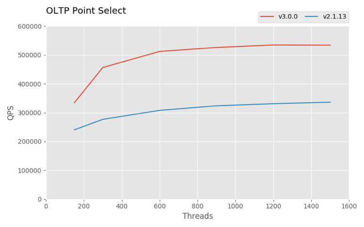
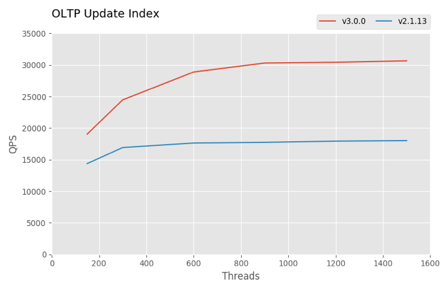
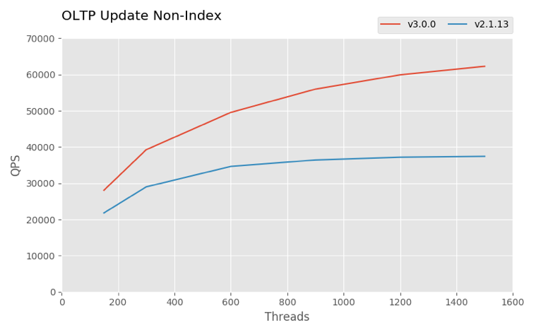
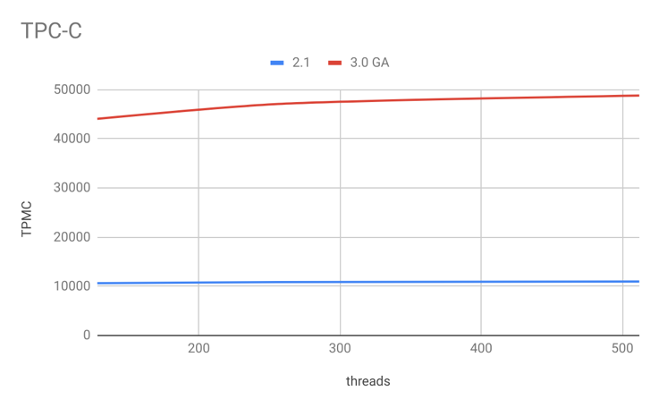
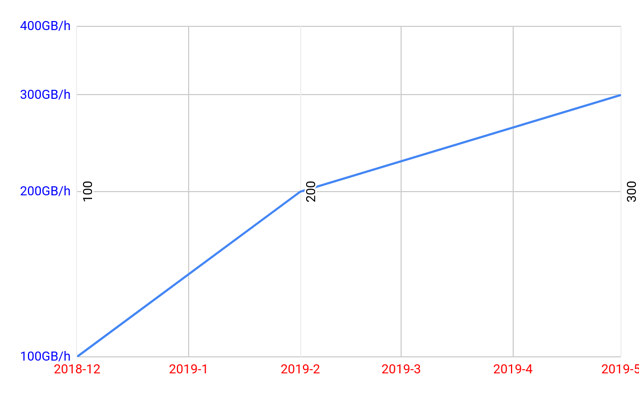

TiDB 是 PingCAP 自主研发的开源分布式关系型数据库，具备商业级数据库的数据可靠性，可用性，安全性等特性，支持在线弹性水平扩展，兼容 MySQL 协议及生态，创新性实现 OLTP 及 OLAP 融合。

**TiDB 3.0 版本显著提升了大规模集群的稳定性，集群支持 150+ 存储节点，300+TB 存储容量长期稳定运行。易用性方面引入大量降低用户运维成本的优化，包括引入 Information_Schema 中的多个实用系统视图、EXPLAIN ANALYZE、SQL Trace 等。在性能方面，特别是 OLTP 性能方面，3.0 比 2.1 也有大幅提升，其中 TPC-C 性能提升约 4.5 倍，Sysbench 性能提升约 1.5 倍，OLAP 方面，TPC-H 50G Q15 因实现 View 可以执行，至此 TPC-H 22 个 Query 均可正常运行。新功能方面增加了窗口函数、视图（实验特性）、分区表、插件系统、悲观锁（实验特性）。**

截止本文发稿时 TiDB 已在 500+ 用户的生产环境中长期稳定运行，涵盖金融、保险、制造，互联网，游戏等领域，涉及交易、数据中台、历史库等多个业务场景。不同业务场景对关系型数据库的诉求可用 “百花齐放”来形容，但对关系数据库最根本的诉求未发生任何变化，如数据可靠性，系统稳定性，可扩展性，安全性，易用性等。请跟随我们的脚步梳理 TiDB 3.0 有什么样的惊喜。

## 一、提升大规模集群稳定性

3.0 与 2.1 版本相比，显著提升了大规模集群的稳定性，支持单集群 150+ 存储节点，300+TB 存储容量长期稳定运行，主要的优化点如下：

1\. 优化 Raft 副本之间的心跳机制，按照 Region 的活跃程度调整心跳频率，减小冷数据对集群的负担。

2\. 热点调度策略支持更多参数配置，采用更高优先级，并提升热点调度的准确性。

3\. 优化 PD 调度流程，提供调度限流机制，提升系统稳定性。

4\. 新增分布式 GC 功能，提升 GC 的性能，降低大集群 GC 时间，提升系统稳定性。

## 二、提升查询计划的稳定性

众所周知，数据库查询计划的稳定性对业务至关重要，TiDB 3.0 版本采用多种优化手段提升查询计划的稳定性，如下：

1. 新增 Fast Analyze 功能，提升收集统计信息的速度，降低集群资源的消耗及对业务的影响。

2. 新增 Incremental Analyze 功能，提升收集单调递增的索引统计信息的速度，降低集群资源的消耗及对业务的影响。

3. 在 CM-Sketch 中新增 TopN 的统计信息，缓解 CM-Sketch 哈希冲突导致估算偏大，提升代价估算的准确性，提升查询计划的稳定性。

4. 引入 Skyline Pruning 框架，利用规则防止查询计划过度依赖统计信息，缓解因统计信息滞后导致选择的查询计划不是最优的情况，提升查询计划的稳定性。

5. 新增 SQL Plan Management 功能，支持在查询计划不准确时手动绑定查询计划，提升查询计划的稳定性。

## 三、提升系统性能，TPC-C 性能提升约 4.5 倍，Sysbench 性能提升约 1.5 倍

### 1. OLTP

3.0 与 2.1 版本相比 Sysbench 的 Point Select，Update Index，Update Non-Index 均提升约 1.5 倍，TPC-C 性能提升约 4.5 倍。主要的优化点如下：

1. TiDB 持续优化 SQL 执行器，包括：优化 `NOT EXISTS` 子查询转化为 Anti Semi Join，优化多表 Join 时 Join 顺序选择等。

2. 优化 Index Join 逻辑，扩大 Index Join 算子的适用场景并提升代价估算的准确性。

3. TiKV 批量接收和发送消息功能，提升写入密集的场景的 TPS 约 7%，读密集的场景提升约 30%。

4. TiKV 优化内存管理，减少 `Iterator Key Bound Option` 的内存分配和拷贝，多个 Column Families 共享 block cache 提升 cache 命中率等手段大幅提升性能。

5. 引入 Titan 存储引擎插件，提升 Value 值超过 1KB 时性能，缓解 RocksDB 写放大问题，减少磁盘 IO 的占用。

6. TiKV 新增多线程 Raftstore 和 Apply 功能，提升单节点内可扩展性，进而提升单节点内并发处理能力和资源利用率，降低延时，大幅提升集群写入能力。

### 2.TiDB Lightning

TiDB Lightning 性能与 2019 年年初相比提升 3 倍，从 100GB/h 提升到 300GB/h，即 28MB/s 提升到 85MB/s，优化点，如下：

1. 提升 SQL 转化成 KV Pairs 的性能，减少不必要的开销。

2. 提升单表导入性能，单表支持批量导入。

3. 提升 TiKV-Importer 导入数据性能，支持将数据和索引分别导入。

4. TiKV-Importer 支持上传 SST 文件限速功能。

## 四、提升系统安全性

**RBAC（Role-Based Access Control，基于角色的权限访问控制）** 是商业系统中最常见的权限管理技术之一，通过 RBAC 思想可以构建最简单“用户-角色-权限”的访问权限控制模型。RBAC 中用户与角色关联，权限与角色关联，角色与权限之间一般是多对多的关系，用户通过成为什么样的角色获取该角色所拥有的权限，达到简化权限管理的目的，通过此版本的迭代 RBAC 功能开发完成。

**IP 白名单功能（企业版特性）**：TiDB 提供基于 IP 白名单实现网络安全访问控制，用户可根据实际情况配置相关的访问策略。

**Audit log 功能（企业版特性）**：Audit log 记录用户对数据库所执行的操作，通过记录 Audit log 用户可以对数据库进行故障分析，行为分析，安全审计等，帮助用户获取数据执行情况。

**加密存储（企业版特性）**：TiDB 利用 RocksDB 自身加密功能，实现加密存储的功能，保证所有写入到磁盘的数据都经过加密，降低数据泄露的风险。

**完善权限语句的权限检查**，新增 `ANALYZE`，`USE`，`SET GLOBAL`，`SHOW PROCESSLIST` 语句权限检查。

## 五、提升系统易用性

1. 新增 SQL 方式查询慢查询，丰富 TiDB 慢查询日志内容，如：Coprocessor 任务数，平均/最长/90% 执行/等待时间，执行/等待时间最长的 TiKV 地址，简化慢查询定位工作，提高排查慢查询问题效率，提升产品易用性。

2. 新增系统配置项合法性检查，优化系统监控项等，提升产品易用性。

3. 新增对 `TableReader`、`IndexReader` 和 `IndexLookupReader` 算子内存使用情况统计信息，提高 Query 内存使用统计的准确性，提升处理内存消耗较大语句的效率。

4. 制定日志规范，重构日志系统，统一日志格式，方便用户理解日志内容，有助于通过工具对日志进行定量分析。

5. 新增 `EXPLAIN ANALYZE` 功能，提升SQL 调优的易用性。

6. 新增 SQL 语句 `Trace` 功能，方便排查问题。

7. 新增通过 `unix_socket` 方式连接数据库。

8. 新增快速恢复被删除表功能，当误删除数据时可通过此功能快速恢复数据。

## 六、增强 HTAP 能力

**TiDB 3.0 新增 TiFlash  组件，解决复杂分析及 HTAP 场景。TiFlash 是列式存储系统，与行存储系统实时同步，具备低延时，高性能，事务一致性读等特性。** 通过 Raft 协议从 TiKV 中实时同步行存数据并转化成列存储格式持久化到一组独立的节点，解决行列混合存储以及资源隔离性问题。TiFlash 可用作行存储系统（TiKV）实时镜像，实时镜像可独立于行存储系统，将行存储及列存储从物理隔离开，提供完善的资源隔离方案，HTAP 场景最优推荐方案；亦可用作行存储表的索引，配合行存储对外提供智能的 OLAP 服务，提升约 10 倍复杂的混合查询的性能。

TiFlash 目前处于 Beta 阶段，计划 2019 年 12 月 31 日之前 GA，欢迎大家申请试用。

## 七、未来规划

**未来我们会继续投入到系统稳定性，易用性，性能，弹性扩展方面，向用户提供极致的弹性伸缩能力，极致的性能体验，极致的用户体验。**

稳定性方面 V4.0 版本将继续完善 V3.0 未 GA 的重大特性，例如：悲观事务模型，View，Table Partition，Titan 行存储引擎，TiFlash 列存储引擎；引入近似物理备份恢复解决分布数据库备份恢复难题；优化 PD 调度功能等。

性能方面 V4.0 版本将继续优化事务处理流程，减少事务资源消耗，提升性能，例如：1PC，省去获取 commit ts 操作等。

弹性扩展方面，PD 将提供弹性扩展所需的元信息供外部系统调用，外部系统可根据元信息及负载情况动态伸缩集群规模，达成节省成本的目标。

## 八、社区概况

我们相信战胜“未知”最好的武器就是社区的力量，基础软件需要坚定地走开源路线。截止发稿我们已经完成 41 篇源码阅读文章。TiDB 开源社区总计 265 位 Contributor，6 位 Committer，在这里我们对社区贡献者表示由衷的感谢，希望更多志同道合的人能加入进来，也希望大家在 TiDB 这个开源社区能够有所收获。

>TiDB 3.0 GA Release Notes：[https://pingcap.com/docs-cn/v3.0/releases/3.0-ga/](https://pingcap.com/docs-cn/v3.0/releases/3.0-ga/)

