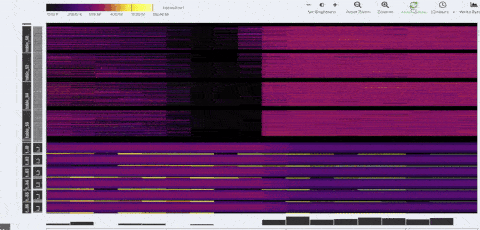
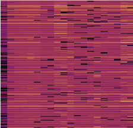
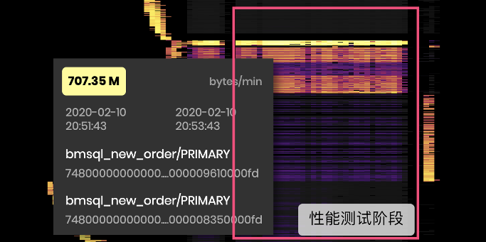

## 前言

古代，医者看病讲究「望、闻、问、切」，通过病人的外部综合表现对病症做出判断。现代，CT 的发明使得人们可以使用 X 光穿透身体各组织内部，将整体的情况以图像的方式展现出来，医生可以根据这个信息快速地排查问题。CT 的出现不仅将诊断的效率提升到了新的高度，也给客观描述身体状态提供了一个标准，是医学史上重要的里程碑。

一个工作中的 TiDB 集群如果只有个别节点非常繁忙，而其他节点相对比较空闲，我们就称这个集群存在热点（问题）。TiDB 作为一个分布式数据库，虽然会自动且动态的进行数据的重新分布以到达尽可能的均衡，但是有时候由于业务特性或者业务负载的突变，仍然会产生热点，这时候往往就会出现性能瓶颈。

在 TiDB 4.0 版本之前，如果我们要诊断集群中的读写热点问题，一般也需要经过「望、闻、问、切」，通过集群的对外表现逐渐摸清热点问题所在：

*   检查各组件 CPU 和 IO 是否均衡；

*   根据集群热区域列表逐一检查热点表；

*   通过表进一步分析业务逻辑查看热点成因；

*   ……

整个过程比较繁琐，涉及到不同的工具和组件，需要一定的学习成本，而且整个结果也很不直观。

**Google 在 Bigtable 的云服务中提供了一个可视化的工具：[Key Visualizer](https://cloud.google.com/bigtable/docs/keyvis-overview)，它可以优雅的解决热点排查的问题。在 4.0 版本中 TiDB 也实现了 Key Visualizer 功能。现在，我们可以很轻松地给集群拍个 “CT”，快速直观地观察集群整体热点及流量分布情况，如下图所示。**

## 为什么会有热点？

一个集群中只有少数节点在卖力工作，其他节点在划水，这个现象听上去像是 TiDB 的 bug，其实不然，它是一种 feature 🙃。正经地说，大多数情况下热点的出现是业务读写模式不能很好地适配分布式的场景的结果。

例如，如果 90% 的流量都在读写一小块数据，那么这就是一个典型的热点，因为 TiDB 架构上一行数据会由一个 TiKV 节点进行处理，而不是所有节点都能用于处理这一行数据。因而，如果大多数业务流量都在频繁访问某一行数据，那么大多数业务流量最终都会由某一个 TiKV 节点来处理，最终这个 TiKV 机器的性能就成为了整个业务的性能上限，无法通过增加更多机器来提高处理能力。

由于 TiDB 实际上是以 [Region](https://pingcap.com/docs-cn/stable/architecture/#tikv-server)（即一批相邻数据）为单位划分处理，因此除了上述场景以外还有更多会产生热点的场景，如使用自增主键连续写入相邻数据导致的写入表数据热点、时间索引下写入相邻时间数据导致的写入表索引热点等，在这里就不一一介绍了，感兴趣的同学可以阅读 TUG 社区上的文章《[TiDB 热点问题详解](https://asktug.com/t/tidb/358)》。

## 如何发现产生热点的元凶？

### 工作原理

由前文描述可知，热点的本质是大多数读写流量都只涉及个别 Region，进而导致集群中只有个别 TiKV 节点承载了大部分操作。**TiDB Key Visualizer 将所有 Region 的读写流量按时间依次展示出来，使用颜色明暗表示读写流量的多少，以热力图的方式呈现。热力图使用户能对集群内 Region 热度情况快速地一窥究竟，直观了解集群中热点 Region 在哪里及其变化趋势，如下图所示：**

说明：

1.  热力图的纵轴 Y 表示集群里面的 Region，横跨 TiDB 集群上所有数据库和数据表；横轴 X 是时间；
2.  颜色越暗（cold）表示该区域的 Region 在这个时间段上读写流量较低，颜色越亮（hot）表示读写流量越高，即越热。

用户也可以控制只显示读流量或写流量。以上面这个图为例，它的下半部分有六条明显的亮色线条，表明各个时刻都有 6 个左右的 Region（或相邻 Region）读写流量非常高。用户将鼠标移到亮色线条处，即可知道这个大流量 Region 属于什么库什么表。

### 常见热力图解读

#### 1. 均衡：期望结果

如图所示，热力图颜色均匀或者深色和亮色混合良好，说明读取或写入在时间和 Region 空间范围上都分布得比较均衡，说明访问压力均匀地分摊在所有的机器上。这种负载是最适合分布式数据库的，也是我们最希望见到的。

#### 2. X 轴明暗交替：需要关注高峰期的资源情况

如图所示，热力图在 X 轴（时间）上表现出明暗交替，但 Y 轴（Region）则比较均匀，说明读取或写入负载具有周期性的变化。这种情况可能出现在周期性的定时任务场景，如大数据平台每天定时从 TiDB 中抽取数据。一般来说可以关注一下使用高峰时期资源是否充裕。

#### 3. Y 轴明暗交替：需要关注产生的热点聚集程度

如图所示，热力图包含几个明亮的条纹，从 Y 轴来看条纹周围都是暗的，这表明，明亮条纹区域的 Region 具有很高的读写流量，可以从业务角度观察一下是否符合预期。例如，所有业务都要关联一下用户表的话，势必用户表的整体流量就会很高，那么在热力图中表现为亮色区域就非常合理。需要注意的是，TiKV 自身拥有以 Region 为单位的热点平衡机制，因此涉及热点的 Region 越多其实越能有利于在所有 TiKV 节点上均衡流量。换句话说，明亮条纹越粗、数量越多则意味着热点越分散、更多的 TiKV 能得到利用；明亮条纹越细、数量越少意味着热点越集中、热点 TiKV 越显著、越需要 DBA 介入并关注。

#### 4. 局部突然变亮：需要关注突增的读写请求

如图所示，热力图中某些区域突然由暗色变为了亮色。这说明在短时间内这些 Region 数据流量突然增加。例如，微博热搜或者秒杀业务。这种时候，需要 DBA 依据业务关注流量突变是否符合预期，并评估系统资源是否充足。值得注意的是，和第 3 点一样，明亮区域 Y 轴方向的粗细非常关键，明亮区域如果非常细，说明短时间内突然增加大量流量，且这些流量都集中到了少量 TiKV 中，这就需要 DBA 重点关注了。

#### 5. 明亮斜线：需要关注业务模式

如图所示，热力图显示了明亮的斜线，表明读写的 Region 是连续的。这种场景常常出现在带索引的数据导入或者扫描阶段。例如，向自增 ID 的表进行连续写入等等。图中明亮部分对应的 Region 是读写流量的热点，往往会成为整个集群的性能问题所在。这种时候，可能需要业务重新调整主键，尽可能打散以将压力分散在多个 Region 上，或者选择将业务任务安排在低峰期。

**需要注意的是，这里只是列出了几种常见的热力图模式。Key Visualizer 中实际展示的是整个集群上所有数据库、数据表的热力图，因此非常有可能在不同的区域观察到不同的热力图模式，也可能观察到多种热力图模式的混合结果。使用的时候应当视实际情况灵活判断。**

## 如何解决热点

无论是之前的望、闻、问、切，还是现在的 Key Visualizer，都是帮助找到形成热点的「元凶」。找到了元凶自然可以进一步着手进行处理，提高集群整体性能和健康度。TiDB 其实内置了不少帮助缓解常见热点问题的功能，本文限于篇幅就不再赘述，对此感兴趣的同学可以阅读《[TiDB 高并发写入常见热点问题及规避方法](https://pingcap.com/blog-cn/tidb-in-high-concurrency-scenarios/)》一文。

## 实战案例

看完上面那么长安利，不如再看一个实际例子直观感受一下 Key Visualizer 的威力。我司的开发同学经常使用各种标准评测中的得分来协助判断 TiDB、TiKV 性能提升的结果。有了 Key Visualizer 之后，我们最近就发现了一个性能测试程序自身 SQL 写法引发的问题，如下图所示：

这是 TPC-C 测试在 TiDB 上的读热力图，我们假设这是一个真实的业务，现在我们要为它进行调优，该图的左半部分是标准测试的导入数据阶段，右半部分是标准测试的性能测试阶段。

由图可见，在性能测试阶段（右半部分）`bmsql_new_order` 表的流量显著地高于其他所有表。虽然热点图中亮色带高度较高，即该热点表的 Region 个数还比较多，应当能比较好地分散到各个 TiKV 上使得负载比较均衡，但从设计上来说该表有大量读流量本身是一个不合理现象。

由此，我们分析了这个表相关的 SQL 语句，发现测试程序中存在一些冗余 SQL 会重复从这个表中读取数据，我们在数据库层面改进优化器后，性能提升了 1%。

## 其他应用场景

除了以上提到的场景，Key Visualizer 对以下场景也会有一些帮助：

### 1. 发现业务负载的变化

数据库上所承载的业务负载往往会随着时间慢慢发生变化，如用户需求或关注度逐渐发生了转移等。使用 Key Visualizer 就能对业务负载进行细粒度的观察，通过对比整个业务负载的历史情况，就能及时发现变化趋势，从而取得先机。

### 2. 观察业务健康度

目前不少用户的应用架构已经从单体系统逐步转变为了微服务架构。系统中调用链持续增加的复杂性，让整个系统的监控难度也随着架构转变而提升。数据库作为这些调用链的最后一环，往往也是最重要的一环。使用 Key Visualizer 观察数据库负载的历史变化情况，可以从侧面观察出业务运行的健康情况，及时发现业务异常。

### 3. 活动预演

线上业务竞争越来越激烈，“造节” “促销” 一周一次，预防翻车自然是 DBA 必不可少的工作。有了 Key Visualizer 提供的热力图，可以对促销提前进行预演，在更低层面对业务行为有一个直观、定性的认识，提前了解流量模式对应模拟的场景。后续在生产环境中观察到类似模式时，就能得心应手进行应对，降低翻车的可能性。

## 快速尝鲜

目前，想尝鲜的用户可以启动 [PD master](https://github.com/pingcap/pd) 版本（或在使用 [Ansible](https://pingcap.com/docs-cn/stable/how-to/deploy/orchestrated/ansible/#%E8%B0%83%E6%95%B4%E5%85%B6%E5%AE%83%E5%8F%98%E9%87%8F%E5%8F%AF%E9%80%89) 部署时将 `tidb_version` 设置为 `latest`），然后浏览器打开以下地址就可以体验 Key Visualizer 了：

[http://PD_ADDRESS:2379/dashboard](http://PD_ADDRESS:2379/dashboard)

>注意：若修改过 PD 默认端口，需要自行修改上述地址中的端口为自己设置的端口。

**除了 Key Visualizer，TiDB Dashboard 还包含更多其他的诊断功能，我们将在未来的系列文章中作进一步介绍，敬请期待。**
