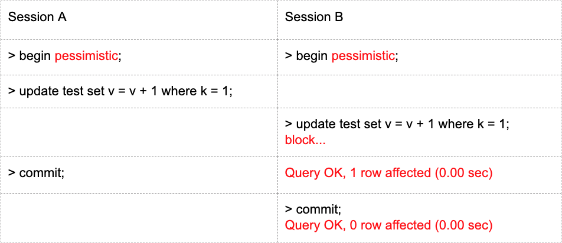
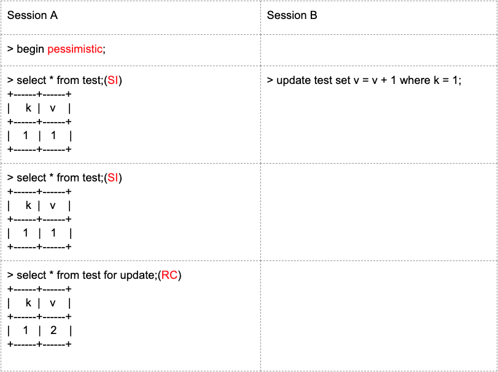
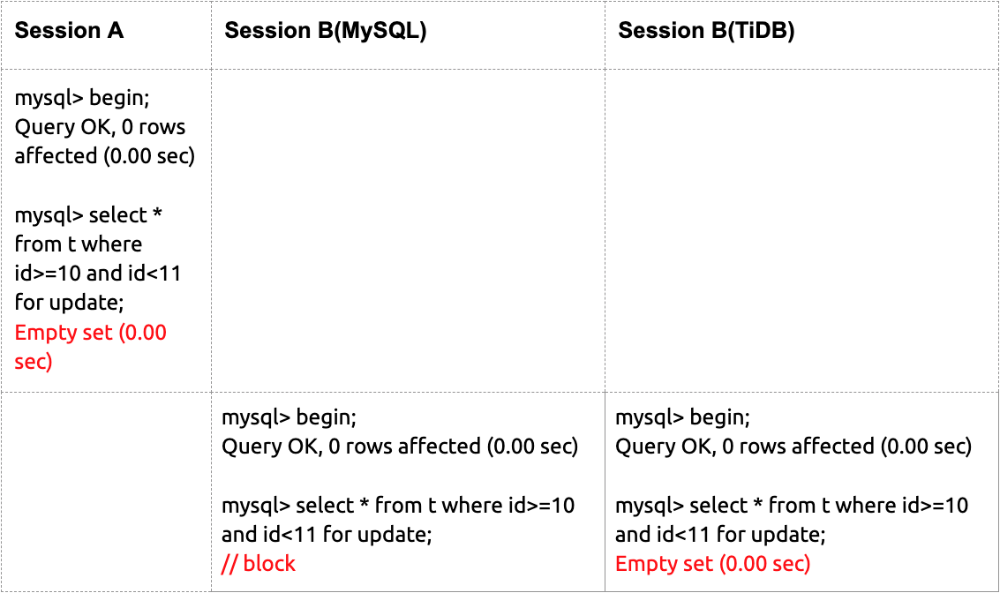
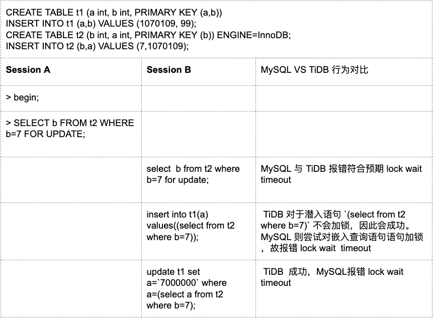

如果说在 TiDB 3.0 中，悲观锁是 “千呼万唤始出来，犹抱琵琶半遮面”。那么在 TiDB 4.0 中，悲观锁在经历了市场与时光的考验后，无论是性能还是稳定性都能够 “轻拢慢撚抹复挑，初为《霓裳》后《六幺》”。TiDB 4.0 悲观锁，欢迎大家尝鲜与反馈。本文将从使用者的角度，介绍悲观锁的使用与注意事项，主要分为以下几方面：

* 白话悲观锁

* TiDB 悲观锁的使用和常见现象

* TiDB 悲观锁与 MySQL 的兼容性

* 未来展望

## 白话悲观锁

自新年以来，口罩作为 2020 年最时尚的年货，变得异常难买，为了能够顺利抢到口罩，我是夜夜辗转难眠，日日盯着各大网站下单，通过这个过程，倒也总结出了各大平台的的购物体验：

* A 类网站：加购物车**飞快**，成功加入购物车加后，下单**不一定**有库存。

* B 类网站：加购物车**有点卡**，成功加入购物车后，下单**一定**有库存。 

作为互联网研发从业者，聪慧如你，一起来思考这两类网站是如何实现加购物车这一逻辑？

A 类网站乐观地假设不存在其他客户同时抢这批口罩，库存代表没下单的库存，给了客户非常积极的体验，我们称这种行为下加购物车时，使用了乐观锁。


这种乐观锁使用的体验是：前期加购物车一时爽，最终下单可不一定爽。

当存在其他网友同时跟你抢这批口罩下单时，可能会遇到以下问题：

* 提交不一定成功。

* 冲突需要重试。（其他人先下单，库存变化，需要重试）

* 冲突严重且重试代价大的场景（比方说你一次性买了一万种商品）性能差，失败率高。

B 类网站可谓谨言慎行，假设所有在别人家购物车里的口罩都会先于你下单，展示给你的库存是在当前最坏场景下能够看到的库存，我们称这种行为下加购物车时，使用了悲观锁。


如上悲观锁的体验是：前期加购物车有点卡，但是加购物车成功一定有库存。没有库存莫着急，等一会儿再来可能又有库存了。

在数据库的实现中，当同时存在多个事务去修改同一行时，也会遇到类似冲突问题，通过实现悲观锁，可以解决部分乐观锁的问题，重点如下：

* 事务提交一定成功。

* MySQL 默认支持悲观锁，支持了悲观锁意味着，MySQL 的客户不需要修改任何代码，就可以轻松上船 TiDB。

## TiDB 悲观锁的使用和常见现象

TiDB 支持多种方式打开悲观锁，具体信息见官方文档， 本文将以以下方式为例展开介绍：

* 执行 ```BEGIN PESSIMISTIC;``` 语句开启的事务，会进入悲观事务模式。

* 注释的形式 ```BEGIN /*!90000 PESSIMISTIC */;``` 来兼容 MySQL 语法。

### 并发更新同一行数据

如下图, 纵轴表示时间轴，session A 和 session B  并发更新同一行数据。



可以看到悲观锁的行为如下：

* 在 session B  执行 DML 时，发现同一行被 session A 锁住，等待至 session A 提交才执行。

* DML 执行成功后，最终 commit 也成功。

### SELECT ..  FOR UPDATE



上例展示的悲观锁事务与 MySQL 行为一致，理解如下：

* 纯查询语句的隔离级别为 SI 隔离级别，即读取为事务 begin 时的版本数据。

* SELECT .. FOR UPDATE 的隔离级别为 RC，即读取为当前已提交的版本数据。

### DEADLOCK

在看这个例子之前，我们首先思考一下为什么会有死锁，同样以购物为例子，假设现在小 A 和小 B 两人都要买口罩和消毒水，可能遇到以下场景：


也就是 A 和 B 两位都要买到这两个商品，只能一直互相等待，也就是我们说的进入死锁状态，在数据库也是类似：


上例展示的场景中 session A 和 session B 产生了死锁，在产生死锁时，悲观锁会立即检测到并返回错误，将死锁扼杀在摇篮里。

## TiDB 悲观锁 VS MySQL InnoDB

作为分布式数据库 TiDB 一直努力与 MySQL 保持协议上的兼容，以造福广大 MySQL 用户。然而 TiDB 与 MySQL 底层实现逻辑的区别，使得部分逻辑无法做到完全兼容。在 TiDB 4.0 中，TiDB 悲观锁与 MySQL 在使用上不兼容的行为详见 [官方文档](https://pingcap.com/docs-cn/dev/reference/transactions/transaction-pessimistic/#%E5%92%8C-mysql-innodb-%E7%9A%84%E5%B7%AE%E5%BC%82) ，这里我们简要介绍以下几点。

### TiDB 没有间隙锁

当无法保证符合过滤条件的数据唯一时：

* MySQL 会锁住过滤条件能涵盖到的所有行：范围锁，全表锁。

* TiDB 只会对读取到的行加锁。

具体对比如下表所示（注：table 中 id 为主键）：



### embedded select 行为不一致

TiDB 中执行 DML  过程中包如果包含 embedded select select，对应的行不会被加锁，MySQL 则会进行加锁。



## 未来展望

事务作为数据库的重中之重，一直是大众关注的焦点。TiDB 自诞生以来便以支持高性能的分布式事务而闻名。本文从使用者的角度，介绍了 TiDB 4.0 中悲观锁的使用与注意事项，欢迎大家尝鲜与反馈。

未来，我们会给出更多 TiDB 悲观锁实现原理与性能优化相关的介绍，欢迎大家持续关注。同时，TiDB 分布式事务未来还有更多激动人心的改进等着大家来一起完成，欢迎大家一起来监督来帮忙来提升，调研与实践国际一流的分布式事务模型。更多反馈欢迎发送至 *transaction-group@pingcap.com*。