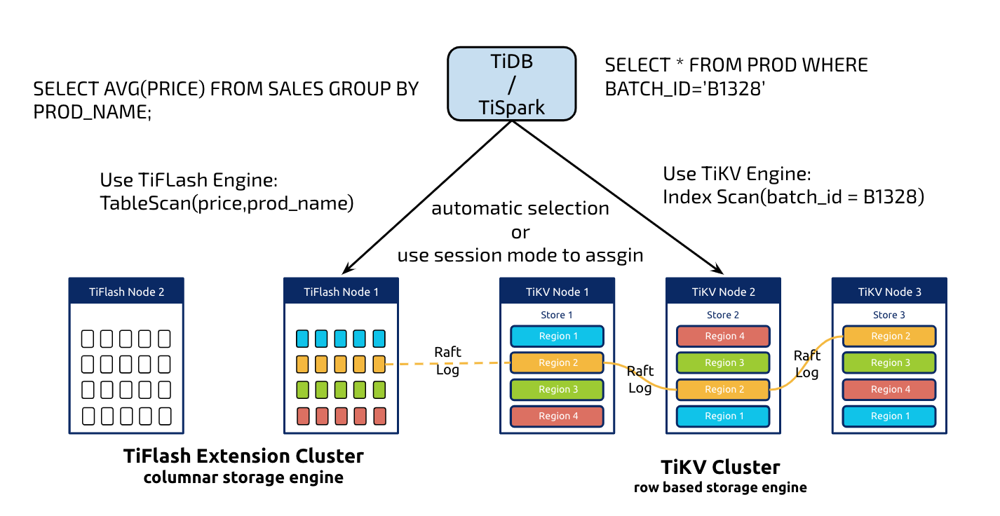
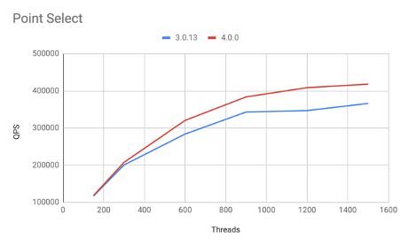
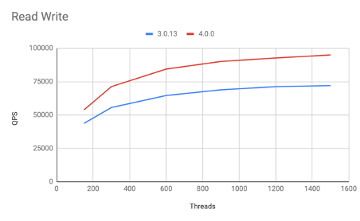
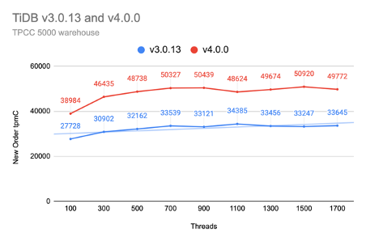
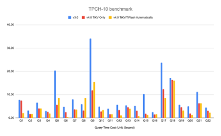

经过一年多的开发，TiDB 4.0 终于迎来 GA 版本，作为 TiDB「面向未来的数据库」道路上面的一个重要的里程碑，TiDB 4.0 不光在稳定性、易用性、性能、云原生等各个方面都有了巨大的进步，新增的特性也让 TiDB 产品能够支持更多元的业务类型。

架构师面对业务，经常需要回答以下问题：

* 业务数据独立离散，互相没有关联，不需要 ACID，容量需要可扩展？用 NoSQL！

* 业务数据互相关联，需要保证 ACID，存储容量可预测在一个相对范围？用传统关系数据库！

* 业务数据需要做数据分析，需要关联多表，执行聚合等操作？用分析型数据库！

**如果让我们回答上述问题，我们的回答只有一个：TiDB 4.0！**

## Real-Time HTAP

我们一直有一个愿望，当用户在使用 TiDB 的时候，并不需要太关注自己的业务到底是 OLTP 类型的，还是 OLAP 类型的（因为很多时候，用户自己其实也并不能很好的对业务进行区分），无论怎样的 SQL，都能在 TiDB 上面高效率的执行。**这个愿望，在 TiDB 4.0 终于得到了实现，我们提供了一套 Real-Time 的 Hybrid Transaction/Analytical Processing (HTAP) 架构解决方案：**

1. 实时的强一致性。在 TiDB 里面更新的数据会实时的同步到 TiFlash，保证 TiFlash 在处理的时候一定能读取到最新的数据。 

2. TiDB 的 SQL 计算层可以智能判断选择行存或者列存，以应对各种不同的查询场景，无需用户干预。

## Serverless

**在 TiDB 4.0，我们不光在 Cloud 上面支持了 Real-Time HTAP，也引入了弹性调度系统，真正的让 TiDB 在 Cloud 上面变成了一个 Serverless 数据库。**

现在，用户只需要在云上（或者自己的 K8s 集群）使用最小规模集群部署 TiDB 集群，配置好规则（譬如当 TiDB 的 CPU 超过 50%，自动扩容一台 TiDB 节点），TiDB 就会根据用户自身的业务负载，自动做一些事情，包括：

1. 弹性的扩缩容，当业务高峰来临，TiDB 会自动增加实例，满足业务请求，反之也能自动收缩实例；

2. 自动分散读负载高的热点区域； 

3. 热点隔离，将热点业务数据移动到单独的实例上面，保证不影响其他业务。

**这个功能在 4.0 中第一次亮相，我相信这个功能会成为未来很多可能性的基石。**

## Performance

相比于 TiDB 3.0，TiDB 4.0 在性能上面，取得了巨大的进步，在 Sysbench 和 TPC-C 等 OLTP 的 Benchmark 中，大多有 30% ~ 50% 的性能提升，对于类似 TPC-H 类型的查询，速度也有大幅度的提升，另外对于实时分析类的查询加上 TiFlash 还会有更进一步的提升。如下是在一些通用性能测试场景下面的数据：

**配置：**

| 组件 | 实例类型 | 数量 |
| -------- | -----: | :----: |
| PD | AWS m5.xlarge | 3 |
| TiKV | AWS i3.4xlarge | 3 |
| TiDB | AWS c5.4xlarge | 3 |

### Sysbench

16 张表，每张表 1000 万数据

### TPC-C

纵轴越高代表性能越好

### TPC-H

10G

纵轴越低代表性能越好

## Other Major Features and Improvements

TiDB 4.0 还新增了非常多的特性和改进，无论从安全、生态，以及功能增强上面都有了很大的提升。

在安全上面：

* 支持 TLS，并且能动态在线对 Certificate 进行更新。

* Encryption at Rest，支持数据透明加密，保证数据的可靠和安全。

在 TiDB 生态上面：

*   增加 TiDB 官方的组件管理工具 TiUP，使用 TiUP 用户可以方便的在 1 分钟以内部署好 TiDB 集群，详细可以参考 [tiup.io](https://tiup.io/)；

*   在分布式系统上面进行故障定位是一件很困难的事情，我们在 TiDB 4.0 提供了一个可视化的 Dashboard，让用户能方便的对 TiDB 性能瓶颈，故障等进行定位，大家可以阅读 [Key Visualizer: Observe Distributed Databases to Discover the Unknowns](https://pingcap.com/blog/observe-distributed-databases-to-discover-unknowns/) 来看一些实际的诊断事例；

*   随着用户在 TiDB 存入越来越多数据，如何快速的备份和恢复成了我们的一个很大的挑战。在 TiDB 4.0，我们提供了分布式备份工具 - BR(Backup&Restore)，使用 BR，用户可以非常方便的将 TiDB 数据备份到共享存储，云存储（S3）等地方，详细可以参考文章：[How to Back Up and Restore a 10-TB Cluster at 1+ GB/s](https://pingcap.com/blog/back-up-and-restore-a-10-tb-cluster-at-1-gb-per-second/)；

*   为了更快速的将业务的数据在 TiDB 内的变更同步给外部系统，TiDB 4.0 提供了 Change Data Capture(CDC) 的支持，大家可以阅读文章 [TiCDC: Replication Latency in Milliseconds for 100+ TB Clusters](https://pingcap.com/blog/replication-latency-in-milliseconds-for-100-tb-clusters/) 来了解 TiCDC 是如何做到毫秒级别延迟的数据同步的。

在 TiDB 功能上面：

*   TiDB 4.0 去掉了之前 100MB 的事务大小限制，现在能支持最多 10GB 的事务，有了这个特性，用户可以方便的一个事务里面处理大量的数据，而不用考虑分批处理问题。具体可以参考 [Large Transactions in TiDB](https://pingcap.com/blog/large-transactions-in-tidb/)。另外，TiDB 4.0 也正式将悲观锁模式作为自己的默认事务模型，使用悲观锁，TiDB 4.0 能更好的去兼容 MySQL，也能方便用户更方便的将自己的业务从 MySQL 迁移到 TiDB 中，详见 [Pessimistic Locking: Better MySQL Compatibility, Fewer Rollbacks Under High Load](https://pingcap.com/blog/pessimistic-locking-better-mysql-compatibility-fewer-rollbacks-under-high-load/)。

*   在 TiDB 长时间运行过程中，随着数据的变更，优化器可能会选错索引，出现慢查询，影响业务。为了解决这个问题，在 TiDB 4.0，我们引入了 SQL Plan Management(SPM)，通过 SPM，TiDB 能很好的控制查询优化器尽量选择最优的执行计划，用户也不需要修改代码去显示的添加 force index 来控制优化器，详见： [SQL Plan Management: Never Worry About Slow Queries Again](https://pingcap.com/blog/sql-plan-management-never-worry-about-slow-queries-again/)。

除了上面提到的特性，TiDB 4.0 还新增了 Sequence，Flashback，Case-Insensitive Collation，Add/Drop primary key 等特性，大家可以在使用 TiDB 4.0 的时候体验。

## 总结

作为一款里程碑产品，我们有理由相信，TiDB 4.0 会给大家带来更多的惊喜，也欢迎大家开始使用 TiDB 4.0，多给我们反馈，共同完善 TiDB，一起打造面向未来的数据库产品。

在此，还要特别感谢 TiDB 开发者社区所有小伙伴的贡献！TiDB 开发者社区以 SIG（Special Interest Groups） 为单位管理组织开发者。每个模块都有其固定的 SIG 负责新功能开发，性能优化，稳定性保障等。如果您想要成为 TiDB 的开发者，加入感兴趣的 SIG，与一线工程师面对面讨论，无疑是最好的方式。以下是截至 TiDB 4.0 GA 发布时 ，为 TiDB 4.0 作出贡献的 TiDB 社区开发者名单及其对应的 SIG 名称。

感谢以下组织的社区贡献者：

| SIG name | GitHub ID| Organization|
|-------------|---------------|--------------|
| [raft](https://github.com/tikv/community/tree/master/sig/raft)| [ice1000](https://github.com/ice1000)| JetBrains|
| [execution](https://github.com/pingcap/community/tree/master/special-interest-groups/sig-exec)| [Rustin-Liu](https://github.com/Rustin-Liu)| Morningstar|
| [ddl](https://github.com/pingcap/community/tree/master/special-interest-groups/sig-ddl)| [spongedu](https://github.com/spongedu)| Tencent|
| [execution](https://github.com/pingcap/community/tree/master/special-interest-groups/sig-exec)| [AerysNan](https://github.com/AerysNan)| ThssSE|
| [raft](https://github.com/tikv/community/tree/master/sig/raft)| [morefreeze](https://github.com/morefreeze)| xiaomi|
| [coprocessor](https://github.com/tikv/community/tree/master/sig/coprocessor)| [hawkingrei](https://github.com/hawkingrei)| bilibili|
| [execution](https://github.com/pingcap/community/tree/master/special-interest-groups/sig-exec)| [hey-kong](https://github.com/hey-kong)| CS |
| [execution](https://github.com/pingcap/community/tree/master/special-interest-groups/sig-exec)| [jacklightChen](https://github.com/jacklightChen)| East|
| [coprocessor](https://github.com/tikv/community/tree/master/sig/coprocessor)| [Renkai](https://github.com/Renkai)| [fordeal.com](http://fordeal.com)|
| [execution](https://github.com/pingcap/community/tree/master/special-interest-groups/sig-exec)| [erjiaqing](https://github.com/erjiaqing)| Google|
| [coprocessor](https://github.com/tikv/community/tree/master/sig/coprocessor)| [cireu](https://github.com/cireu)| Guangdong|
| [scheduling](https://github.com/pingcap/community/tree/master/special-interest-groups/sig-scheduling)| [mantuliu](https://github.com/mantuliu)| Hive|
| [tiup](https://github.com/pingcap/community/tree/master/special-interest-groups/sig-tiup)| [qinzuoyan](https://github.com/qinzuoyan)| Xiaomi|
| [engine](https://github.com/tikv/community/tree/master/sig/engine)| [fredchenbj](https://github.com/fredchenbj)| Yidian|
| [execution](https://github.com/pingcap/community/tree/master/special-interest-groups/sig-exec)| [shihongzhi](https://github.com/shihongzhi)| Youdao|

全部贡献者名单：

| SIG name| GitHub ID|
|---|---|
| [coprocessor](https://github.com/tikv/community/tree/master/sig/coprocessor) | [Fullstop000](https://github.com/Fullstop000) |
| [engine](https://github.com/tikv/community/tree/master/sig/engine)| [fredchenbj](https://github.com/fredchenbj) |
| [execution](https://github.com/pingcap/community/tree/master/special-interest-groups/sig-exec) | [b41sh](https://github.com/b41sh) |
|[execution](https://github.com/pingcap/community/tree/master/special-interest-groups/sig-exec) | [mmyj](https://github.com/mmyj)|
| [execution](https://github.com/pingcap/community/tree/master/special-interest-groups/sig-exec) | [js00070](https://github.com/js00070) |
| [execution](https://github.com/pingcap/community/tree/master/special-interest-groups/sig-exec) | [tsthght](https://github.com/tsthght) |
| [execution](https://github.com/pingcap/community/tree/master/special-interest-groups/sig-exec) | [shihongzhi](https://github.com/shihongzhi) |
| [execution](https://github.com/pingcap/community/tree/master/special-interest-groups/sig-exec) | [tangwz](https://github.com/tangwz) |
| [raft](https://github.com/tikv/community/tree/master/sig/raft) | [Fullstop000](https://github.com/Fullstop000) |
| [ddl](https://github.com/pingcap/community/tree/master/special-interest-groups/sig-ddl) | [lysu](https://github.com/lysu) |
| [ddl](https://github.com/pingcap/community/tree/master/special-interest-groups/sig-ddl) | [Deardrops](https://github.com/Deardrops) |
| [docs](https://github.com/pingcap/community/tree/master/special-interest-groups/sig-docs) | [YiniXu9506](https://github.com/YiniXu9506) |
| [docs](https://github.com/pingcap/community/tree/master/special-interest-groups/sig-docs) | juliezhang1112 |
| [docs](https://github.com/pingcap/community/tree/master/special-interest-groups/sig-docs) | [ericsyh](https://github.com/ericsyh) |
|[docs](https://github.com/pingcap/community/tree/master/special-interest-groups/sig-docs) | [aylei](https://github.com/aylei) |
| [docs](https://github.com/pingcap/community/tree/master/special-interest-groups/sig-docs) | [weekface](https://github.com/weekface) |
| [docs](https://github.com/pingcap/community/tree/master/special-interest-groups/sig-docs) | [crazycs520](https://github.com/crazycs520) |
| [docs](https://github.com/pingcap/community/tree/master/special-interest-groups/sig-docs) | [anotherrachel](https://github.com/anotherrachel) |
| [planner](https://github.com/pingcap/community/tree/master/special-interest-groups/sig-planner) | [zz-jason](https://github.com/zz-jason)|
| [planner](https://github.com/pingcap/community/tree/master/special-interest-groups/sig-planner) | [XuHuaiyu](https://github.com/XuHuaiyu) |
| [planner](https://github.com/pingcap/community/tree/master/special-interest-groups/sig-planner) | [lamxTyler](https://github.com/lamxTyler) |
| [planner](https://github.com/pingcap/community/tree/master/special-interest-groups/sig-planner)| [SunRunAway](https://github.com/SunRunAway)|
| [planner](https://github.com/pingcap/community/tree/master/special-interest-groups/sig-planner) | [wjhuang2016](https://github.com/wjhuang2016) |
| [planner](https://github.com/pingcap/community/tree/master/special-interest-groups/sig-planner)| [imtbkcat](https://github.com/imtbkcat)|
| [coprocessor](https://github.com/tikv/community/tree/master/sig/coprocessor) | [hawkingrei](https://github.com/hawkingrei) |
| [coprocessor](https://github.com/tikv/community/tree/master/sig/coprocessor) | [koushiro](https://github.com/koushiro) |
| [coprocessor](https://github.com/tikv/community/tree/master/sig/coprocessor) | [cireu](https://github.com/cireu)|
| [coprocessor](https://github.com/tikv/community/tree/master/sig/coprocessor) | [Renkai](https://github.com/Renkai) |
| [coprocessor](https://github.com/tikv/community/tree/master/sig/coprocessor) | [codeworm96](https://github.com/codeworm96)|
| [ddl](https://github.com/pingcap/community/tree/master/special-interest-groups/sig-ddl) | [reafans](https://github.com/reafans) |
| [ddl](https://github.com/pingcap/community/tree/master/special-interest-groups/sig-ddl) | [spongedu](https://github.com/spongedu) |
| [ddl](https://github.com/pingcap/community/tree/master/special-interest-groups/sig-ddl) | [Rustin-Liu](https://github.com/Rustin-Liu) |
| [docs](https://github.com/pingcap/community/tree/master/special-interest-groups/sig-docs) | [lance6716](https://github.com/lance6716) |
| [docs](https://github.com/pingcap/community/tree/master/special-interest-groups/sig-docs) | [xiaojingchen](https://github.com/xiaojingchen) |
| [docs](https://github.com/pingcap/community/tree/master/special-interest-groups/sig-docs) | [IzabelWang](https://github.com/IzabelWang) |
| [execution](https://github.com/pingcap/community/tree/master/special-interest-groups/sig-exec) | [erjiaqing](https://github.com/erjiaqing)|
| [execution](https://github.com/pingcap/community/tree/master/special-interest-groups/sig-exec) | [hey-kong](https://github.com/hey-kong) |
| [execution](https://github.com/pingcap/community/tree/master/special-interest-groups/sig-exec) | [AerysNan](https://github.com/AerysNan) |
| [execution](https://github.com/pingcap/community/tree/master/special-interest-groups/sig-exec) | [spongedu](https://github.com/spongedu) |
| [execution](https://github.com/pingcap/community/tree/master/special-interest-groups/sig-exec) | [pingyu](https://github.com/pingyu) |
| [execution](https://github.com/pingcap/community/tree/master/special-interest-groups/sig-exec) | [TennyZhuang](https://github.com/TennyZhuang) |
| [execution](https://github.com/pingcap/community/tree/master/special-interest-groups/sig-exec) | [ekalinin](https://github.com/ekalinin) |
| [execution](https://github.com/pingcap/community/tree/master/special-interest-groups/sig-exec) | [jacklightChen](https://github.com/jacklightChen) |
| [execution](https://github.com/pingcap/community/tree/master/special-interest-groups/sig-exec) | [AndrewDi](https://github.com/AndrewDi) |
| [execution](https://github.com/pingcap/community/tree/master/special-interest-groups/sig-exec) | [Rustin-Liu](https://github.com/Rustin-Liu) |
| [k8s](https://github.com/pingcap/community/tree/master/special-interest-groups/sig-k8s) | [xiaojingchen](https://github.com/xiaojingchen) |
| [k8s](https://github.com/pingcap/community/tree/master/special-interest-groups/sig-k8s) | [shinnosuke-okada](https://github.com/shinnosuke-okada) |
| [k8s](https://github.com/pingcap/community/tree/master/special-interest-groups/sig-k8s) | [mikechengwei](https://github.com/mikechengwei) |
| [k8s](https://github.com/pingcap/community/tree/master/special-interest-groups/sig-k8s)| [shonge](https://github.com/shonge) |
|[planner](https://github.com/pingcap/community/tree/master/special-interest-groups/sig-planner) | [foreyes](https://github.com/foreyes) |
| [planner](https://github.com/pingcap/community/tree/master/special-interest-groups/sig-planner) | [SeaRise](https://github.com/SeaRise) |
| [raft](https://github.com/tikv/community/tree/master/sig/raft) | [morefreeze](https://github.com/morefreeze) |
| [raft](https://github.com/tikv/community/tree/master/sig/raft) | [csmoe](https://github.com/csmoe) |
| [raft](https://github.com/tikv/community/tree/master/sig/raft) | [ice1000](https://github.com/ice1000) |
| [raft](https://github.com/tikv/community/tree/master/sig/raft) | [hhkbp2](https://github.com/hhkbp2) |
| [scheduling](https://github.com/pingcap/community/tree/master/special-interest-groups/sig-scheduling) | [mantuliu](https://github.com/mantuliu) |
| [tiup](https://github.com/pingcap/community/tree/master/special-interest-groups/sig-tiup) | [qinzuoyan](https://github.com/qinzuoyan) |
| [docs](https://github.com/pingcap/community/tree/master/special-interest-groups/sig-docs)| [gmhdbjd](https://github.com/gmhdbjd) |
| [docs](https://github.com/pingcap/community/tree/master/special-interest-groups/sig-docs) | [3pointer](https://github.com/3pointer) |
| [docs](https://github.com/pingcap/community/tree/master/special-interest-groups/sig-docs)| [tiancaiamao](https://github.com/tiancaiamao) |
| [docs](https://github.com/pingcap/community/tree/master/special-interest-groups/sig-docs) | [lamxTyler](https://github.com/lamxTyler) |
| [docs](https://github.com/pingcap/community/tree/master/special-interest-groups/sig-docs) | [kissmydb](https://github.com/kissmydb) |
| [docs](https://github.com/pingcap/community/tree/master/special-interest-groups/sig-docs) | [july2993](https://github.com/july2993) |
| [docs](https://github.com/pingcap/community/tree/master/special-interest-groups/sig-docs) | [lysu](https://github.com/lysu) |
| [docs](https://github.com/pingcap/community/tree/master/special-interest-groups/sig-docs) | [kolbe](https://github.com/kolbe) |
| [docs](https://github.com/pingcap/community/tree/master/special-interest-groups/sig-docs) | [csuzhangxc](https://github.com/csuzhangxc) |
| [docs](https://github.com/pingcap/community/tree/master/special-interest-groups/sig-docs) | [zhouqiang-cl](https://github.com/zhouqiang-cl) |
| [docs](https://github.com/pingcap/community/tree/master/special-interest-groups/sig-docs) | [superlzs0476](https://github.com/superlzs0476) |
| [docs](https://github.com/pingcap/community/tree/master/special-interest-groups/sig-docs) | [Yisaer](https://github.com/Yisaer) |
| [docs](https://github.com/pingcap/community/tree/master/special-interest-groups/sig-docs) | [zimulala](https://github.com/zimulala) |
| [docs](https://github.com/pingcap/community/tree/master/special-interest-groups/sig-docs) | [huangxiuyan](https://github.com/huangxiuyan) |
| [docs](https://github.com/pingcap/community/tree/master/special-interest-groups/sig-docs) | [Deardrops](https://github.com/Deardrops) |
| [docs](https://github.com/pingcap/community/tree/master/special-interest-groups/sig-docs) | [tennix](https://github.com/tennix) |
| [docs](https://github.com/pingcap/community/tree/master/special-interest-groups/sig-docs) | [amyangfei](https://github.com/amyangfei) |
| [docs](https://github.com/pingcap/community/tree/master/special-interest-groups/sig-docs) | [liubo0127](https://github.com/liubo0127) |
| [docs](https://github.com/pingcap/community/tree/master/special-interest-groups/sig-docs) | [lichunzhu](https://github.com/lichunzhu) |
| [docs](https://github.com/pingcap/community/tree/master/special-interest-groups/sig-docs) | [tangenta](https://github.com/tangenta) |
| [execution](https://github.com/pingcap/community/tree/master/special-interest-groups/sig-exec) | [k-ye](https://github.com/k-ye) |
| [execution](https://github.com/pingcap/community/tree/master/special-interest-groups/sig-exec) | [xiekeyi98](https://github.com/xiekeyi98) |
| [k8s](https://github.com/pingcap/community/tree/master/special-interest-groups/sig-k8s) | [cwen0](https://github.com/cwen0) |
| [planner](https://github.com/pingcap/community/tree/master/special-interest-groups/sig-planner) | [tiancaiamao](https://github.com/tiancaiamao)|
| [planner](https://github.com/pingcap/community/tree/master/special-interest-groups/sig-planner)| [wshwsh12](https://github.com/wshwsh12)|
| [planner](https://github.com/pingcap/community/tree/master/special-interest-groups/sig-planner)| [lonng](https://github.com/lonng)|
| [planner](https://github.com/pingcap/community/tree/master/special-interest-groups/sig-planner)| [Deardrops](https://github.com/Deardrops)|
| [raft](https://github.com/tikv/community/tree/master/sig/raft)| [nrc](https://github.com/nrc) |
| [raft](https://github.com/tikv/community/tree/master/sig/raft) | [siddontang](https://github.com/siddontang) |
| [raft](https://github.com/tikv/community/tree/master/sig/raft) | [ngaut](https://github.com/ngaut) |
| [raft](https://github.com/tikv/community/tree/master/sig/raft) | [disksing](https://github.com/disksing) |
| [raft](https://github.com/tikv/community/tree/master/sig/raft) | [Hoverbear](https://github.com/Hoverbear) |
| [tiup](https://github.com/pingcap/community/tree/master/special-interest-groups/sig-tiup) | [c4pt0r](https://github.com/c4pt0r) |
| [tiup](https://github.com/pingcap/community/tree/master/special-interest-groups/sig-tiup) | [YangKeao](https://github.com/YangKeao) |
