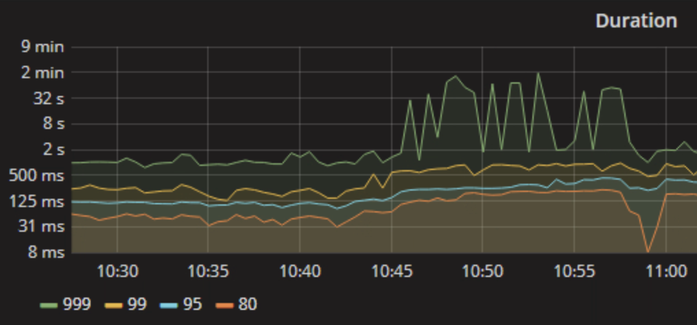
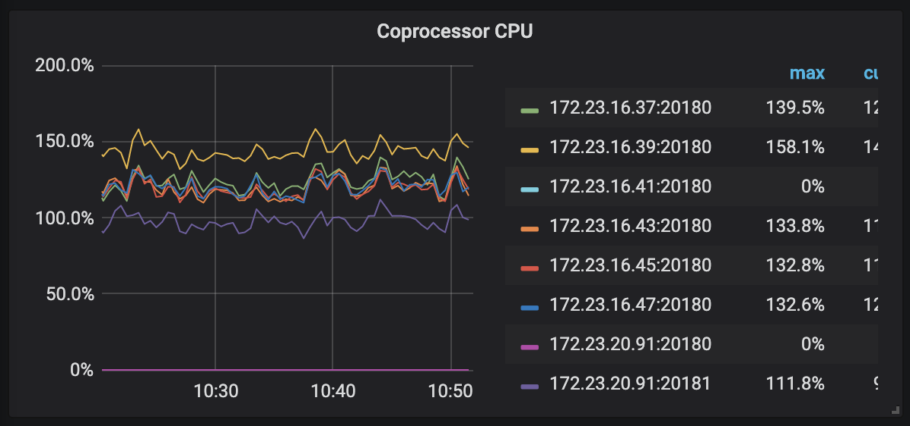
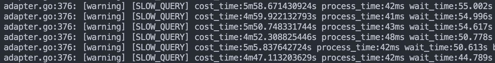
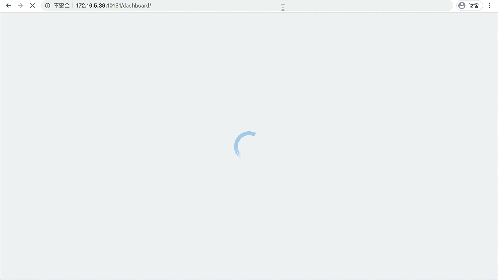
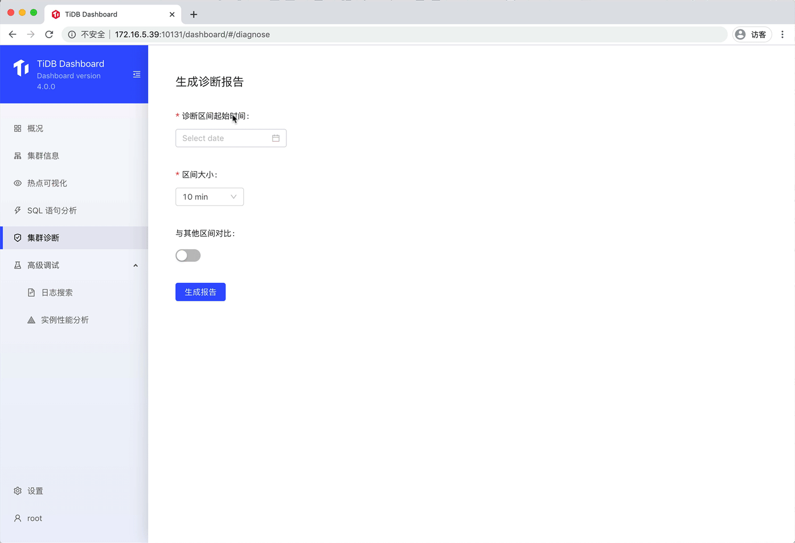
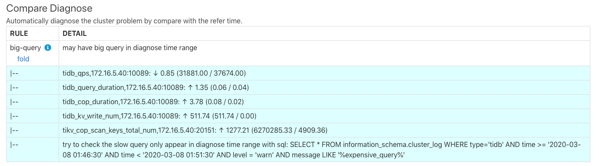
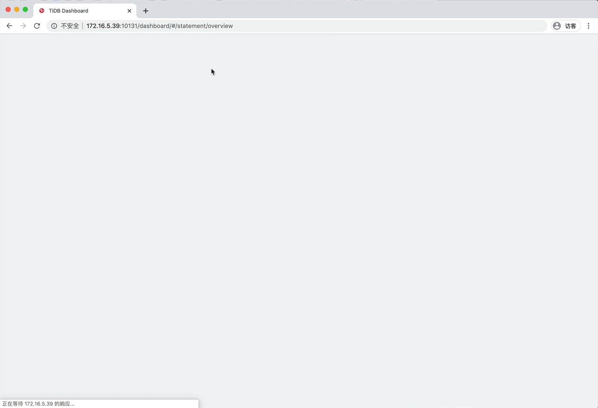
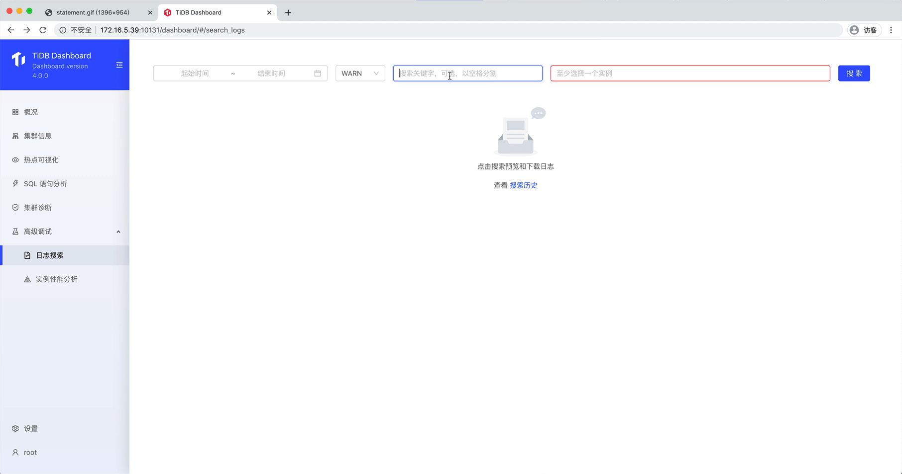
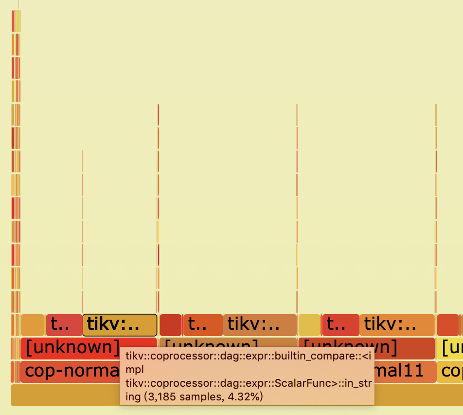

某天，PongHat 公司 DBA 小王同学收到了业务侧的反馈：”小王啊，我们数据库查询现在突然变得很慢，业务已经紧急停了，能不能看下是什么情况？“

小王同学身经百战、见得多了，熟练地输入了 TiDB Grafana 地址，点进 TiDB 监控面板，看到 SQL 执行时间确实突然变得很长，如下所示：



小王根据经验开始排查。他首先从监控上点开 TiKV 节点 CPU 占用的监控——CPU 分布很均匀，但各个 TiKV 的 Coprocessor 占用率都很高。



小王知识水平很高，立刻意识到，可能是因为有大查询！于是他 SSH 到各个 TiDB 机器上，进入日志目录查看 slow log，确实看到了一波可疑的 SQL，它们都执行了很长的时间。



小王挑了几个 SQL 尝试复现，但都未能成功，执行得很快。原来这些 SQL 只是受到影响的 SQL，集群整体占满了导致它们运行缓慢。

翻慢日志翻得即将头晕眼花之际，小王终于找到一条 SQL 现在执行时间也需要很久。他非常 excited，使用 EXPLAIN 观察了一下 SQL 的计划，最终发现原来是有人误操作删除了一个索引，导致 TiDB 走了全表扫描。增加索引后，问题解决。幸好小王对诊断 TiDB 问题经验丰富，汇聚多个线索、结合不同工具最终分析出了问题的根源，如果是新手肯定就跪了。

## 能不能查问题更方便一些？

TiDB 4.0 新提供 TiDB Dashboard 图形化界面，内置各种有力工具方便 DBA 同学诊断、监视和管理集群。



之前的《 [拍个 CT 诊断集群热点](https://pingcap.com/blog-cn/tidb-4.0-key-visualizer/) 》一文中介绍的 Key Visualizer 便是 TiDB Dashboard 包含的工具之一，它可以用于观察业务模式的变化、快速直观的查看热点读写情况。除了 Key Visualizer 以外，TiDB Dashboard 还包含其他工具。接下来让我们来看一下 TiDB Dashboard 都有哪些工具可以缓解上文小王同学的燃眉之急（我们后续还会对这些功能点进行详细介绍，敬请期待）。

### 集群诊断报告

选择一个时间段，TiDB Dashboard 会生成一份诊断报告，直接告诉你集群中有什么已知的问题。也可以选择两个对比时间段，生成对比报告。



集群诊断报告是基于一系列预设规则进行的，会以配置、SQL 执行时间、各种监控、硬件情况等作为依据。该功能目前尚处于非常早期的阶段，涵盖的规则还在不断持续完善中。我们希望它能成长为一个 DBA 得力的助手，让没有经验的 DBA 同学也能拥有相关知识，快速地发现常见问题缘由。

在本文开头的案例中，小王同学可以使用此工具，生成缓慢时候与正常时候的对比报告。报告中直接涵盖之前正常运行、现在则显著变慢了的 SQL，帮助小王同学快速抓到真凶。



### SQL 语句分析（Statements）

选择一个时间段，SQL 语句分析功能可以展示时间段内各个类型 SQL 的总时间占比、单条时间占比、扫的数据量等信息。在 Statements 中，仅仅是参数值不同、其他部分相同的 SQL 语句会被合并显示在一起，使用者无需担心他们成为一堆零碎的 SQL 语句难以系统性地分析。



如果小王同学使用 Statements 功能，选择时间段后，就可以直接按总执行时间或平均执行时间找到“肇事” SQL。

### 日志搜索和导出

使用日志搜索和导出功能，可以简单地通过输入关键字、选择时间范围、选择日志级别、选择搜索组件这几个步骤，批量地在 TiDB、TiKV 和 PD 节点上搜索和导出日志。小王同学再也不需要手工 SSH 一台一台登录服务器搜日志了，一切只需点几下鼠标。



### 节点性能分析（Profiling）

该功能用于直接抓取 TiDB、TiKV 或 PD 节点的火焰图情况。



火焰图直观显示了进程在抓取时间内花在各个内部函数上的时间占比，供高阶用户更好地知道节点当前主要在做什么事情。

## 使用 TiDB Dashboard

TiDB Dashboard 在 TiDB 4.0 集群的 PD 组件中直接内置，无需额外部署。目前 4.0 版本还未正式发布，想要在本地快速体验新版 TiDB 的同学可以使用我们新推出的 TiDB 快速部署工具 TiUP（可在官方网站 [https://tiup.io](https://tiup.io) 进一步了解详情）。

使用 TiUP 可以一键在本地启动 nightly 版本的测试集群，支持 Mac 和 Linux：

```
tiup playground nightly --monitor
```

启动测试集群后，访问以下地址即可体验 TiDB Dashboard：

```
http://127.0.0.1:2379/dashboard
```

对于极端关注集群稳定性的用户，也可以选择独立部署 TiDB Dashboard，本文限于篇幅就不进行详细介绍，可以阅读 TiDB 电子书《TiDB in Action》的 [TiDB Dashboard 章节](https://book.tidb.io/session3/chapter2/key-vis.html) 了解详情（后续会持续更新），**也欢迎大家反馈意见，扫描下方二维码，添加 TiDB Robot 为好友并回复“新特性”即可入群交流：**


