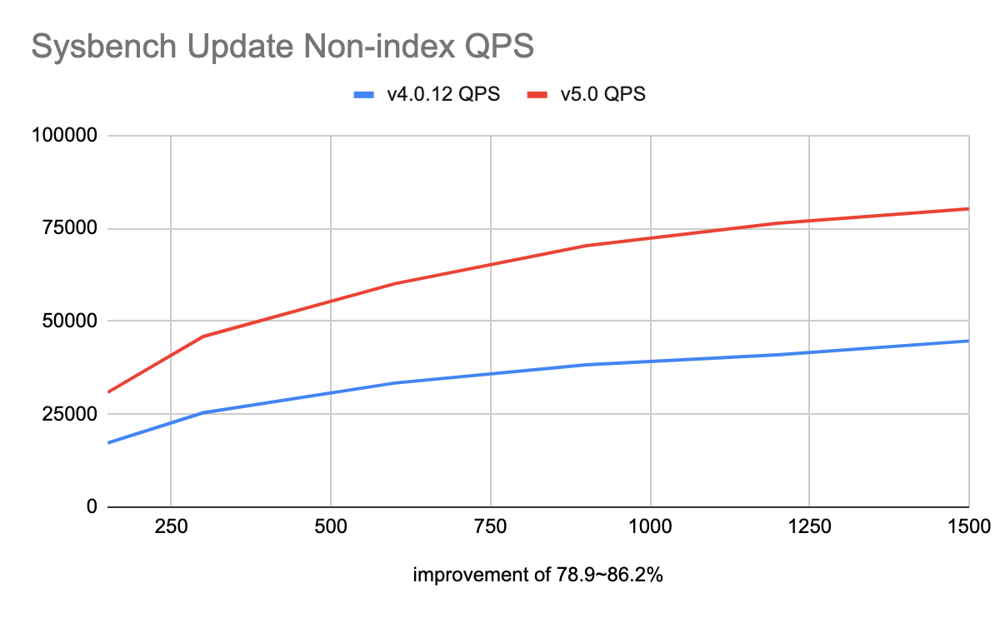
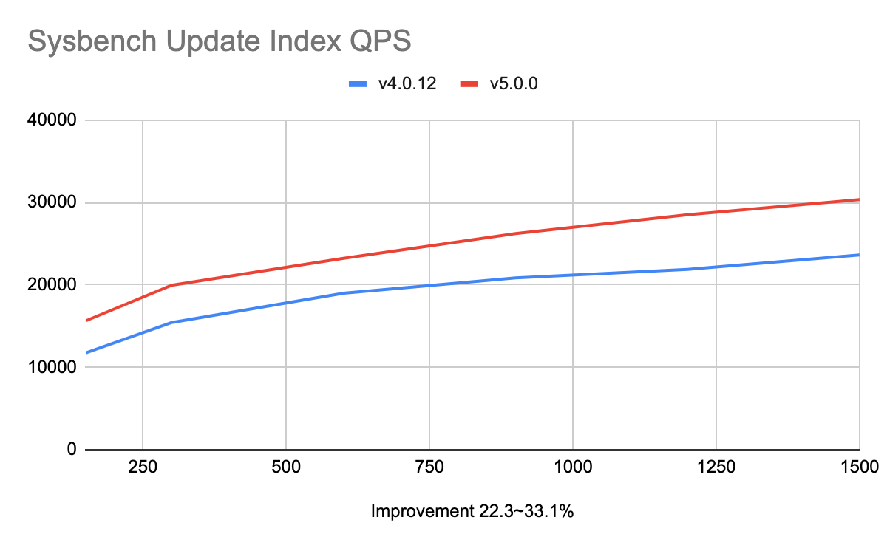
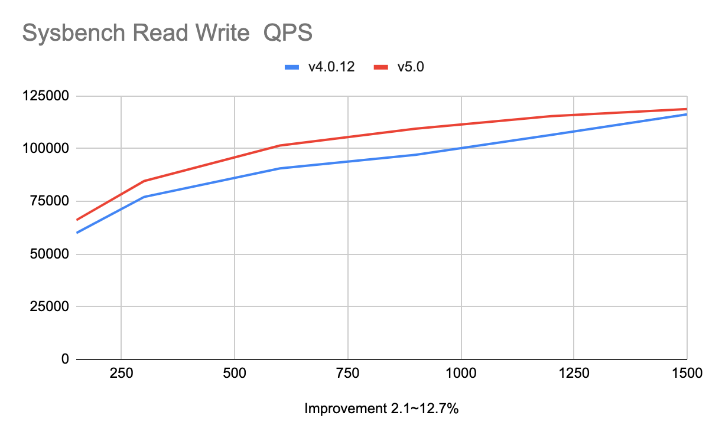
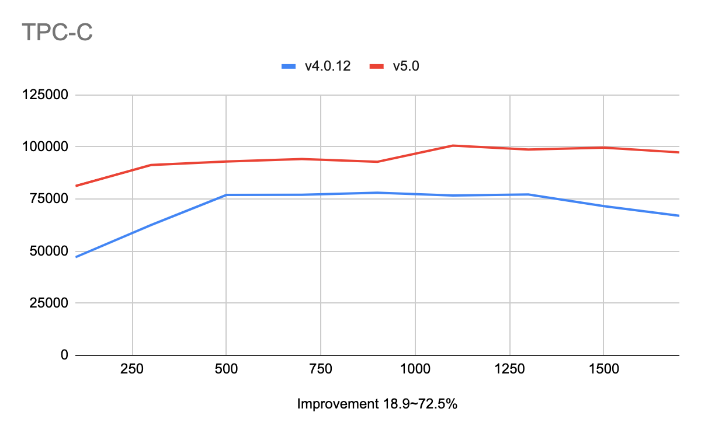
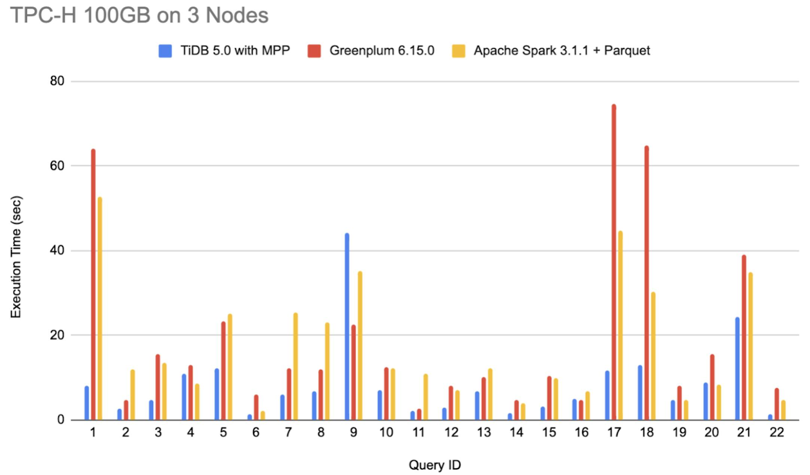
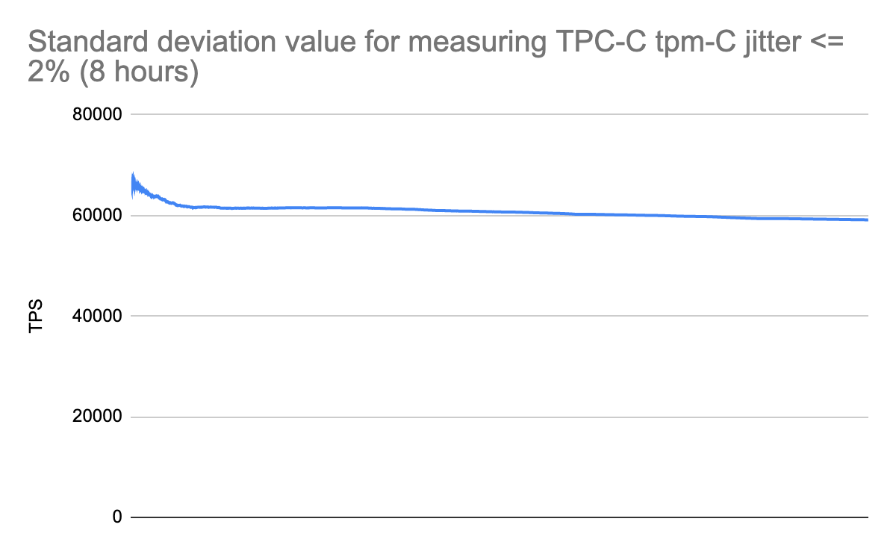
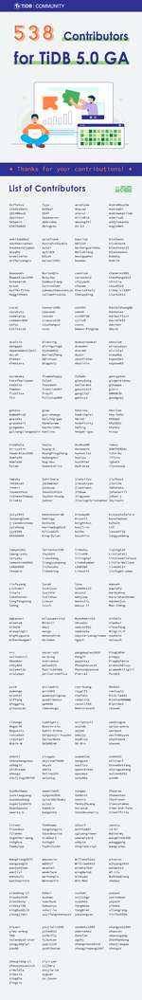

随着 2021 年春天的来临和 PingCAP 年满 6 周岁纪念日的到来，TiDB 5.0 迎来正式 GA。经过近一年紧锣密鼓的开发和打磨，TiDB 5.0 成为迈向企业级核心场景的里程碑版本：TiDB 5.0 的性能和稳定性得到显著提升，从而具备更强大的 OLTP 金融级核心场景的服务能力；在原有 HTAP 引擎 TiFlash 的基础上引入 MPP 架构，TiDB 使得众多企业的实时/交互式 BI 成为现实，为高成长企业和数字化创新场景提供了一栈式的数据服务底座，加速带动 HTAP 进入更多大型企业的数字化场景。

此外，TiDB 5.0 新增多项企业级特性，集成更丰富的大数据生态，提供更加简易的运维体验，帮助企业更高效地基于 TiDB 构建和扩展应用。秉持开源、开放、创新的发展路径，TiDB 将持续为企业构建“融合，简化，可靠”的分布式数据库平台。

## 高性能：多项性能指标实现突破

相比于 TiDB 4.0，TiDB 5.0 在性能方面取得了巨大的进步，通过提供[聚簇索引](https://docs.pingcap.com/zh/tidb/v5.0/clustered-indexes)、[异步提交事务](https://docs.pingcap.com/zh/tidb/v5.0/system-variables#tidb_enable_async_commit-%E4%BB%8E-v50-%E7%89%88%E6%9C%AC%E5%BC%80%E5%A7%8B%E5%BC%95%E5%85%A5)、[TiFlash MPP](https://docs.pingcap.com/zh/tidb/v5.0/use-tiflash#%E4%BD%BF%E7%94%A8-mpp-%E6%A8%A1%E5%BC%8F) 等功能， 在 Sysbench 和 TPC-C 等 OLTP 的基准测试中，获得 20% ~ 80% 的性能提升。基于 100 GB 数据量 TPC-H 查询的结果显示：TiDB 5.0 在同等资源下，MPP 引擎的总体性能是 Greenplum 6.15.0 与 Apache Spark 3.1.1 两到三倍之间，部分查询可达 8 倍性能差异。如下是在一些通用性能测试场景下面的数据：

### 配置信息

|  组件名称 |  配置信息  | 数量 |
|  ----  | ----  | ----  |
|  PD | m5.xlarge (AWS) | 3  |
|  TiDB  | c5.4xlarge (AWS)  | 3  |
|  TiKV | i3.4xlarge (AWS)  | 3 |

### 负载信息

16 张表，每张表有 1000 万行数据

### 性能数据

## 稳定性：衡量 TPC-C tpm-C 抖动的标准差值小于等于 2%

相比于 TiDB 4.0，TiDB 5.0 在稳定性上面取得了巨大的进步。通过优化 TiDB 调度过程中对  I/O、网络、CPU、内存等资源的占用，大幅减少 QPS 和延时因为资源被抢占而出现的性能抖动问题，在 TPC-C OLTP 的基准测试中，衡量 TPC-C tpmC 抖动标准差的值小于等于 2%。

### 配置信息

Intel(R) Xeon(R) CPU E5-2630 v4 @ 2.20GHz  40Core 189GB Memory  3TB SSD

## 易用性：更精准，更高效，更全面

### 更精准的性能排查

用户在排查 SQL 语句性能问题时，需要详细的信息来判断原因。TiDB 5.0 通过 [EXPLAIN](https://docs.pingcap.com/zh/tidb/v5.0/sql-statement-explain#explain) 可查看日志、监控等详细信息，帮助用户提升排查问题的效率。

### 更高效的集群运维

在 TiDB 5.0 中，TiUP 支持一键式环境检查并给出修复建议，自动修复检查过程中发现的环境问题，优化了多项集群部署的操作逻辑，便于 DBA 更快地部署标准的 TiDB 生产集群。新版本的 TiUP 提供业务无感知的升级体验，升级过程中的性能抖动控制在 10~30 秒。

在升级 TiDB 时，新增自动捕获并绑定查询计划的功能，由系统自动捕获并绑定最近一次查询计划然后存储在系统表中，确保升级过程中的 SQL 仍然走绑定的执行计划，

确保稳定性。升级完成后，DBA 可以导出绑定的查询计划，分析并决策是否要删除绑定。

### 更全面的 SQL 调优

TiDB 5.0 支持[不可见索引 ](https://docs.pingcap.com/zh/tidb/v5.0/sql-statement-create-index#%E4%B8%8D%E5%8F%AF%E8%A7%81%E7%B4%A2%E5%BC%95)(Invisible Indexes)，DBA 在调试和选择相对最优的索引时，可以通过 SQL 语句将某个索引设置成 `Visible` 或者 `Invisible`，避免执行消耗资源较多的操作，例如：`DROP INDEX` 或 `ADD INDEX`。

在 TiDB 5.0 性能调优或者运维过程中，用户可以根据实际需要或者基于 [EXPLAIN ANALYZE](https://docs.pingcap.com/zh/tidb/v5.0/sql-statement-explain-analyze#explain-analyze) 测试选择优化过的 SQL 语句，通过 [SQL BINDING](https://docs.pingcap.com/zh/tidb/v5.0/sql-plan-management) 将优化过的 SQL 语句与业务代码执行的 SQL 语句绑定，确保稳定性。

## 数据生态：增加多个数据迁移、数据导入、数据共享组件，方便用户在异构环境使用 TiDB

### 数据迁移方面

[数据迁移类工具](https://docs.pingcap.com/zh/tidb/v5.0/dumpling-overview#%E5%AF%BC%E5%87%BA%E5%88%B0-amazon-s3-%E4%BA%91%E7%9B%98)支持 AWS S3（也包含支持 S3 协议的其他存储服务）作为数据迁移的中间转存介质，同时支持将 [Aurora 快照数据直接初始化 TiDB](https://docs.pingcap.com/zh/tidb/v5.0/migrate-from-aurora-using-lightning) 中，丰富了数据从 AWS S3/Aurora 迁移到 TiDB 的选择。

数据导入工具 [TiDB Lightning](https://docs.pingcap.com/zh/tidb/v5.0/tidb-lightning-overview) 针对 [DBaaS  AWS T1.standard](https://en.pingcap.com/products/tidbcloud/)  配置（及其等同配置）的 TiDB 集群进行了数据导入性能优化，测试结果显示使用 TiDB Lightning 导入 1TB TPCC  数据到 TiDB，性能提升了 40%，由 254 GiB/h 提升到了 366 GiB/h。

### 数据共享方面

[TiCDC 集成 Kafka Connect (Confluent Platform)](https://docs.pingcap.com/zh/tidb/v5.0/integrate-confluent-using-ticdc#tidb-集成-confluent-platform-快速上手指南)，通过 Kafka Connectors 协议，支持将 TiDB 的数据变更同步到不同关系型或非关系型数据库，例如：Kafka, Hadoop, Oracle 等，帮助企业将业务数据流转到异构数据库，形成数据闭环。

[TiCDC 支持在多套 TiDB 集群之间相互复制数据](https://docs.pingcap.com/zh/tidb/v5.0/manage-ticdc#%E7%8E%AF%E5%BD%A2%E5%90%8C%E6%AD%A5)，可用于多个 TiDB 集群之间数据的备份、容灾与数据汇聚等场景。

## 企业级特性：企业级特性获得整体增强

### 事务方面

悲观事务模式下，如果事务所涉及到的表存在并发的 DDL 操作或者 SCHEMA VERSION 变更，系统自动将该事务的 SCHEMA VERSION 更新到最新版本，以此确保事务的成功提交。

### 高可用与容灾

TiDB 5.0 引入 Raft Joint Consensus 算法将 Region 成员变更操作中的“添加”和“删除”合并为一个操作，并发送给所有成员，提升 Region 成员变更时的可用性。在变更过程中，Region 处于中间的状态，如果任何被修改的成员失败，系统仍然具备高可用能力。

### 安全合规

为满足企业安全合规例如《通用数据保护条例》(GDPR) 的要求，TiDB 在输出错误信息和日志信息时，支持对敏感信息（例如身份证信息、信用卡号等）进行脱敏处理，避免敏感信息泄露。

此外，新版本进一步优化了内存管理模块，跟踪统计聚合函数的内存使用情况，从而降低系统 OOM 的风险。在 SQL 功能方面，TiDB 5.0 支持 `INTERSECT` 和 `EXCEPT` 操作符、支持 List 和  List Column 分区表，在字符集和排序规则方面支持 `utf8mb4_unicode_ci` 和 `utf8_unicode_ci` 排序规则。

## 总结

作为企业级开源分布式数据库，TiDB 5.0 在性能、稳定性、易用性、高可用与安全合规等方面都取得了巨大的进步，并增加了多个企业级特性，在 OLTP Scale 的基础之上实现了一栈式数据实时分析的需求，将带动企业用户借助增强性 HTAP 的能力，加速推进数字化转型与升级。

今天就去下载吧！ 

[TiDB 5.0 Download](https://pingcap.com/download-cn/)

[TiDB 5.0 GA Release Notes](https://docs.pingcap.com/zh/tidb/v5.0/release-5.0.0)

特别感谢，TiDB 的开发者社区和用户社区的所有小伙伴为 TiDB 发展所作出的贡献。从 TiDB 4.0 发布以来总计有 538 位 Contributor 提交了 12513 个 PR 帮助我们一起完成企业级核心场景的里程碑版本的开发。如何让 TiDB 在这个时代最优秀的场景中打磨从而不停的迭代和进化？我们相信唯有极致的开放才能让这一切变为可能：开放的源代码，开放的社区，开放的生态和开放的心态！

