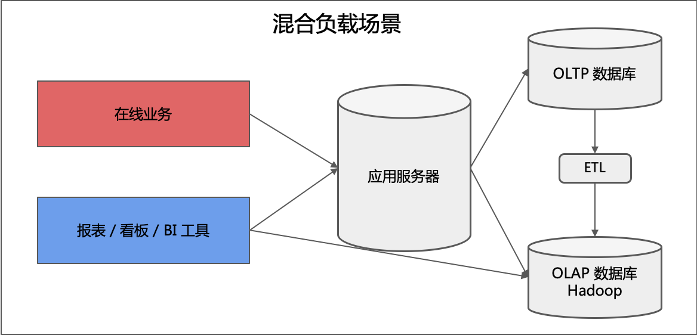
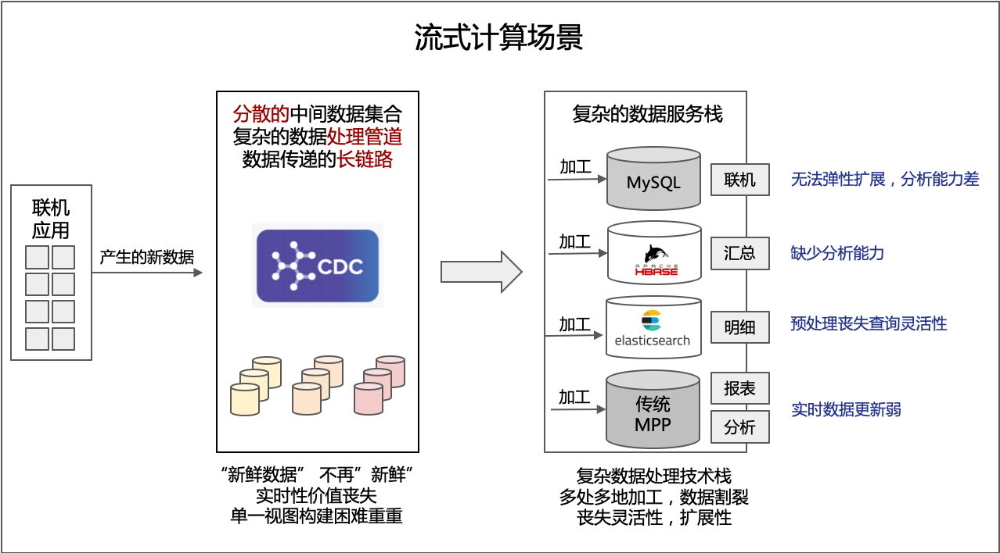
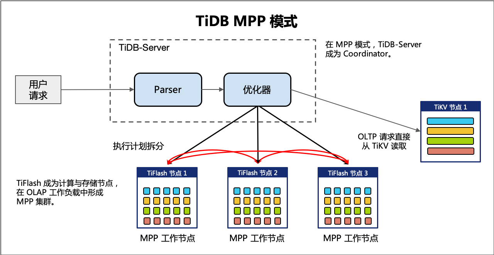
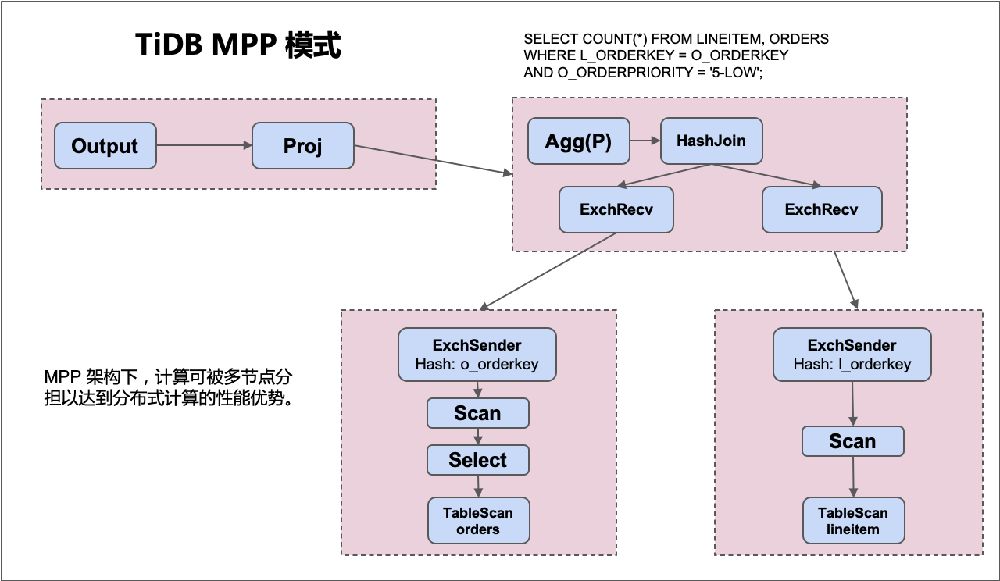
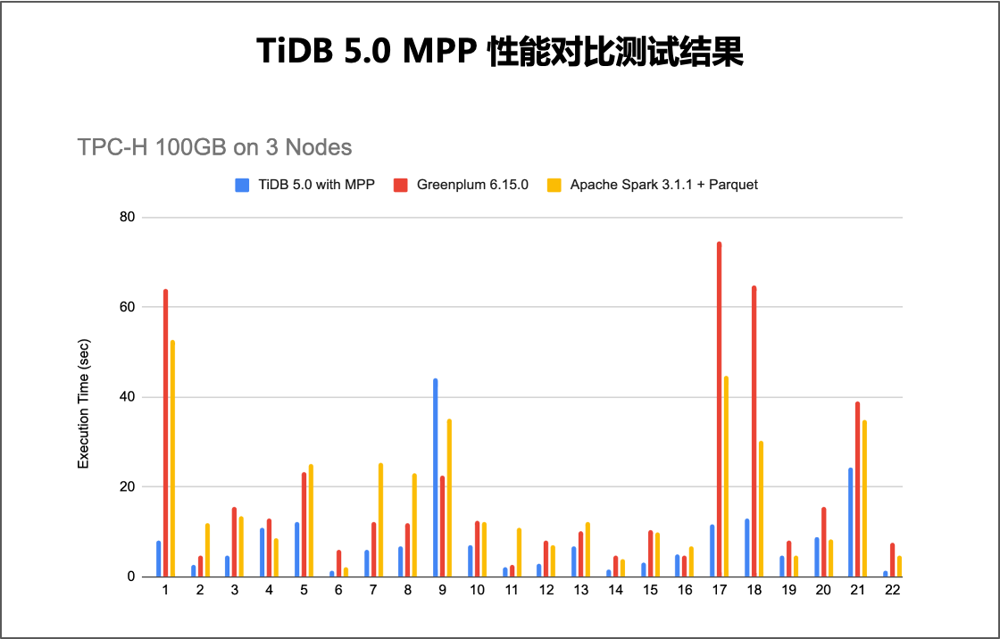
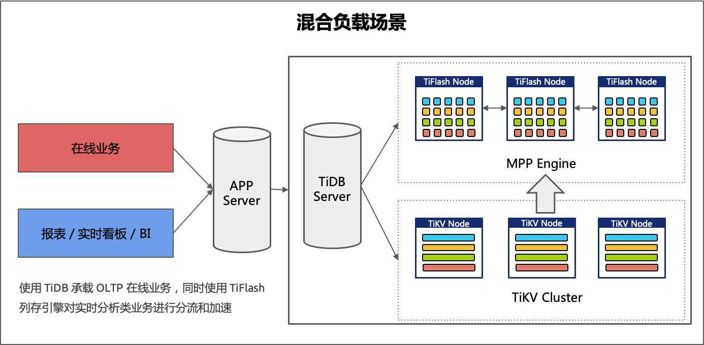
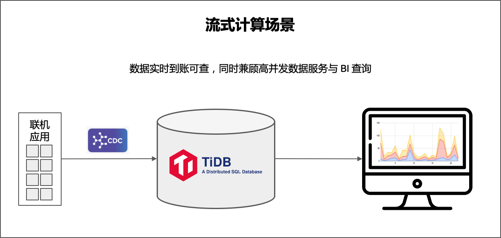
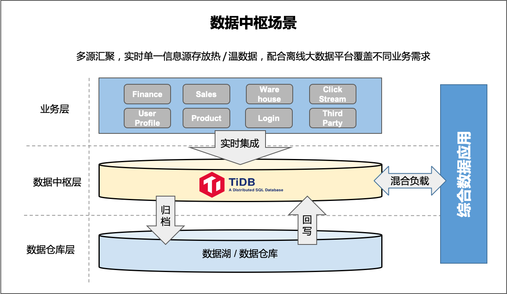

> 作者介绍：马晓宇，PingCAP HTAP 产品部负责人。

## 数据实时化成为业务必须

数字化转型浪潮是现在进行时，在企业数字化转型的过程中，我们看到一个普遍的趋势，企业对“**海量、实时、在线**”的数据需求变得更加迫切。数字化转型并不是互联网公司的专利，人工智能、大数据、物联网这些技术也不仅仅是互联网公司才会使用。事实证明，越来越多的传统企业正在应用这些新兴技术进行业务的创新。每一项新技术的应用都需要一定的技术积累，互联网公司也许会配备很多工程师来支持一个数据体系架构。但对于传统公司来说也许不具备这样的实力，他们会发现自己很难驾驭大数据技术栈。此外，传统大技术栈已经慢慢开始难以应对日新月异的业务需求和爆炸性的数据增长。企业的很多业务对数据实时性的要求越来越高，比如风控、反欺诈等，更早地识别和阻断风险可以让企业减少损失；在物流行业，更实时的数据让物流企业可以更实时地调配行车路线和各类资源，以达到更好的运营效率；公共服务也会对实时数据产生要求，如果去柜台办理一个业务，需要等很久才能查到刚刚办的上一个流程的数据，这对于用户体验来说是非常糟糕的。

## 用户希望用简单的数据库使用体验应对大数据到来

数据的实时化对技术本身要求非常高，一个实时化的数据技术栈，对业务和技术的复杂度提出了更进一步的需求。现实的情况往往是企业的前台业务和离线数仓之间缺少良好的衔接，缺少一个可以与成熟大数据技术无缝衔接的体系。在企业的混合负载场景中，ERP、CRM、MES 等包含多种不同数据访问模式，无法简单区分 OLTP（在线交易处理） 与 OLAP（在线分析处理），DBA 需要不断实时查询各种不同维度的报表。**以往用户使用传统单机数据库承载业务，但当数据量暴涨之后，他们被迫使用更复杂的架构去重构业务系统，这个代价和时间成本通常是业务无法承受的。**

举个例子，比如 DBA 把流水账以 OLTP 的方式来录入，同时有一部分数据是转存到离线数仓之中提供报表查询。在这样的数据架构中，数据链路变得非常复杂：首先应用服务器同时面对数仓类和 OLTP 类的数据库，这两类数据库之间还要搭建 T+1 的 ETL 数据处理流程，从而使两者能共享数据。前端的业务也会面临直接跟应用服务器打交道或者从大数据技术栈捞取数据的情况，这对于应用架构来说非常复杂。更进一步而言， SaaS 或应用软件供应商会觉得尤其痛苦，因为他们要面对客户的所有系统，技术栈的复杂度和维护难度将呈指数级上升。

在流式计算场景中，**基于大数据或者互联网架构，通常得把日志流传向后端，然后进行日志和行为分析**。传统业务在使用流计算场景的时候，更多的时候前端可能是 OLTP 类的数据库，通过 CDC （Change Data Capture 变更数据捕捉）组件向下游输出带有“删”和“改”不同类型操作的数据日志。这些日志在传统的架构下，并没有一个非常好的技术栈去处理。对于下游来说，根据不同的业务需求，也会派生出不同的数据存储去存放和应对这些不同的数据请求。

如果希望承载 CDC 的日志，要求下游的数据库也能实现实时的对应**“删”和“改”**，或许可以选 MySQL，但选择传统单机数据库遇到经常遇到的问题是在海量数据下没有办法做很好的扩容。如果选择既可以扩容、又支持删改的，第一个可能想到 NoSQL 数据库，但是 NoSQL 没有办法进行复杂的数据分析，即使用来做数据分析，也无法达到理想的性能。所以这两种选择在数据量增长的数据分析场景都不太适用。

还有一些其他的选择，比如 Elasticsearch，他其实是一个搜索引擎，如果用来做聚合，就会面临灵活性丧失的问题。此外还有传统的 MPP，他是根据传统 T+1 数仓入库的流程而设计的，所以无法很好地应对数据的实时更新，尤其是 CDC 类的数据更新。

综上所述，**无论是从数据链路层，还是到整个下游的承载，目前都缺少成熟的方案来应对，这就造成了很多时候数据架构师们会把不同的技术架构栈组合在一起以满足业务层的需求。** 举个例子，企业的某种业务包含多个子需求，这些子需求需要多种查询系统或者多种数据平台联合起来工作才能完成，这就造成了企业整个数据架构栈会变得非常复杂，而且栈和栈之间数据的一致性和时效性无法保障。

在 2000 年互联网浪潮还没有到来之前，大多数企业已经在建设上一代的数字化，主要是通过使用数据库来实现的。单体数据库在那个阶段可以能胜任大多数不同的业务需求，所有的数据访问需求其实都应该由数据库来完成，而不是由各种各样复杂的组件来完成。尤其对于传统企业来说，他们更倾向有一个更像传统数据库的技术解决方案来降低技术转型的门槛，这套方案在提供传统数据库体验的同时，还能给数字化转型带来的业务和规模复杂度提供等量的支持。

从大数据技术的发展趋势可以看到，Hadoop 这类传统的大数据技术栈前行的脚步在放缓，整个传统的大数据技术栈已经达到了应有的成熟度，遇到了相应的天花板，要想达到类似成熟数据库一般的体验，几乎是不可能的。在技术发展变缓的前提底下，现有的产品仍然无法达到企业期待的成熟度，于是企业开始寻找其他理想的方案。企业期待中的理想方案是怎么样子的？首先，**可以应对不断膨胀的数据规模** ；其次，**需要应对不同作业类型所需业务模型的技术能力** ；最后，**需要像经典数据库一样架构简单，使用和维护也更加简单。** 在 TiDB 4.0 中，HTAP 架构是由 TiKV 和 TiFlash 共同组成的行列混合的存储架构引擎，使用 TiDB 作为共享的 SQL 入口，共享前端，用同样的数据权管控，优化器会自动根据代价来选择行存或者列存。4.0 架构不完美的地方主要体现在存储和计算能力之间的不匹配。从存储节点而言，TiKV 或者 TiFlash，舒适区是在数据量几百 TB 这个级别。从算力上讲，TiDB-Server 虽然可以多机部署，但是多机部署本身无法实现多机协同，缺少共同做一个大复杂查询切分的能力。形象一点进行比喻，在 TiDB 4.0 以及 4.0 之前，TiDB 拥有非常大的数据存储能力就像小熊庞大的身体，但计算能力就像小熊的头部，两者是不成比例的。

在 **TiDB 5.0 的 HTAP 体系中**，TiFlash 已经不仅仅是一个列式存储引擎这么简单。**TiFlash 引入了 MPP 模式，使得整个 TiFlash 从单纯的存储节点升级成为一个全功能的分析引擎，保留单一的入口，使用用同样的权限控制，OLTP 和 OLAP 仍然是由优化器提供自动的选择。**

TiDB 4.0 中， OLTP 和 OLAP 的选择只涉及选择行存或者选择列存，5.0 可以提供更加多维度的选择，例如选择 MPP 引擎或者选择用单机来进行计算。在架构更新的同时，TiDB 5.0 基于 MPP 引擎，提供了超越传统大数据解决方案的性能。

## TiDB 5.0 HTAP 架构设计

TiDB 5.0 HTAP 架构图中，可以看到右下角的 Storage Cluster 是整个 TiDB 的存储引擎，包含 TiKV 节点，使用的是行式存储，**所谓行式存储就是一行的数据会连续存放在相邻的位置**。TiFlash 节点使用的是列式存储，列式存储的含义就是不同行当中同一列数据会相邻存储在一起，行和列分别会应对不同的业务需求，行存倾向于响应 OLTP 类业务。

一般 OLTP 类业务是少量查询个别的行，进行修改，然后再进行回写，业务希望尽可能地把所有一次操作的数据都放在同一个地点，这就是行存具备的能力。列存一般用来响应报表类和 BI 类请求，例如从一个相当宽的表当中选出其中几列进行筛选和聚合，在这个场景，列存可以选择其中需要读到的列，而不用去碰那些不用的列，而这在行存当中是无法实现的。此外，**列存引擎也会更好地配合向量化引擎**，做到从磁盘读取或者到内存计算，都是一个向量的方式来进行数据的排布，这是对 BI 和分析型引擎最好的加速。

在 TiDB 5.0 中，TiFlash 会全面补充 TiDB 的计算能力，TiDB 在 OLAP 场景下就会退化成一个 master 节点，PD 职责没有任何变化。基于 MPP 架构，用户会向 TiDB Server 发送查询 SQL，这个查询 SQL 会由共享的 TiDB 服务器来承担。这些 TiDB 服务器会进行 Join，然后交给优化器去决策。优化器会把使用行存、列存、某些索引、单机引擎、MPP 引擎，或者是使用不同组合产生不同的执行计划，都纳入到同一个代价模型中进行评估，最后选出一个最优的执行方案。假设业务需要根据某一个人的订单号去查询当前的订单，这是一个点查的查询，优化器将直接向 TiKV 发送点查请求。如果业务有一个报表类查询需求，需要关联百万甚至千万级别的表，并在关联的结果之上再进行聚合与分析，这就是一个 **典型的 MPP 加列存的查询**，优化器就会把这部分查询下发给 TiFlash 的分析型引擎节点进行计算。

上图是分析型引擎的执行计划拆分和处理流程的示意。图中所有红色的虚线框都代表一组节点的物理边界，例如右上角的一个查询，需要 SELECT COUNT 两张表的关联，并按照条件排序。这样的一个表查询就会被拆分成一个查询计划，有两组机器进行扫描，这两组机器可能是共享同一组硬件资源，有一组节点负责扫描左表，有另一组节点负责扫描右表，两个节点分别按照关联查询条件 Join 数据，同样的数据会被关联到一起，属于同一个分片的数据都会到达同一组机器或者同一个机器上，机器再进行局部的关联，把结果合并产生一个完整的结果，最后进行聚合后返回给用户。这就是整个 MPP 架构带来的好处，类似 Join 这样大规模的查询，可以很方便地通过多节点来进行分担。

很多人关心 MPP 引擎到底有多快，这里展示了一个真实场景对比测试的结果。在三节点 TPC-H 100GB 环境下，主表达到几亿规模的数据量，查看在同等的硬件和资源投入下测试执行不同 Query 所需要的时间。从测试结果可以看到，**对比 Greenplum 6.15.0 和 Apache Spark 3.1.1，TiDB 5.0 MPP 展示了更好的性能加速，总体获得 2 - 3 倍的性能优势，个别查询可达 8 倍性能提升。**

## 在 TiDB HTAP 底下用户只要写 SQL 就好

相对于 TiDB 4.0 来说，TiFlash 已经不仅仅是一个列式存储引擎，已经进化成为一个完整的计算分析引擎，**最终实现了把 OLTP 和 OLAP 完整地合二为一，使用同一个前端，数据库就回到了接近于最初经典形态的样子**。一个数据库其实可以同时处理各种形式的查询，数据库只要保证以尽可能高效的方式运行，返回用户应该有的结果就行了。用户只管写 SQL，只管对提出查询或者写入需求，不用管业务是 OLTP 还是 OLAP，TiDB 提供统一入口，同一份逻辑数据，两种存储格式，依靠前端优化器自由选择最优的执行方式，对用户屏蔽了底层架构的复杂度，用户只管写 SQL 就可以了。

在混合负载场景下，使用 TiDB 可以承载 OLTP 类业务，同时使用 TiFlash 加速实时报表，加速对分析业务的查询响应。从架构上来说，以往需要有不同的数据链路去维护不同数据引擎之间的数据流转和存储，现在对用户而言只需要一个入口，一个 APP Server，不同的业务类型可以不加区分地接入这个 APP Server，APP Server 向 TiDB 发送请求，**TiDB 将不同的业务向不同的引擎进行分流和加速，整套技术架构栈变得非常简洁。**

数字时代，越来越多的业务对实时分析的需求更加迫切，在流式计算场景下，对于传统的日志流分析的需求，大数据提供了比较成熟的解决方案。在联机交易或者要求传统 OLTP 类数据库传输带有删改的数据，以及带有 Join 数据的场景下，TiDB 就是目前最理想的方案。

首先，**TiDB 是一款真正的 HTAP 分布式数据库**，可以非常方便地作为一个从库，挂接在 Oracle 或者 MySQL 这样的数据库后面，不需要复杂的数据同步手段，借助 Kafka 或者其他数据管道来进行同步即可。TiDB 可以挂在 MySQL 后面作为从库或者作为 Oracle 的一个复制目的地。与此同时，如果业务希望做一些数据处理的话，也可以随时切换到传统的数据架构上。

**TiDB 本身是一个带有 OLTP 类属性的 HTAP 数据库，对于任何实时的删改增落地，TiDB 是可以达到实时响应，整条数据链路可以实现秒级查询**。TiDB 本身的行列混合属性也意味数据落地不论是明细数据的明细查询，还是对于数据的各种不同维度的实时聚合，都可以很好地响应。

在数据中枢场景中，假设前端有多个业务线，每个业务线都有自己不同的 OLTP 类数据库，例如财务、EPR、销售、仓储数据库，有 Click Stream、有 User Profile、也有产品库，还有用户登录和第三方不同的数据源，这些数据存放在各自的数据库中，可以通过 CDC 的方式或者通过 Kafka 实时集成到 TiDB 里面。这些从不同数据源、不同业务线整合过来的数据，可以放在数据中枢层。

**数据中枢层是相对于离线的数仓层来说的一个概念**，首先他只存放一部分时间段内的数据，而数仓可能会放更久远的历史数据；数据中枢层更倾向于是存放温和热的数据，可以提供实时的数据存取和查询服务。相对于大数据和离线数仓层而言，数据中枢可以直接对接数据应用端，作为一个既可以承接高并发访问，又能够以数据服务的形式来提供全量数据的存取，而离线数仓和数据湖更倾向于离线的方式，通常提供不太新鲜的数据来进行报表与 BI 类查询。

当 TiDB 集成到整个数据平台当中，他充当了一个数据中枢的角色。即使数据平台中已经有了离线数层和 Hadoop 平台，仍然可以把 TiDB 放在业务层、Hadoop 层，或者在数据仓库层之间，作为提供一个实时数据存储和管理的平台，用来满足越来越多用户对于实时存取与实时分析的需求。

从以上几个场景可以看到，**TiDB 的能力已经超越了一个分布式关系型数据库本身**，随着 5.0 MPP 功能的引入与多项企业级特性的增强，TiDB 已经发展成为“**一栈式数据服务生态**”，即“**one stack to serve them all**”。在这整个数据服务生态中，并不只有 PingCAP 在创造和建设，广大社区小伙伴们参与了这套生态的共建和迭代，总计有 538 位 Contributor 提交了 12513 个 PR 协同 PingCAP 一起完成 5.0 这个里程碑版本的开发。例如知乎，给社区贡献了多个大数据生态相关的组件和生态工具，对于大体量用户的业务场景极具应用价值。

我们相信开放和透明的协作，必定会创造出全新的、无限的可能性，把 TiDB 打造成为一个更加完善的“一栈式数据服务生态”，我们一起在路上。