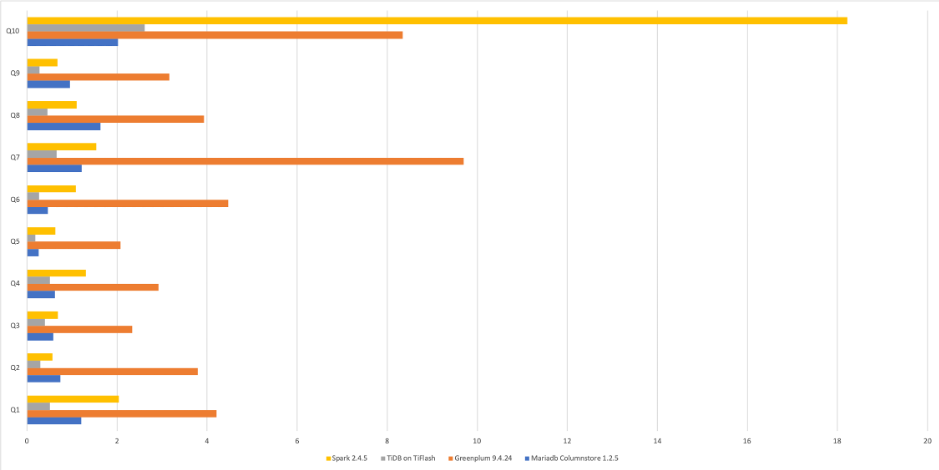

---  
title: 为了证明它的速度，我们一口气对比了 MySQL、Greenplum、Apache Spark、MariaDB ColumnStore……
author: ['马晓宇']
date: 2020-02-12
summary: 借助 TiFlash 的一致性数据同步特型，用户可否以一个优异的速度直接对实时数据进行分析呢？
tags: ['TiFlash']
---  

[上篇文章](https://pingcap.com/blog-cn/10x-improving-analytical-processing-ability-of-tidb-with-tiflash/) 中，我们简单介绍了 TiFlash 的设计和架构，TiFlash 是 TiDB 即将随着 3.1 版本发布（3月）的列存引擎，大幅提升了 TiDB 在实时分析场景下的性能。同时和 TiDB 体系无缝结合，可实时更新，弹性扩展，保持 TiDB 的 ACID 事务特性和快照隔离级别，可用于严肃场景的实时分析。

## 那么 TiFlash 到底有多快？

为了更直观回答这个问题，我们进行了一次对比测试。测试选取了传统交易型数据库（及其列存扩展），分析型数据库和大数据计算引擎进行对比，分别是 MySQL、MariaDB ColumnStore、Greenplum 和 Apache Spark。

其中 MySQL 可以承担在线交易业务，但是分析速度对比针对分析场景特化的产品就相当堪忧；而列存数据库则无法承担在线交易，无论是无更实时新存储结构还是高频少量数据访问性能都很难符合在线交易业务要求。

**而 TiDB 作为 HTAP 数据库，在交易场景已经大量验证的前提下，加上 TiFlash 后在分析侧又能达到怎样的性能呢？借助 TiFlash 的一致性数据同步特型，用户可否以一个优异的速度直接对实时数据进行分析呢？**

这次我们一起来看一组来自美国交通部的有趣数据，它包含了从 1987 至今的飞机起降和准点情况。这个测试参考了 ClickHouse 的官网教程 :)

大家可以使用 Percona Lab 的 [下载脚本](https://github.com/Percona-Lab/ontime-airline-performance/blob/master/download.sh) 获取数据集。数据集总共为一亿八千多万行飞机起降记录。数据集的表结构在 [这里](https://gist.github.com/ilovesoup/1806fd87a8aed66bb058ff64b5286194)。

测试所用查询见后文，我们先来看看对比结果：

| 查询语句 | TiDB + TiFlash Delta Tree | MySQL 5.7.29 | Greenplum 6.1  16 Segments | Mariadb Columnstore 1.2.5 | Spark 2.4.5 + Parquet |
|:------|:------|:------|:------|:------|:------|
| Q1 | 0.508 | 290.340 | 4.206 | 1.209 | 2.044 |
| Q2 | 0.295 | 262.650 | 3.795 | 0.740 | 0.564 |
| Q3 | 0.395 | 247.260 | 2.339 | 0.583 | 0.684 |
| Q4 | 0.512 | 254.960 | 2.923 | 0.625 | 1.306 |
| Q5 | 0.184 | 242.530 | 2.077 | 0.258 | 0.627 |
| Q6 | 0.273 | 288.290 | 4.471 | 0.462 | 1.084 |
| Q7 | 0.659 | 514.700 | 9.698 | 1.213 | 1.536 |
| Q8 | 0.453 | 487.890 | 3.927 | 1.629 | 1.099 |
| Q9 | 0.277 | 261.820 | 3.160 | 0.951 | 0.681 |
| Q10 | 2.615 | 407.360 | 8.344 | 2.020 | 18.219 |




>注：由于 MySQL 过慢，为了不影响比例，上图忽略了 MySQL 数据。

从上面的对比可以看出，

* **相对 MySQL 而言，单机环境下可达到数百倍提升（更不用提 TiFlash 可扩展）；**
* **而对比 MPP 数据库或者新 MariaDB ColumnStore 等无法实时更新的分析型数据库 / 引擎，仍然可达数倍乃至十倍的性能提升。**

如下十条为测试分析查询所用的 SQL。

**查询 1：平均每月航班起降记录数**

```sql
select avg(c1) from 
( select year, month, count(*) as c1 from ontime group by year, month ) A;
```

**查询 2：2000 年到 2008 年的每日航班数**

```sql
select dayofweek, count(*) as c from ontime 
where year>=2000 and year<=2008 group by dayofweek 
order by c desc;
```

**查询 3：按星期统计 2000 年到 2008 年延误（10 分钟以上，下同）的航班数**

```sql
select dayofweek, count(*) as c from ontime 
where depdelay>10 and year>=2000 and year<=2008 group by dayofweek order by c desc;
```

**查询 4：按出发机场统计 2000 年到 2008 年延误数**

```sql
select origin, count(*) as c from ontime 
where depdelay>10 and year>=2000 and year<=2008 group by origin order by c desc limit 10;
```

**查询 5：按照航空公司统计 2007 年延误数**

```sql
select carrier, count(*) from ontime 
where depdelay>10 and year=2007 group by carrier 
order by count(*) desc;
```

**查询 6：按照航空公司统计 2007 年延误比例**

```sql
select carrier, c, c2, c*100/c2 as c3 from 
(select carrier, count(*) as c from ontime where depdelay>10 and year=2007 group by carrier ) A 
inner join 
( select carrier, count(*) as c2 from ontime where year=2007 group by carrier ) B using (carrier) 
order by c3 desc;
```

**查询 7：按照航空公司统计 2000 到 2008 年延误比例**

```sql
select carrier, c, c2, c*100/c2 as c3 from 
( select carrier, count(*) as c from ontime where depdelay>10 and year>=2000 and year<=2008 group by carrier ) A 
inner join 
( select carrier, count(*) as c2 from ontime where year>=2000 and year<=2008 group by carrier ) B using (carrier) 
order by c3 desc;
```

**查询 8：按年统计航班延误率**

```sql
select year, c1/c2 from ( select year, count(*)*100 as c1 from ontime where depdelay>10 group by year ) A 
inner join 
( select year, count(*) as c2 from ontime group by year ) B using (year) 
order by year;
```

**查询 9：每年航班数**

```sql
select year, count(*) as c1 from ontime 
group by year;
```

**查询 10：多维度复杂过滤和聚合**

```sql
select min(year), max(year), carrier, count(*) as cnt, sum(arrdelayminutes>30) as flights_delayed, round(sum(arrdelayminutes>30)/count(*),2) as rate from ontime 
where dayofweek not in (6,7) and originstate not in ('ak', 'hi', 'pr', 'vi') and deststate not in ('ak', 'hi', 'pr', 'vi') and flightdate < '2010-01-01' 
group by carrier having cnt>100000 and max(year)>1990 
order by rate desc limit 1000;
```

## 真 · 行列混合

**别忘了还有行存。TiDB 不但拥有 TiFlash 列存引擎，也同时拥有相应的行存和配套的细粒度索引支持。**

对于唯一值个数非常高的列（例如一个具体的时间，产品唯一序列号等等），一般来说列存很难有良好的手段进行精确过滤。例如在上述 OnTime 数据集中，对 CRSDepTime 计划起飞时间列进行索引，同样的查询还能变得更快。

统计所有在 18:45 分计划起飞的飞机总数。

```
mysql> select count(*) from ontime where 1845 = CRSDepTime;
+----------+
| count(*) |
+----------+
|   766539 |
+----------+
1 row in set (0.09 sec)
```

**而纯粹使用列存，在 MariaDB，Spark 以及 Greenplum 中，这样的查询分别是 0.447 vs 0.449 以及 1.576 秒——与 TiDB +TiFlash 存在 4 至 17 倍速度差！因为他们必须暴力扫表。**

**除此以外，TiDB 的行列混合并不是传统设计上的行存列存二选一，而是 TiDB 可以在同一张表同时拥有行存和列存，且两者永远保持数据强一致（而非最终一致）。**

看到这里也许你要问，TiDB 同时拥有行存和列存是否反而会给用户带来心智负担？答案是并不会。何时使用行存或者列存，除了用户可以为了 HTAP 业务隔离而强制选择以外，你完全可以委托给 TiDB 自行选择。当行存更优（例如上面的案例），TiDB 则会凭借统计信息自动切换到行存进行读取：上面的查询在 TiFlash 上的性能只有 TiKV 行存 + 索引的一半。

## 更快的数据到达

由于为配合 TiDB 数据镜像同步而设计的可高频更新列存引擎，使得 TiFlash 得以高速更新数据。这使得它的快不仅仅意味高速返回查询，也意味着数据能更快被查询到。相较于传统的分析型数据库或者 Hadoop 数据湖需要从源数据库 T + 1 批量加载（往往是一天），TiFlash 的可以读取到最新的（而非仅仅是新鲜的）数据，且你无需关心数据到达乱序或者一致性问题。相比维护额外的数据复制作业，你不但精简了架构，也可以更实时地访问数据。

## 何不试试看？

另外，[TiFlash 上线测试非常简单](https://pingcap.com/blog-cn/10x-improving-analytical-processing-ability-of-tidb-with-tiflash/)，你可以使用一两台现成的机器进行测试，简单一两条命令，上线 TiFlash 节点，添加列存副本，等副本同步完成之后就可以看到效果，绿色无害。TiFlash 已经在进行第一轮用户测试，并在 2 到 3 月间会开启开放公测，请关注后续信息，也欢迎联系询问提前体验 [maxiaoyu@pingcap.com](mailto:maxiaoyu@pingcap.com)。

>附本文测试环境
>
>由于部分测试对象不支持集群模式，测试环境为单机（但是借助 TiDB 的可扩展体系，TiFlash 也可以进行无缝线性扩展）。测试机规格和配置如下：
>
>* CPU: 40 vCores, Intel(R) Xeon(R) CPU E5-2630 v4 @ 2.20GHz @ 1268.383 MHz
>
>* Mem: 188G @ 2133 MHz
>
>* 1 x NVMe SSD 3.6T 
>
>* OS: centos-release-7-6.1810.2.el7.centos.x86_64
>
>* Filesystem: ext4
>
>* TiKV Region Size: 512M**
