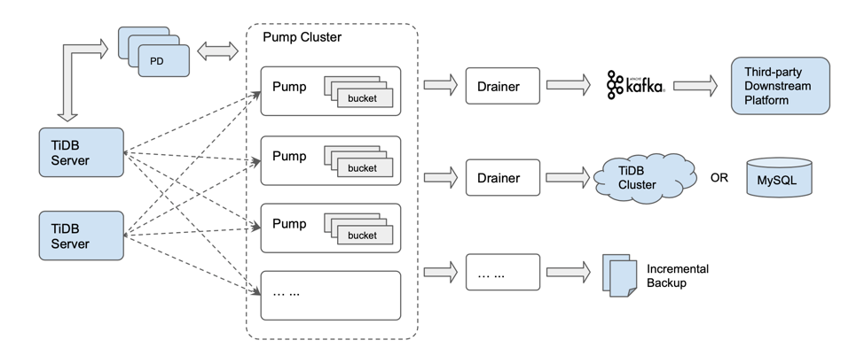

[TiDB Binlog](https://github.com/pingcap/tidb-binlog) 组件用于收集 TiDB 的 binlog，并准实时同步给下游，如：TiDB/MySQL等。该组件在功能上类似于 MySQL 的主从复制，会收集各个 TiDB 实例产生的 binlog，并按事务提交的时间排序，全局有序的将数据同步至下游。利用 TiDB Binlog 可以实现数据准实时同步到其他数据库，以及 TiDB 数据准实时的备份与恢复。TiDB Binlog 作为 TiDB 的核心组件之一，已经在上百家用户的生产环境中长时间稳定运行。

为方便用户和开发者更加深入理解和使用 TiDB Binlog 组件，以及基于 TiDB Binlog 组件做二次开发用于更多的业务场景， 我们决定今天正式开源 TiDB Binlog 组件。

## TiDB Binlog 适用的功能场景

+ 准实时数据同步：同步 TiDB 数据到其他数据库或消息队列（如 TiDB/MySQL/MariaDB/Kafka）。
+ 准实时备份和恢复：增量备份 TiDB 集群数据到外部系统，利用备份的数据在系统故障或者其他场景时可将数据恢复到任意时间点。

## TiDB Binlog 架构

## TiDB Binlog 核心特性

+ 支持类似 MySQL ROW 复制模式。
+ 准实时并按事务提交的时间顺序将数据同步至下游。
+ 分布式架构设计，支持水平弹性扩容和服务高可用。
+ 数据高可靠，系统实时将数据持久化到本地磁盘。
+ 支持多种输出方式，如下：
    - 文件：系统准实时将 binlog 写入文件系统作为增量备份，利用此增量备份文件可将数据恢复到任意时间点。
    - 消息队列：按照 [binlog slave protocol](https://pingcap.com/docs-cn/tools/binlog/binlog-slave-client/) 输出到 Kafka。
    - 下游目标数据库：TiDB/MySQL/MariaDB。

## TiDB Binlog 代码及文档资源

+ [TiDB Binlog 源代码](https://github.com/pingcap/tidb-binlog)
+ [TiDB Binlog 使用手册](https://pingcap.com/docs-cn/tools/binlog/overview/)
+ [深入理解 TiDB Binlog 组件实现原理](https://pingcap.com/blog-cn/tidb-ecosystem-tools-1/)
+ [定制输出方式或者输出到其他下游存储系统](https://pingcap.com/docs-cn/tools/binlog/binlog-slave-client/)

**欢迎大家一起参与 TiDB Binlog 的设计、研发、测试共同推进 TiDB Binlog 走向更成熟，更稳定。近期我们将发布 TiDB Binlog 源码阅读指南，敬请期待。**
