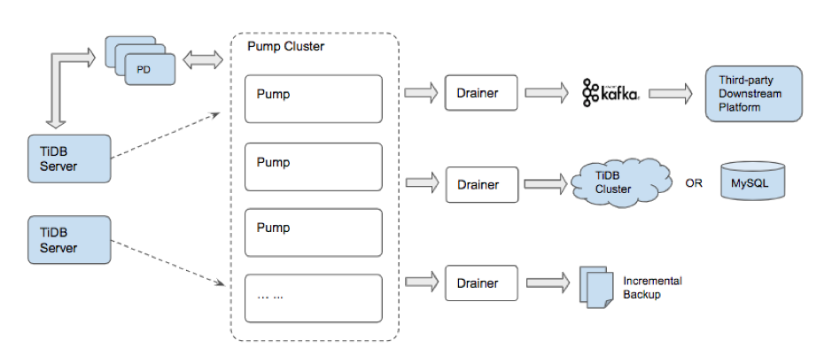
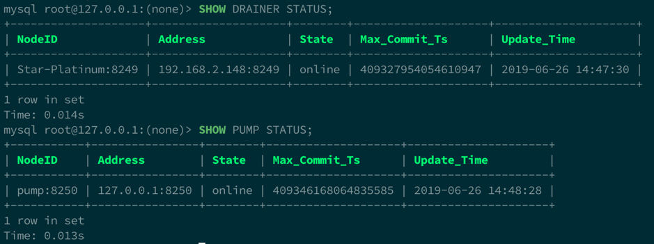
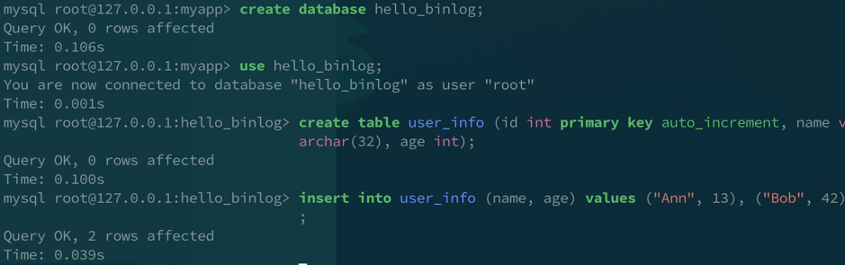
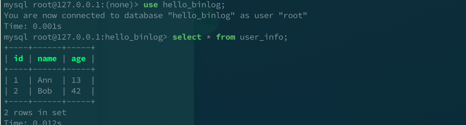

## TiDB Binlog 架构简介

TiDB Binlog 主要由 Pump 和 Drainer 两部分组成，其中 Pump 负责存储 TiDB 产生的 binlog 并向 Drainer 提供按时间戳查询和读取 binlog 的服务，Drainer 负责将获取后的 binlog 合并排序再以合适的格式保存到对接的下游组件。



**在《[TiDB Binlog 架构演进与实现原理](https://pingcap.com/blog-cn/tidb-ecosystem-tools-1/)》一文中，我们对 TiDB Binlog 整体架构有更详细的说明，建议先行阅读该文。**

### 相关源码仓库

TiDB Binlog 的实现主要分布在 [tidb-tools](https://github.com/pingcap/tidb-tools/) 和 [tidb-binlog](https://github.com/pingcap/tidb-binlog) 两个源码仓库中，我们先介绍一下这两个源码仓库中的关键目录。

#### 1. tidb-tools

Repo: [https://github.com/pingcap/tidb-tools/](https://github.com/pingcap/tidb-tools/)

这个仓库除了 TiDB Binlog 还有其他工具的组件，在这里与 TiDB Binlog 关系最密切的是 `tidb-binlog/pump_client` 这个 package。`pump_client` 实现了 Pump 的客户端接口，当 binlog 功能开启时，TiDB 使用它来给 pump [发送 binlog](https://github.com/pingcap/tidb-tools/blob/v3.0.0-rc.3/tidb-binlog/pump_client/client.go#L242) 。

#### 2. tidb-binlog

Repo: [https://github.com/pingcap/tidb-binlog](https://github.com/pingcap/tidb-binlog)

TiDB-Binlog 的核心组件都在这个仓库，下面是各个关键目录：

* `cmd`：包含 `pump`，`drainer`，`binlogctl`，`reparo`，`arbiter` 等 5 个子目录，分别对应 5 个同名命令行工具。这些子目录下面的 `main.go` 是对应命令行工具的入口，而主要功能的实现则依赖下面将介绍到的各个同名 packages。 
* `pump`：Pump 源码，主要入口是 [`pump.NewServer`](https://github.com/pingcap/tidb-binlog/blob/v3.0.0-rc.3/pump/server.go#L103) 和 [`Server.Start`](https://github.com/pingcap/tidb-binlog/blob/v3.0.0-rc.3/pump/server.go#L313)；服务启动后，主要的功能是 `WriteBinlog`（面向 `TiDB/pump_client`） 和 `PullBinlogs`（面向 `Drainer`）。
* `drainer`：Drainer 源码，主要入口是 [`drainer.NewServer`](https://github.com/pingcap/tidb-binlog/blob/v3.0.0-rc.3/drainer/server.go#L88) 和 [`Server.Start`](https://github.com/pingcap/tidb-binlog/blob/v3.0.0-rc.3/drainer/server.go#L238)；服务启动后，Drainer 会先找到所有 Pump 节点，然后调用 Pump 节点的 `PullBinlogs` 接口同步 binlog 到下游。目前支持的下游有：mysql/tidb，file（文件增量备份），kafka 。
* `binlogctl`：Binlogctl 源码，实现一些常用的 Binlog 运维操作，例如用 `-cmd pumps` 参数可以查看当前注册的各个 Pump 节点信息，相应的实现就是 [`QueryNodesByKind`](https://github.com/pingcap/tidb-binlog/blob/v3.0.0-rc.3/binlogctl/nodes.go#L37)。
* `reparo`：Reparo 源码，实现从备份文件（Drainer 选择 file 下游时保存的文件）恢复数据到指定数据库的功能。
* `arbiter`：Arbiter 源码，实现从 Kafka 消息队列中读取 binlog 同步到指定数据库的功能，binlog 在消息中以 [`Protobuf`](https://github.com/pingcap/tidb-tools/blob/v3.0.0-rc.3/tidb-binlog/slave_binlog_proto/proto/binlog.proto#L85) 格式编码。
* `pkg`：各个工具公用的一些辅助类的 packages，例如 `pkg/util` 下面有用于重试函数执行的 [`RetryOnError`](https://github.com/pingcap/tidb-binlog/blob/v3.0.0-rc.3/pkg/util/util.go#L145)，pkg/version 下面有用于打印版本信息的 [`PrintVersionInfo`](https://github.com/pingcap/tidb-binlog/blob/v3.0.0-rc.3/pkg/version/version.go#L45)。
* `tests`：集成测试。

## 启动测试集群

上个小节提到的 `tests` 目录里有一个名为 `run.sh` 脚本，我们一般会使用 [`make integration_test`](https://github.com/pingcap/tidb-binlog/blob/v3.0.0-rc.3/Makefile#L68) 命令，通过该脚本执行一次完整的集成测试，不过现在我们先介绍如何用它来启动一个测试集群。

启动测试集群前，需要在 `bin` 目录下准备好相关组件的可执行文件：

1.  pd-server：下载链接（[Linux](https://download.pingcap.org/pd-master-linux-amd64.tar.gz) / [macOS](https://download.pingcap.org/pd-master-darwin-amd64.tar.gz)）

2.  tikv-server：下载链接（[Linux](https://download.pingcap.org/tikv-master-linux-amd64.tar.gz) / [macOS](https://download.pingcap.org/tikv-master-darwin-amd64.tar.gz)）

3.  tidb-server：下载链接（[Linux](https://download.pingcap.org/tidb-master-linux-amd64.tar.gz) / [macOS](https://download.pingcap.org/tidb-master-darwin-amd64.tar.gz)）

4.  `pump`, `drainer`, `binlogctl`：在 tidb-binlog 目录执行 `make build`

脚本依赖 MySQL 命令行客户端来确定 TiDB 已经成功启动，所以我们还需要安装一个 MySQL 客户端。

准备好以上依赖，运行 `tests/run.sh --debug`，就可以启动一个测试集群。启动过程中会输出一些进度信息，看到以下提示就说明已成功启动：

```
Starting Drainer...
You may now debug from another terminal. Press [ENTER] to continue.
```

测试集群包含以下服务：

1. 2 个作为上游的 TiDB 实例，分别使用端口 4000 和 4001
2. 1 个作为下游的 TiDB 实例， 使用端口 3306
3. PD 实例，使用端口 2379
4. TiKV，使用端口 20160
5. Pump ，使用端口 8250
6. Drainer，使用端口 8249

使用 MySQL 客户端连接任意一个上游 TiDB，可以用 `SHOW PUMP STATUS` 和 `SHOW DRAINER STATUS` 查询对应工具的运行状态，例如：



通过 `binlogctl` 也可以查询到同样的信息，例如：

```
$ bin/binlogctl -pd-urls=localhost:2379 -cmd pumps
[2019/06/26 14:36:29.158 +08:00] [INFO] [nodes.go:49] ["query node"] [type=pump] [node="{NodeID: pump:8250, Addr: 127.0.0.1:8250, State: online, MaxCommitTS: 409345979065827329, UpdateTime: 2019-06-26 14:36:27 +0800 CST}"]
```

接下来我们可以用 MySQL 客户端连接上端口为 4000 或 4001 的 TiDB 数据库，插入一些测试数据。




上图的演示中创建了一个叫 `hello_binlog` 的 database，在里面新建了 `user_info` 表并插入了两行数据。完成上述操作后，就可以连接到端口为 3306 的下游数据库验证同步是否成功：



## 小结

本文简单介绍了 tidb-tools 和 tidb-binlog 及其中的目录，并且展示了如何启动测试集群。有了这些准备，大家就可以进一步了解各个功能的源码实现。下篇文章将会介绍 `pump_client` 如何将一条 binlog 发送往 Pump Server。
