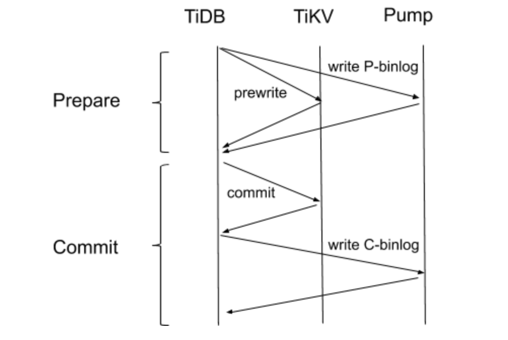

在 [上篇文章](https://pingcap.com/blog-cn/tidb-binlog-source-code-reading-2/) 中，我们介绍了 Pump 的作用是存储 TiDB 产生的 binlog。本篇将介绍 Pump client，希望大家了解 TiDB 把 binlog 写到 Pump，以及输出数据的过程。

## gRPC API

Pump client 的代码在 tidb-tools 下这个 [路径](https://github.com/pingcap/tidb-tools/tree/v3.0.0-rc.3/tidb-binlog/pump_client)，TiDB 会直接 import 这个路径使用 Pump client package。TiDB 跟 Pump 之间使用 gRPC 通信，相关的 proto 文件定义在 [这里](https://github.com/pingcap/tipb/tree/87cb1e27ab4a86efc534fd4c5b62fda621e38465/proto/binlog)。Pump server 提供以下两个接口：

```
// Interfaces exported by Pump.
service Pump {
    // Writes a binlog to the local file on the pump machine.
    // A response with an empty errmsg is returned if the binlog is written successfully.
    rpc WriteBinlog(WriteBinlogReq) returns (WriteBinlogResp) {}

    // Sends binlog stream from a given location.
    rpc PullBinlogs(PullBinlogReq) returns (stream PullBinlogResp) {}
}
```


本文我们主要介绍 RPC `WriteBinlog` 这个接口，Pump client 会通过这个接口写 binlog 到 Pump。

`WriteBinlogReq` 里面包含的 [binlog event](https://github.com/pingcap/tipb/blob/87cb1e27ab4a86efc534fd4c5b62fda621e38465/proto/binlog/binlog.proto#L57)：

```
// Binlog contains all the changes in a transaction, which can be used to reconstruct SQL statement, then export to
// other systems.
message Binlog {
    optional BinlogType    tp             = 1 [(gogoproto.nullable) = false];

    // start_ts is used in Prewrite, Commit and Rollback binlog Type.
    // It is used for pairing prewrite log to commit log or rollback log.
    optional int64         start_ts       = 2 [(gogoproto.nullable) = false];

    // commit_ts is used only in binlog type Commit.
    optional int64         commit_ts      = 3 [(gogoproto.nullable) = false];

    // prewrite key is used only in Prewrite binlog type.
    // It is the primary key of the transaction, is used to check that the transaction is
    // commited or not if it failed to pair to commit log or rollback log within a time window.
    optional bytes         prewrite_key   = 4;

    // prewrite_data is marshalled from PrewriteData type,
    // we do not need to unmarshal prewrite data before the binlog have been successfully paired.
    optional bytes         prewrite_value = 5;

    // ddl_query is the original ddl statement query.
    optional bytes         ddl_query      = 6;

    // ddl_job_id is used for DDL Binlog.
    // If ddl_job_id is setted, this is a DDL Binlog and ddl_query contains the DDL query.
    optional int64         ddl_job_id     = 7 [(gogoproto.nullable) = false];
}
```

## TiDB 如何写 binlog

TiDB 的事务采用 2-phase-commit 算法，一次事务提交会分为 Prewrite 和 Commit 阶段，有兴趣的可以看下相关文章[《TiKV 事务模型概览，Google Spanner 开源实现》](https://pingcap.com/blog-cn/tidb-transaction-model/)。

大家可以先猜想一下 TiDB 是如何写 binlog 的？

如果只写一条 binlog 的话可行吗？可以很容易想到，如果只写一条 binlog 的话必须确保写 binlog 操作和事务提交操作是一个原子操作，那么就要基于事务模型再构建一个复杂的 2PC 模型，从复杂度方面考虑这个方案几乎是不可行的。

实际上，在 TiDB 的实现中，TiDB 会每个阶段分别写一条 binlog， 即：Prewrite binlog 和 Commit binlog，下面会简称 P-binlog 和 C-binlog ，具体写入流程如下：



这里我们说的 P-binlog 和 C-binlog 都是通过 RPC `WriteBinlog` 接口写入，对应着参数 `WriteBinlogReq` 里面包含的 [binlog event](https://github.com/pingcap/tipb/blob/87cb1e27ab4a86efc534fd4c5b62fda621e38465/proto/binlog/binlog.proto#L57)，只是字段有些区别：

* P-binlog 对应的 `tp` 是 `Prewrite`，C-binlog 的 `tp` 是 `Commit` 或者 `Rollback`。

* 同个事务的 P-binlog 和 C-binlog 包含相同 `start_ts`。

* 只有 P-binlog 包含对应事务修改数据 `prewrite_value`。

* 只有 C-binlog 包含事务的 `commit_ts`。

在 Prepare 的阶段，TiDB 会把 Prewrite 的数据发到 TiKV，同时并发写一条 P-binlog 到其中一个 Pump。 两个操作全部成功后才会进行 Commit 阶段，所以我们提交事务时就可以确定 P-binlog 已经成功保存。写 C-binlog 是在 TiKV 提交事务后异步发送的，告诉  Pump 这个事务提交了还是回滚了。

###  写 binlog 对事务延迟的影响

* Prepare 阶段：并发写 P-binlog 到 Pump 和 Prewrite data 到 TiKV，如果请求 Pump 写 P-binlog 的速度快于写 TiKV 的速度，那么对延迟没有影响。一般而言写入 Pump 会比写入 TiKV 更快。

* Commit 阶段：异步的去写 C-binlog，对延迟也没有影响。

### 写 binlog 失败

1. 写 P-binlog 失败，那么 transaction 不会 commit，不会对系统有任何影响。

2. 写 C-binlog 失败，Pump 会等待最多 `max transaction timeout` 的时间（这是一个 TiDB/Pump 的配置，默认为 10 分钟），然后向 TiKV 去查询 transaction 的提交状态来补全 C-binlog，但是此时同步延迟也等于 `max transaction timeout` 。这种情况经常发生于 TiDB 进程重启或者挂掉的场景。

3. 写 P-binlog 成功，但是 Prewrite 失败，那么也会和 2 类似。

## Pump client 源码

Pump client 的代码维护在 [`pump_client`](https://github.com/pingcap/tidb-tools/tree/master/tidb-binlog/pump_client)，提供了 [`NewPumpsClient`](https://github.com/pingcap/tidb-tools/blob/c969908e6130dfbdb4ab80fb84f275df2a6fd877/tidb-binlog/pump_client/client.go#L125) 方法来创建一个 Pump client  实例。Pump client 的主要功能就是维护所有 Pump 状态（将 Pump 分为 avaliable 和 unavailable 两种状态），以此为依据将 TiDB 生成的 binlog 发送到合适的 Pump。为此 Pump client 主要实现了以下几个机制：

1. watch etcd

	Pump 在运行时会将自己的状态信息上报到 PD（etcd）中，并且定时更新自己的状态。在创建 Pump client 的时候，会 [首先从 PD（etcd）中获取所有的 Pump 状态信息](https://github.com/pingcap/tidb-tools/blob/c969908e6130dfbdb4ab80fb84f275df2a6fd877/tidb-binlog/pump_client/client.go#L227)，根据 Pump 状态是否为 Online 初步判断 Pump 为 avaliable 或者 unavailable。然后 Pump client 会 [watch](https://github.com/pingcap/tidb-tools/blob/c969908e6130dfbdb4ab80fb84f275df2a6fd877/tidb-binlog/pump_client/client.go#L478) etcd 中的 Pump 状态变更，及时更新内存中维护的 Pump 状态。

2. binlog 重试机制

	对于每个 Pump，在 Pump client 中都维护了一个变量 [`ErrNum`](https://github.com/pingcap/tidb-tools/blob/c969908e6130dfbdb4ab80fb84f275df2a6fd877/tidb-binlog/pump_client/pump.go#L70) 来记录该 Pump 写 binlog 的失败次数，当 ErrNum 超过一定的阈值，则判断 [该 Pump 不可用](https://github.com/pingcap/tidb-tools/blob/c969908e6130dfbdb4ab80fb84f275df2a6fd877/tidb-binlog/pump_client/pump.go#L174)，如果写 binlog 成功，则 [重置 `ErrNum`](https://github.com/pingcap/tidb-tools/blob/c969908e6130dfbdb4ab80fb84f275df2a6fd877/tidb-binlog/pump_client/pump.go#L162)。

3. 发送探活请求

	在某些情况下，比如网络抖动，可能会导致 Pump 写 binlog 失败，因此该 Pump 被 Pump client 判断状态为 unavailable，但是当网络恢复后，该 Pump 仍然可以提供写 binlog 服务。Pump client 实现了 [detect](https://github.com/pingcap/tidb-tools/blob/c969908e6130dfbdb4ab80fb84f275df2a6fd877/tidb-binlog/pump_client/client.go#L531) 机制，会定期向 unavailable 状态的 Pump 发送探活请求，如果探活请求成功，则更新 Pump 状态为 avaliable。

为了将 binlog 均匀地分发到所有 Pump，Pump client 使用 [`PumpSelector`](https://github.com/pingcap/tidb-tools/blob/c969908e6130dfbdb4ab80fb84f275df2a6fd877/tidb-binlog/pump_client/selector.go#L47) 为每一个 binlog 选择一个合适的 Pump，`PumpSelector` 是一个接口，提供 [`SetPumps`](https://github.com/pingcap/tidb-tools/blob/c969908e6130dfbdb4ab80fb84f275df2a6fd877/tidb-binlog/pump_client/selector.go#L49) 方法来设置可选的 Pump 列表，提供 [`Select`](https://github.com/pingcap/tidb-tools/blob/c969908e6130dfbdb4ab80fb84f275df2a6fd877/tidb-binlog/pump_client/selector.go#L52) 来为 binlog 选择 Pump。目前主要实现了 [Hash](https://github.com/pingcap/tidb-tools/blob/c969908e6130dfbdb4ab80fb84f275df2a6fd877/tidb-binlog/pump_client/selector.go#L59) 和 [Round-Robin](https://github.com/pingcap/tidb-tools/blob/c969908e6130dfbdb4ab80fb84f275df2a6fd877/tidb-binlog/pump_client/selector.go#L109) 两种策略。

为了提高 Pump client 的健壮性，binlog 写失败后会提供一定的重试，每个 Pump 可以重试写多次，同时也会尽量尝试所有的 Pump，这样就可以保证部分 Pump 有故障或者临时的网络抖动也不影响 TiDB 写 binlog，可以查看 [`WriteBinlog`](https://github.com/pingcap/tidb-tools/blob/c969908e6130dfbdb4ab80fb84f275df2a6fd877/tidb-binlog/pump_client/client.go#L242) 了解具体实现方式。

## 小结

本文给大家介绍了 TiDB 如何通过 Pump client 写 binlog 到 Pump，以及 binlog 的主要内容，后续我们将继续介绍 Pump server 是对应如何处理相应请求的。
