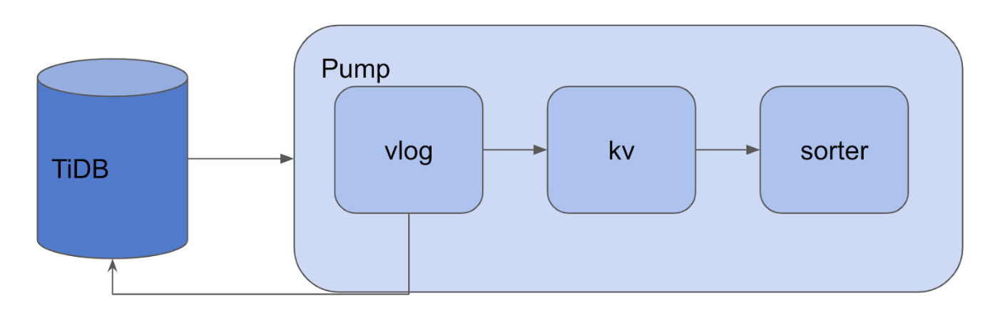
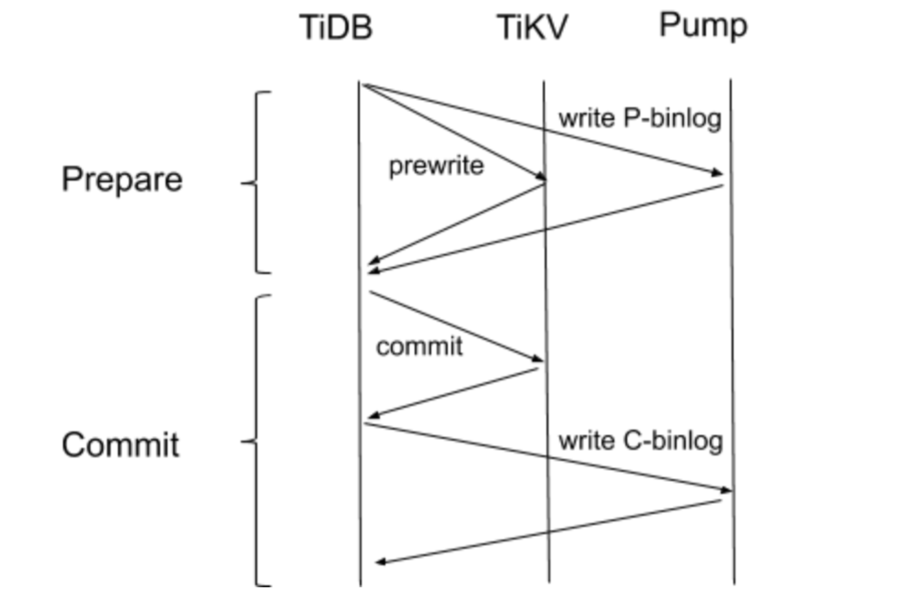

在上篇文章中，我们主要介绍了 Pump Server 的上线过程、gRPC API 实现、以及下线过程和相关辅助机制，其中反复提到了 Pump Storage 这个实体。本文就将介绍 Pump Storage 的实现，其主要代码在 [pump/storage](https://github.com/pingcap/tidb-binlog/tree/7acad5c5d51df57ef117ba70839a1fd0beac5a2c/pump/storage) 文件夹中。

Pump Storage 由 Pump Server 调用，主要负责 binlog 的持久化存储，同时兼顾排序、配对等功能，下面我们由 Storage 接口开始了解 Pump Storage 的实现。

## Storage interface

[Storage 接口](https://github.com/pingcap/tidb-binlog/blob/7acad5c5d51df57ef117ba70839a1fd0beac5a2c/pump/storage/storage.go#L69) 定义了 Pump Storage 对外暴露的操作，其中比较重要的是 `WriteBinlog`、`GC` 和 `PullCommitBinlog` 函数，我们将在下文具体介绍。Storage 的接口定义如下：

```
type Storage interface {
	// WriteBinlog 写入 binlog 数据到 Storage
	WriteBinlog(binlog *pb.Binlog) error
	// GC 清理 tso 小于指定 ts 的 binlog
	GC(ts int64)
	// GetGCTS 返回最近一次触发 GC 指定的 ts
	GetGCTS() int64
	// AllMatched 返回是否所有的 P-binlog 都和 C-binlog 匹配
	AllMatched() bool
	// MaxCommitTS 返回最大的 CommitTS，在这个 TS 之前的数据已经完备，可以安全的同步给下游
	MaxCommitTS() int64
	// GetBinlog 指定 ts 返回 binlog
	GetBinlog(ts int64) (binlog *pb.Binlog, err error)
	// PullCommitBinlog 按序拉 commitTs > last 的 binlog
	PullCommitBinlog(ctx context.Context, last int64) <-chan []byte
	// Close 安全的关闭 Storage
	Close() error
}
```

## Append

[Append](https://github.com/pingcap/tidb-binlog/blob/7acad5c5d51df57ef117ba70839a1fd0beac5a2c/pump/storage/storage.go#L94) 是建立在文件系统接口上的持久化的 Storage 接口实现。在这个实现中，binlog 数据被追加写入 Valuelog，因此我们将这个实现命名为 Append。由于一条 binlog 可能会很大，为了提高性能，我们采用 Key 和 Value 分离的设计。使用 goleveldb 存储 Key（binlog 的 Timestamp），并针对 Pump 的读写特点设计了用于存储 binlog 数据的 Valuelog 组件。

### 初始化

Append 的初始化操作是在 [`NewAppendWithResolver`](https://github.com/pingcap/tidb-binlog/blob/7acad5c5d51df57ef117ba70839a1fd0beac5a2c/pump/storage/storage.go#L130) 函数中实现的，首先初始化 Valuelog、goleveldb 等组件，然后启动处理写入 binlog、GC、状态维护等几个 goroutine。

### WriteBinlog

[`WriteBinlog`](https://github.com/pingcap/tidb-binlog/blob/7acad5c5d51df57ef117ba70839a1fd0beac5a2c/pump/storage/storage.go#L760) 由 Pump Server 调用，用于写入 binlog 到本地的持久化存储中。在 Append 实现的 `WirteBinlog` 函数中，binlog 在编码后被传入到 [`Append.writeCh`](https://github.com/pingcap/tidb-binlog/blob/7acad5c5d51df57ef117ba70839a1fd0beac5a2c/pump/storage/storage.go#L115) Channel 由专门的 goroutine 处理：

```
toKV := append.writeToValueLog(writeCh)
go append.writeToSorter(append.writeToKV(toKV))
```

一条 binlog 被传入 `Append.writeCh` 后将按如下顺序流经数个处理流程：



<center>图 1 binlog 传入 Append.writeCh 的处理流程</center>

1. vlog

	这个过程的主要实现在 [`writeToValueLog`](https://github.com/pingcap/tidb-binlog/blob/7acad5c5d51df57ef117ba70839a1fd0beac5a2c/pump/storage/storage.go#L889) 中：

	```
	// valuePointer 定义
	type valuePointer struct {
		// Fid 是 valuelog 文件 Id
		Fid    uint32
		// Offset 是 pointer 指向的 valuelog 在文件中的偏移量
		Offset int64
	}
	```

	Append 将从 `Append.writeCh` 读出的 binlog，批量写入到 ValueLog 组件中。我们可以将 ValueLog 组件看作一种由 `valuePointer` 映射到 binlog 的持久化键值存储实现，我们将在下一篇文章详细介绍 ValueLog 组件。

2. kv

	这个过程的主要实现在 [`writeBatchToKV`](https://github.com/pingcap/tidb-binlog/blob/7acad5c5d51df57ef117ba70839a1fd0beac5a2c/pump/storage/storage.go#L1350) 中，Append 将 binlog 的 tso 作为 Key, `valuePointer` 作为 Value 批量写入 Metadata 存储中，在目前的 Pump 实现中，我们采用 goleveldb 作为 Metadata 存储数据库。由于 goleveldb 的底层是数据结构是 LSM-Tree，存储在 Metadata 存储的 binlog 相关信息已经天然按 tso 排好序了。

3. sorter

	既然 binlog 的元数据在 writeToKV 过程已经排好序了，为什么还需要 `writeToSorter` 呢？这里和《[TiDB-Binlog 架构演进与实现原理](https://pingcap.com/blog-cn/tidb-ecosystem-tools-1/)》一文提到的 Binlog 工作原理有关：

	TiDB 的事务采用 2pc 算法，一个成功的事务会写两条 binlog，包括一条 Prewrite binlog 和 一条 Commit binlog；如果事务失败，会发一条 Rollback binlog。

	要完整的还原事务，我们需要对 Prewrite binlog 和 Commit binlog（下文简称 P-binlog 和 C-binlog） 配对，才能知晓某一个事务是否被 commit 成功了。[Sorter](https://github.com/pingcap/tidb-binlog/blob/7acad5c5d5/pump/storage/sorter.go#L95) 就起这样的作用，这个过程的主要实现在 [sorter.run](https://github.com/pingcap/tidb-binlog/blob/7acad5c5d5/pump/storage/sorter.go#L156) 中。Sorter 逐条读出 binlog，对于 P-binlog 则暂时存放在内存中等待配对，对于 C-binlog 则与内存中未配对的 P-binlog 进行匹配。如果某一条 P-binlog 长期没有 C-binlog 与之牵手，Sorter 将反查 TiKV 问问这条单身狗 P-binlog 的伴侣是不是迷路了。

	为什么会有 C-binlog 迷路呢？要解释这个现象，我们首先要回顾一下 binlog 的写入流程：

	
	
	<center>图 2 binlog 写入流程</center>

	在 Prepare 阶段，TiDB 同时向 TiKV 和 Pump 发起 prewrite 请求，只有 TiKV 和 Pump 全部返回成功了，TiDB 才认为 Prepare 成功。因此可以保证只要 Prepare 阶段成功，Pump 就一定能收到 P-binlog。这里可以这样做的原因是，TiKV 和 Pump 的 prewrite 都可以回滚，因此有任一节点 prewrite 失败后，TiDB 可以回滚其他节点，不会影响数据一致性。然而 Commit 阶段则不然，commit 是无法回滚的操作，因此 TiDB 先 commit TiKV，成功后再向 Pump 写入 C-binlog。而 TiKV commit 后，这个事务就已经提交成功了，如果写 C-binlog 操作失败，则会产生事务提交成功但 Pump 未收到 C-binlog 的现象。在生产环境中，C-binlog 写失败大多是由于重启 TiDB 导致的，这本身属于一个可控事件或小概率事件。

### PullCommitBinlog

PullCommitBinlog 顾名思义，是用于拉 Commit binlog 的接口，其实现主要在 [PullCommitBinlog](https://github.com/pingcap/tidb-binlog/blob/7acad5c5d5/pump/storage/storage.go#L1061) 函数中。这个过程实现上比较简单，Append 将从客户端指定的 tso 开始 Scan Metadata，Scan 过程中只关注 C-binlog，发现 C-binlog 时根据 StartTs 再反查与它牵手的 P-binlog。这样我们从这个接口拉到的就都是 Commit 成功的 binlog 了。

### GC

GC 是老生常谈，必不可少的机制。Pump Storage 数据在本地存储的体积随时间而增大，我们需要某种 GC 机制来释放存储资源。对垃圾数据的判定有两条规则：1、该条 binlog 已经同步到下游；2、该条 binlog 的 tso 距现在已经超过一段时间（该值即配置项：`gc`）。

注：  由于生产环境中发现用户有时会关闭了 drainer 却没有使用 binlogctl 将相应 drainer 节点标记为 offline，导致 pump storage 的数据一直在膨胀，不能GC。因此在 v3.0.1、v2.1.15 后无论 Binlog 是否已经同步到下游，都会正常进入 GC 流程。

GC 实现在 [doGCTS](https://github.com/pingcap/tidb-binlog/blob/7acad5c5d5/pump/storage/storage.go#L653) 中，GC 过程分别针对 Metadata 和 Valuelog 两类存储。

对于 Metadata，我们 Scan `[0,GcTso]` 这个范围内的 Metadata，每 1024 个 KVS 作为一批次进行删除：

```
for iter.Next() && deleteBatch < 100 {
	batch.Delete(iter.Key())
	deleteNum++
	lastKey = iter.Key()

	if batch.Len() == 1024 {
err := a.metadata.Write(batch, nil)
if err != nil {
	log.Error("write batch failed", zap.Error(err))
}
deletedKv.Add(float64(batch.Len()))
batch.Reset()
deleteBatch++
	}
}
```

在实际的生产环境中，我们发现，如果不对 GC 限速，GC 线程将频繁的触发底层 goleveldb 的 compaction 操作，严重时甚至会引起 WritePaused，影响 Binlog 的正常写入，这是不能接受的。因此，我们通过 l0 文件的数量判断当前底层 goleveldb 的写入压力，当 l0 文件数量超过一定阈值，我们将暂停 GC 过程：

```
if l0Num >= l0Trigger {
	log.Info("wait some time to gc cause too many L0 file", zap.Int("files", l0Num))
	if iter != nil {
		iter.Release()
		iter = nil
	}
	time.Sleep(5 * time.Second)
	continue
}
```

对于 Valuelog，GC 每删除 100 批 KVS（即 102400 个 KVS）触发一次 Valuelog 的 GC，Valuelog GC 最终反应到文件系统上删除文件，因此开销比较小。

在示例代码的 [doGCTS](https://github.com/pingcap/tidb-binlog/blob/7acad5c5d51df57ef117ba70839a1fd0beac5a2c/pump/storage/storage.go#L653) 函数中存在一个 Bug，你发现了么？欢迎留言抢答。

## 小结

本文介绍了 Pump Storage 的初始化过程和主要功能的实现，希望能帮助大家在阅读代码的时候梳理重点、理清思路。下一篇文章将会介绍上文提及的 Valuelog 和 SlowChaser 等辅助机制。
