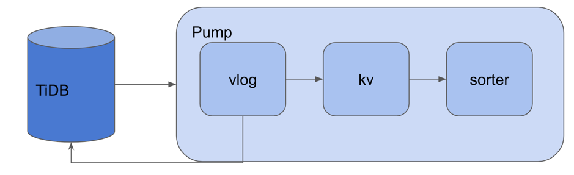

在 [上篇文章](https://pingcap.com/blog-cn/tidb-binlog-source-code-reading-5/) 中，我们主要介绍了 Pump Storage 是如何对 binlog 进行持久化存储、排序、配对的。在文中我们提到 binlog 的持久化键值存储主要是由 [`valueLog`](https://github.com/pingcap/tidb-binlog/blob/9f3c81683bb3428c4940611a6203288474d4aff0/pump/storage/vlog.go) 组件完成的。同时，大家如果在上文点开 [`writeToValueLog`](https://github.com/pingcap/tidb-binlog/blob/9f3c81683bb3428c4940611a6203288474d4aff0/pump/storage/storage.go#L889) 代码阅读的话会发现在其中还会使用一个 `slowChaser` 组件。`slowChaser` 组件主要用于避免在写 kv 环节中 GoLevelDB 写入太慢甚至出现 write paused 时影响 Pump Storage 的执行效率的问题。

接下来，本篇文章重点介绍 `valueLog` 与 `slowChaser` 这两个组件。

## valueLog

`valueLog` 组件的代码位于 [pump/storage/vlog.go](https://github.com/pingcap/tidb-binlog/blob/9f3c81683bb3428c4940611a6203288474d4aff0/pump/storage/vlog.go#L156) 中，主要作用是管理磁盘中的所有存放 Binlog Event 的 logFile 文件。Pump 本地 GoLevelDB 中存储的 key value 中，key 用 Binlog 的 `StartTs/CommitTs` 拼成，value 则只是一个索引，指向 `valueLog` 中的一条 Binlog 记录。`valueLog` 的结构体定义如下所示：


```
type valueLog struct {
	buf *bytes.Buffer // buf to write to the current log file

	dirPath   string
	sync      bool
	maxFid    uint32
	filesLock sync.RWMutex
	filesMap  map[uint32]*logFile

	opt *Options
}
```

logFile 文件在 Pump 指定数据目录下会以类似 “000001.log” 的命名保存，其中的 “000001” 即为表示 logFile 文件编号的 Fid。`valueLog` 中的 `maxFid` 为文件中最大的 Fid，`valueLog` 也只会把 binlog 写到 maxFid 的 logFile。 filesMap 中会保存所有的 Fid 编号所对应的 logFile 对象。logFile 包含了单个 logFile 的一些属性和方法，主要包含在 [pump/storage/log.go](https://github.com/pingcap/tidb-binlog/blob/9f3c81683bb3428c4940611a6203288474d4aff0/pump/storage/log.go#L51) 中。

valueLog 作为持久化 Binlog Event 到 logFiles 的组件，包含了一系列对 logFiles 进行的操作。下面我们来看看其中几个比较重要的方法。

### 1. [`readValue`](https://github.com/pingcap/tidb-binlog/blob/9f3c81683bb3428c4940611a6203288474d4aff0/pump/storage/vlog.go#L297)

该函数的作用是使用上一篇文章中提到的 [`valuePointer`](https://github.com/pingcap/tidb-binlog/blob/9f3c81683bb3428c4940611a6203288474d4aff0/pump/storage/vlog.go#L123) 在磁盘的 logFiles 中定位到对应的 Binlog Event。该函数会在 Pump 向 Drainer 发 Binlogs 和向 TiKV 查询 Binlog 的提交状态时被用到。

### 2. [`write`](https://github.com/pingcap/tidb-binlog/blob/9f3c81683bb3428c4940611a6203288474d4aff0/pump/storage/vlog.go#L314)

顾名思义，主要作用是处理 [写 binlog 请求](https://github.com/pingcap/tidb-binlog/blob/9f3c81683bb3428c4940611a6203288474d4aff0/pump/storage/vlog.go#L100)，在上一篇文章中提到的 [writeToValueLog](https://github.com/pingcap/tidb-binlog/blob/9f3c81683bb3428c4940611a6203288474d4aff0/pump/storage/storage.go#L889) 被用到，不是并发安全的。为了提高写入效率，`write` 函数在处理一组写 binlog request 时，会先使用 [encodeRecord](https://github.com/pingcap/tidb-binlog/blob/9f3c81683bb3428c4940611a6203288474d4aff0/pump/storage/log.go#L83) 函数把将要写入的 binlog event 编码后存入 `bufReqs` 数组，随后再通过 `toDisk` 函数写入 logFile 文件。如果要写入的目标 logFile 文件已经很大，则新建并切换到新的 log 文件，同时增大 maxFid。

一个完整的 binlog 文件的编码格式在 log.go [开头注释](https://github.com/pingcap/tidb-binlog/blob/9f3c81683bb3428c4940611a6203288474d4aff0/pump/storage/log.go#L33) 中：

```
/*
log file := records + log file footer
record :=
  magic: uint32   // magic number of a record start
  length: uint64  // payload 长度
  checksum: uint32   // checksum of payload
  payload:  uint8[length]    // binlog 数据
footer :=
  maxTS: uint64     // the max ts of all binlog in this log file, so we can check if we can safe delete the file when gc according to ts
  fileEndMagic: uint32  // check if the file has a footer
*/

```

一个 binlog 文件中往往包含了多条 record。一条 record 中开头的 16 个字节为 record 头：其中前 4 个字节为表示 record 数据开始的 magic 码；中间 8 个字节保存了该条 record 的长度；最后 4 个字节为 checksum，用于校验。record 头后面紧跟的是单个 binlog event 的二进制编码。这样编码的一大好处是 `valueLog` 只需要 Offset 参数就能得到 binlog 编码段。

完整的 log 文件尾部还有一个 footer。valueLog 不会向已经有 footer 的 log 文件写入新的 binlog event。footer 的前 8 个字节为该 logFile 中所有 Binlog 的 maxTS，该值可用于后面介绍到的 GC 操作。后 4 个字节为表示文件已结束的 magic 码。

### 3. [`openOrCreateFiles`](https://github.com/pingcap/tidb-binlog/blob/9f3c81683bb3428c4940611a6203288474d4aff0/pump/storage/vlog.go#L202)

在 Pump Storage 启动时会使用该函数启动 `valueLog` 组件，初始化 `valueLog` 的配置信息，读取磁盘的 log 文件并将文档信息导入到 `filesMap` 中。

在 `valueLog` 启动时，如果要写入的 logFile 没有 footer，则该函数会使用 `scan` 方法扫描该 logFile 的所有 binlog，求出 `maxTS` 更新至内存。因此在关闭 `valueLog` 时，如果当前文件已经较大，则将文件加上 footer，将内存中的 `maxTS` 持久化到 footer 以节省下次启动 `valueLog` 时进行 `scan` 查询的时间。

### 4. [`scan`](https://github.com/pingcap/tidb-binlog/blob/9f3c81683bb3428c4940611a6203288474d4aff0/pump/storage/vlog.go#L415) 与 [`scanRequests`](https://github.com/pingcap/tidb-binlog/blob/9f3c81683bb3428c4940611a6203288474d4aff0/pump/storage/vlog.go#L386)

扫描某个 `valuePointer` 之后的所有在 logFiles 中的 binlog event，并将读到的 binlog event 通过 `fn` 函数进行对应的处理。Pump Storage 在重启时会使用该函数读取持久化到 vlog 但还没将索引写到 kv 的 binlog event 并 [交给 kv 组件处理](https://github.com/pingcap/tidb-binlog/blob/9f3c81683bb3428c4940611a6203288474d4aff0/pump/storage/storage.go#L229)。为提高效率，scan 只在读取文件列表时加文件锁，读取完毕开始扫描后如果有并发写入的 logFile 则不会被 scan 扫到。

### 5. [`gcTS`](https://github.com/pingcap/tidb-binlog/blob/9f3c81683bb3428c4940611a6203288474d4aff0/pump/storage/vlog.go#L442)

在 Storage 进行 GC 时使用，前面 write 中提到的 `maxTS` 即在这里使用。该函数会直接删掉磁盘目录下所有 `maxTS` 小于 `gcTS` 的 logFile 以节约磁盘空间。

## slowChaser

`slowChaser` 组件的代码主要位于 [pump/storage/chaser.go](https://github.com/pingcap/tidb-binlog/blob/9f3c81683bb3428c4940611a6203288474d4aff0/pump/storage/chaser.go) 中。其结构体定义如下所示：

```
type slowChaser struct {
	on                 int32
	vlog               valLogScanner
	lastUnreadPtr      *valuePointer
	recoveryTimeout    time.Duration
	lastRecoverAttempt time.Time
	output             chan *request
	WriteLock          sync.Mutex
}
```

**看到这里，相信大家也一定有个疑问：既然 Pump 已经有了正常写 binlogs 的链路，为什么我们还要再引入 `slowChaser` 组件呢？**



在上篇文章中我们提到，当 Pump Server 收到 binlog 后，会按照 vlog -> kv ->  sorter 的顺序传递 binlog，每一条 binlog 都会在上一步写入完成后发送给下一步组件的输入 channel。在 [写 kv 时](https://github.com/pingcap/tidb-binlog/blob/9f3c81683bb3428c4940611a6203288474d4aff0/pump/storage/storage.go#L1367)，GoLevelDB 可能会因为执行 compaction 导致写入变慢甚至出现 write paused 现象。此时，当 vlog -> kv channel 装满后，则需要 `slowChaser` 来处理后续的 binlog 到 kv。

### slowChaser 的初始化与启动

`slowChaser` 会在调用 `writeValueLog` 函数的一开始就被实例化，并同时开启线程运行 [`slowChaser.Run()`](https://github.com/pingcap/tidb-binlog/blob/9f3c81683bb3428c4940611a6203288474d4aff0/pump/storage/chaser.go#L72)。但此时 `slowChaser` 并未开始扫描，只是开始监视 Pump 写 kv 的速度。

开启 `slowChaser` 的代码位于 [`writeValueLog`](https://github.com/pingcap/tidb-binlog/blob/9f3c81683bb3428c4940611a6203288474d4aff0/pump/storage/storage.go#L946)。当我们发现向 buffer channel 中写入 request [等待的时间超过 1 秒](https://github.com/pingcap/tidb-binlog/blob/9f3c81683bb3428c4940611a6203288474d4aff0/pump/storage/storage.go#L945)，`slowChaser` 便会被开启。同时从该 binlog 开始之后在 `writeValueLog` 中写入磁盘的 binlog 均不会再再传递进 vlog -> kv 之间的 buffer channel，直到 `slowChaser` 被关闭为止。

因为 `slowChaser` 是可能被多次启停的，因此在 `slowChaser` 的 `Run` 函数中我们使用 [`waitUntilTurnedOn`](https://github.com/pingcap/tidb-binlog/blob/9f3c81683bb3428c4940611a6203288474d4aff0/pump/storage/chaser.go#L150) 函数每隔 0.5 秒就检查 `slowChaser` 的启动状态。

### slowChaser 的扫描操作：catchUp

`slowChaser` 在被启动后会使用 [`catchUp`](https://github.com/pingcap/tidb-binlog/blob/9f3c81683bb3428c4940611a6203288474d4aff0/pump/storage/chaser.go#L130) 函数去扫描磁盘目录，从 `lastUnreadPtr` 即第一个没有被写 kv 的 binlog 的 `valuePointer ` 开始。该值会在启动 `slowChaser` 时设置为当时的 binlog 对应的 `valuePointer`，之后会在每次成功写入 kv 后就更新。

有了起始 `valuePointer` 以后，`slowChaser` 会使用前文提到的 `valueLog` 的 `scanRequests` 方法进行一次扫描。扫描时 chaser 会把扫出的每条 binlog 逐一发给 toKV channel。

### slowChaser 的运行与关闭

在前面介绍了 `slowChaser` 的作用，但我们应当注意的是 `slowChaser` 毕竟是一个 “slow” 的组件，是针对写 kv 缓慢的无奈之举，从硬盘中扫描读取 binlog 再写 kv 的操作是必然慢于直接从内存写 kv 的。因此 `slowChaser` 启动扫描后，我们就应该观察写 kv 的速度是否已经恢复正常，以及在磁盘中的 binlog 是否已经全部写到 kv，从而适时关掉 `slowChaser` 以提高运行速度。基于此，下面我们将介绍 `slowChaser` 的 `catchUp` 与关闭操作，主要涉及 [`slowChaser.Run()`](https://github.com/pingcap/tidb-binlog/blob/9f3c81683bb3428c4940611a6203288474d4aff0/pump/storage/chaser.go#L72) 的 for 循环里的代码。

`slowChaser` 在每轮运行时会进行至多两次 `catchUp` 操作：

*   第一次 `catchUp` 操作不会使用写锁禁止 `valueLog` 组件写 logFile 到磁盘。在正常扫描完磁盘中的 binlog 后，chaser 会同时计算本次 `catchUp` 所花费的时间，如果花费时间较短，说明这可能是个恢复正常运转的好时机。这时 `slowChaser` 会进入第二次 `catchUp` 操作，尝试扫完所有 binlog 并关闭 `slowChaser`。如果本次 `catchUp` 花费时间过长或者在 1 分钟内进行过第二次的 `catchUp` 操作则会跳过第二次 `catchUp` 直接进入下一轮。

*   第二次 `catchUp` 会在操作开始前记录本次恢复开始的时间，同时上锁阻止 vlog 写 binlog 到磁盘。如果 `catchUp` 在 1 秒内完成，此时磁盘中所有 binlog 都已经写到 kv ， 则 `slowChaser` 可以安全地被关闭。如果 `catchUp` 超时，为避免长时间持锁阻止 vlog 写 binlog 影响性能，`slowChaser` 将继续进行下一轮的 `catchUp`。第二次 catchUp 操作结束时不论成败互斥锁都将被释放。

`slowChaser` 在成功 catch up 之后会被关闭，但不会完全停止运行，只是进入了 “睡眠” 状态，继续不断监视 Pump 写 kv 的速度。一旦 `writeValueLog` 中再次出现了写 kv 慢的现象，[`slowChaser.TurnOn`](https://github.com/pingcap/tidb-binlog/blob/9f3c81683bb3428c4940611a6203288474d4aff0/pump/storage/chaser.go#L58) 被调用，`slowChaser` 又会重新启动，开始新的轮次的 `catchUp` 操作。只有当 `writeValueLog` 函数退出时，`slowChaser` 才会真正随之退出并完全停止运行。

## 小结

本文介绍了 Pump Storage 的两个重要组件 `valueLog`，`slowChaser` 的主要功能与具体实现，希望能帮助大家更好地理解 Pump 部分的源码。

至此 TiDB Binlog 源码的 Pump 部分的代码已基本介绍完毕，在下一篇文章中我们将开始介绍 Drainer Server 模块，帮助大家理解 Drainer 是如何启动，维护状态与获取全局 binlog 数据与 Schema 信息的。
