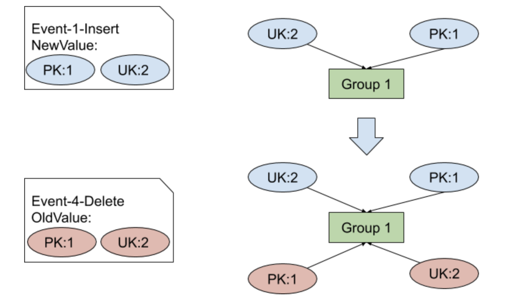
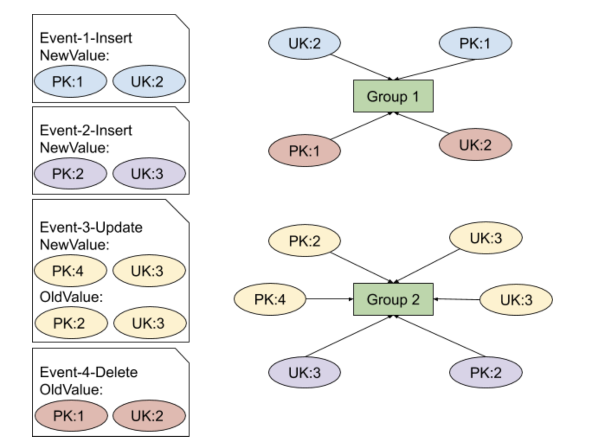
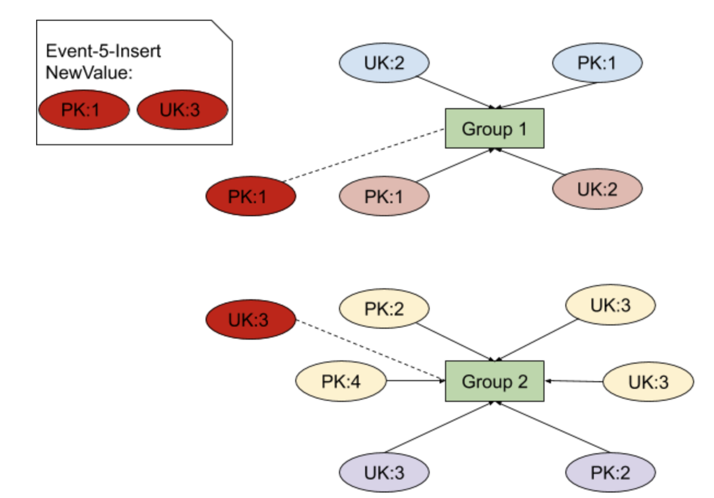

在[上一篇文章](https://pingcap.com/blog-cn/tidb-binlog-source-code-reading-7/)中，我们介绍了 Drainer server，其中 Syncer 的实现之一 MySQLSyncer 就是对 Loader 的封装。Loader 主要用于将 binlog 数据写入到支持 MySQL 协议的数据库。由于 Drainer/Reparo 等组件都需要类似功能，因此我们将 Loader 抽离成独立的 Package，供其他应用程序调用。Loader 代码主要在 TiDB Binlog repo 的 [pkg/loader](https://github.com/pingcap/tidb-binlog/tree/v3.0.7/pkg/loader) 目录下。

本文将从 Loader 的接口定义开始，由上至下的介绍 Loader 将 binlog 写入下游数据库的过程。

## Loader Interface

[Loader 组件的接口定义](https://github.com/pingcap/tidb-binlog/blob/v3.0.7/pkg/loader/load.go#L52)：

```
type Loader interface {
	// SetSafeMode 设置 SafeMode 状态
	SetSafeMode(bool)
	// GetSafeMode 获取 SafeMode 状态
	GetSafeMode() bool
	// Input 返回一个用于输入事务的 Channel
	Input() chan<- *Txn
	// Successes 事务执行成功后，将输出到 Successes
	Successes() <-chan *Txn
	// Close 安全关闭 Loader
	Close()
	// Run 运行 Loader 相关流程
	Run() error
}
```

Loader 将处理调用者传入的 Txn Cahnnel，[Txn 的结构](https://github.com/pingcap/tidb-binlog/blob/v3.0.7/pkg/loader/model.go#L57)中包含 DDL、DML 等信息，将在下一篇中详细介绍。Loader 的使用者可以将待同步的事务传入 Input，并从 Successes 中接收事务提交成功的事件通知。[Example Loader](https://github.com/pingcap/tidb-binlog/blob/v3.0.7/pkg/loader/example_loader_test.go) 是一个比较简单的 Loader 使用范例，可供大家参考。

## SafeMode

了解 Binlog 组件的读者可能知道，drainer 有一个配置项 `safe-mode`。开启安全模式后，Loader 会将 Insert 语句换为 Replace 语句，将 Update 语句拆分为 Delete + Replace 语句，使得下游 MySQL/TiDB 可被重复写入。

在 Loader 中，我们通过 `SetSafeMode` 和 `GetSafeMode` 来设置和获取 SafeMode 状态。[`SetSafeMode`](https://github.com/pingcap/tidb-binlog/blob/v3.0.7/pkg/loader/load.go#L195) 和 [`GetSafeMode`](https://github.com/pingcap/tidb-binlog/blob/v3.0.7/pkg/loader/load.go#L204) 的实现如下：

```
func (s *loaderImpl) SetSafeMode(safe bool) {
	if safe {
		atomic.StoreInt32(&s.safeMode, 1)
	} else {
		atomic.StoreInt32(&s.safeMode, 0)
	}
}
 
func (s *loaderImpl) GetSafeMode() bool {
	v := atomic.LoadInt32(&s.safeMode)
 
	return v != 0
}
```

`SetSafeMode` 和 `GetSafeMode` 实际上都是对 `safeMode` 这个变量进行原子操作，接下来我们来追踪一下 `safeMode` 变量，`safeMode` 在 [`(*executor).singleExec`](https://github.com/pingcap/tidb-binlog/blob/v3.0.7/pkg/loader/executor.go#L253) 函数中被用到：

```
func (e *executor) singleExec(dmls []*DML, safeMode bool) error {
	tx, err := e.begin()
	if err != nil {
		return errors.Trace(err)
	}
 
	for _, dml := range dmls {
		if safeMode && dml.Tp == UpdateDMLType {
			sql, args := dml.deleteSQL()
			_, err := tx.autoRollbackExec(sql, args...)
			if err != nil {
				return errors.Trace(err)
			}
 
			sql, args = dml.replaceSQL()
			_, err = tx.autoRollbackExec(sql, args...)
			if err != nil {
				return errors.Trace(err)
			}
		} else if safeMode && dml.Tp == InsertDMLType {
			sql, args := dml.replaceSQL()
			_, err := tx.autoRollbackExec(sql, args...)
			if err != nil {
				return errors.Trace(err)
			}
		} else {
			sql, args := dml.sql()
			_, err := tx.autoRollbackExec(sql, args...)
			if err != nil {
				return errors.Trace(err)
			}
		}
	}
 
	err = tx.commit()
	return errors.Trace(err)
}
```

通过代码逻辑我们不难看出，`singleExec` 根据 DML 结构构建 SQL 语句，并在下游数据库执行。在 SafeMode 模式下，UPDATE 事件会被拆分成 DELETE 和 REPLACE 语句同步到下游，INSERT 事件会被转化为 REPLACE 语句同步到下游。也就是说 SafeMode 模式下，Loader 会忽略下游主键或唯一索引冲突的情况，强行向下同步新数据。但这样做的目的是什么呢？

从[上一篇文章](https://pingcap.com/blog-cn/tidb-binlog-source-code-reading-7/)中 Checkpoint 一章我们了解到，写 checkpoint 操作并不是同步的，并且写 checkpoint 操作和写下游数据也并不能保证原子性，因此当 Loader 由于某些原因异常退出时，checkpoint 可能只能记录到退出时刻之前的一个恢复点，因此当同步任务重启时，Loader 可能会重复写入部分数据。开启 SafeMode，能保证 Loader 对下游数据库的操作是可重入的。通过 [`enableSafeModeInitializationPhase`](https://github.com/pingcap/tidb-binlog/blob/v3.0.7/drainer/syncer.go#L151) 函数也可以观察到，Drainer 开启的前 5 分钟是自动开启 SafeMode 模式的，目的就是避免这种情况。

## 主循环

主循环包含 Loader 运行的主要逻辑，Loader 的主循环在 [`(*loaderImpl).Run`](https://github.com/pingcap/tidb-binlog/blob/v3.0.7/pkg/loader/load.go#L432) 函数中，这个函数大体上做了这样几个事：

```
// 省略了次要逻辑
for {
	select {
	case txn, ok := <-input:
		if !ok {
			if err := batch.execAccumulatedDMLs(); err != nil {
				return errors.Trace(err)
			}
			return nil
		}
 
		s.metricsInputTxn(txn)
		txnManager.pop(txn)
		if err := batch.put(txn); err != nil {
			return errors.Trace(err)
		}
 
	default:
		if len(batch.dmls) > 0 {
			if err := batch.execAccumulatedDMLs(); err != nil {
				return errors.Trace(err)
			}
			continue
		}
	}
}
```

1. 每接收到事务，执行 `(*txnManager).pop`。

2. 每接收到事务，将事务 put 到 `batchManager`。

3. 在合适的时候调用 `(*batchManager).execAccumulatedDMLs`。

因此我们只要理解了 `txnManager` 和 `batchManager` 就理解了 Loader 的行为。

### txnManager

[`txnManager`](https://github.com/pingcap/tidb-binlog/blob/v3.0.7/pkg/loader/load.go#L633) 这个 struct 名字起的有一些“大众化”，一眼看不出它的作用，实际它的“管理职能”很简单，就是起到一个内存用量控制的作用，原理也很容易理解。在 Loader 运行过程中，内存占用大户一般是各个 Channel。一个不加控制的 Channel 往往会持有数千个 Txn 结构的引用，而 Txn 结构中存储着一个事务的包含的全部数据变更，上游事务尺寸大一点，Loader 就吃不消了，因此 Loader 需要有手段能控制内存的使用。但是直接减少 Channel 的容量又会降低同步效率，因此我们通过事务的尺寸，动态的调整 Channel 的容量。`txnManager` 计算流经 `txnManager` 的事务总尺寸，当这个尺寸和超过一定阈值，就停止 pulling Input Channel，待下游消费（`pop` 被调用）后再继续 pulling Input Channel。

### batchManager

[`batchManager`](https://github.com/pingcap/tidb-binlog/blob/v3.0.7/pkg/loader/load.go#L564) 顾名思义，这是一个用于管理 batch 的结构，`batchManager` 内包含一个 `[]*Txn`，当事务被 put 到 `batchManager` 时，`batchManager` 将该事务加入到缓存中 [`execAccumulatedDMLs`](https://github.com/pingcap/tidb-binlog/blob/v3.0.7/pkg/loader/load.go#L574) 函数用于将缓存中的 DML 向下游执行。当缓存中 DML 数量达到预定阈值，或者 `batchManager` 接收到 DDL 时，`batchManager` 将调用 `execAccumulatedDMLs`函数将缓存中的 DML flush 到下游。

## 并行执行 DML

大家知道，Binlog 组件要接住上游 TiDB 集群的全部流量。而对于下游而言，单条流串行写入的负载场景对数据库并不是很友好，如果我们采用单条流串行写入的方式向下游同步数据，性能将很难满足要求。因此，Loader 需要有并行执行 DML 的能力。而这就带来了一个问题，如何在保证数据一致性的情况下，合理的拆分事务？

[Causality](https://github.com/pingcap/tidb-binlog/blob/v3.0.7/pkg/loader/causality.go#L35) 解决了这个问题，Causality 采用一种类似并查集的算法，对每一个 DML 进行分类，将相互关联的 DML 分为一组。我们来看一个例子，假设上游有一张包含主键和唯一索引的表，以下 DML 待同步：

```
DML1: INSERT INTO table_name (pk, uk) VALUES (1, 2);
DML2: INSERT INTO table_name (pk, uk) VALUES (2, 3);
DML3: UPDATE table_name SET pk = 4, uk = 3 WHERE pk = 2;
DML4: DELETE FROM table_name WHERE pk = 1;
DML5: INSERT INTO table_name (pk, uk) VALUES (1, 3);
```

首先关注 Event1 和 Event4 两条 SQL，当 DML1 是 Causality 接收到的第一个 DML 时，Causality 将其索引项作为叶子节点建立一颗树 Group1，当 Causality 接收到 DML4 时，由于 DML4 中存在和 Group1 叶子节点相同的索引项，因此将 DML4 加入 Group1，如图 1 所示：



<div class="caption-center"> 图 1 包含相同索引键值的 DML 加入同一个 Group</div>

同理当 Causality 接收到 DML1-4 时，Causality 内部维护的 Group 如图 2 所示：



<div class="caption-center"> 图 2 不同索引键值的 DML 加入不同的 Group</div>

根据图 2，我们可以直观的观察到，同 Group 中的 DML 操作的 Row 是有重叠的，非同 Group 的 DML 之间互不影响。因此，对于 Group 内 DML 需要按照时序串行执行，Group 间 DML 则可以并行执行。当 Causality 接收到 DML5 时，DML5 既和 Group1 相关，又和 Group2 相关，此处产生了冲突。在发生冲突时，Loader 会将各个 Group 中的 DML 执行完毕，Reset Causality，开始新一轮的分组，如图 3：



<div class="caption-center"> 图 3 分组冲突情况</div>

## 小结

本篇文章详细地介绍了 Loader Package 的设计、SafeMode、主要同步流程以及 DML 并行执行机制。希望能帮助大家在阅读代码的时候梳理重点、理清思路。下篇文章将介绍 Drainer 是如何实现数据同步的以及 binlog 增量备份文件的恢复。
