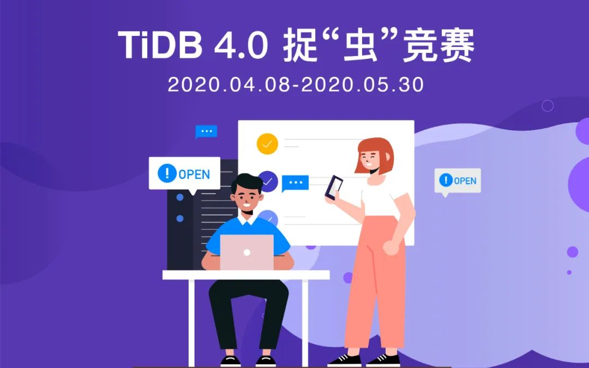
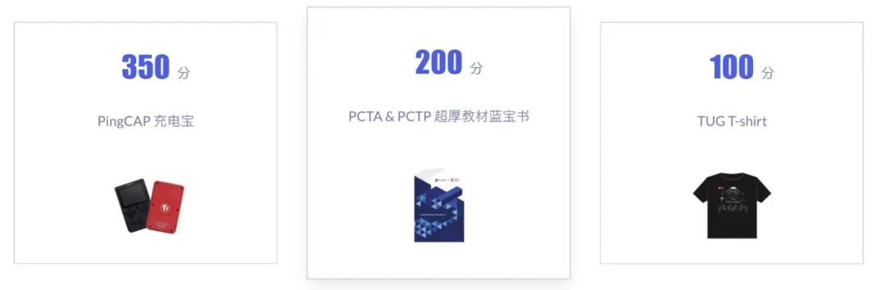
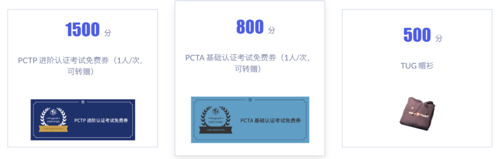

>[TiDB 4.0 RC 版本](https://pingcap.com/blog-cn/the-overview-of-tidb-4.0/) 已经发布，很多小伙伴已经跃跃欲试想要体验新功能了，这里有一个“一边体验一边拿周边”的好机会哦。

**TiDB 4.0 捉“虫”竞赛来袭**，本次竞赛将持续到 5 月 30 日，邀请社区小伙伴参与一起为 TiDB 全球社区建设添砖加瓦，让 TiDB 新版本给大家带来更好的体验！我们将按大家发现的 bug 等级或提交的体验报告给予相应积分，积分可以兑换 TiDB 限量周边、PingCAP University 培训机会等多项奖品。

## Highlights!

**1.提交测试报告也可以获得积分**

除了提交 bug 获得积分之外，我们也鼓励参赛选手提交测试报告，无论是哪一种贡献，都是可以获得相应积分奖励的哦。
	
**2.丰富奖品**

TUG 卫衣、蓝宝书、PCTA 考试券等。
	

**3.TiDB 挑战赛的彩蛋**

现在 [TiDB 挑战赛](https://pingcap.com/blog-cn/TiDB-usability-challenge-program/) 的参赛选手现在也可以来 4.0 捉“虫”竞赛挖矿啦～挑战赛选手可以认领 4.0 捉“虫”竞赛 issue 中任何一个已经被标记为“challenge-program-2”的 issue，并按照挑战赛流程 pick up 即可认领任务。点击查看 [详细规则](https://github.com/pingcap/community/blob/master/bug-hunting-programs/bug-hunting-program-cn.md#彩蛋挑战赛挖矿)。

## 4.0 捉“虫”竞赛报名

**报名方式：**

* 在 [bug-hunting-register 仓库](https://github.com/tidb-challenge-program/bug-hunting-register) 创建一个报名 Issue。

* 报名 Issue 的标题统一为："bug hunting/sign up"，内容需包括团队名称、队长的邮箱和团队成员的邮箱。注意个人参赛者也需要以团队的方式进行报名，个人参赛者只需要填写团队名和队长邮箱（即参赛者本人邮箱）即可。

**团队参赛的注意事项：**

* 包括队长在内，每队成员最多五人；

* 我们非常欢迎参赛选手与 PingCAP 的成员进行组队参赛，每个队伍 PingCAP 的成员不超过 1 人。有 PingCAP 成员参与的团队将作为打星队伍，不参与积分最终排名，但仍保留积分兑换权限。

* 如果在提 issue 过程中有任何问题欢迎加入**捉虫竞赛微信群**进行沟通交流。

* 进群方式：添加 TiDB Robot（微信号：tidbai）为好友，回复“捉虫竞赛”即可入群。

## 参赛流程

TiDB 4.0 捉“虫”竞赛全流程包括：测试 feature->提交 bug/测试体验报告->评估 bug->获得积分->积分兑换，其中 “获得积分” 之前的步骤都将在 GitHub 上完成。

**第一步：测试 feature**

参赛队伍可以根据我们提供的操作手册自行测试，在遇到与操作手册结果不符合的情况可以上报 Bug，各个功能对应的操作手册可以在 [活动官网](https://pingcap.com/community-cn/tidb-bug-hunting/) 找到。

**第二步：提交 Bug/测试体验报告**

在测试完成后，如果参赛者发现了 Bug，则可以在 bug-hunting/issue 按照模版提交 Issue。

参赛者在测试/试用之后，也可以记录下您的测试过程和体验感受，在 AskTUG（asktug.com） 上提交测试体验报告，该测试体验报告可作为 TUG MVA (Most Valuable Advocate) 内容贡献的参考依据，报告发布方式参见 [这篇文章](https://asktug.com/t/topic/33432) 。

在 AskTUG 上提交的测试体验报告、经官方评定为**内容质量前三**的，会获得额外加分：第一名加 1000 分；第二名加 800 分，第三名加 500 分*（注：通过官方认可的体验报告均可获得 50 分）*。

同时，伴随此次捉“虫”竞赛，TiDB 社区将成立 **SIG-Testing 专项兴趣小组**，小组成员可以持续为 TiDB 产品的质量保驾护航。**根据贡献程度的不同，小组成员将会在组内获得 Active Contributor 甚至 Committer 等社区荣誉**。

**第三步：Bug 评估及积分授予**

PingCAP QA 团队会根据 Bug 等级，为 Bug 打上 label（P0，P1，P2，P3）如果你是第一个发现 bug 的小伙伴，PingCAP QA 团队会根据 bug 的等级给你加上积分。如果经验证不是 bug，PingCAP QA 团队则会打上 label（non-bug）并关闭 issue，选手可以继续寻找其他 bug。

**第四步：积分兑换**

积分排行榜可以在活动官网查看。

* **积分兑换时间**：每个赛季结束后一年内。

	例：第一赛季于 2020 年 4 月 30 日结束，兑换时间截止至 2021 年 4 月 30 日。

* **兑换方式**：本赛季结束后填写礼品兑换表，工作人员将主动联系大家进行礼品兑换。

## 学习资料

在开始测试前可以阅读 [TiDB 官方用户文档](https://pingcap.com/docs-cn/stable/) 了解 TiDB。

除此之外 [TiDB 社区伙伴们共同撰写的开源电子书《TiDB in Action》](https://pingcap.com/blog-cn/tidb-in-action-finish/) 也是很好的学习材料，书中包括了 TiDB 基本架构原理、最佳实践及案例、部署、运维（慢查询、热点问题调优）、备份恢复、数据同步和迁移等，可以作为参考资料，点击阅读 [电子书](https://book.tidb.io/)。

>我们在捉虫竞赛等你来！进入 [活动官网](https://pingcap.com/community-cn/tidb-bug-hunting/) 了解更多比赛详情~