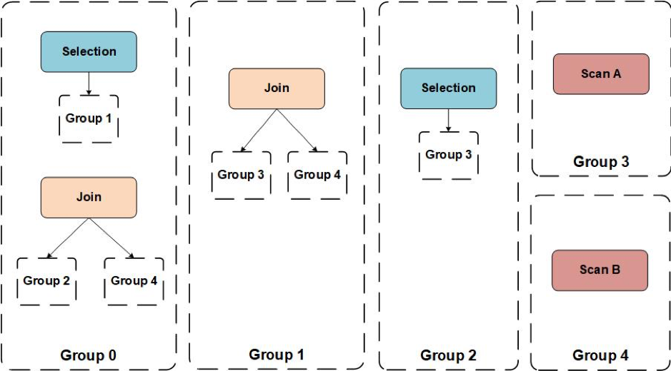
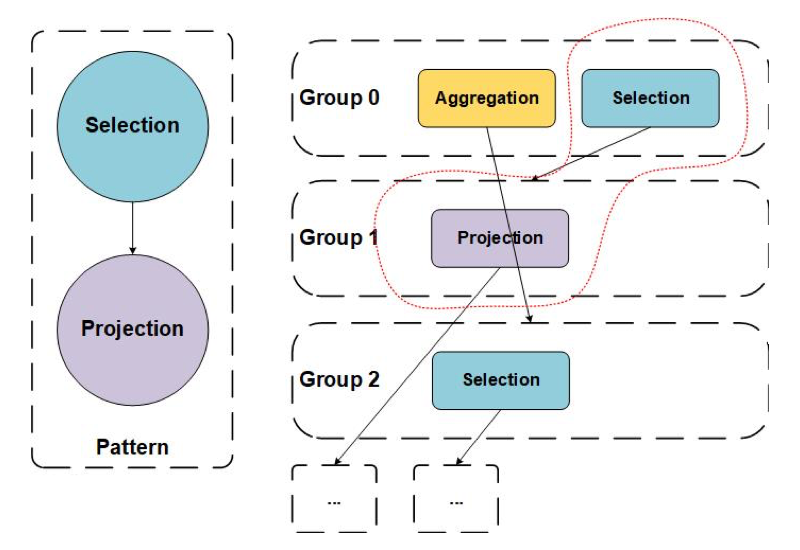
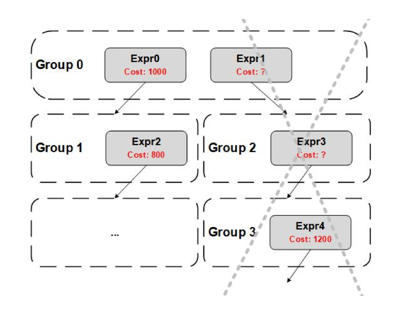

在《[十分钟成为 Contributor 系列 | 为 Cascades Planner 添加优化规则](https://pingcap.com/blog-cn/10mins-become-contributor-20191126/)》中，我们简单介绍了 Cascades 的相关背景知识，本文将为大家深入介绍 TiDB 新的优化器——Cascades Planner 的框架及原理。

## TiDB 当前优化器简介

关系型数据库中查询优化器的作用是为一个 SQL 在合理的开销内产生一个合适的查询计划，[TiDB 源码阅读系列文章（六）Select 语句概览](https://pingcap.com/blog-cn/tidb-source-code-reading-6/) 中介绍过 TiDB 当前优化器的基本组成，TiDB 当前的优化器将优化过程主要分为逻辑优化（Logical Optimize）和物理优化（Physical Optimize）两个阶段。逻辑优化是将一棵逻辑算子树（LogicalPlan Tree）进行逻辑等价的变化，最后的结果是一棵更优的逻辑算子树；而物理优化则是将一棵逻辑算子树转换成一棵物理算子树（PhysicalPlan Tree）。这棵物理算子树就是我们说的物理执行计划，将交由 TiDB 执行引擎去完成后续的 SQL 执行过程。

### 逻辑优化

TiDB 中，一个 SQL 在进入到逻辑优化阶段之前，它的 AST（抽象语法树）已经转换成了对应的逻辑算子树，因此逻辑优化就是将一个逻辑算子树进行逻辑上等价变换的过程。逻辑优化是基于规则的优化（Rule-Based Optimization，RBO），这些规则背后的原理就是关系代数的等价变换，其中典型的规则包括：列剪裁，谓词下推等。TiDB 现有逻辑优化规则的原理和实现可以参考这两篇源码阅读文章：[（七）基于规则的优化](https://pingcap.com/blog-cn/tidb-source-code-reading-7/)，[（二十一）基于规则的优化 II](https://pingcap.com/blog-cn/tidb-source-code-reading-21/)。

随着 TiDB 中逻辑优化规则的不断增多，逐渐暴露了当前优化框架存在的几个问题：

1.  优化器要求每个逻辑优化规则一定是有收益的，转换后得到的逻辑执行计划必须比转换前的更优（例如谓词下推），但是某些优化规则只在特定场景下有收益（例如聚合下推 Join），这种优化规则很难添加到目前的优化器中，导致优化器在那些特定场景下的执行计划不够优。

2.  不管什么样的 SQL，在逻辑优化阶段，所有的优化规则都按照同一个固定的顺序依次去看是否能够作用于当前的逻辑执行计划，例如最先执行的规则总是列剪裁。逻辑优化规则之间的顺序需要经过有经验的优化器老手精心的安排，例如分区表处理（PartitionProcess）要在谓词下推后进行。这就导致所有人在添加优化规则的时候都需要小心翼翼地安排这个顺序，添加一个优化规则需要了解其他所有优化规则，门槛较高。

3.  逻辑优化阶段，每个规则至多只会在被顺序遍历到的时候执行一次，但实际场景中，往往存在之前某个已经执行过的优化规则可以再次被执行的情况。我们以一个例子来说明，对于这个简单的 SQL：`select b from t where a >1`，其中 `a` 是 `int` 类型的主键，我们最终会产生这样一个物理执行计划：

	```
	TableScan(table: t, range:(1, inf]) -> TableReader(a, b) -> Projection(b)
	```
	
	在 TableReader 的 Schema 中包含了 `a`	 `b` 两列，也就是说 TiDB 会从 TiKV 中读取两列内容，但最终自己却只需要其中第一列。这个问题背后的原因是：优化器先进行列裁剪，再谓词下推，但是谓词下推之后，有可能列剪裁可以再次生效，而这个可能生效的列剪裁在现在优化器中无法被执行了，导致 TiDB 从 TiKV 多读取了一列数据，增加了 SQL 执行时的网络 IO 使用量。

### 物理优化

物理优化是一个将逻辑算子树转化为物理算子树的过程，我们在之前的[TiDB 源码阅读系列文章（八）基于代价的优化](https://pingcap.com/blog-cn/tidb-source-code-reading-8/) 中做过详细的介绍。在物理优化中，优化器会结合数据的分布（统计信息）情况来对查询计划进行优化，物理优化是一个记忆化搜索的过程，搜索的目标是为逻辑执行计划寻找满足特定物理属性的物理执行计划，并在其中选择代价最低的作为搜索结果，因此也被称为基于代价的优化（Cost-Based Optimization，CBO），例如 DataSource 应该选择怎样的扫描路径（使用哪个索引），Join 应该选择怎样的执行方式（HashJoin、MergeJoin 或 IndexJoin）等。

在 TiDB 中，物理优化不仅仅是选择物理算子，还完成了算子下推 TiKV 的任务，例如将 Aggregation 算子分裂成 FinalMode 和 PartialMode 两部分，并将 PartialMode 的 Aggregation 下推到 TiKV Coprocessor 中执行，具体可以参考 [TiDB 源码阅读系列文章（二十二）Hash Aggregation](https://pingcap.com/blog-cn/tidb-source-code-reading-22/)。

目前支持下推的算子有：Selection、Limit、TopN 和 Aggregation，下推的方式有两种：

* 对于 Selection 算子，由于 Selection 在逻辑优化阶段被下推到 DataSource 中，因此在物理优化阶段中，如果 Selection 中有过滤条件不能转换成扫描的 Range 条件，就会产生一个 Coprocessor 层的 Selection。

* 对于 Limit、TopN 以及 Aggregation 算子，当且仅当它们的子节点是 DataSource 的时候，才允许被下推。

下图展示了一个简单的聚合查询如何经过优化得到最后的物理计划：


1. 首先在逻辑优化阶段，Selection 中的过滤条件会被下推到 DataSource 中的 AccessConds 中。
2. 在物理优化阶段其中的 `A.pk > 10` 会转换为主键的范围条件，而 `A.value > 1` 则会产生一个 TiKV 层的 Selection。
3. 同时由于 Aggregation 的子节点是 DataSource，因此也会被下推到 TiKV 中。

上述的物理优化过程，存在几个潜在的问题：

* 算子下推逻辑过于简单，难以应对未来添加的新的下推算子（例如 Projection 等），同时也没法针对某些特殊场景进行灵活地算子下推。

* 扩展性差：难以扩展支持其他的存储引擎，并实现相应的算子下推，例如 TiFlash（一个尚未开源的列存引擎）。

* 难以添加针对特殊数据源的优化规则，优化器的搜索空间进一步被限制。

## The Volcano/Cascades Optimizer

Volcano/Cascades Optimizer 是经典的优化器框架，分别产自论文 [The Volcano Optimizer Generator: Extensibility and Efficient Search](https://cs.uwaterloo.ca/~david/cs848/volcano.pdf) 以及 [The Cascades Framework for Query Optimization](https://15721.courses.cs.cmu.edu/spring2018/papers/15-optimizer1/graefe-ieee1995.pdf)，其主要作者都是 Goetz Graefe。Cascades Framework 已经被很多常见的数据库系统所实现，我们简单介绍一下两篇文章中提出的一些基本概念。

### The Volcano Optimizer Generator

Volcano Optimizer Generator 本身的定位是一个优化器的“生成器”，其核心贡献是提供了一个搜索引擎。作者提供了一个数据库查询优化器的基本框架，而数据库实现者要为自己的 Data Model 实现相应的接口后便可以生成一个查询优化器。我们下面抛开生成器的概念，只介绍其在“优化器”方向提出的一些方法：

1.  Volcano Optimizer 使用两阶段的优化，使用 “Logical Algebra” 来表示各种关系代数算子，而使用 “Physical Algebra” 来表示各种关系代数算子的实现算法。Logical Algebra 之间使用 Transformation 来完成变换，而 Logical Algebra 到 Physical Algebra 之间的转换使用基于代价的（cost-based）选择。

2.  Volcano Optimizer 中的变化都使用 Rule 来描述。例如 Logical Algebra 之间的变化使用 Transformation Rule；而 Logical Algebra 到 Physical Algebra 之间的转换使用 Implementation Rule。

3.  Volcano Optimizer 中各个算子、表达式的结果使用 Property 来表示。Logical Propery 可以从 Logical Algebra 中提取，主要包括算子的 Schema、统计信息等；Physical Property 可以从 Physical Algebra 中提取，表示算子所产生的数的具有的物理属性，比如按照某个 Key 排序、按照某个 Key 分布在集群中等。

4.  Volcano Optimizer 的搜索采用自顶向下的动态规划算法（记忆化搜索）。

### Cascades Optmizer

Cascades Optimizer 是 Volcano Optimizer 的后续作品，其对 Volcano Optimizer 做了进一步的优化，下面介绍一些 Cascades Optimizer 中的基本概念。

#### Memo

Cascades Optimizer 在搜索的过程中，其搜索的空间是一个关系代数算子树所组成的森林，而保存这个森林的数据结构就是 Memo。Memo 中两个最基本的概念就是 Expression Group（下文简称 Group） 以及 Group Expression（对应关系代数算子）。每个 Group 中保存的是逻辑等价的 Group Expression，而 Group Expression 的子节点是由 Group 组成。下图是由五个 Group 组成的 Memo：



我们可以通过上面的 Memo 提取出以下两棵等价的算子树，使用 Memo 存储下面两棵树，可以避免存储冗余的算子（如 Scan A 以及 Scan B）。


#### Rule

在 Volcano Optimizer 中，Rule 被分为了 Transformation Rule 和 Implementation Rule 两种。其中 Transformation Rule 用来在 Memo 中添加逻辑等价的 Group Expression。Transformation Rule 具有原子性，只作用于算子树的一个局部小片段，每个 Transformation Rule 都有自己的匹配条件，应用某个 Transformation Rule，通过不停的应用可以匹配上的 Transformation Rule 来扩展搜索的空间，寻找可能的最优解。Implementation Rule 则是为 Group Expression 选择物理算子。

而在 Cascades Optimizer 中，不再对这两类 Rule 做区分。

#### Pattern

Pattern 用于描述 Group Expression 的局部特征。每个 Rule 都有自己的 Pattern，只有满足了相应 Pattern 的 Group Expression 才能够应用该 Rule。下图中左侧定义了一个 `Selection->Projection` 的 Pattern，并在右侧 Memo 中红色虚线内出现了匹配的 Group Expression。



#### Searching Algorithm

Cascades Optimizer 的搜索算法与 Volcano Optimizer 有所不同，Volcano Optimizer 将搜索分为两个阶段，在第一个阶段枚举所有逻辑等价的  Logical Algebra，而在第二阶段运用动态规划的方法自顶向下地搜索代价最小的 Physical Algebra。Cascades Optimizer 则将这两个阶段融合在一起，在枚举逻辑等价算子的同时也进行物理算子的生成，这样就可以提早对一些搜索分支进行剪枝。

Cascades Optimizer 为 Rule 的应用顺序做了很细致的设计，例如每个 Rule 都有 promise 和 condition 两个方法，其中 promise 用来表示 Rule 在当前搜索过程中的重要性，promise 值越高，则该规则越可能有用，当 promise 值小于等于 0 时，这个 Rule 就不会被执行；而 condition 直接通过返回一个布尔值决定一个 Rule 是否可以在当前过程中被应用。当一个 Rule 被成功应用之后，会计算下一步有可能会被应用的 Rule 的集合。

Volcano/Cascades Optimzier 都使用了 Branch-And-Bound 的方法对搜索空间进行剪枝。由于两者都采用了自顶向下的搜索，在搜索的过程中可以为算子设置其 Cost Upper Bound，如果在向下搜索的过程中还没有搜索到叶子节点就超过了预设的 Cost Upper Bound，就可以对这个搜索分支预先进行剪枝。

## TiDB Cascades Planner 的设计

基于 Volcano/Cascades Optimizer 的原理，我们为 TiDB 重新设计了一个优化器：TiDB Cascades Planner。我们希望可以通过新的优化器来解决现行优化器的问题，并且也能够带来一些新的特性：

* 优化规则易于实现，通过实现几个简单的接口来定义优化规则。
* 优化规则易于扩展，我们不需要再考虑优化规则的执行顺序。
* 优化规则可以反复应用，增大优化器的搜索空间。
* 对于不一定更优的优化规则，可以通过 Cost 来选取结果。
* 算子下推存储层更加灵活，方便未来扩展新的下推算子。
* 使 TiDB 可以更容易地接入其他的存储或者计算引擎，例如 [TiFlash](https://pingcap.com/blog-cn/tidb-with-tiflash-extension/)。
* 为 TiDB 的优化器能力分级，不同复杂程度的查询可以选用不同的优化等级。

### 基本数据结构

首先我们介绍 TiDB Cascades Planner 中的一些基本的数据结构，以下的部分概念与上文介绍的 Volcano/Cascades Optimizer 大体一致，只会有少许的不同。

#### Group/GroupExpr

GroupExpr 是对 `LogicalPlan` 的封装，与 `LogicalPlan` 不同的是，GroupExpr 的子节点不再是 `LogicalPlan`，而是 Group：

```golang
type GroupExpr struct {
  ExprNode plannercore.LogicalPlan
  Children []*Group
  Group    *Group
  ...
}
```

Group 是一组逻辑等价的 GroupExpr 集合，换句话说，从逻辑上来看，通过一个 Group 中任何一个 GroupExpr 产生的算子树都是逻辑等价的。

```golang
type Group struct {
  Equivalents *list.List 

  ImplMap map[string]Implementation
  Prop    *property.LogicalProperty 
  EngineType EngineType
}
```

为了加快搜索的过程，我们对 Group 做了一些更细粒度的优化，例如在将 GroupExpr 插入到 Equivalents 时，我们总是保证相同类型的 LogicalPlan 在链表中连续存储；同时为每种类型的首个 GroupExpr 提供一个 map 作为索引等。

通过以上两个定义我们可以发现，Group 和 GroupExpr 相互递归地引用，最终形成一个 Memo 数据结构。

#### Operand

Operand 是 LogicalPlan 的类型符，用于描述 Pattern。

```golang
type Operand int
const (
  OperandAny Operand = iota
  OperandJoin
  OperandAggregation
  OperandProjection
  ...
```

#### Pattern

Pattern 是一个树状的数据结构，用于表示逻辑算子树的局部的形状。需要注意的是 Pattern 只能用于匹配逻辑算子的类型（通过 Operand），但是不能够指定算子中具体的内容。

```golang
type Pattern struct {
  Operand
  Children []*Pattern
}
```

#### Transformation

Transformation 是一个接口类型，用来定义一个逻辑变换规则。

*   `GetPattern()` 方法获取这个变换规则所需要匹配的一个 Pattern。

*   由于 Pattern 只能描述算子的类型，不能描述 LogicalPlan 内部的内容约束，因此通过 `Match()` 方法可以判断更细节的匹配条件。例如 Pattern 只能描述我们想要一个 Join 类型的算子，但是却没法描述这个 Join 应该是 InnerJoin 或者是 LeftOuterJoin，这类条件就需要在 `Match()` 中进行判断。

*   `OnTransform()` 方法中定义了变换规则的具体内容，返回的内容分别是新的 GroupExpr，是否删除旧的 `GroupExpr`，是否删除旧的 Group 中所有的 `GroupExpr`。

```golang
// Transformation defines the interface for the transformation rules.
type Transformation interface {
  GetPattern() *memo.Pattern
 
  Match(expr *memo.ExprIter) bool
  
  OnTransform(old *memo.ExprIter) (newExprs []*memo.GroupExpr, eraseOld bool, eraseAll bool, err error)
}
```


下面我们以一个变换规则：`PushSelDownAggregation` 为例，具体介绍上面三个方法的使用方式。

这个规则匹配的 Pattern 是 `Selection -> Aggregation`，作用则是将这个 Selection 下推到 Aggregation 下面，例如 SQL: `select a, sum(b) from t group by a having a > 10 and max(c) > 10` 中，having 条件里的 `a > 10` 可以下推到 Aggregation 的下方。更具体地来说，只要 Selection 当中的一个 Expression 里的所有列都出现在 group by 的分组列时，我们就可以把这个 Expression 进行下推。

参考下图：


1.  在 Group0 中的 Selection 匹配到了 Pattern `Selection -> Aggregation`。

2.  执行了 `OnTransform()` 的转换，Selection 中的 `a > 10` 条件被下推到了新的 Aggregation 下方，并且保留的条件 `max(c) < 10` 成为了一个新的 Selection。

3.  由于 `OnTransform()` 的 `eraseOld` 返回了 `True`，因此最终把原来的 GroupExpr 从 Group 中删除。


#### Implementation/Implementation Rule

Implementation 是对 PhysicalPlan 的一个封装，记录了一个 PhysicalPlan Tree 的 Physical Plan 和 Cost。

```golang
type Implementation interface {
  CalcCost(outCount float64, children ...Implementation) float64
  SetCost(cost float64)
  GetCost() float64
  GetPlan() plannercore.PhysicalPlan

  AttachChildren(children ...Implementation) Implementation
  ScaleCostLimit(costLimit float64) float64
}
```

`ImplementationRule` 是一个接口类型，用来定义一个物理算子的选择。

*   `ImplementationRule` 只能通过 Operand 来匹配，因此也需要一个 `Match()` 方法来对算子内部的细节做更细粒度的匹配。

*   `OnImplement()` 方法用于为 GroupExpr 生成对应的 Implementation。

```golang
type ImplementationRule interface {
  Match(expr *memo.GroupExpr, prop *property.PhysicalProperty) (matched bool)
  OnImplement(expr *memo.GroupExpr, reqProp *property.PhysicalProperty) (memo.Implementation, error)
}
```


下面我们仍旧以 Aggregation 为例，我们知道 Aggregation 有两种典型的物理执行方式，一个是 HashAggregation，一种是 StreamAggregation。

实现 HashAgg 的 ImplementationRule 是 ImplHashAgg，源码位于  [planner/cascades/implementation_rules.go/implHashAgg](https://github.com/pingcap/tidb/blob/9acb0a37f04aecdec2baa1d1e11731c33c2471e0/planner/cascades/implementation_rules.go#L242)  ，由于 HashAgg 不能满足上层节点要求的任何 Property，因此在 `Match()` 方法中，如果上层节点传递下来的 Prop 非空的话，我们这里就不能够将 Aggregation 转换成 HashAgg；而在 `OnImplement()` 方法中，我们只需要将 LogicalAggregation 转换成 PhysicalHashAgg 就可以了。

#### Enforcer

Enforcer 用来在算子树中强制添加 Sort 算子来满足父亲节点要求的顺序属性，我们将在下文中的 Implementation Phase 介绍如何使用 Enforcer。

```golang
type Enforcer interface {
  NewProperty(prop *property.PhysicalProperty) (newProp *property.PhysicalProperty)
  OnEnforce(reqProp *property.PhysicalProperty, child memo.Implementation) (impl memo.Implementation)
  GetEnforceCost(g *memo.Group) float64
}
```

#### LogicalProperty

LogicalProperty 包含 Schema 和统计信息两部分，因为一个 Group 中所有的 GroupExpr 是逻辑等价的，因此他们共享同一个 LogicalProperty。

```golang
type LogicalProperty struct {
  Stats  *StatsInfo
  Schema *expression.Schema
}
```

#### PhysicalProperty

PhysicalProperty 中记录 OrderBy Items 以及 ExpectedCount，这两者与 [TiDB 源码阅读系列文章（八）基于代价的优化](https://pingcap.com/blog-cn/tidb-source-code-reading-8/) 中描述的一致，这里不再赘述。

#### Adapter Model

为了使 TiDB 能够使用在各种不同的存储组件之上，我们为 TiDB Cascades Planner 引入了 Adapter Model。所谓 Adapter Model 指的是，我们在 LogicalPlan 中添加各种用来从存储引擎收集数据的算子，例如 `TiKVTableGather`、`TiFlashTableGather` 甚至 `MySQLGather` 等，这些 Gather 算子最终在物理优化阶段会被改写成 `TableReader`、`IndexReader` 等用来读取数据的算子，因此 Gather 的所有父亲算子都是在 TiDB 中执行的，而 Gather 所有子节点的算子都是在相应的存储引擎上执行的。这样做有两个好处：

* 我们可以在逻辑优化阶段就区分出不同的存储引擎，可以针对不同的存储引擎设计不同的算子下推策略。

* 若 TiDB 想要使用别的存储引擎，在优化器中只需要实现对应的 Gather 算子以及物理优化阶段的 Reader 算子。


### 优化过程

TiDB Cascades Planner 在当前的设计中将搜索过程分为三个阶段：

*   Preprocessing phase，预处理阶段。

*   Exploration phase，逻辑搜索阶段。

*   Implementation phase，物理实现阶段。

这一部分的源码位于 [planner/cascades/optimize.go](https://github.com/pingcap/tidb/blob/9acb0a37f04aecdec2baa1d1e11731c33c2471e0/planner/cascades/optimize.go#L105)。

#### Preprocessing Phase

在预处理阶段，我们会对原始的逻辑算子树做“一定更优”的逻辑变换，例如列剪裁。

#### Exploration Phase

在逻辑搜索阶段，与 TiDB 现行的逻辑优化类似，我们会对输入的逻辑算子树做逻辑上的等价变换。但不同的是，此处我们先将 LogicalPlan Tree 转换成 Group Tree，通过在 Group Tree 应用 Transformation Rule 来实现逻辑上的等价变化。

在搜索算法的实现中，主要涉及三个函数，下面我们自底向上的介绍这三个函数的作用。

##### findMoreEquiv(group, groupExpr)

`findMoreEquiv(group, groupExpr)` 是对一个 GroupExpr 应用所有的 Transformation 来搜索更多的逻辑等价的 GroupExpr，其过程如下：

1.  首先根据 GroupExpr 中对应的 Operand 来获取有可能匹配的 Transformation rule，我们在这里为所有的 Transformation rule 根据其 Pattern 中的最顶部 Operand 进行了分组，例如当 GroupExpr 是 Selection 时，只会尝试匹配所有 Pattern 以 Selection 开头的 Transformation rule。

2.  寻找是否有以 GroupExpr 为首且与之对应 Pattern 匹配的结构；

3.  如果找到这样的结构，则通过 `Match()` 方法进一步判断是否能够匹配相应的细节内容（例如 Join 的类型）；

4.  最后如果 `Match()` 成功，则调用 `OnTransformation()` 方法来应用相应的变换规则。

5.  如果 `OnTransformation` 返回了新的 `GroupExpr`，则将这个 GroupExpr 插入到 Group 中，并且将 Group 标记为 UnExplored，保证新生成的 GroupExpr 未来也可以被搜索到。

6.  如果 `OnTransformation` 返回的 `eraseOld` 为 `True`，那么在 `findMoreEquiv()` 结束后，会将当前的 GroupExpr 从 Group 中删除。

7.  如果 `OnTransformation` 返回的 `eraseAll` 为 `True`，那么可以删除当前 Group 中的所有 GroupExpr，插入新的 GroupExpr 并结束当前 Group 的搜索。

##### exploreGroup(group)

`exploreGroup()` 方法自底向上递归地对整个 Group Tree 中的 GroupExpr 调用 `findMoreEquiv()`，主要过程如下：

1.  遍历当前 Group 中所有的 GroupExpr，并先对这些 GroupExpr 的子 Group 递归调用 `exploreGroup()`，直至子 Group 中不再产生新的 GroupExpr 为止。

2.  当某个 GroupExpr 的子 Group 被搜索完全后，对当前 GroupExpr 调用 `findMoreEquiv()`，若返回的 `eraseCur` 为 `True`，则将这个 GroupExpr 从 Group 中删除。

##### OnPhaseExploration(group)

最后一个部分就是对顶部的 Group (root Group)，循环调用 `exploreGroup()`，直至所有的 Group 都不再产生新的 GroupExpr 为止。

到这里，我们就通过 Group 保存了所有逻辑等价的 LogicalPlan Tree，接下来我们要为这些 LogicalPlan 选择代价最小的一个 PhysicalPlan Tree。

#### Implementation Phase

Implementation Phase 与现行的优化器中的 Physical Optimize 类似，都是将逻辑计划转化成代价最小的物理计划。但不同的是，旧的优化器只能为一个 LogicalPlan Tree 选择物理计划，但在 Cascades Planner 里，我们是为一个 Group Tree 或者说一组逻辑等价的 LogicalPlan Tree 选择物理计划。

我们可以将这个过程分为三部分：

**1. implGroupExpr(groupExpr, reqPhysicalProp)**

`implGroupExpr` 为一个 GroupExpr 根据上层传递下来的 PhysicalProperty 来生成 Implementation。过程十分简单，就是尝试对当前的 GroupExpr 应用所有对应的 ImplementationRule，最后将匹配成功后产生的 Implementations 返回。

```golang
func (opt *Optimizer) implGroupExpr(groupExpr *memo.GroupExpr, reqPhysProp *property.PhysicalProperty) (impls []memo.Implementation, err error) {
  for _, rule := range opt.GetImplementationRules(groupExpr.ExprNode) {
     if !rule.Match(groupExpr, reqPhysProp) {
        continue
     }
     impl, err := rule.OnImplement(groupExpr, reqPhysProp)
     if err != nil {
        return nil, err
     }
     if impl != nil {
        impls = append(impls, impl)
     }
  }
  return impls, nil
}
```


**2. implGroup(group, reqPhysicalProp, costLimit)**

`implGroup()` 根据上层传递下来的 PhysicalProperty 递归地为 Group 生成最优的 Implementation。

*  Implementation Phase 实际上是一个记忆化搜索的过程，每个 Group 搜索到一个 PhysicalProperty 对应最优的 Implementation 后都会将其记录下来，因此在搜索之前可以先查看是否可以从历史结果中查询到 `reqPhysicalProp` 对应的最优 Implementation。

* CostLimit 是在搜索过程中用于预剪枝的 Cost 上界，要注意的是使用 CostLimit 的前提是：Cost 必须的自底向上单调递增。我们以下图为例，Expr0 和 Expr1 是 Group0 中逻辑等价的 GroupExpr，Expr0 产生的最优的 Implementation 的 Cost 是 1000，此时我们会用 CostLimit = 1000 去搜索 Expr1，我们的目的是让 Expr1 产生更好的（Cost 更小的）Implementation，但是 Expr1 在向下搜索的过程中，Expr4 的最优 Implementation 的 Cost 是 1200，大于了 CostLimit，也就是说 Expr1 产生的 Implementation 的 Cost 一定是大于 1200 的，所以 Expr1 在这条路径上无论如何都不会比 Expr0 产生的 Implementation 更优，因此我们会将这条搜索路径剪枝，不对 Expr1、Expr3 再进行搜索。



* 在生成 Implementation 之前会先对当前的 Group 调用`fillGroupStats()`来填充LogicalProperty 里的统计信息。

* 最后就是调用 `implGroupExpr()` 来产生 Implementation 和递归调用 `implGroup()`来搜索子 Group 的过程。

**3. EnforcerRule**

上文中我们没有详细介绍 Enforcer 的概念，我们在这里补充。例如我们有这样一个 SQL：

```sql
select b, sum(c) over (partition by b) from t`
```

这是一个带有 Window Function 的查询，Window 中以 `b `列为分组，由于目前 Window 的实现是需要下层算子根据分组列有序，当没有可以使 `b `列有序的索引时，我们必须在 Window 算子下面强制添加一个 Sort 算子来满足 Window 算子向下传递的 PhysicalProperty。

## 总结

本文主要介绍了 TiDB Cascades Planner 框架的组成以及原理，Cascades Planner 的引入解决了现有优化器存在的部分问题，同时又为 TiDB 引入了一些新的特性。我们希望可以通过 Cascades Planner 来降低社区参与 TiDB 优化器开发的难度，能够吸引更多的同学参与 TiDB 的开发，同时也希望可以通过 Cascades Planner 来使 TiDB 在将来成为更加“通用”的 SQL 计算组件，让 TiDB 可以更容易地接入其他存储引擎。最后，非常欢迎大家加入 [#sig-planner](https://tidbcommunity.slack.com/messages/sig-planner) 和我们交流讨论～
