>本文转载自 [InfoQ](https://www.infoq.cn/article/bxGvrb_CxAZD6Wv3fUj8)，策划：赵钰莹。
>
>作为一个分布式数据库，TiDB 面临的严重挑战在于如何让用户相信存储在 TiDB 里面的数据是安全的，不会出现丢失，损坏等情况。因此，在 TiDB 研发初期，PingCAP 就引入了混沌工程，来保证 TiDB 在各种极端情况下面的稳定性。本文整理自 ArchSummit 全球架构师峰会（深圳站）2019 峰会演讲，分享了 TiDB 应用混沌工程的方法，介绍基于 K8s 自研的自动化测试平台 Schrodinger，并通过实际例子说明如何在 Schrodinger 里应用混沌来测试系统。

大家好！我是唐刘，现在是 PingCAP 的首席架构师，同时负责 TiDB 底层组件 TiKV 的研发，该项目属于 CNCF 孵化中项目，应该也是国内唯一进入 CNCF 的数据库项目。同时，我也是典型的开源爱好者，做了很多 go-mysql，raft.rs，grpc-rs 等开源组件的工作。

## 为什么需要混沌工程？

假设，我们现在开始建造一个系统，无论该系统的具体功能是什么，我们都需要保证系统的稳定性，但是如何知道系统是否处于稳定状态呢？**通常，团队可以通过单元测试、集成测试和性能测试等手段进行验证。但是，无论这些测试写的多好，我们认为都远远不够，因为错误可以在任何时间发生，尤其是对分布式系统而言，此时就需要引入混沌工程（Chaos Engineering）。**

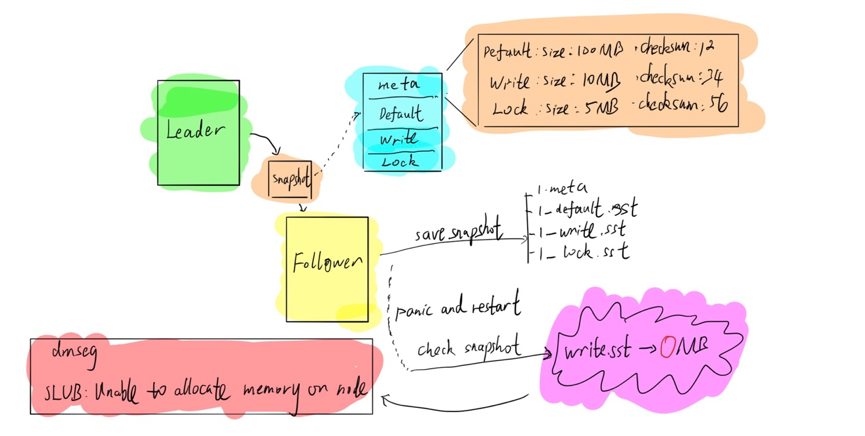

以 TiDB 的实际生产流程为例，由于 TiDB 底层采用 Raft 一致性协议进行副本复制，因此存在 Follower 和 Leader 的概念，Follower 被动接受 Leader 的日志，同步相关数据。当新的 Follower 节点加入集群后，Leader 会给 Follower 发送 Snapshot，也就是说，Leader 会把当前整个数据镜像打包成 Snapshot 发给 Follower。在 TiDB 里面，Snapshot 包括四部分，分别是 Meta 文件，default.sst，write.sst 和 lock.sst。Meta 文件记录数据文件源信息，包括数据文件的大小等，其余三个是数据文件。当 Follower 接收到 Snapshot 文件后，会进行 Save Snapshot 的操作，将四个部分存到不同的文件里面。然后，Follower 会 Check Snapshot，也就是检查 Snapshot 的正确性，如果 Snapshot 是正确的，就会将其应用到整个 Follower 状态。如上图所示，在 Save Snapshot 和 Check Snapshot 之间发生了 Panic，并且进行了重启。要知道，对 Linux 系统而言，如果写文件时进程挂掉，但 Linux 系统没有挂掉，那么这个文件还可以认为是安全的，虽然会把文件写到 Page  Cache 里面，但挂掉之后，Linux 系统会强制将 Page  Cache 刷到磁盘里面，保证文件安全。但是，当我们的 Follower 挂掉重启之后，我们发现文件出现丢失，如上图所示 write.sst 变成了 0 兆，但根据 Meta 文件，write.sst 不可能是 0 兆。也就是说，在磁盘没有任何问题的情况下，进程重启后出现了文件丢失。通过查看 dmseg，出现了 SLUB：unable to allocate memoy on node 的提示。这可以理解为，虽然系统没有出现问题，但可能由于内存不足等其他问题让文件 Page  Cache 无法正常进行，此时就会出现上述问题。对我们来说，虽然很多时候可以认为程序没有问题，但是与程序一起合作的操作系统可能会出现 Bug，导致整个数据丢失，这是对程序进行多少次单元测试都无法避免的事情。

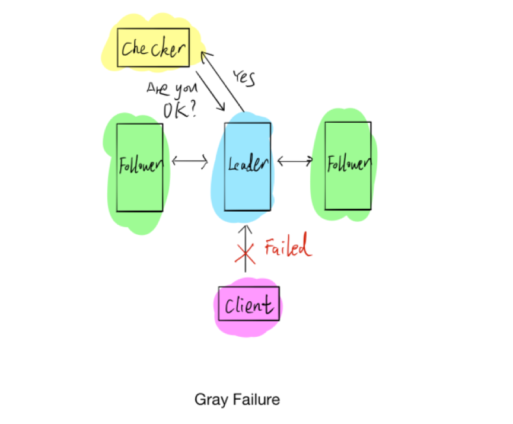

上图是第二个示例，显示的是分布式系统里常见的 Gray Failure 问题。通常情况下，判断一个程序的死活，很直观的感觉就是写一个 Checker 程序，定期运行以试探程序状态。我们可能会出现一种情况，就是上文提到的 Gray Failure，具体指的是检查程序与整个系统相通，但客户端与系统很可能已经完全无法交互，我们自认为系统是好的，但实际上系统已经出现问题。**综上，分布式系统会出现很多仅仅通过测试无法解决的问题，因此我们想到了非常好的解决方法就是混沌工程。**

## 混沌工程是什么？

混沌工程的概念很早之前就有，但是直到 2012 年，Netflix 公司才让外界更多人知道了“混沌”。为了更好地推广混沌工程，Netflix 引入了一只猴子（Chaos Monkey），试想一只猴子在系统里面，平时是安安静静的，什么事情都不做，突然一天发疯开始在系统里到处捣乱，作为工程师，要干的一件事情就是逮住这只猴子，让它别捣乱，这大概就是混沌工程要表达的意思。**简单来说，混沌工程也是一个工程学科，这就意味着需要做实验，通过设计进行混沌实验，观察系统对各类故障的真实反映，以此来完善保证系统的稳定性。** 但是在开始混沌工程之前，这一切的前提是确保系统是容错的 ，也就是平常所说的双活、多活。假设系统是典型的单点架构，只要单点损坏，整个系统就崩溃了，没法验证混沌工程的效果，因此系统必须能够支持容错，然后通过不断的故障引入来验证系统容错性，如果系统不能容错，我们不限要考虑的是让系统能容错，从而再去考虑混沌工程。

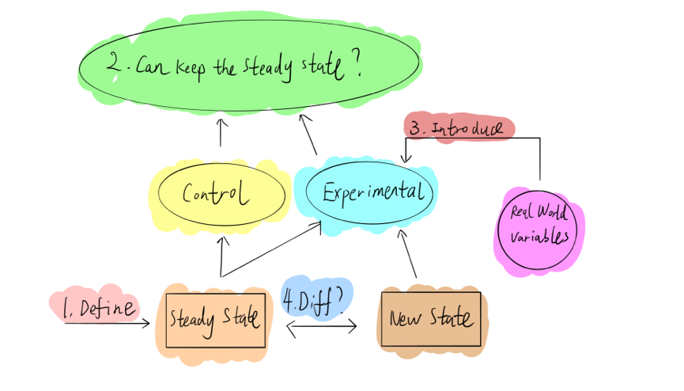

具体到实践层面，大家可以参考 Principles of Chaos Engineering 网页里面的步骤。如上图，第一步，需要定义系统稳态，通常情况下，可以通过 metrics 或者客户端指标定义系统，比如 QPS、延迟等，只要这些指标没有太大波动，就可以认为系统是稳定的；第二步，定义系统稳态后，我们分为实验组和对照组进行实验，假设无论对实验组做任何操作，整个系统都可以继续维持稳定状态；第三步，引进现实生活中的变量，也就是模拟现实世界可能发生的错误故障，比如硬件故障，网络延迟隔离等到实验组中；最后，比较实验组和对照组前后稳定状态的差异，是否可以满足预期。如果前后保持一致，则可以认为系统对该故障的有容错能力；反之，如果两者的稳定状态不一致，那就找到了一个系统弱点，从而可以修复它，提高系统可靠性。

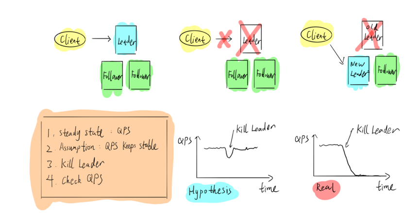

如上图以 TiDB 为例，对三副本的 Raft 算法而言，Leader 对外提供客户端写入操作。如果把 Leader 干掉，Follower 会立刻选出一个新的 Leader，继续对外提供服务，对于这个系统来说，如果要做混沌工程，应该怎么做呢？首先，根据一些指标定义系统稳态，比如 QPS；其次，假设客户端的 QPS 在受到攻击，Leader 节点被杀死后会出现一个抖动，Follower 会立马选出新的 Leader 节点，迅速恢复至稳定状态；第三步，进行错误注入实验；最后，观察结果，如果发现系统 QPS 降为零并再也没有恢复，证明系统有 bug，我们就需要去找出问题并修正；反之，如果 QPS 恢复了，则证明系统可以容忍这次故障，可以继续进行下一个实验。为了更好地进行混沌工程实践，Netflix 在官网提供了相关原则：第一个原则是构建系统稳态的假设；第二个原则是引入现实环境的变量事件；第三个原则是在生产环境中运行实验，此处需要注意任何在生产环境进行的操作都是有风险的，因此需要提前与相关部门进行沟通，以免因为疏忽导致业务挂掉不可用；第四个原则是持续自动化运行实验，如果全部通过手工方式实现，效率将非常低；最后一个原则是要控制好“爆炸半径”，在进行混沌实验时一定要注意受影响的范围，如果没有预估好，很容易导致所有的用户都没法使用，这是很严重的问题。

## PingCAP 在 TiDB 实践混沌工程

**在 PingCAP，我们主要针对 TiDB 进行混沌工程实践，重点关注两个大方向：一是发现错误；二是注入错误。在 TiDB，我们采用的是比较原始的三种方法分析系统状态：Metrics、Log 和 Tracing。**

**第一种，是基于 Metrics**，TiDB 使用的是普罗米修斯，以下是典型的 QPS 曲线图，可以看到凌晨两点，latency 曲线突然飙升。

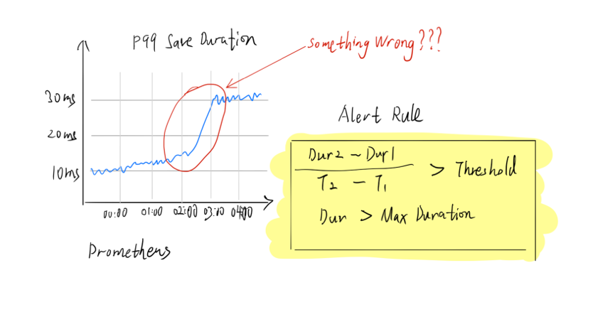

于是，我们有一个非常粗暴简单的脚本，当检测到延迟大于某个阈值时，就会发起告警。

但是，如果认真观察前后两天的曲线，可以看出每天固定时间的延迟都会升高，这可认为是用户正常的工作负载，如果只是简单粗暴的通过 Metrics 等弱指标进行相关判断，并不能很好地发现系统相关问题，所以需要查看历史数据，尤其是 Metrics 的历史，然后进行比较，就可以基本判断出数据是否正常。当然，我们也会通过机器学习的方式进行更精确的判断。

**第二种是基于 Log**，因为 Log 里面存放了详细的错误信息，但是作为一家创业公司，我们现阶段还没办法做一整套 Log 系统，因此采用了业界比较主流的开源方案，比如 FluentBit 或 Promtail，将这些数据导入 ES 或 LOKI 进行相关分析。后续我们也会自己写相关日志分析组件，比如，对于 transaction，我们会有一个 transaction ID，将事物查询可能会分到多个不同的组件上，都会有统一的 ID 详细显示出来，这其实是通过 Log 进行分析。

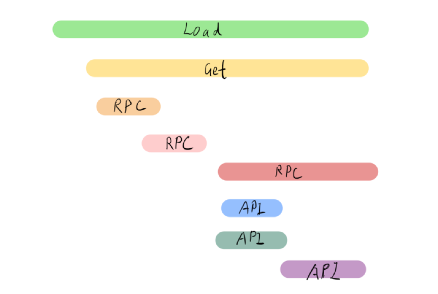

**第三种是引入 Tracing**，虽然我们采用的是业界通用的主流方案—— TiDB 支持 OpenTracing，但我一直认为，只有当 Log 或者 Metrics 没办法解决问题时，才不得已使用 Tracing，因为开启 Tracing 会对整个系统的性能产生一定影响。通常情况下，TiDB 默认关闭 Tracing，仅在必要时才会启动该方法，比如需要查询到底在哪个地方消耗较多时间等。现在，Metrics、Log 和 Tracing 也会被称作 Observability（可观测性），TiDB 的可观测性还是采用业界的主流方案，并没有做太多定制化。

### 故障注入

学会发现错误之后，接下来就是考虑如何注入错误，对系统引入各种故障。因为 TiDB 是一个分布式数据库，所以我们主要关心两个问题：网络和文件系统的故障。因为是分布式的，所以一定绕不开网络问题；因为需要进行数据存储，因此要考虑文件系统。虽然现在有很多网络拓扑结构，但如果要对网络进行错误注入，通常情况下有三种模型：

如上图所示，第一种是 Complete，两个节点之间的网络完全不通；第二种是 Simplex，A 能给 B 发送消息，但是 B 不能给 A 回复消息；第三种是 Partial，A 和 B 完全不通，但是 A 和 B 能够通过另一个节点也就是 C 进行互动。**对 TiDB 而言，我们尽量模拟相关网络环境，尽可能多的发现在网络隔离下面的错误。**

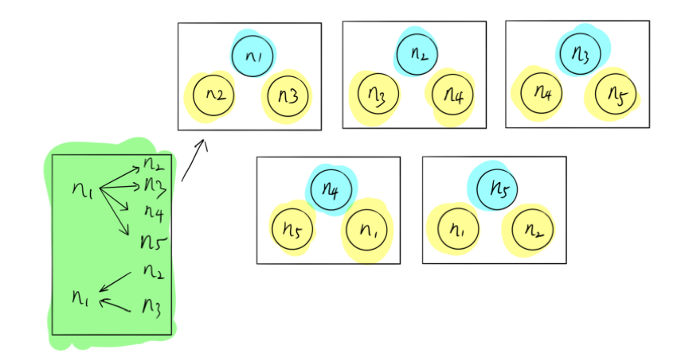

这里，一个比较典型的例子，我们称之为 Network Partition Ring 。如上图，假设有五个节点，一共分成五组，在这个组里面，N1 可以给 N2、N3、N4、N5 发送消息，但是 N1 只能够收取 N2 和 N3 的消息，不能收取 N4 和 N5 的消息。其实这种网络拓扑出现的问题在现实生活中很难被发现，为什么还需要来做这个事情呢？我们希望进行混沌实验，在还没出现对用户造成伤害之前，我们可以主动发现并解决这些问题。除了网络，存储也需要进行相应的故障注入。

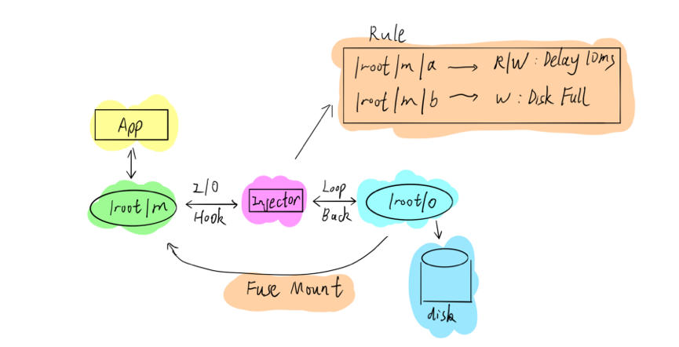

**在 TiDB 里，我们主要是通过 Fuse 的机制进行文件系统干扰**，如上图所示，实际数据可能存储在 /Root/O 路径下，可以通过 Fuse Mount 到另外一个路径下面，让应用程序跟在 Mount 路径进行交互。因为采用的 Fuse，Mount 的时候可以在整个 IO 链上做错误注入。通过这种方式，我们能够非常方便地模拟各种 IO 错误的情况，如果不想使用 Fuse，也可以考虑 Linux 的其他 Debug 工具。

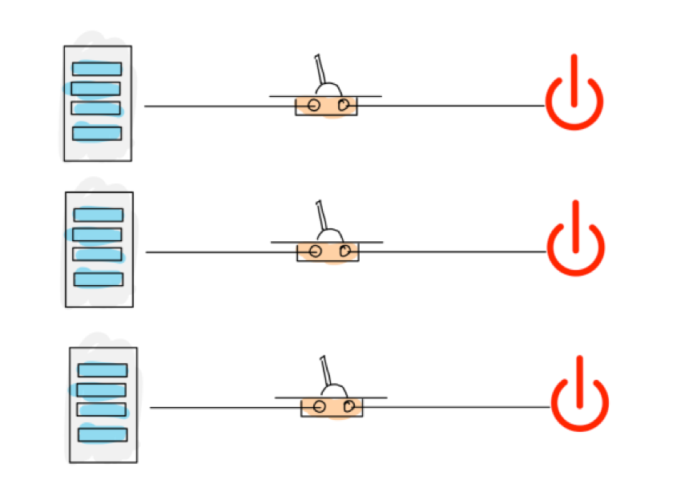

**对文件系统而言，我们可能还有更加粗暴的一种方式。在 TiDB 里面，我们也会经常将电源拔掉，手工触发断电、断网等情况，以考察系统是否可以维持稳定，以下是我们常用的错误画像，仅供参考：**

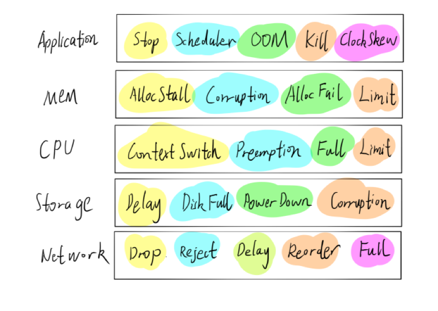

**此外，对分布式系统测试而言，Jepsen 也是一个不错的工具**，对错误注入感兴趣的可以参考 Jepsen 的代码。不过，Jepsen 是用 Clojure 语言编写的，有些难以理解。

### 云上混沌工程实践

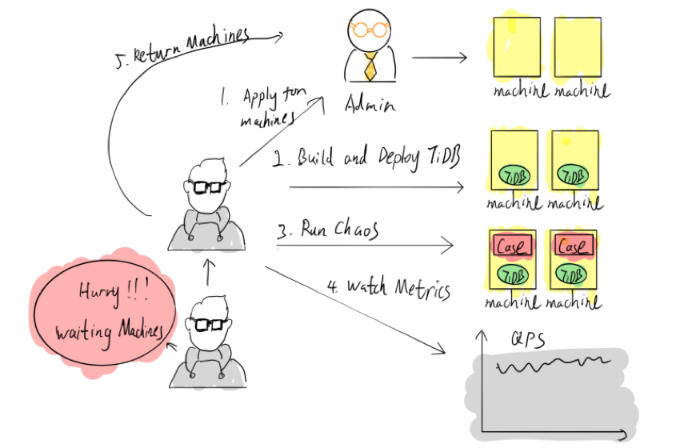

在 TiDB 研发初期，PingCAP 就对其引入了混沌工程。早期，如果需要进行混沌工程实验，只能自己申请几台冗余或闲置的机器，所有实验都需要手动完成，包括自己构建并发布整个 TiDB 集群，虽然这个过程也发现了不少问题，但手工部署耗时且非常低效，在资源利用上也十分不合理。

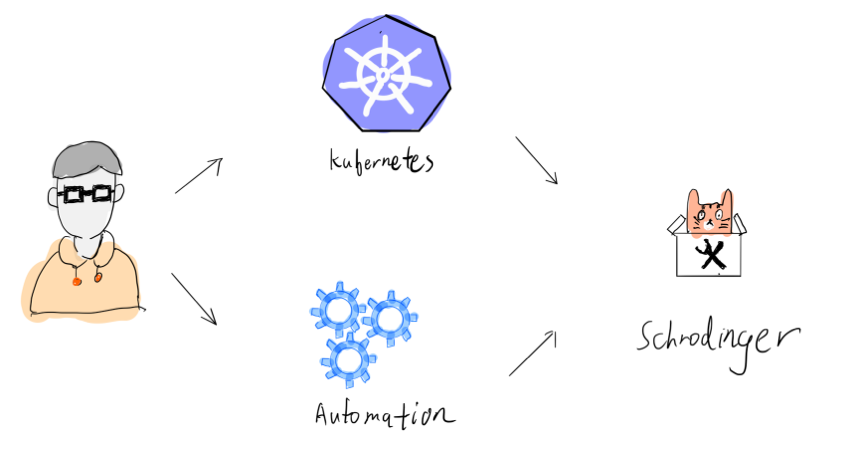

**我们决定简化整个流程。如上图，第一步是通过 Kubernetes 更好的管理机器；第二步是进行流程自动化，因此，基于 Kubernetes 平台我们搭建了一套自动化的混沌工程平台——薛定谔平台（Schrodinger）。**

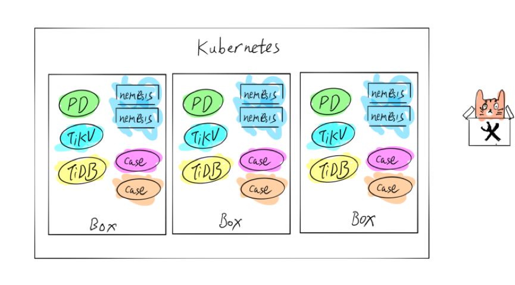

如上图，在 Kubernetes 里面有三个 Box，每个 Box 都有两个用例，通过随机注入来验证系统是否可以保持稳定。实现自动化之后，只需要将错误输入薛定谔平台，该平台就可以自动编译版本，自动运行相关测试用例。如果用例挂掉了，系统会通知我们进行相应处理。PingCAP 现在已经跟其他企业合作，努力优化做更加通用的混沌工程平台，让大家能够把自己的业务放到这个平台上跑。因为我们仍然基于 Kubernetes，只要将集群 Helm 的配置文件与混沌工程结合，就可以直接运行在我们的平台上。如果大家对一些 Kubernetes 的概念不熟悉，可以对比 Linux 的相关概念理解。

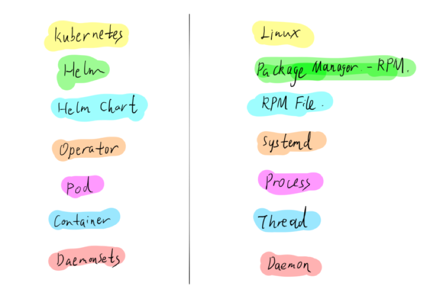

具体来说，要想将业务运行在该平台之上，主要是使用 Chaos Operator，Operator 会把所有对象就是 Chaos 定义成 CRD，在不同的物理节点上启动一个 DaemonSets，这个 DaemonSets 就负责干扰不同的 Load，以及上面不同的 Pod，对应的 Pod 里面会注入一个 Sidecar，这可以认为是一个 Thread，Sidecar 帮我们进行注入，负责破坏 Pod。对用户来说，只要提供他自己的 Helm  Chart，同时把我们的 Chaos CRD 一起放到 Chaos  Operator 里面即可。Chaos Operator 启动之后，会通过 Web  Hook 的方式把 Daemmsets 起来，随后进行系列操作。

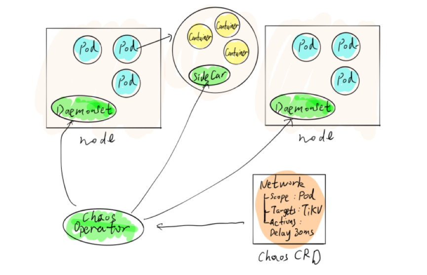

>**作者介绍**：唐刘，PingCAP 首席架构师，主要是负责分布式 key-value TiKV 的研发工作，也会折腾下 TiDB 整个产品的测试，工具开发等工作。

