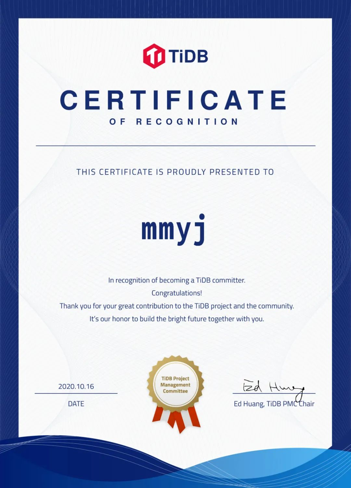
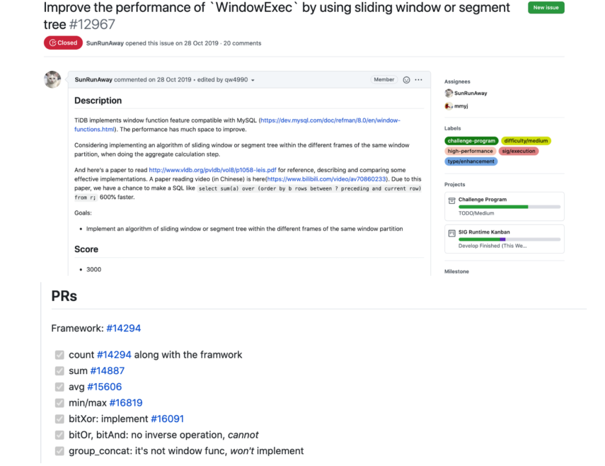
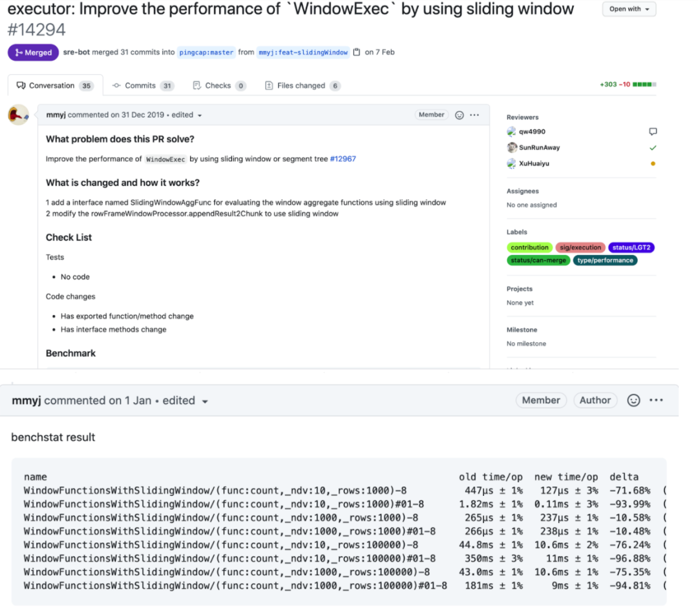

他是第一期 Talent plan 的学员，也是第一期易用性挑战赛优秀参赛选手，拥有多个身份的他成为了 TiDB 新晋 Committer，他就是来自 Execution SIG 的马钰杰（mmyj）。

他是游戏云玩家，也喜欢研究电子产品，总是第一时间入手，也逃不过第一时间吃灰。目前在星火网校做后台开发，工作中接触最多的语言是 Golang。他自称是个典型的程序员，但在采访的间隙突然让我稍等他一下，去给女友煮汤圆，着实让小编酸了一把～

今天，让我们来看看 mmyj 在 TiDB 社区的心路历程吧！

## 第一次贡献 TiDB，感受如何？

2019 年 10 月，我第一次听说 TiDB，也是第一次接触到开源，之前并没有特别关注这个领域。因为公司使用 golang，所以我想找一些 golang 的项目学习，后来无意中在 GitHub 上发现了 TiDB 的文档和源码阅读活动，这让我参与社区得到了很大帮助。我还记得第一个 PR 是 execution 向量化的活动。

当时觉得学习的门槛不高，正好那段时间有易用性挑战赛，就尝试参加了。
最开始的时候会有点手足无措，不知道如何提交 PR 才能被采纳。不过社区小伙伴都很耐心，逐渐的我也就适应了贡献流程。

## 为什么会持续给 TiDB 贡献？

我在易用性挑战赛花了挺多时间，一下班八点多到家就开始做 issue。除了有周边可以兑换，我对 Reviewer 也很向往，觉得 Reviewer 是我努力的一个方向。我很感谢 Execution SIG 的 mentor 给了我很多帮助，我也希望自己可以反哺社区，像当时 mentor 们帮助我一样，指导社区的同学来贡献回馈社区。

有一次我印象特别深刻，当时我有一个问题不太明白，立元就给我画白板来解释，可惜我当时太害羞，害怕麻烦他所以不好意思开摄像头，如果是现在我一定会更大胆的和导师交流。

**TiDB 社区氛围很好，我希望可以把这份善意传递下去。**

## 贡献过程中遇到过困难吗？中途是否想过放弃？

有一个 PR 我断断续续做了很久，优化灵感的来源是一篇论文，我先花一个月时间看完了论文，然后再花一个月时间看 TiDB 代码，研究怎么修改才能达到论文的效果。难点在于，这个 PR 有很多优化的小点，把所有优化点都做完，整个战线就需要拉的很长。

在学习 Talent plan 课程的过程中也遇到了一些困难，因为课程的学习是在已知的框架内找一个未知的答案，对我来说是一个挺有挑战的事情。当时卡在优化器部分，不过最后我也没有寻求导师的帮助，自己去看 TiDB 源码找到了答案，感觉是有一点小作弊了哈哈。

## 贡献过程中最有成就感的事？

上面提到解决的最难的一个 PR 对执行器优化巨大，引入了滑动窗口的优化，提升了某些常用窗口函数的 10 倍计算效率。

这个结果让我很满意，觉得自己的贡献很有意义。

## 你认为开源是什么？

很多项目只是把代码公开在 GitHub 上，我认为这并不能算是真正的开源，维护一个项目需要花费时间和精力，能像 TiDB 一样拥有一个活跃的社区，并且用心的去维护它，这很不容易。

## 给 TiDB 社区新人们的一些建议？

**一定不要害羞，社区的同学都很 nice！TiDB 社区期待你们的加入！**

## 与 Contributor 同行，相信开放的力量

随着越来越多的人了解和使用 TiDB，作为社区贡献者，我们选择了相信开放的力量，做自己真正喜爱和擅长的事情，与全球的开发者共同协作，打造我们梦想的数据库，帮助大家解决问题，让更多用户一起受益，在数据库历史的发展上留下自己的一笔，我们感到兴奋而且自豪！

聚沙成塔，集腋成裘。社区每一个微小的贡献都让 TiDB 距离「数据库界的事实标准」更近一步。很荣幸能和一群志同道合的朋友一起做酷且正确的事情。

在开源的世界，一切皆有可能。