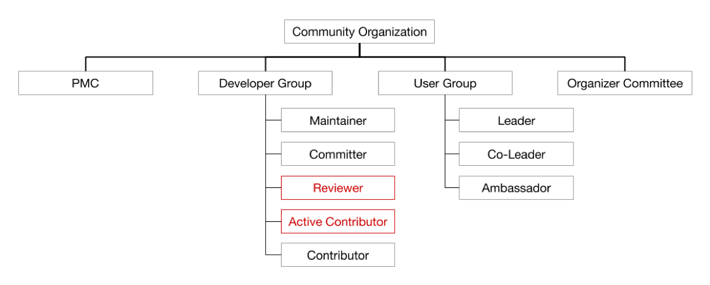

经过几年的发展，TiDB 社区已经逐渐成熟，但是随着社区的发展壮大，我们逐渐感受到了现在社区架构上的一些不足。经过一系列的思考和总结，我们决定升级和调整目前社区组织架构，引入更多的社区角色和社区组织，以便更好的激发社区活力，维护积极健康的社区环境。

## 老社区架构

下图是之前官网上的社区架构图：

图 1 老社区架构

老社区架构主要面向 TiDB 开发者社区（Developer Group），主要角色有 Maintainer、Committer、Contributor 等，其中：

* Committer：由 Maintainer 或 PMC 推荐，是对 TiDB 有突出贡献的 Contributor。需要独立完成至少一个 feature 或修复重大 bug。

* Maintainer：项目的规划和设计者，拥有合并主干分支的权限，从 Committer 中产生。他们必须对子项目的健康表现出良好的判断力和责任感。维护者必须直接或通过委派这些职责来设置技术方向并为子项目做出或批准设计决策。

可以看到老社区架构屏蔽了日益壮大的、对产品打磨升级至关重要的 TiDB 用户群体，并且老架构中对于开发者社区角色的职责、角色之间关系的表述都比较简单，所以我们在新社区架构中做了一些加法，将 TiDB 用户社区纳入进来的同时，对 TiDB 开发者社区的每个角色定义、权责又做了明确的界定，同时也增加了一些新角色、新组织，下面让我们来详细地看一看。

## 新社区架构

### 变化 1：将 TiDB 用户社区纳入整体社区架构

随着 TiDB 产品的成熟，TiDB 用户群体愈发壮大，用户在使用过程中遇到的问题反馈及实践经验，对于 TiDB 产品的完善及应用推广有着不可忽视的重要作用。因此我们此次正式将 TiDB 用户社区（TiDB User Group，简称 TUG）纳入新的社区架构中来，希望用户与开发者有更好的交流互动，一起推动 TiDB 社区的健康发展。

图 2 新社区架构之 User Group

TiDB User Group（TUG）是由 TiDB 用户发起的独立、非盈利的第三方组织，用户实行自我管理，旨在加强 TiDB 用户之间的交流和学习。TUG 的形式包括但不限于线上问答和技术文章分享、线下技术沙龙、走进名企、官方互动活动等等。TUG 成员可以通过线上、线下的活动，学习前沿技术知识，发表技术见解，共同建设 TiDB 项目。更多信息可以登陆 TUG 问答论坛 [asktug.com](https://asktug.com) 查看。

### 变化 2：Active Contributor 和 Reviewer

图 3 新社区架构之 Active Contributor、Reviewer

上图反映了这次社区架构升级的第 2 个变化：在开发者社区中，新增了 Reviewer 和 Active Contributor 的角色。

Active Contributor 是一年贡献超过 8 个 PR 的 Contributor。Reviewer 从 Active Contributor 中诞生，具有 Review PR 的义务，并且对 TiDB 或者 TiKV 某个子模块的 PR 的点赞（LGTM）有效。关于这些角色，我们将在后文介绍 Special Interest Group 时更详细地介绍。

### 变化 3：Special Interest Group

让我们把开发者社区架构图放大再看看：

图 4 新社区架构之 Special Interest Group

上图展示了以垂直的视角来细看开发者社区的整体架构，反映了这次社区架构升级的第 3 个变化：引入了 “专项兴趣小组”（Special Interest Group，简称 SIG）。

专项兴趣小组主要负责 TiDB/TiKV 某个模块的开发和维护工作，对该模块代码的质量负责。我们将邀请满足条件的 Active Contributor 加入专项兴趣小组，开发者们将在专项兴趣小组中获得来自 Tech Lead 们的持续指导，一边锻炼技术能力，一边优化和完善该模块。社区开发者们可通过专项兴趣小组逐渐从初始的 Active Contributor 成长为受到社区认可的 Reviewer、Committer 和 Maintainer。一般而言每个专项兴趣小组都会周期性的组织会议，讨论最近进展和遇到的问题，所有的会议讨论都公开在社区上，方便感兴趣的同学一起参与和讨论。

具体可参考目前我们正在运营的表达式专项兴趣小组：[Expression Special Interest Group](https://github.com/pingcap/community/tree/master/special-interest-groups/sig-expr)。

另外这张图也反映了社区角色和专项兴趣小组的关系，我们来仔细看看 SIG 中的社区角色：

1.  Active Contributor
    + 即一年贡献超过 8 个 PR 的 Contributor。
    + 如果要加入某个 SIG，某个 Contributor 需要在 1 年内为该 SIG 所负责的模块贡献超过 8 个以上的 PR，这样即可获得邀请，加入该 SIG 进行针对性的学习和贡献。

2.  Reviewer
    + 隶属于某个 SIG，具有 Review PR 的义务。
    + Reviewer 从 Active Contributor 中诞生，当 Active Contributor 对该模块拥有比较深度的贡献，并且得到 2 个或 2 个以上 Committer 的提名时，将被邀请成为该模块的 Reviewer。
    + Reviewer 对该模块代码的点赞（LGTM）有效（注：TiDB 要求每个 PR 至少拥有 2 个 LGTM 后才能够合并到开发分支）。

3.  Tech Lead
    + 即 SIG 的组织者，负责 SIG 的日常运营，包括组织会议，解答疑问等。
    + Tech Lead 需要为 SIG 的管理和成长负责，责任重大。目前暂时由 PingCAP 内部同事担任，将来可由社区开发者一起担任，和 PingCAP 同事一起为 SIG 的进步而努力。

再来看看另外两个角色：

1. Committer
    + 资深的社区开发者，从 Reviewer 中诞生。
    + 当 Reviewer 对该模块拥有非常深度的贡献，或者在保持当前模块 Reviewer 角色的同时，也在别的模块深度贡献成为了 Reviewer，这时他就在深度或者广度上具备了成为 Committer 的条件，只要再得到 2 个或 2 个以上 Maintainer 的提名时，即可成为 Committer。

2. Maintainer
    + 重度参与 TiDB 社区的开发者，从 Committer 中诞生，对代码 repo 拥有写权限。

>以上社区角色的详细的定义和权责内容可以在 [这里](https://pingcap.com/community-cn/developer-group/) 查看。

### 变化 4：Working Group

图 5 新社区架构之 Working Group

第 4 个变化是开发者社区架构中引入了 “工作小组”（Working Group，简称 WG）。工作小组是由为了完成某个特定目标而聚集在一起的社区开发者与 PingCAP 同事一起成立。为了完成目标，有些工作小组可能跨越多个 SIG，有些小组可能只会专注在某个具体的 SIG 中做某个具体的事情。

工作小组具有生命周期，一旦目标完成，工作小组即可解散。工作小组运营和管理的唯一目标是确保该小组成立时设置的目标在适当的时间内完成。一般而言，工作小组也会有周期性的会议，用于总结目前项目进展，确定下一步实施方案等。

可参考目前我们正在运营的表达式工作小组：[Vectorized Expression Working Group](https://github.com/pingcap/community/blob/master/working-groups/wg-vec-expr.md)。

## 总结和未来的工作

总的来说，这次社区架构升级主要有如下改进：

1. 引入了 TiDB 用户社区（TiDB User Group）。

2. 引入了 Active Contributor、Reviewer 的社区角色。

3. 引入了 Special Interest Group（SIG）。

4. 引入了 Working Group（WG）。

在社区运营方面，我们未来还将继续：

1. 完善社区成员晋级的指导机制，让社区同学从 Contributor 成长到 Committer 或 Maintainer 有路可循。

2. 让社区上的事情更加成体系，做事不乱。

3. 让社区同学更有归属感，加强和其他社区成员的沟通。

在未来，我们将陆续开放更多的专项兴趣小组和工作小组。在专项兴趣小组中，还将持续发放更多数据库相关的资料，帮助成员在专项兴趣小组中逐渐深度参与 TiDB 的开发工作。希望大家都能够多多参与进来，一起将 TiDB 打造成开源分布式关系型数据库的事实标准！
